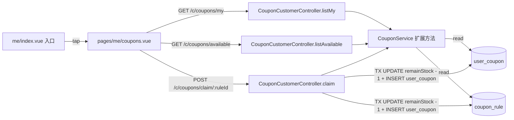

# DESIGN — 优惠券领取链路

## 1. 架构总览



## 2. 数据模型

### 2.1 新表 `user_coupon`

| 字段           | 类型                                  | 说明                       |
| -------------- | ------------------------------------- | -------------------------- |
| user_coupon_id | bigint PK                             | 主键                       |
| customer_id    | bigint NOT NULL                       | 用户 id                    |
| coupon_rule_id | bigint NOT NULL                       | 关联 coupon_rule           |
| status         | varchar(16) NOT NULL DEFAULT 'UNUSED' | UNUSED / USED / EXPIRED    |
| order_id       | bigint NULL                           | 使用时绑定的订单(本期不写) |
| received_at    | bigint NOT NULL                       | 领取时间戳(ms)             |
| used_at        | bigint NULL                           | 使用时间戳(stage 11+)      |

- 唯一索引 `uk_user_coupon_customer_rule (customer_id, coupon_rule_id)` — 用于防止同一用户重复领取同一张券
- 普通索引 `idx_user_coupon_customer_status (customer_id, status)` — 用于列表查询

### 2.2 复用现有 `coupon_rule`

- 领取时校验 `status='ACTIVE' AND validFrom <= now AND validTo > now AND remainStock > 0`
- 原子扣减:`UPDATE coupon_rule SET remain_stock = remain_stock - 1 WHERE coupon_rule_id = ? AND remain_stock > 0` —— 受影响行数 0 即 stock_depleted

## 3. 接口契约

### 3.1 `GET /c/coupons/available`

可领取列表(分页)

**Query**:`pageNo? = 1, pageSize? = 20, bizType? = FOOD|ERRAND|ALL`

**Response data**:

```ts
{
  items: Array<{
    couponRuleId: string,
    couponName: string,
    couponType: 'AMOUNT' | 'DISCOUNT',
    bizType: 'FOOD' | 'ERRAND' | 'ALL',
    threshold: string,            // 满 threshold 分可用
    discount: string,             // 满减金额(AMOUNT)或折扣 ‰(DISCOUNT)
    remainStock: number,
    validFrom: number,
    validTo: number,
    alreadyClaimed: boolean,      // 当前用户是否已领过
  }>,
  total: number,
  pageNo: number,
  pageSize: number,
}
```

### 3.2 `POST /c/coupons/claim/:couponRuleId`

领取

**Response**:

- 成功 `{ userCouponId, couponRuleId }`
- 已领过:422 `code=INVALID_PARAM, detail=ALREADY_CLAIMED`
- 库存耗尽:422 `code=INVALID_PARAM, detail=STOCK_DEPLETED`
- 已过期/未开始/Disabled:422 `code=INVALID_PARAM, detail=COUPON_NOT_AVAILABLE`

### 3.3 `GET /c/coupons/my`

我的优惠券

**Query**:`status? = UNUSED|USED|EXPIRED, pageNo? = 1, pageSize? = 20`

**Response data**:

```ts
{
  items: Array<{
    userCouponId: string,
    couponRuleId: string,
    couponName: string,
    couponType: 'AMOUNT' | 'DISCOUNT',
    bizType: 'FOOD' | 'ERRAND' | 'ALL',
    threshold: string,
    discount: string,
    validFrom: number,
    validTo: number,
    status: 'UNUSED' | 'USED' | 'EXPIRED',
    receivedAt: number,
    usedAt: number | null,
  }>,
  total: number,
  pageNo: number,
  pageSize: number,
}
```

`status` 计算逻辑:

- DB 原始为 `UNUSED` 但 `validTo < now` → 返回 `EXPIRED`
- 其他原样返回

## 4. 客户端 UI 设计

`pages/me/coupons.vue`:

```
┌─────────────────────────────┐
│ navigationBar:我的优惠券    │
├─────────────────────────────┤
│  [我的优惠券]  领券中心      │  ← segment(主题色下划线)
├─────────────────────────────┤
│ 全部 / 未使用 / 已使用 /已过期│  ← chips
├─────────────────────────────┤
│  ┌──────────────────────┐  │
│  │ ¥10  满50减10         │  │  ← 单张券卡片
│  │      外卖通用         │  │
│  │      有效期至 5/31    │  │
│  └──────────────────────┘  │
│  ...                        │
└─────────────────────────────┘
```

**领券中心 tab**:卡片右侧"领取"按钮 → tap → claim → 重新拉列表;`alreadyClaimed=true` 显示"已领取"禁用态。

## 5. 异常处理

| 场景     | 后端响应            | 客户端处理                |
| -------- | ------------------- | ------------------------- |
| 未登录   | 401                 | request.ts 已统一,跳登录  |
| 已领过   | 422 ALREADY_CLAIMED | toast"您已领过这张券"     |
| 库存空   | 422 STOCK_DEPLETED  | toast"已被抢光"并刷新列表 |
| 网络错误 | 0                   | toast"网络不可用"         |

## 6. 文件清单

- 后端
  - `apps/server/src/database/entities/user-coupon.entity.ts`(新)
  - `apps/server/src/database/migrations/{timestamp}-UserCoupon.ts`(新)
  - `apps/server/src/modules/coupon/coupon-customer.controller.ts`(新)
  - `apps/server/src/modules/coupon/coupon-customer.dto.ts`(新)
  - `apps/server/src/modules/coupon/coupon.service.ts`(改)
  - `apps/server/src/modules/coupon/coupon.module.ts`(改)
  - `apps/server/src/modules/coupon/coupon.service.spec.ts`(改/补)
  - `apps/server/src/database/entities/index.ts`(改:导出 UserCoupon)
- 客户端
  - `apps/customer-app/src/api/coupons.ts`(新)
  - `apps/customer-app/src/api/coupons.spec.ts`(新)
  - `apps/customer-app/src/api/index.ts`(改:re-export)
  - `apps/customer-app/src/pages/me/coupons.vue`(新)
  - `apps/customer-app/src/pages.json`(改:注册)
  - `apps/customer-app/src/pages/me/index.vue`(改:入口启用)
