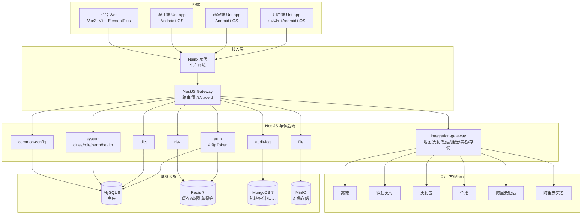
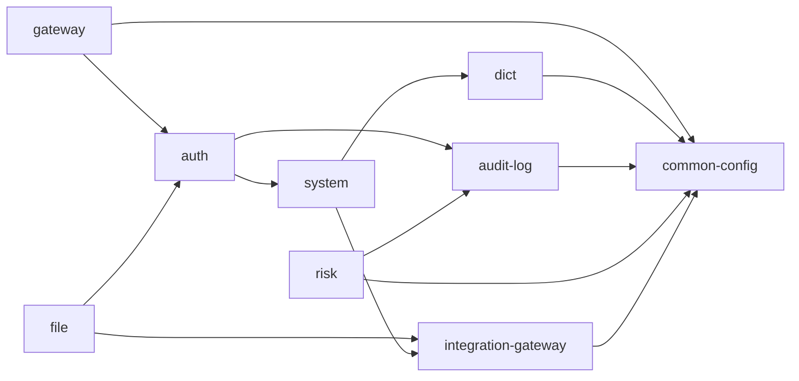
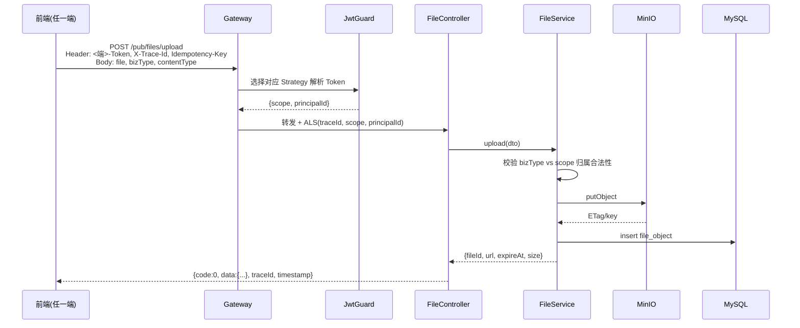
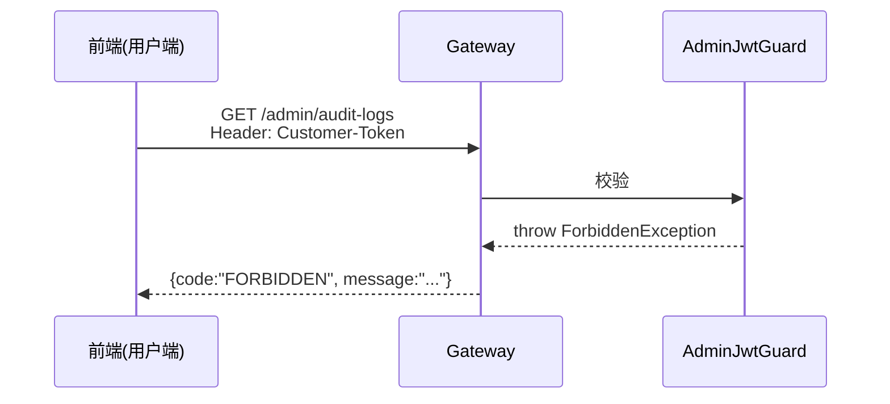
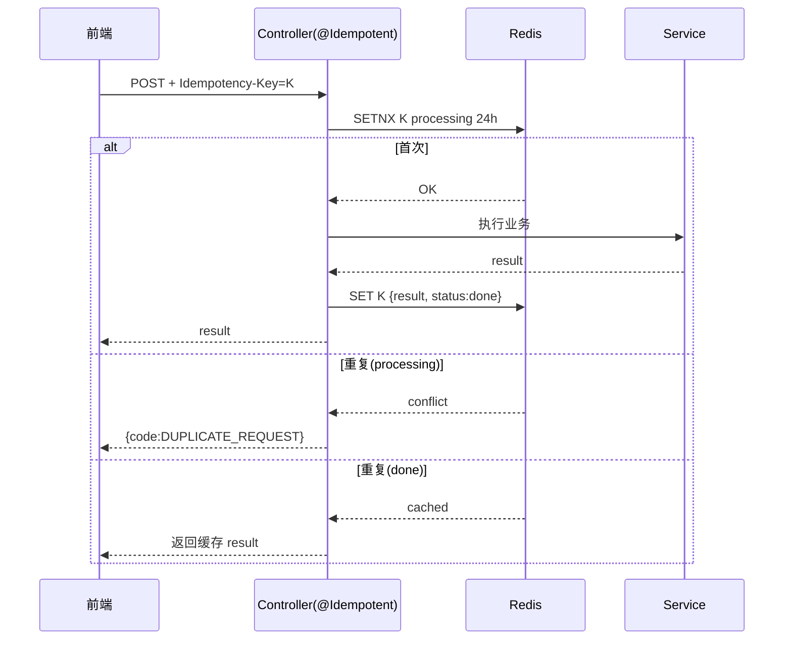
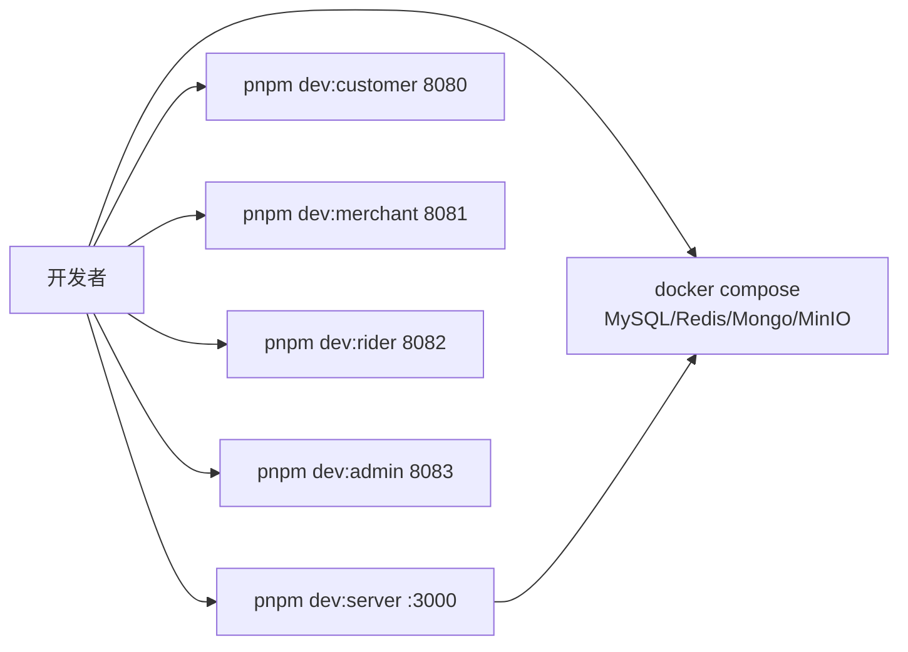

# 阶段0 — 项目初始化与全局契约 · 架构设计文档(DESIGN)

> 商家端仅 Android APP / iOS APP,禁止规划商家 Web 后台、商家小程序。外卖订单与跑腿订单必须独立订单体系、独立状态机、独立计价、独立退款规则。

## 1. 整体架构



## 2. 模块依赖关系



## 3. 分层设计

### 3.1 后端分层(每模块统一)

```
modules/<name>/
├── <name>.module.ts            # 模块声明
├── <name>.controller.ts        # HTTP 入口(按端拆 c/m/r/admin/pub)
├── <name>.service.ts           # 业务逻辑
├── dto/                        # 入参 DTO + class-validator
├── vo/                         # 出参 VO
├── entities/                   # TypeORM 实体(MySQL)/ Mongoose Schema(Mongo)
├── repository/                 # 自定义复杂查询(可选)
└── tests/                      # 单测 + e2e
```

### 3.2 共享能力(`common/`)

- **filters/AllExceptionsFilter**:统一异常 → `{code,message,traceId,timestamp}`
- **interceptors/ResponseInterceptor**:成功响应 → 统一结构
- **interceptors/TraceIdInterceptor**:生成或透传 `X-Trace-Id`,塞入 ALS(AsyncLocalStorage)
- **interceptors/AuditInterceptor**:配 `@Audit` 装饰器自动写审计
- **guards/CustomerJwtGuard / MerchantJwtGuard / RiderJwtGuard / AdminJwtGuard**
- **guards/PermissionGuard**:配 `@RequirePermission('admin:audit:logs:view')`
- **decorators/Public()**:跳过鉴权
- **decorators/Idempotent({scope,ttl})**:写接口幂等
- **decorators/CurrentUser()**:从 ALS 读当前主体
- **pipes/ValidationPipe**:全局 class-validator
- **middleware/ThrottlerMiddleware**:Redis 限流

### 3.3 前端分层(每端统一)

**4 端共用结构**:

```
apps/<end>/src/
├── api/              # API 常量 + 调用封装(import @o2o/api-client)
├── stores/           # Pinia
├── pages/            # 页面(Uni-app)/views(Web)
├── components/       # 端内组件
├── utils/
│   ├── request.ts    # HTTP 拦截器(Token / traceId / 错误处理 / 登录失效跳转)
│   ├── token.ts      # Token storage(端隔离)
│   └── format.ts     # 金额/距离/时间格式化
├── router/           # Web 用,Uni-app 用 pages.json
├── locales/          # 错误码 → 文案映射
└── App.vue / main.ts
```

## 4. 数据模型(本阶段 9 张表)

### 4.1 MySQL 表关键字段

```sql
-- sys_dict
CREATE TABLE sys_dict (
  id BIGINT PRIMARY KEY AUTO_INCREMENT,
  dict_type VARCHAR(64) NOT NULL,      -- 例: order_takeaway_status
  code VARCHAR(64) NOT NULL,
  label VARCHAR(128) NOT NULL,
  sort INT NOT NULL DEFAULT 0,
  enabled TINYINT NOT NULL DEFAULT 1,
  remark VARCHAR(255),
  created_at BIGINT NOT NULL,
  updated_at BIGINT NOT NULL,
  UNIQUE KEY uk_type_code (dict_type, code)
);

-- sys_config
CREATE TABLE sys_config (
  id BIGINT PRIMARY KEY AUTO_INCREMENT,
  config_key VARCHAR(128) NOT NULL UNIQUE,
  config_value TEXT NOT NULL,
  scope VARCHAR(32) NOT NULL DEFAULT 'global',
  description VARCHAR(255),
  updated_at BIGINT NOT NULL
);

-- sys_error_code
CREATE TABLE sys_error_code (
  code VARCHAR(64) PRIMARY KEY,
  i18n_zh VARCHAR(255) NOT NULL,
  i18n_en VARCHAR(255),
  level VARCHAR(16) NOT NULL,           -- info/warn/error
  description TEXT,
  updated_at BIGINT NOT NULL
);

-- sys_role
CREATE TABLE sys_role (
  id BIGINT PRIMARY KEY AUTO_INCREMENT,
  code VARCHAR(64) NOT NULL UNIQUE,
  name VARCHAR(128) NOT NULL,
  scope ENUM('admin','merchant','rider','customer') NOT NULL,
  enabled TINYINT NOT NULL DEFAULT 1,
  created_at BIGINT NOT NULL
);

-- sys_permission
CREATE TABLE sys_permission (
  id BIGINT PRIMARY KEY AUTO_INCREMENT,
  code VARCHAR(128) NOT NULL UNIQUE,    -- 例: admin:audit:logs:view
  name VARCHAR(128) NOT NULL,
  scope ENUM('admin','merchant','rider','customer','public') NOT NULL,
  type ENUM('menu','button','data') NOT NULL,
  parent_code VARCHAR(128),
  sort INT NOT NULL DEFAULT 0
);

-- sys_role_permission(关联表)
CREATE TABLE sys_role_permission (
  role_id BIGINT NOT NULL,
  permission_id BIGINT NOT NULL,
  PRIMARY KEY (role_id, permission_id)
);

-- file_object
CREATE TABLE file_object (
  file_id VARCHAR(64) PRIMARY KEY,
  biz_type VARCHAR(64) NOT NULL,        -- avatar/license/goods/aftersale 等
  owner_type ENUM('customer','merchant','rider','admin') NOT NULL,
  owner_id BIGINT NOT NULL,
  storage_provider VARCHAR(32) NOT NULL DEFAULT 'minio',
  bucket VARCHAR(128) NOT NULL,
  object_key VARCHAR(512) NOT NULL,
  url VARCHAR(1024),
  content_type VARCHAR(128),
  size BIGINT,
  expire_at BIGINT,
  created_at BIGINT NOT NULL
);

-- third_party_config
CREATE TABLE third_party_config (
  id BIGINT PRIMARY KEY AUTO_INCREMENT,
  provider VARCHAR(64) NOT NULL,        -- amap/wxpay/alipay/getui/sms/realname/minio
  env VARCHAR(16) NOT NULL,             -- dev/staging/prod
  encrypted_secret TEXT,                -- AES 加密
  status ENUM('active','disabled','error') NOT NULL,
  last_health_at BIGINT,
  error_message VARCHAR(1024),
  updated_at BIGINT NOT NULL,
  UNIQUE KEY uk_provider_env (provider, env)
);

-- idempotency_record
CREATE TABLE idempotency_record (
  idempotency_key VARCHAR(128) NOT NULL,
  scope VARCHAR(64) NOT NULL,
  request_hash VARCHAR(128) NOT NULL,
  response_payload TEXT,
  status ENUM('processing','done','failed') NOT NULL,
  expire_at BIGINT NOT NULL,
  created_at BIGINT NOT NULL,
  PRIMARY KEY (idempotency_key, scope)
);
```

### 4.2 MongoDB 集合

```
audit_log_detail        # sys_audit_log 的 payload 明细
operation_log           # 操作流水(异步落库)
trace_log               # 调用链(可选,生产环境关闭采样)
```

## 5. 接口契约(本阶段 5 个)

| 接口       | Method | Path                                | 守卫                                                  | 权限                      |
| ---------- | ------ | ----------------------------------- | ----------------------------------------------------- | ------------------------- |
| 字典       | GET    | `/api/v1/pub/dictionaries`          | Public(可选 Token)                                    | `public:read`             |
| 城市       | GET    | `/api/v1/pub/cities`                | Public(可选 Token)                                    | `public:read`             |
| 文件上传   | POST   | `/api/v1/pub/files/upload`          | 任一端 Token(由 Body.bizType 与 Token.scope 校验归属) | `principal:file:upload`   |
| 第三方健康 | GET    | `/api/v1/admin/integrations/health` | AdminJwtGuard                                         | `admin:integrations:view` |
| 审计日志   | GET    | `/api/v1/admin/audit-logs`          | AdminJwtGuard                                         | `admin:audit:logs:view`   |

请求/响应字段照搬契约清单。

## 6. 关键序列图

### 6.1 文件上传(校验主体归属)



### 6.2 跨端 Token 隔离演示



### 6.3 幂等



## 7. 异常处理策略

| 场景                      | 行为                                                   |
| ------------------------- | ------------------------------------------------------ |
| 校验失败(class-validator) | `INVALID_PARAM` + 字段级错误                           |
| Token 缺失/失效           | `UNAUTHORIZED` + 前端跳登录                            |
| Token 端不匹配            | `FORBIDDEN`                                            |
| 资源不存在                | `DATA_NOT_FOUND`                                       |
| 状态非法流转              | `STATUS_INVALID`                                       |
| 幂等冲突(processing)      | `DUPLICATE_REQUEST`                                    |
| 第三方失败                | `THIRD_PARTY_ERROR`(adapter 层封装,记录原始错误到日志) |
| 限流                      | `RATE_LIMIT_EXCEEDED` + 429                            |
| 兜底                      | `INTERNAL_ERROR` + 500                                 |

## 8. 前端工程设计

### 8.1 Uni-app 三端共性

- **Vue 3 + setup + TypeScript + Pinia + Vite**(Uni-app 4.x 默认)
- **uview-plus** 作为 UI 库
- **请求封装**:`uni.request` 包一层,自动注入 `<端>-Token` / `X-Trace-Id` / `Idempotency-Key`(POST)
- **Token storage**:`uni.setStorageSync` + 端 namespace(避免同设备调试时混淆)
- **登录失效**:401 → 清 Token → 跳登录占位页
- **条件编译**:`#ifdef MP-WEIXIN` `#ifdef APP-PLUS` 分别处理小程序与 APP 差异
- **商家端**:`pages.json` 中无 H5 路由出口;`manifest.json` 关闭微信小程序与 H5 编译模式,只允许 Android/iOS

### 8.2 平台 Web

- **Vue 3 + Vite 5 + Pinia + Vue Router 4 + Element Plus + UnoCSS**
- **路由权限**:`router.beforeEach` 校验 `admin:menu:*` 权限
- **按钮权限**:`v-permission` 指令
- **API 客户端**:axios + 拦截器
- **登录占位页**:仅展示 UI,真实登录留给阶段4

## 9. 部署结构(dev)



## 10. 安全设计要点(本阶段)

- 4 类 Token JWT 用 **不同 secret**(`.env` 分别配),即使一端泄漏也无法伪造其他端。
- 第三方 secret 在 `third_party_config.encrypted_secret` 用 **AES-256-GCM** 加密,主密钥仅在 `.env`。
- 文件 URL 默认走 **MinIO 预签名 URL**,有效期 ≤ 15 分钟,`expire_at` 落库。
- 所有写接口默认开启限流(默认 60/min/IP,可由 `sys_config` 调整)。
- 日志脱敏:手机号、身份证号、银行卡输出前掩码。

## 11. 与现有规划/契约的映射

| 现有规划要求    | 本设计落地点                                                                                                     |
| --------------- | ---------------------------------------------------------------------------------------------------------------- |
| 9 后端模块      | `modules/` 9 个目录                                                                                              |
| 4 端 Token 隔离 | 4 个 Strategy + 4 个 Guard                                                                                       |
| 统一响应/错误码 | ResponseInterceptor + AllExceptionsFilter + sys_error_code                                                       |
| 幂等            | @Idempotent + idempotency_record                                                                                 |
| 审计            | @Audit + AuditInterceptor + sys_audit_log + audit_log_detail                                                     |
| 9 张系统表      | TypeORM migration                                                                                                |
| 5 个接口        | 各模块 Controller                                                                                                |
| 第三方适配      | `integration-gateway/adapters/{amap,wxpay,alipay,getui,sms,realname,minio}` 各含 `interface + mock + real(占位)` |
| 商家端只 APP    | `merchant-app/manifest.json` 仅启用 APP 端                                                                       |

---

**设计结论**:架构图清晰、分层一致、与现有契约规范对齐、商家端边界严格隔离。可进入 ATOMIZE 阶段。
