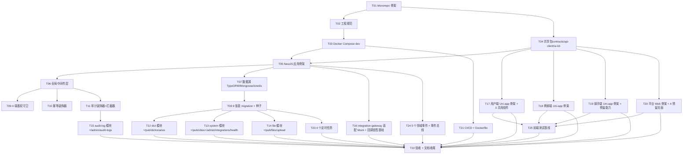

# 阶段0 — 项目初始化与全局契约 · 原子任务清单(TASK)

> 商家端仅 Android APP / iOS APP,禁止规划商家 Web 后台、商家小程序。外卖订单与跑腿订单必须独立订单体系、独立状态机、独立计价、独立退款规则。

## 任务总览

共 **26 个原子任务**,分为 7 组:基础工程(T01-T04)、后端基线(T05-T11)、后端模块与接口(T12-T16)、定时任务与领域事件(T23-T24)、前端 4 端(T17-T20)、第三方/部署/前端测试(T21、T25)、收尾(T22)。

预估工时(单 Agent 串行参考):**5-6 天**;若多 Agent 并行(T17-T20 可并跑),**3 天**。

> ⚠️ **首版 TASK 漏检并已补齐的项**(对照 `项目阶段规划/00-阶段0-...` 各文档):
>
> - 4 个定时任务(`后端数据任务事件.md` § 定时任务)→ T23
> - 5 个领域事件(`后端数据任务事件.md` § 领域事件)→ T24
> - 用户端 3 个共用组件(地图/文件上传/状态标签,`阶段规划.md`)→ 并入 T17
> - 骑手端预留能力(定位/轨迹上报/推送设备绑定/后台保活,`阶段规划.md`)→ 并入 T19
> - 平台 Web 预留页面(操作日志/第三方配置/系统参数/角色权限,`阶段规划.md`)→ 并入 T20
> - 第三方回调验签/去重/防重放基础设施(`接口契约清单.md` § 接口审查清单)→ 并入 T16
> - 敏感信息脱敏(手机号/身份证,`权限与安全.md`)→ 并入 T06
> - 前端页面测试基线(`阶段交付清单.md` § 测试交付)→ T25
> - `问题与风险记录.md` 创建与维护(`阶段交付清单.md` § 文档交付)→ 并入 T22

## 任务依赖图

---

## 第一组:基础工程(T01-T04)

### T01 Monorepo 骨架

- **输入**:CONSENSUS § 2 技术栈、DESIGN § 1 整体架构。
- **产出**:
  - 根 `package.json`(workspaces)、`pnpm-workspace.yaml`、`tsconfig.base.json`、`.editorconfig`、`.gitignore`(含 `__pycache__`、`.env`、`node_modules`、`dist`、`unpackage`)
  - 目录:`apps/{server,customer-app,merchant-app,rider-app,admin-web}/`、`packages/{contracts,api-client,ui-kit}/`、`deploy/`、`docs/`(已存在)
  - `README.md`(项目根说明)
- **约束**:Node 20 LTS;pnpm 9;TypeScript 5 strict
- **依赖**:无
- **验收**:`pnpm install` 成功;`pnpm -r exec -- node -v` 全部输出。

### T02 工程规范

- **输入**:T01。
- **产出**:`.eslintrc.cjs`(根)、`.prettierrc`、`commitlint.config.cjs`、`.husky/{pre-commit,commit-msg}`、`lint-staged` 配置。
- **依赖**:T01。
- **验收**:故意写错代码 `git commit` 被拦截;符合 Conventional Commit 规范。

### T03 Docker Compose dev

- **输入**:CONSENSUS § 2、DESIGN § 9。
- **产出**:`deploy/docker-compose.dev.yml`(MySQL 8 / Redis 7 / MongoDB 7 / MinIO),`deploy/init/{mysql,mongo}` 初始化 SQL/JS,`deploy/.env.example`。
- **依赖**:T01。
- **验收**:`docker compose -f deploy/docker-compose.dev.yml up -d` 后 `docker compose ps` 全部 healthy;能用 `mysql -h 127.0.0.1 -uroot` 连接成功。

### T04 共享包

- **输入**:DESIGN § 5、§ 7。
- **产出**:
  - `packages/contracts`:`error-codes.ts`、`response.ts`(`ApiResponse<T>`)、`status/{takeaway,errand}.ts`、`enums/*`、`headers.ts`(Header 常量)
  - `packages/api-client`:axios 封装(供 Web)、`uni-request`(供 Uni-app)、共用拦截器抽象
  - `packages/ui-kit`(可选,Stage 0 留空目录占位)
- **依赖**:T01。
- **验收**:`packages/contracts` 能被后端与前端 `import` 成功;TS 类型导出。

---

## 第二组:后端基线(T05-T11)

### T05 NestJS 应用骨架

- **输入**:T01、T03、T04。
- **产出**:`apps/server` 中 NestJS 应用,`main.ts`(端口 3000、Swagger 注册、ValidationPipe、cookie/helmet、CORS)、`app.module.ts`、9 个空模块文件 `modules/{gateway,auth,common-config,dict,file,integration-gateway,audit-log,system,risk}.module.ts`、`config/`(读取 `.env`)。
- **依赖**:T01、T03、T04。
- **验收**:`pnpm dev:server` 启动无错;`GET /api/v1/pub/health` 返回 `{code:'0', data:{ status:'ok' }, traceId, timestamp}`;`/api-docs` 可访问。

### T06 全局中间件层

- **输入**:DESIGN § 3.2、§ 7;`权限与安全.md` 安全检查清单。
- **产出**:`common/{filters,interceptors,guards,decorators,pipes,middleware}` 全套
  - `AllExceptionsFilter` 输出统一 code/message/traceId
  - `ResponseInterceptor` 包装成功响应
  - `TraceIdInterceptor` + AsyncLocalStorage
  - `ThrottlerMiddleware`(Redis 桶,默认 60/min/IP,可被 sys_config 覆盖)
  - `Public()` 装饰器
  - `@Mask({type:'phone'|'idcard'|'bankcard'|'address'})` 字段脱敏装饰器(响应序列化时生效)
  - `pino` logger 自动脱敏(手机号/身份证/银行卡正则匹配)
- **依赖**:T05。
- **验收**:故意 `throw new BadRequestException` 返回 `{code:'INVALID_PARAM',...}`;并发请求每个都有独立 traceId;返回含 phone 字段时被掩码为 `138****8888`;日志中身份证号被掩码。

### T07 数据源

- **输入**:DESIGN § 4。
- **产出**:`config/database.module.ts`(TypeORM,带迁移配置)、`config/mongoose.module.ts`、`config/redis.module.ts`(全局 ioredis Provider)。`.env.example` 增加对应键。
- **依赖**:T05、T03。
- **验收**:启动后日志显示三库连接成功;关库后启动报清晰错误。

### T08 9 张表 migration + 种子

- **输入**:DESIGN § 4.1、CONSENSUS § 5。
- **产出**:
  - 9 张表的 TypeORM migration:`database/migrations/1700000000000-init-stage0.ts`
  - 种子脚本:`database/seeds/{dict,role,permission,error-code,city}.seed.ts`
  - 种子内容:
    - 字典:外卖状态 11+异常 4、跑腿状态 9+异常 4、性别、文件 bizType、第三方 provider 等
    - 错误码:全 9 个固化错误码 + 子码占位
    - 角色:`SUPER_ADMIN/AUDITOR/CUSTOMER/MERCHANT/RIDER` 各端基础角色
    - 权限:本阶段权限点 `public:read`、`principal:file:upload`、`admin:integrations:view`、`admin:audit:logs:view`
    - 城市:北京、上海、广州 3 个种子城市
- **依赖**:T07。
- **验收**:`pnpm migrate:run` 成功;`pnpm seed:run` 成功;DB 中 `sys_dict` ≥ 30 行,`sys_error_code` ≥ 9 行,`sys_permission` ≥ 4 行。

### T09 4 端鉴权守卫

- **输入**:DESIGN § 6.2。
- **产出**:
  - 4 个 Passport Strategy:`Customer/Merchant/Rider/Admin JwtStrategy`(分别从 `Customer-Token` 等 Header 取)
  - 4 个 Guard
  - `PermissionGuard` + `@RequirePermission(...)` 装饰器
  - `CurrentUser()` 装饰器
  - 单测:跨端 Token 调用返回 403
- **依赖**:T06、T08(读取角色权限)。
- **验收**:Jest 单测覆盖跨端 4×4 矩阵;Customer-Token 调 `/admin/**` 返回 `FORBIDDEN`。

### T10 幂等装饰器

- **输入**:DESIGN § 6.3。
- **产出**:
  - `@Idempotent({ scope, ttl })` 装饰器
  - `IdempotencyInterceptor`:Redis SETNX,首次执行落 `idempotency_record`,重复返回缓存 / 冲突
  - 单测:模拟同 key 重放
- **依赖**:T07、T08。
- **验收**:同一 `Idempotency-Key` 第二次请求 1ms 内返回相同 body 且不重复执行业务。

### T11 审计装饰器+拦截器

- **输入**:DESIGN § 4、§ 6。
- **产出**:
  - `@Audit({ targetType })` 装饰器
  - `AuditInterceptor`:成功后异步写 `sys_audit_log`(主键)+ MongoDB `audit_log_detail`(payload)
  - 字段:traceId/operatorType/operatorId/targetType/targetId/beforeStatus/afterStatus/ip/deviceId/createdAt
  - 单测
- **依赖**:T07、T08。
- **验收**:演示接口加装饰器后,DB 与 Mongo 同时落审计记录。

---

## 第三组:后端模块与接口(T12-T16)

### T12 dict 模块 + `GET /api/v1/pub/dictionaries`

- **输入**:接口契约清单。
- **产出**:Controller、Service、DTO/VO、Service 缓存(Redis 5 分钟)、Swagger 注解、单测、e2e。
- **依赖**:T08、T09。
- **验收**:`GET /api/v1/pub/dictionaries?typeList=order_takeaway_status` 返回外卖 11 状态;无参时返回全部。

### T13 system 模块 + 2 接口

- **输入**:接口契约清单。
- **产出**:
  - `GET /api/v1/pub/cities`(支持 keyword 模糊、enabled 过滤)
  - `GET /api/v1/admin/integrations/health`(读 `third_party_config` 状态;Stage 0 全部返回 mock 健康)
  - Swagger、单测、e2e
- **依赖**:T08、T09。
- **验收**:Admin-Token 调 health 接口返回 6 个 provider;Customer-Token 调返回 403。

### T14 file 模块 + `POST /api/v1/pub/files/upload`

- **输入**:接口契约清单、DESIGN § 6.1。
- **产出**:
  - 接收 `multipart/form-data`(file/bizType/contentType)
  - 主体归属校验(scope×bizType 白名单)
  - 写 MinIO + `file_object` 表
  - 返回预签名 URL + 15 分钟过期
  - 装上 `@Audit` + `@Idempotent`
- **依赖**:T08、T09、T10、T11、T16。
- **验收**:四端 Token 上传不同 bizType,均成功;非法 bizType(如 Customer-Token 上传 `merchant-license`)返回 403。

### T15 audit-log 模块 + `GET /api/v1/admin/audit-logs`

- **输入**:接口契约清单。
- **产出**:Controller、Service、复合查询(operatorType/targetType/targetId/timeRange/page),JOIN MongoDB 取明细。
- **依赖**:T11、T09。
- **验收**:Admin-Token 分页查询返回正确;非 Admin 调 403。

### T16 integration-gateway 适配 Mock + 回调验签基础

- **输入**:DESIGN § 1、CONSENSUS § 2.1;`接口契约清单.md` § 接口审查清单(回调验签/去重/防重放)。
- **产出**:`integration-gateway/`
  - `adapters/`(每个含 `interface + mock + real(占位 stub)`)
    - `amap` / `wxpay` / `alipay` / `getui` / `sms` / `realname` / `storage(minio)`
  - `IntegrationGatewayService`:依据 `INTEGRATION_MODE` 注入 mock 或 real
  - `CallbackController` 骨架:`/api/v1/callback/{provider}` 占位路由(本阶段仅注册,真实回调留给业务阶段)
  - `CallbackVerifyGuard`:统一回调验签接口(各 provider 实现自己的 verify)
  - `CallbackIdempotencyInterceptor`:基于 `callback_id + provider` 在 Redis 去重
  - `CallbackReplayGuard`:基于时间戳窗口(默认 ±5min)防重放
- **依赖**:T05、T07(Redis)。
- **验收**:
  - `INTEGRATION_MODE=mock` 启动后所有 adapter 返回 mock 数据
  - 切到 real 时报清晰"凭证未配置"
  - 单测:回调签名错误返回 `FORBIDDEN`、重复 callback_id 返回 `DUPLICATE_REQUEST`、超时戳返回 `INVALID_PARAM`

---

## 第四组:4 端前端(T17-T20)— 可并行

### T17 用户端 Uni-app 骨架 + 3 共用组件

- **输入**:DESIGN § 8.1;`阶段规划.md` § 用户端(地图/文件上传/状态标签 3 个共用组件)。
- **产出**:`apps/customer-app/`
  - HBuilderX/CLI 工程
  - `manifest.json`:启用 微信小程序 + Android + iOS + H5(开发用)
  - `pages.json`:启动页 / 定位授权页 / 登录占位 / 错误页 / 无权限页 / 网络错误页 / 系统维护页
  - `utils/{request.ts(注入 Customer-Token + Idempotency-Key + traceId),token.ts(端 namespace),format.ts}`
  - `api/index.ts`:封装 5 个 stage-0 接口
  - **3 个共用组件**(`components/common/` 下):
    - `<MapView>`:封装高德地图 SDK(条件编译:小程序用 `uni.createMapContext`,APP 用 nvue map),输出统一 props/events
    - `<FileUpload>`:封装 `uni.uploadFile` + 调用 `/pub/files/upload`,支持选图/选文件/进度/重试
    - `<StatusTag>`:从 `/pub/dictionaries` 读取后端枚举,根据 `dictType+code` 渲染中文标签,**禁止前端硬编码中文**
  - Pinia store 骨架(`useDictStore` 缓存字典)
  - 登录态失效拦截 → 跳登录占位
- **依赖**:T04。
- **验收**:
  - `pnpm dev:customer:h5` 启动后浏览器能打开
  - 能调通后端 `/pub/dictionaries` 并通过 `<StatusTag>` 渲染外卖状态
  - `<MapView>` 在 H5 渲染高德地图(用占位 key)
  - `<FileUpload>` 选图后能成功上传到后端 `/pub/files/upload`

### T18 商家端 Uni-app 骨架

- **输入**:DESIGN § 8.1、按端实施范围(仅 Android/iOS)。
- **产出**:`apps/merchant-app/`,`manifest.json` **关闭** 微信小程序 与 H5 编译模式(只开 Android+iOS);其余同 T17(Token 改 Merchant-Token,启动页 + 审核中占位)。
- **依赖**:T04。
- **验收**:HBuilderX 中只能选 Android/iOS 编译目标;`pages.json` 内无 H5 入口。

### T19 骑手端 Uni-app 骨架 + 预留能力

- **输入**:DESIGN § 8.1;`阶段规划.md` § 骑手端(预留定位、轨迹上报、推送设备绑定、后台保活)。
- **产出**:`apps/rider-app/`
  - 启动页 + 定位授权页 + 登录占位 + 错误页
  - Token 改 Rider-Token,manifest 启用 Android+iOS(关闭微信小程序;H5 仅用于开发调试)
  - **预留能力骨架**(本阶段只搭框架,留接口给 Stage 3/8 实现):
    - `services/location.ts`:封装 `uni.getLocation` + 后台定位权限申请(Android `permissions/manifest`、iOS `Info.plist` 模板)
    - `services/trace-upload.ts`:轨迹批量上传队列骨架(本地缓存 + 网络重试 + 上报间隔配置)
    - `services/push.ts`:个推 SDK 集成 + `clientId/cid` 注册 → 调后端预留接口绑定
    - `services/keepalive.ts`:Android 前台服务 + iOS Background Modes 配置说明(留 README)
- **依赖**:T04。
- **验收**:
  - `pnpm dev:rider:h5` 启动正常
  - 4 个 service 文件存在且暴露 TypeScript interface,内部函数返回 mock 数据并标 `// TODO: Stage 3/8 接入`
  - manifest.json 中 Android `permissions` 含 `ACCESS_FINE_LOCATION/ACCESS_BACKGROUND_LOCATION/FOREGROUND_SERVICE`

### T20 平台 Web 骨架 + 4 预留页面

- **输入**:DESIGN § 8.2;`阶段规划.md` § 平台管理端(预留操作日志、第三方配置、系统参数、角色权限页面)。
- **产出**:`apps/admin-web/`
  - Vite + Vue3 + Pinia + Vue Router + Element Plus + UnoCSS
  - 登录页(占位)、工作台空框架、403/404、网络错误、系统维护
  - `utils/request.ts`(axios + Admin-Token + 401 跳登录 + 自动注入 traceId)
  - 路由权限守卫 + `v-permission` 指令(菜单 + 按钮)
  - **4 个预留页面**(本阶段只搭页面骨架 + 路由,Stage 4/9 实现完整功能):
    - `/admin/audit-logs`(操作日志):接 `GET /admin/audit-logs`(本阶段已有)
    - `/admin/integrations`(第三方配置):接 `GET /admin/integrations/health`(本阶段已有)+ 预留配置编辑表单(空表)
    - `/admin/system-config`(系统参数):预留 `sys_config` 列表 + 编辑(本阶段无后端接口,前端先放占位空态)
    - `/admin/roles-permissions`(角色权限):预留角色列表 + 权限树(本阶段无后端接口,前端先放占位空态)
- **依赖**:T04。
- **验收**:
  - `pnpm dev:admin` 启动后能访问 8083
  - 登录占位 → 工作台
  - 4 个预留页面均可路由进入,有空态/占位提示;其中操作日志、第三方配置能调通后端接口显示数据
  - 路由权限测试:无 `admin:audit:logs:view` 权限的账号访问 `/admin/audit-logs` → 跳 403

---

## 第五组:部署与 CI(T21)

### T21 CI + Dockerfile

- **输入**:T02、T05。
- **产出**:
  - `.github/workflows/ci.yml`:`pnpm install → lint → typecheck → test`(后端单测 + e2e via testcontainers 可选)
  - `deploy/Dockerfile.server`(多阶段构建)
  - `deploy/docker-compose.prod.yml`(占位,留给阶段11)
- **依赖**:T02、T05。
- **验收**:PR 提交后 GitHub Actions 全绿。

---

### T23 4 个定时任务

- **输入**:`后端数据任务事件.md` § 定时任务。
- **产出**:`apps/server/src/scheduler/` 模块
  - 集成 `@nestjs/schedule` + Redis 分布式锁(避免多实例重复执行)
  - 4 个 Job 实现:
    - `ExpiredCleanupJob`:清理过期验证码(`auth` 域)和过期幂等记录(`idempotency_record.expire_at < now`),每 5 分钟一次
    - `AuditLogArchiveJob`:归档 `sys_audit_log` 主键(超过 90 天的条目压缩落 MongoDB,本阶段实现框架,周期可配)
    - `ThirdPartyRetryJob`:扫描 `integration_request_log`(本阶段新增简化表)中失败状态的第三方调用,带补偿重试
    - `ConfigCacheRefreshJob`:订阅 `ConfigChanged` 事件(见 T24)+ 兜底 1 分钟轮询,刷新 `sys_config` Redis 缓存
  - 每个 Job 含:幂等校验、失败重试、错误日志、metrics(执行次数/耗时)
- **依赖**:T07、T08。
- **验收**:
  - 启动后 `pnpm dev:server` 日志显示 4 个 Job 注册
  - 单测:模拟过期幂等记录被清理;模拟两实例并发只有一个执行
  - 手动触发(暴露 `/admin/scheduler/trigger/{job}` 仅 dev 环境)能成功跑

### T24 5 个领域事件 + 事件总线

- **输入**:`后端数据任务事件.md` § 领域事件。
- **产出**:`apps/server/src/events/` 模块
  - 集成 `@nestjs/event-emitter`(进程内同步)+ 抽象 `DomainEventBus` 接口预留 MQ 替换点(后续可换 RabbitMQ/Kafka)
  - 事件持久化表 `domain_event`(eventId/bizType/bizId/payload/status/retryCount/errorMessage/createdAt)→ 加入 T08 migration
  - 5 个事件定义:
    - `ConfigChanged`(payload: configKey, oldValue, newValue, operator)
    - `PermissionChanged`(payload: roleId/permissionId, action: grant|revoke)
    - `FileUploaded`(payload: fileId, bizType, ownerType, ownerId)
    - `ThirdPartyCallbackReceived`(payload: provider, callbackId, status, raw)
    - `AuditLogCreated`(payload: auditLogId, traceId, targetType, targetId)
  - 默认订阅器:
    - `ConfigChanged` → `ConfigCacheRefreshJob` 触发
    - `FileUploaded` → 异步生成缩略图(占位)
    - 其余记录到 `domain_event` 表
  - 失败重试:订阅器异常时进 `domain_event.status='retrying'`,由 `ThirdPartyRetryJob` 类似机制兜底
- **依赖**:T05、T08(domain_event 表加入 migration)。
- **验收**:
  - 单测:发布 5 类事件,默认订阅器能正确响应
  - DB 中 `domain_event` 落记录
  - 失败模拟:订阅器抛错 → status=retrying → 重试成功后 status=done

---

## 第六组:前端测试基线(T25)

### T25 前端 4 端测试基线

- **输入**:`阶段交付清单.md` § 测试交付(前端页面测试已覆盖)。
- **产出**:
  - **平台 Web**:Vitest + @vue/test-utils 配置;1 个 smoke test(渲染登录页);路由权限单测
  - **3 个 Uni-app**:Vitest 配置(注意 Uni-app 编译目标差异);1 个 smoke test 各端
  - 4 端 `package.json` 加 `test` 脚本
  - 共享 mock(`@o2o/api-client` mock 工厂)
- **依赖**:T17、T18、T19、T20。
- **验收**:`pnpm -r test` 全绿;CI 中执行通过。

---

## 第七组:验收与收尾(T22)

### T22 验收 + 文档收尾

- **输入**:全部 T01-T21、T23-T25。
- **产出**:
  - 按 CONSENSUS § 7 的 13 条 AC 逐项验证
  - 按 `阶段交付清单.md` 22 条交付项逐条勾选
  - 填写 `项目阶段规划/00-阶段0-项目初始化与全局契约/手动审查与测试.md`(P0/P1 清零,逐项填证据)
  - 维护 `项目阶段规划/00-阶段0-项目初始化与全局契约/问题与风险记录.md`(发现的问题登记)
  - 生成 `docs/阶段0-初始化/ACCEPTANCE_阶段0.md`(逐 AC 证据 + 截图引用)
  - 生成 `docs/阶段0-初始化/FINAL_阶段0.md`(总结报告)
  - 生成 `docs/阶段0-初始化/TODO_阶段0.md`(待用户提供凭证清单 + UI 库确认 + iOS 打包准备)
- **依赖**:全部。
- **验收**:13 条 AC 全部通过截图 / 命令输出存档;阶段交付清单 22 项全部勾选;手动审查 P0/P1 清零。

---

## 任务并行度建议

- **串行(必须)**:T01 → T02/T03/T04 → T05 → T06/T07 → T08 → T09/T10/T11 → T12-T16 + T23/T24 → T25 → T22
- **可并行**:
  - T02 / T03 / T04 三组可同时开
  - T09 / T10 / T11 可并行
  - T12 / T13 / T14 / T15 / T16 / T23 / T24 七个后端任务可由不同 Agent 并行(共享 T08/T09 基线后)
  - **T17 / T18 / T19 / T20 强烈建议并行**(4 个 Agent 各做一端)
  - T21 与 T17-T20 并行

## 复杂度评估

- 简单(0.5 天):T01、T02、T03、T18、T25
- 中等(1 天):T04、T05、T06、T07、T12、T13、T15、T17、T19、T20、T21、T22、T23
- 较高(1.5 天):T08、T09、T10、T11、T14、T16、T24

## 反查覆盖矩阵(对照 `阶段交付清单.md`)

| 交付清单要求                                                                                                                                  | 对应任务                                     |
| --------------------------------------------------------------------------------------------------------------------------------------------- | -------------------------------------------- |
| 阶段规划/按端实施范围/前端页面与接口对接/接口契约清单/后端数据任务事件/状态机与业务规则/权限与安全/手动审查与测试/问题与风险记录 9 个 md 文档 | 已存在(规划目录),T22 维护手动审查 + 问题记录 |
| 前端页面和路由已创建                                                                                                                          | T17/T18/T19/T20                              |
| 前端 API 常量已创建                                                                                                                           | T04(共享 contracts)+ T17-T20(各端 api/)      |
| 后端 Controller/Service/DTO/VO 已创建                                                                                                         | T05(骨架)+ T12-T16(实现)                     |
| 数据表和迁移脚本已创建                                                                                                                        | T08                                          |
| 定时任务和领域事件已创建                                                                                                                      | T23、T24                                     |
| 审计日志已接入                                                                                                                                | T11                                          |
| 第三方适配或 Mock 清零计划已明确                                                                                                              | T16 + T22 TODO                               |
| 接口测试用例已覆盖                                                                                                                            | T12-T16 各自 e2e                             |
| 前端页面测试已覆盖                                                                                                                            | T25                                          |
| 权限测试已覆盖                                                                                                                                | T09 单测 + 各模块 e2e                        |
| 状态机测试已覆盖                                                                                                                              | 阶段0 无具体业务状态机,T22 标"不涉及"        |
| 幂等测试已覆盖                                                                                                                                | T10                                          |
| 第三方失败测试已覆盖                                                                                                                          | T16                                          |
| 手动审查与测试.md 已执行并记录证据                                                                                                            | T22                                          |
| 商家端边界复核                                                                                                                                | T18 + T22 文件清单审查                       |
| 外卖/跑腿规则未混用                                                                                                                           | T08 字典种子 + T22 复核                      |

---

## 接下来的执行模式

按 CLAUDE.md 6A 流程,**TASK 完成需用户 Approve 才能进入 Automate**。

**严格约束**(已记入项目记忆):

- 不得遗漏 `项目阶段规划/00-阶段0-...` 中任何一项要求
- 不得自行扩充规划之外的功能
- 每个任务的产出必须可反查到规划文档某一段(见上方反查覆盖矩阵)

**回复 "Approve"(或附带修改意见)我即开始 T01。**
