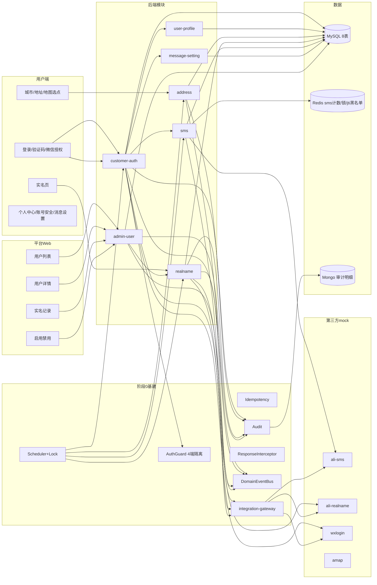
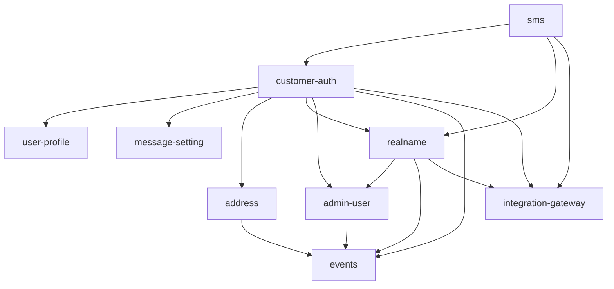
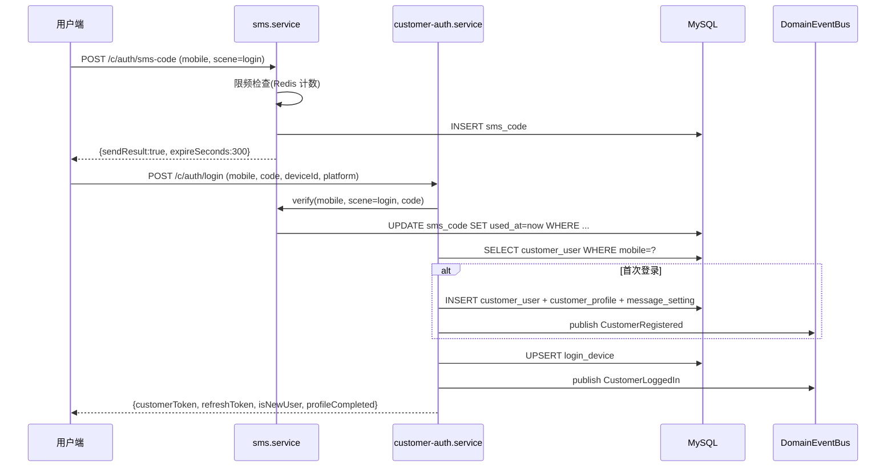
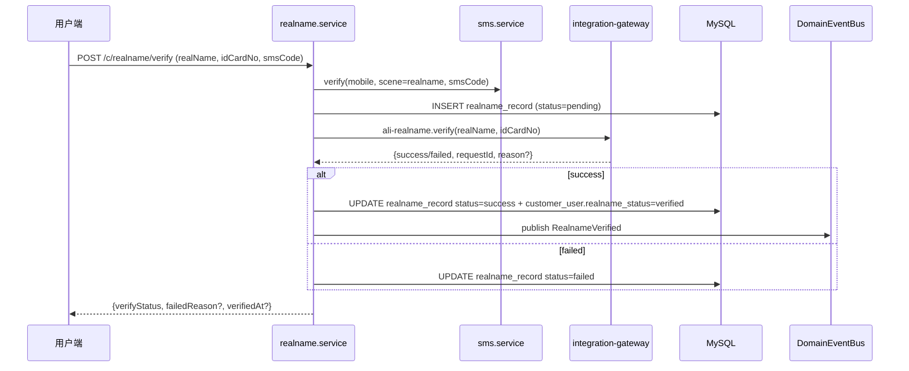
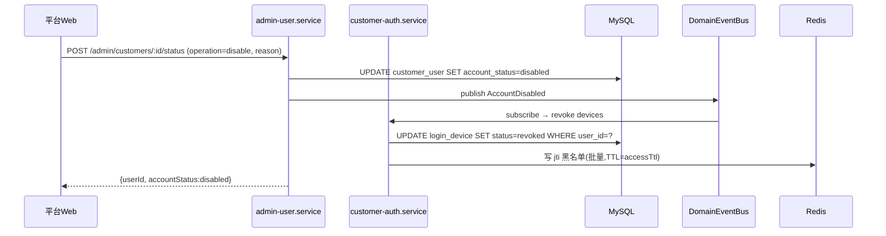

# 阶段 1 — 用户端账号地址与基础框架 · 设计文档(DESIGN)

> 商家端仅 Android APP / iOS APP,禁止规划商家 Web 后台、商家小程序。外卖订单与跑腿订单必须独立订单体系、独立状态机、独立计价、独立退款规则。

## 1. 整体架构



## 2. 模块依赖关系



## 3. 数据表设计(8 张)

### 3.1 customer_user(用户主表)

| 字段               | 类型        | 约束                      | 说明                                     |
| ------------------ | ----------- | ------------------------- | ---------------------------------------- |
| user_id            | BIGINT      | PK auto                   | 用户 ID                                  |
| mobile             | VARCHAR(20) | UK,非空                   | 手机号(明文存,后端 mask 输出)            |
| wechat_open_id     | VARCHAR(64) | UK,可空                   | 微信 openId                              |
| account_status     | VARCHAR(20) | 非空 default `active`     | active / disabled                        |
| realname_status    | VARCHAR(20) | 非空 default `unverified` | unverified / pending / verified / failed |
| profile_completed  | TINYINT     | default 0                 | 个人资料完整度                           |
| register_source    | VARCHAR(20) | 非空                      | mobile / wechat                          |
| register_device_id | VARCHAR(64) | 可空                      | 注册设备                                 |
| created_at         | DATETIME(3) | 非空                      |                                          |
| updated_at         | DATETIME(3) | 非空                      |                                          |

索引:`idx_mobile (mobile)` `idx_wechat_open_id (wechat_open_id)` `idx_status (account_status, realname_status)`

### 3.2 customer_profile

| 字段       | 类型         | 说明                  |
| ---------- | ------------ | --------------------- |
| user_id    | BIGINT       | PK,FK→customer_user   |
| nickname   | VARCHAR(64)  | 默认 `用户${user_id}` |
| avatar_url | VARCHAR(500) | 可空                  |
| gender     | VARCHAR(10)  | unknown/male/female   |
| birthday   | DATE         | 可空                  |
| updated_at | DATETIME(3)  |                       |

### 3.3 customer_address

| 字段          | 类型          | 说明               |
| ------------- | ------------- | ------------------ |
| address_id    | BIGINT        | PK auto            |
| user_id       | BIGINT        | FK,索引            |
| receiver_name | VARCHAR(50)   |                    |
| mobile        | VARCHAR(20)   | 非空               |
| city_code     | VARCHAR(20)   | 引用 `/pub/cities` |
| detail        | VARCHAR(255)  | 详细地址           |
| lng           | DECIMAL(10,7) |                    |
| lat           | DECIMAL(10,7) |                    |
| is_default    | TINYINT       | 0/1                |
| created_at    | DATETIME(3)   |                    |
| updated_at    | DATETIME(3)   |                    |

索引:`idx_user_default (user_id, is_default DESC, updated_at DESC)`

### 3.4 realname_record

| 字段                | 类型         | 说明                                                |
| ------------------- | ------------ | --------------------------------------------------- |
| record_id           | BIGINT       | PK auto                                             |
| user_id             | BIGINT       | FK                                                  |
| real_name           | VARCHAR(50)  | 加密存(stage 11 真接入加密;本阶段明文存,@Mask 输出) |
| id_card_no          | VARCHAR(30)  | 同上                                                |
| status              | VARCHAR(20)  | pending/success/failed                              |
| failed_reason       | VARCHAR(100) | 标准化文案                                          |
| provider_request_id | VARCHAR(64)  | 第三方请求 ID(mock-xxx)                             |
| verified_at         | DATETIME(3)  | 可空                                                |
| created_at          | DATETIME(3)  |                                                     |
| updated_at          | DATETIME(3)  |                                                     |

索引:`idx_user_status (user_id, status)` `idx_pending (status, created_at)`(用于补偿任务)

### 3.5 sms_code

| 字段       | 类型        | 说明                                         |
| ---------- | ----------- | -------------------------------------------- |
| code_id    | BIGINT      | PK auto                                      |
| mobile     | VARCHAR(20) | 非空                                         |
| scene      | VARCHAR(20) | login / realname / change-mobile / sensitive |
| code       | CHAR(6)     | 6 位数字                                     |
| expire_at  | DATETIME(3) |                                              |
| used_at    | DATETIME(3) | 可空                                         |
| client_ip  | VARCHAR(45) |                                              |
| created_at | DATETIME(3) |                                              |

索引:`idx_mobile_scene (mobile, scene, created_at DESC)` `idx_cleanup (expire_at)`

### 3.6 login_device

| 字段               | 类型        | 说明                                   |
| ------------------ | ----------- | -------------------------------------- |
| login_id           | BIGINT      | PK auto                                |
| user_id            | BIGINT      | FK                                     |
| device_id          | VARCHAR(64) | 客户端设备号                           |
| platform           | VARCHAR(20) | mp-weixin / app-android / app-ios / h5 |
| login_ip           | VARCHAR(45) |                                        |
| login_city         | VARCHAR(50) | 异地检测用                             |
| refresh_token_hash | CHAR(64)    | sha256(refreshToken)                   |
| login_at           | DATETIME(3) |                                        |
| last_active_at     | DATETIME(3) |                                        |
| status             | VARCHAR(20) | active / revoked                       |

索引:`idx_user_status (user_id, status)` `idx_refresh (refresh_token_hash)` `idx_anomaly (user_id, login_at DESC)`

### 3.7 message_setting

| 字段            | 类型        | 说明      |
| --------------- | ----------- | --------- |
| user_id         | BIGINT      | PK        |
| order_notify    | TINYINT     | default 1 |
| activity_notify | TINYINT     | default 1 |
| sms_notify      | TINYINT     | default 1 |
| updated_at      | DATETIME(3) |           |

### 3.8 risk_user_tag

| 字段       | 类型         | 说明                                           |
| ---------- | ------------ | ---------------------------------------------- |
| tag_id     | BIGINT       | PK auto                                        |
| user_id    | BIGINT       | FK,索引                                        |
| tag_type   | VARCHAR(40)  | high_value_blocked / suspect_fraud / blacklist |
| reason     | VARCHAR(255) |                                                |
| created_by | BIGINT       | 操作人 admin id                                |
| created_at | DATETIME(3)  |                                                |

索引:`idx_user_tag (user_id, tag_type)`

## 4. 接口契约定义(12 个)

### 4.1 用户端 9 个

#### POST /api/v1/c/auth/sms-code

- Token:无 | 权限点:`customer:public`
- 请求:`{mobile, scene, captchaToken?}`
- 响应:`{sendResult, expireSeconds, requestId}`
- 限频:同 mobile 60s/1、同 IP 60s/5、同 mobile/day 10
- 幂等:`Idempotency-Key`(60s 内同 mobile+scene 返回同结果)
- 审计:**否**(避免短信日志爆量)
- 错误码:`INVALID_PARAM` `DUPLICATE_REQUEST`(限频)`THIRD_PARTY_ERROR`

#### POST /api/v1/c/auth/login

- Token:无
- 请求:`{mobile, code, deviceId, platform}`
- 响应:`{customerToken, refreshToken, isNewUser, profileCompleted}`
- 副作用:首次登录 INSERT customer_user + customer_profile + message_setting + 发布 `CustomerRegistered`;每次登录 UPSERT login_device + 发布 `CustomerLoggedIn`
- 幂等:`Idempotency-Key`
- 审计:`@Audit operation=login`
- 错误码:`INVALID_PARAM` `UNAUTHORIZED`(code 错)`STATUS_INVALID`(account_status=disabled)

#### POST /api/v1/c/auth/wechat-login

- Token:无
- 请求:`{jsCode, encryptedData?, iv?, deviceId, platform}`
- 响应:`{customerToken, refreshToken, bindMobileRequired, isNewUser}`
- 副作用:同上;`bindMobileRequired=true` 当 wechat openId 首次出现且无 mobile 绑定
- 幂等:`Idempotency-Key`
- 审计:`@Audit operation=wechat-login`

#### POST /api/v1/c/auth/refresh(决策 4 新增)

- Token:无(用 refreshToken 换新)
- 请求:`{refreshToken, deviceId}`
- 响应:`{customerToken, refreshToken}`(轮换)
- 副作用:更新 login_device.refresh_token_hash + last_active_at;旧 refresh 即刻失效
- 错误码:`UNAUTHORIZED`(refresh 不存在/失效)`STATUS_INVALID`(账户禁用)

#### POST /api/v1/c/auth/logout(决策 4 新增)

- Token:Customer | 权限点:`customer:self`
- 请求:无
- 响应:`{ok:true}`
- 副作用:login_device.status=revoked + 写 jti 黑名单到 Redis(TTL=accessTtl 剩余)
- 审计:`@Audit operation=logout`

#### POST /api/v1/c/realname/verify

- Token:Customer | 权限点:`customer:self`
- 请求:`{realName, idCardNo, smsCode}`
- 响应:`{verifyStatus, failedReason?, verifiedAt?}`
- 副作用:INSERT realname_record(status=pending)→ 调 ali-realname mock → UPDATE 为 success/failed → 成功时 customer_user.realname_status=verified + 发布 `RealnameVerified`
- 限制:已 verified 用户重复提交返回 `STATUS_INVALID`
- 幂等:`Idempotency-Key`(防止重复扣验证码)
- 审计:`@Audit operation=realname-verify`

#### GET /api/v1/c/addresses

- Token:Customer | 权限点:`customer:self`
- 请求:`?pageNo=1&pageSize=20`
- 响应:`{pageNo, pageSize, total, list:[{addressId, receiverName, mobileMasked, cityCode, detail, lng, lat, isDefault}]}`
- 排序:isDefault DESC, updatedAt DESC

#### POST /api/v1/c/addresses

- Token:Customer | 权限点:`customer:self`
- 请求:`{addressId?, receiverName, mobile, cityCode, detail, lng, lat, isDefault}`
- 响应:`{addressId, isDefault}`
- 副作用:`isDefault=true` 时事务先 UPDATE 同 user 全部 isDefault=0;发布 `AddressChanged`
- 幂等:`Idempotency-Key`
- 审计:`@Audit operation=address-upsert`

### 4.2 平台 Web 4 个

#### GET /api/v1/admin/customers

- Token:Admin | 权限点:`admin:customers:view`
- 请求:`?keyword&realnameStatus&accountStatus&pageNo&pageSize`
- 响应:`{pageNo, pageSize, total, list:[{userId, mobileMasked, nickname, realnameStatus, accountStatus, registeredAt, lastLoginAt}]}`
- keyword 支持手机号(后 4 位/全 11 位)、userId、昵称模糊
- 审计:无(读接口)

#### GET /api/v1/admin/customers/:id(决策 3 新增)

- Token:Admin | 权限点:`admin:customers:view`
- 请求:路径参数 id
- 响应:`{userId, mobileMasked, nickname, realnameStatus, accountStatus, profile, currentRealname?, recentDevices, riskTags}`
- 审计:无

#### GET /api/v1/admin/customers/:id/realname-records(决策 3 新增)

- Token:Admin | 权限点:`admin:customers:view`
- 请求:`?pageNo&pageSize`
- 响应:`{list:[{recordId, realNameMasked, idCardMasked, status, failedReason, verifiedAt, createdAt}]}`
- 审计:无

#### POST /api/v1/admin/customers/:id/status(决策 3 新增)

- Token:Admin | 权限点:`admin:customers:disable`
- 请求:`{operation: 'enable' | 'disable', reason}`
- 响应:`{userId, accountStatus}`
- 副作用:UPDATE customer_user.account_status;disable 时发布 `AccountDisabled` + 吊销该用户全部 login_device
- 幂等:`Idempotency-Key`
- 审计:`@Audit operation=customer-status-change`

## 5. 数据流向图

### 5.1 手机号登录



### 5.2 实名认证



### 5.3 后台禁用账号



## 6. 异常处理策略

| 场景                   | 处理                                                            | 错误码                        |
| ---------------------- | --------------------------------------------------------------- | ----------------------------- |
| 短信限频触发           | sms.service 抛 BusinessException                                | `DUPLICATE_REQUEST`           |
| 验证码错误 / 过期      | customer-auth.service 抛                                        | `UNAUTHORIZED`                |
| 微信 jscode 第三方失败 | integration-gateway 抛 + 自动 mock 兜底                         | `THIRD_PARTY_ERROR`           |
| 实名重复提交           | 检测 customer_user.realname_status=verified                     | `STATUS_INVALID`              |
| 实名第三方超时         | 落 record status=pending → 定时任务 RealnameRetryJob 补查       | (响应正常,告知用户"审核中")   |
| 默认地址多条           | 写入事务先 UPDATE 0 + 定时任务 DefaultAddressUniquenessJob 兜底 | (无错误,日志告警)             |
| 后台禁用用户           | 全部 access token 进 jti 黑名单,login_device 全部 revoked       | (前端遇 401 自动跳登录)       |
| 跨端 Token 误用        | ScopeJwtGuard 直接抛                                            | `FORBIDDEN`(`scope mismatch`) |
| Redis 不可用           | 限频计数降级为允许通过(写日志告警);分布式锁不可用则任务跳过     | (运维感知,不阻塞业务)         |

## 7. 4 端 Token 与权限点

新增权限点:

| 权限点                    | 描述                       | 默认绑定角色         |
| ------------------------- | -------------------------- | -------------------- |
| `customer:self`           | 用户访问本人数据           | 所有 customer        |
| `customer:public`         | 公开接口(发短信)           | 匿名                 |
| `admin:customers:view`    | 查看用户列表/详情/实名记录 | SUPER_ADMIN, AUDITOR |
| `admin:customers:disable` | 启用/禁用账号              | SUPER_ADMIN          |

阶段 0 已有 SUPER_ADMIN / AUDITOR 角色,本阶段在 migration 中追加 sys_role_permission 关联即可。

## 8. 4 个定时任务设计

| Job                         | Cron           | 锁 key                     | 主流程                                                                                 |
| --------------------------- | -------------- | -------------------------- | -------------------------------------------------------------------------------------- |
| SmsCodeExpiredCleanupJob    | `*/5 * * * *`  | `lock:job:sms-cleanup`     | DELETE sms_code WHERE expire_at<NOW()-7d                                               |
| LoginAnomalyDetectionJob    | `*/10 * * * *` | `lock:job:login-anomaly`   | 扫 login_device 1h 内同 user 城市切换,发布事件 + 日志                                  |
| RealnameRetryJob            | `* * * * *`    | `lock:job:realname-retry`  | 扫 realname_record status=pending 超 5min,重查 ali-realname mock(本阶段直接落 success) |
| DefaultAddressUniquenessJob | `30 3 * * *`   | `lock:job:address-default` | GROUP BY user_id HAVING SUM(is_default)>1,保留最新置 1                                 |

## 9. 5 个领域事件设计

```ts
// events.ts(在阶段 0 EventName 上扩充)
export const EventName = {
  // ... 阶段 0 已有 5 个
  CustomerRegistered: 'customer.registered',
  CustomerLoggedIn: 'customer.logged-in',
  RealnameVerified: 'customer.realname-verified',
  AddressChanged: 'customer.address-changed',
  AccountDisabled: 'customer.account-disabled',
} as const;

interface CustomerRegisteredPayload {
  userId: string;
  mobile: string;
  registerSource: 'mobile' | 'wechat';
  deviceId?: string;
}
interface CustomerLoggedInPayload {
  userId: string;
  deviceId: string;
  ip: string;
  city?: string;
  scene: 'login' | 'wechat-login' | 'refresh';
}
interface RealnameVerifiedPayload {
  userId: string;
  verifiedAt: number;
}
interface AddressChangedPayload {
  userId: string;
  addressId: string;
  action: 'create' | 'update' | 'set-default';
}
interface AccountDisabledPayload {
  userId: string;
  operatorId: string;
  reason: string;
}
```

订阅器:

- `CustomerRegisteredSubscriber` → 已在 customer-auth 内部 INSERT,事件订阅器仅记录日志(留 stage 11 触发欢迎短信)
- `CustomerLoggedInSubscriber` → 异地检测在定时任务,事件订阅器仅 audit 落日志
- `RealnameVerifiedSubscriber` → 解锁高额跑腿(占位 risk_user_tag DELETE high_value_blocked)
- `AddressChangedSubscriber` → 留 stage 5+ 订阅(本阶段无订阅器,仅事件总线落库)
- `AccountDisabledSubscriber` → customer-auth 内部订阅,吊销 login_device + jti 黑名单

## 10. 前端页面设计

### 10.1 用户端(11 页)

| 页面       | 路径                      | 接口                             | 关键交互                                              |
| ---------- | ------------------------- | -------------------------------- | ----------------------------------------------------- |
| 登录页     | `/pages/login/index`      | POST sms-code                    | 输手机号 → 发送验证码(60s 倒计时)                     |
| 验证码页   | `/pages/login/verify`     | POST login                       | 输 6 位码 → 登录 → 跳首页                             |
| 微信授权页 | `/pages/login/wechat`     | POST wechat-login                | uni.login 取 jscode → bindMobileRequired 时跳手机绑定 |
| 实名页     | `/pages/profile/realname` | sms-code+realname/verify         | 输姓名+身份证 → 发短信 → 提交                         |
| 城市选择   | `/pages/address/city`     | (消费 stage 0 /pub/cities)       | 列表 + 字母索引 + 当前定位                            |
| 地址列表   | `/pages/address/list`     | GET addresses                    | 卡片列表 + 默认标识 + 编辑按钮                        |
| 地址编辑   | `/pages/address/edit`     | POST addresses                   | 表单 + 设默认开关                                     |
| 地图选点   | `/pages/address/map`      | (前端 amap mock)                 | 地图拖动选点 → 回填 detail                            |
| 个人中心   | `/pages/me/index`         | (无接口,localStorage 取 profile) | 头像/昵称/订单/收藏/优惠/积分/钱包/消息 入口          |
| 账号安全   | `/pages/me/security`      | POST logout                      | 登出                                                  |
| 消息设置   | `/pages/me/notification`  | (本地状态,接口在 stage 1+)       | 三个开关                                              |

新增组件:

- `MobileInput.vue`(手机号输入 + 国际区号占位)
- `SmsCodeInput.vue`(6 位短信码 + 自动聚焦)
- `IdCardInput.vue`(身份证号输入)
- `AddressCard.vue`(地址卡片)

### 10.2 平台 Web(4 页)

| 页面         | 路径                      | 接口                                      | 权限点                  |
| ------------ | ------------------------- | ----------------------------------------- | ----------------------- |
| 用户列表     | `/customers/index`        | GET /admin/customers                      | admin:customers:view    |
| 用户详情     | `/customers/:id`          | GET /admin/customers/:id                  | admin:customers:view    |
| 实名记录     | `/customers/:id/realname` | GET /admin/customers/:id/realname-records | admin:customers:view    |
| 账号禁用弹窗 | (在用户详情内 modal)      | POST /admin/customers/:id/status          | admin:customers:disable |

复用阶段 0 已有的 `el-table` / `el-form` / `el-pagination` / `v-permission`。

## 11. 与阶段 0 集成点

| 集成点          | 阶段 0 提供                                            | 阶段 1 使用                                                           |
| --------------- | ------------------------------------------------------ | --------------------------------------------------------------------- |
| 4 端守卫        | `ScopeJwtGuard` + 4 个 secret                          | customer-auth controller 加 `@Scope('customer')`                      |
| 权限点          | `@RequirePermission` + `PermissionGuard`               | admin-user controller 加 `@RequirePermission('admin:customers:view')` |
| 幂等            | `@Idempotent` 装饰器 + `IdempotencyInterceptor`        | 全部写接口                                                            |
| 审计            | `@Audit` + `AuditInterceptor` + Mongo audit_log_detail | 关键写接口                                                            |
| 脱敏            | `@Mask` 装饰器                                         | 响应 DTO 的 mobile / idCardNo / realName                              |
| 字典            | `/pub/dictionaries` + sys_dict 表                      | sms 模板 / scene / realname 失败原因                                  |
| 城市            | `/pub/cities`                                          | 用户端城市选择                                                        |
| 文件            | `/pub/files/upload`                                    | 本阶段不直接接;预留 user_realname biz_type                            |
| 事件总线        | `DomainEventBus.publish`                               | 5 个新事件                                                            |
| 调度器          | `BaseJob` + `DistributedLockService`                   | 4 个新任务继承即可                                                    |
| 第三方网关      | `integration-gateway` 6 provider                       | 追加 ali-sms / ali-realname / wxlogin                                 |
| 共享类型        | `@o2o/contracts`                                       | 5 个新事件 EventName + 错误码复用                                     |
| api-client mock | mock-factory.ts                                        | 前端 vitest 复用                                                      |

## 12. 风险与规避

| 风险                                         | 规避                                                                                                         |
| -------------------------------------------- | ------------------------------------------------------------------------------------------------------------ | ------------------------------------ |
| 阶段 0 mock 模式与本阶段 mock 行为不一致     | 在 `integration-gateway/__tests__/` 加固定 mock 行为对比测试                                                 |
| 8 张表 migration 顺序错误导致外键失败        | migration 用单一文件 `1714867300000-Stage1Init.ts` 一次性建表                                                |
| 手机号脱敏未覆盖审计明细                     | pino redaction 全局已有 `mobile/idCard/bankCard`,DTO 用 `@Mask` 二次保险                                     |
| 默认地址唯一性并发竞争                       | 写事务用 `SELECT ... FOR UPDATE` + 定时任务兜底                                                              |
| 短信限频 Redis key 设计错误导致绕过          | key 前缀统一 `sms:limit:{mobile}:{scene}:{minute                                                             | day}`,在 sms.service.ts 集中定义常量 |
| 微信登录 mock 让自动注册成功但生产环境不可用 | 在 ALIGNMENT 中明确 mock 行为,生产凭证到位后改 INTEGRATION_MODE=real                                         |
| admin 启用/禁用幂等丢失导致重复 audit        | 接口必须 @Idempotent + 后端校验 account_status 已是目标态时直接返回成功                                      |
| login_device 表无限增长                      | 在 SmsCodeExpiredCleanupJob 中顺带清理 status=revoked 且 last_active_at>30d 的记录(本阶段不做,登记 stage 11) |
