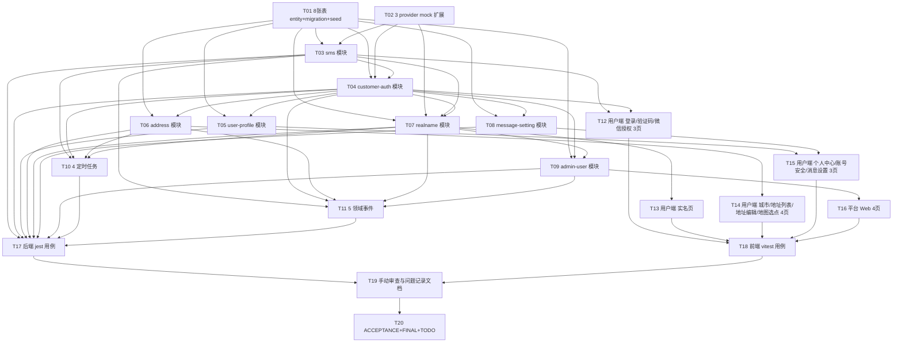

# 阶段 1 — 用户端账号地址与基础框架 · 原子任务清单(TASK)

> 商家端仅 Android APP / iOS APP,禁止规划商家 Web 后台、商家小程序。外卖订单与跑腿订单必须独立订单体系、独立状态机、独立计价、独立退款规则。

## 任务总览

共 **20 个原子任务**,分为 8 组:

| 组  | 范围                | 任务      |
| --- | ------------------- | --------- |
| A   | 数据层              | T01       |
| B   | 第三方适配扩展      | T02       |
| C   | 后端业务模块        | T03 ~ T09 |
| D   | 定时任务 + 领域事件 | T10、T11  |
| E   | 用户端页面          | T12 ~ T15 |
| F   | 平台 Web 页面       | T16       |
| G   | 测试                | T17、T18  |
| H   | 验收收尾            | T19、T20  |

## 任务依赖图

---

## 第 A 组:数据层(T01)

### T01 8 张业务表 entity + migration + seed

- **输入**:DESIGN § 3。
- **产出**:
  - `apps/server/src/database/entities/customer-user.entity.ts` 等 8 个 entity 文件 + 更新 `entities/index.ts`
  - `apps/server/src/database/migrations/1714867300000-Stage1Init.ts`(8 表 + 索引 + 4 个新权限点 sys_role_permission 关联)
  - 必要种子(stage 0 admin user 拥有 `admin:customers:view` `admin:customers:disable`)
- **约束**:
  - 列名 snake_case,索引按 DESIGN § 3 表
  - DATETIME(3) 毫秒精度
  - 所有 BIGINT 用字符串映射(避免精度丢失)
  - mobile / id_card_no / real_name 字段 entity 加 `@Mask()` 装饰器
- **验收**:
  - `pnpm --filter @o2o/server typeorm:migration:run` 成功
  - MySQL 中 `SHOW TABLES LIKE 'customer_%'` 4 张 + `realname_record / sms_code / login_device / message_setting / risk_user_tag` 4 张共 8 张
  - `SELECT * FROM sys_role_permission WHERE permission_code LIKE 'admin:customers:%'` 至少 2 行
- **依赖**:无(stage 0 数据源已就绪)

## 第 B 组:第三方适配扩展(T02)

### T02 3 provider mock 扩展

- **输入**:DESIGN § 11、阶段 0 `integration-gateway`。
- **产出**:
  - `apps/server/src/modules/integration-gateway/adapters/ali-sms.adapter.ts`(send + verify mock + real-stub)
  - `apps/server/src/modules/integration-gateway/adapters/ali-realname.adapter.ts`(verify mock,姓名首字汉字 → success,否则 failed)
  - `apps/server/src/modules/integration-gateway/adapters/wxlogin.adapter.ts`(jscode2session mock,固定 openId)
  - 在 `integration-gateway.module.ts` 注册新 provider 并按 INTEGRATION_MODE 切换
  - `packages/contracts/src/enums/index.ts` `ThirdPartyProvider` 已有 ali-sms / ali-realname,补 `WXLOGIN: 'wxlogin'`
- **约束**:
  - 真实接入留 `real-stub` 抛 `'wxlogin not configured (stage 1+)'`
  - mock 调用记录写入 `integration_request_log` 表(stage 0 已有)
- **验收**:
  - jest 单测 3 个 provider mock 行为
  - `INTEGRATION_MODE=mock` 下 sms.send 返回 `{success:true, providerRequestId:/^mock-/}`
- **依赖**:无

## 第 C 组:后端业务模块(T03 ~ T09)

### T03 sms 模块

- **输入**:DESIGN § 4.1 sms-code、DESIGN § 6 限频策略。
- **产出**:
  - `apps/server/src/modules/sms/{sms.module,sms.service,sms.controller,sms.dto}.ts`
  - `apps/server/src/modules/sms/sms.constants.ts`(场景枚举、限频常量、Redis key 前缀)
  - 内部 service:`sendCode(mobile, scene, ip)` / `verifyCode(mobile, scene, code)` / `consumeCode(...)`
  - controller:`POST /api/v1/c/auth/sms-code`
- **约束**:
  - 限频:同 mobile 60s/1、同 IP 60s/5、同 mobile/day 10
  - 验证码 6 位数字,5 分钟过期
  - 写 `sms_code` 表 + 调 ali-sms 适配器
  - 不挂 @Audit(避免短信审计爆量),挂 @Idempotent(60s)
- **验收**:
  - jest:1 happy + 限频 + 第三方失败 + 重复请求幂等
  - 接口 e2e:`curl POST /api/v1/c/auth/sms-code` 返回 `{code:'0', data:{sendResult:true, expireSeconds:300}}`
- **依赖**:T01,T02

### T04 customer-auth 模块

- **输入**:DESIGN § 4.1 login/wechat-login/refresh/logout、§ 5.1 数据流图。
- **产出**:
  - `apps/server/src/modules/customer-auth/{customer-auth.module,*.service,*.controller,*.dto}.ts`
  - `customer-auth.service`:
    - `loginByMobile(mobile, code, deviceId, platform, ip)` → 自动注册 + token 签发
    - `loginByWechat(jsCode, deviceId, platform, ip)` → openId 查/建 + token 签发
    - `refresh(refreshToken, deviceId)` → 验 hash + 轮换
    - `logout(userId, jti, deviceId)` → revoke device + jti 黑名单
  - controller 4 个接口
  - jti 黑名单:Redis SET TTL=accessTtl
  - 扩展 `ScopeJwtGuard` 校验 jti 不在黑名单(若已校验则跳过 — 阶段 0 暂未做,本阶段补)
  - 自动注册:INSERT customer_user + customer_profile + message_setting 三表(事务)+ 发布 `CustomerRegistered`
  - 每次登录:UPSERT login_device + 发布 `CustomerLoggedIn`
- **约束**:
  - 4 个接口全部 @Idempotent
  - login/wechat-login/logout 挂 @Audit
  - refresh 不挂 @Audit(频繁,日志爆量)
  - access 2h、refresh 30d(从阶段 0 jwt config 取)
- **验收**:
  - jest:首次登录建号 + 重复登录复用 + 验证码错 + 禁用账号 + refresh 轮换 + logout 后 access 失效(jti 黑名单)
  - 接口 e2e:登录获 token → 调 /admin/integrations/health 获 403(端隔离仍生效)
- **依赖**:T01,T02,T03

### T05 user-profile 模块

- **输入**:DESIGN § 7、ALIGNMENT § 4.2。
- **产出**:
  - `apps/server/src/modules/user-profile/{user-profile.module,*.service}.ts`
  - service:`createDefault(userId)` / `getById(userId)` / `markCompleted(userId)`(内部使用,无 controller)
- **约束**:
  - 不暴露 HTTP 接口(规划接口契约清单未列)
  - 在 customer-auth 自动注册时同事务调用
- **验收**:jest:首次登录后 customer_profile 表 1 条记录,nickname=`用户${userId}`
- **依赖**:T01,T04

### T06 address 模块

- **输入**:DESIGN § 4.1 addresses、§ 6 默认唯一性、ALIGNMENT § 4.3。
- **产出**:
  - `apps/server/src/modules/address/{address.module,*.service,*.controller,*.dto}.ts`
  - service:`list(userId, pageNo, pageSize)` / `upsert(userId, dto)`
  - controller:`GET /api/v1/c/addresses` + `POST /api/v1/c/addresses`
- **约束**:
  - upsert 时 `isDefault=true` 走事务先 UPDATE 同 user 全部 isDefault=0
  - city_code 校验:必须存在于 stage 0 city 数据(简化:服务端不强校验,前端选)
  - mobile 在响应中脱敏(@Mask)
  - 写接口 @Idempotent + @Audit(operation=address-upsert)
  - 发布 `AddressChanged`
- **验收**:
  - jest:新增 + 设默认时旧默认被清 + 越权访问他人 → FORBIDDEN
  - 接口 e2e:GET 返回脱敏 mobile;POST 后 GET 列表 isDefault 排前
- **依赖**:T01,T04

### T07 realname 模块

- **输入**:DESIGN § 4.1 realname、§ 5.2 数据流图。
- **产出**:
  - `apps/server/src/modules/realname/{realname.module,*.service,*.controller,*.dto}.ts`
  - controller:`POST /api/v1/c/realname/verify`
  - service:`submit(userId, dto, mobile)` → 校 sms code + INSERT pending + 调 ali-realname mock + UPDATE
  - 失败原因标准化(`内容不符 / 三要素不一致 / 三方不可用`)
- **约束**:
  - 已 verified 用户重复提交返回 STATUS_INVALID
  - mobile 来自 customer_user 表,不允许从请求传入
  - @Idempotent + @Audit
  - success 时 UPDATE customer_user + 发布 RealnameVerified
- **验收**:
  - jest:happy + 已 verified 重复 + sms code 错 + 第三方 failed
  - failed 时 record status=failed,failed_reason 不含第三方原文
- **依赖**:T01,T02,T03,T04

### T08 message-setting 模块

- **输入**:ALIGNMENT § 4.6。
- **产出**:`apps/server/src/modules/message-setting/{message-setting.module,*.service}.ts`,内部 service `createDefault(userId)` / `getByUserId(userId)`,无 controller。
- **约束**:不暴露 HTTP 接口;在 customer-auth 自动注册时同事务调用。
- **验收**:首次登录后 message_setting 表 1 条记录,3 个字段全 1。
- **依赖**:T01,T04

### T09 admin-user 模块

- **输入**:DESIGN § 4.2 4 个 admin 接口、§ 5.3 禁用流程。
- **产出**:
  - `apps/server/src/modules/admin-user/{admin-user.module,*.service,*.controller,*.dto}.ts`
  - 4 个接口 controller
  - service:`listCustomers / getCustomerDetail / listRealnameRecords / changeStatus`
- **约束**:
  - 全部接口 @Scope('admin') + @RequirePermission('admin:customers:view')(disable 用 `:disable`)
  - 响应 mobile / idCardNo / realName 字段 @Mask
  - 列表 keyword 模糊用 LIKE,允许 mobile 全 11 位精确匹配优先
  - changeStatus 写 @Audit + 发布 AccountDisabled(disable 时);enable 不发布事件
  - 幂等:operation=disable 但 account_status 已 disabled 时直接返回成功不重发事件
- **验收**:
  - jest:列表分页 + keyword 筛选 + 详情 + 实名记录分页 + 启用禁用幂等 + customer Token 调 admin 接口 → FORBIDDEN
  - 禁用后该用户 login_device 全部 status=revoked(由 AccountDisabledSubscriber 异步处理)
- **依赖**:T01,T04

## 第 D 组:定时任务 + 领域事件(T10、T11)

### T10 4 个定时任务

- **输入**:DESIGN § 8。
- **产出**:
  - `apps/server/src/scheduler/jobs/sms-code-expired-cleanup.job.ts`
  - `apps/server/src/scheduler/jobs/login-anomaly-detection.job.ts`
  - `apps/server/src/scheduler/jobs/realname-retry.job.ts`
  - `apps/server/src/scheduler/jobs/default-address-uniqueness.job.ts`
  - 注册到 `scheduler.module.ts`
- **约束**:
  - 全部继承 `BaseJob`(继承阶段 0)
  - 锁 key 与 cron 与 DESIGN § 8 表一致
  - dev 模式可通过 `POST /admin/scheduler/trigger/:job` 触发(阶段 0 已有)
- **验收**:
  - jest:每个 job 1 主流程 + 1 锁竞争测试
  - 手动触发:`curl -H "Admin-Token" POST /admin/scheduler/trigger/sms-code-expired-cleanup` 返回 `{ok:true, deleted:N}`
- **依赖**:T03,T04,T06,T07

### T11 5 领域事件 + 订阅器

- **输入**:DESIGN § 9、阶段 0 `events` 模块。
- **产出**:
  - 扩展 `apps/server/src/events/events.ts` EventName + payload 接口(5 个)
  - `apps/server/src/events/subscribers/customer-registered.subscriber.ts`(仅日志)
  - `apps/server/src/events/subscribers/customer-logged-in.subscriber.ts`(仅日志)
  - `apps/server/src/events/subscribers/realname-verified.subscriber.ts`(占位 risk tag DELETE)
  - `apps/server/src/events/subscribers/account-disabled.subscriber.ts`(吊销 device + jti 黑名单 — 调 customer-auth.service)
  - `AddressChanged` 不写订阅器(留 stage 5+)
  - 在各业务 service 中 publish 事件(在 T04/T06/T07/T09 中已嵌入)
- **约束**:
  - 沿用阶段 0 `DomainEventBus.publish` + 持久化 + retry job
  - 订阅器抛错走重试(不影响主流程)
- **验收**:
  - jest:每个事件 1 发布 + 1 订阅器执行
  - DB:`SELECT * FROM domain_event WHERE name LIKE 'customer.%'` 5 个事件均有 status=done 记录
- **依赖**:T03,T04,T06,T07,T09

## 第 E 组:用户端页面(T12 ~ T15)

### T12 用户端 登录 / 验证码 / 微信授权 3 页 + token 持久化

- **输入**:DESIGN § 10.1。
- **产出**:
  - `apps/customer-app/src/pages/login/{index,verify,wechat}.vue`(更新阶段 0 占位)
  - `apps/customer-app/src/pages.json` 注册 3 路由
  - `apps/customer-app/src/api/index.ts` 增加 5 个接口常量(sms-code/login/wechat-login/refresh/logout)
  - `apps/customer-app/src/stores/auth.ts`(Pinia,管理 access/refresh + isNewUser + profileCompleted + 持久化)
  - 接口 401 时自动调 refresh,失败跳登录页
  - `MobileInput.vue` `SmsCodeInput.vue` 共用组件
- **约束**:
  - 不散写 URL,全走 api/index.ts
  - 倒计时 60s 在前端(Pinia 维护起算时间,刷新页保留)
  - error 文案走 contracts 错误码映射(阶段 0 已有 `getErrorMessage`)
- **验收**:
  - vitest:登录提交 + 验证码倒计时 + 401 自动 refresh
  - 真机/H5 启动:能看到 3 页骨架 + 表单验证
- **依赖**:T03,T04

### T13 用户端 实名页

- **输入**:DESIGN § 10.1。
- **产出**:
  - `apps/customer-app/src/pages/profile/realname.vue`
  - `IdCardInput.vue` 共用组件(18 位输入 + 校验位本地校验)
  - api 常量 `realnameVerify`
- **约束**:已 verified 用户 onLoad 时直接显示状态 + 失败 reason
- **验收**:vitest:输入 + 提交 + 失败提示;手机预览页面渲染 OK
- **依赖**:T07

### T14 用户端 城市选择 + 地址列表 + 地址编辑 + 地图选点 4 页

- **输入**:DESIGN § 10.1、阶段 0 `/pub/cities`。
- **产出**:
  - `apps/customer-app/src/pages/address/{city,list,edit,map}.vue`
  - `AddressCard.vue` 共用组件
  - api 常量 `getAddresses` `upsertAddress` `getCities`(阶段 0 已有 cities)
- **约束**:
  - 地图选点用阶段 0 已有的 `MapView.vue` 共用组件(占位)
  - 设默认开关在 edit 页面
  - 列表为空显示"暂无收件地址,新增一个吧"
- **验收**:vitest:列表 + 编辑 + 设默认;e2e:新增后默认排前
- **依赖**:T06

### T15 用户端 个人中心 + 账号安全 + 消息设置 3 页

- **输入**:DESIGN § 10.1。
- **产出**:
  - `apps/customer-app/src/pages/me/{index,security,notification}.vue`
  - 个人中心入口:订单/收藏/优惠券/积分/钱包/消息设置 6 项,本阶段仅消息设置可点(其他 toast "敬请期待")
  - 账号安全:登出按钮 + 修改手机号占位 + 实名状态显示
  - 消息设置:3 个本地开关(无接口)
- **约束**:不接订单/钱包等接口
- **验收**:vitest:登出后 token 清空 + 跳登录
- **依赖**:T05,T08

## 第 F 组:平台 Web 页面(T16)

### T16 平台 Web 用户管理 4 页

- **输入**:DESIGN § 4.2、§ 10.2。
- **产出**:
  - `apps/admin-web/src/views/customers/{index,detail,realname-records}.vue`
  - `apps/admin-web/src/views/customers/components/DisableDialog.vue`
  - `apps/admin-web/src/router/index.ts` 注册 3 路由(detail/realname 嵌套子路由)
  - `apps/admin-web/src/api/admin-customers.ts`(4 个接口)
- **约束**:
  - 列表 el-table + 关键字 / realnameStatus / accountStatus 三筛选
  - 详情 + 实名记录 + 禁用弹窗 在同一详情页面 + 弹窗
  - 禁用按钮 v-permission="['admin:customers:disable']"(无权限隐藏)
  - 状态展示走后端枚举 + dictStore 中文映射
- **验收**:
  - vitest:列表筛选 + 详情加载 + 禁用提交
  - 浏览器:用 SUPER_ADMIN token 启用/禁用切换;用 AUDITOR token 看不到禁用按钮
- **依赖**:T09

## 第 G 组:测试(T17、T18)

### T17 后端 jest 用例

- **输入**:T03~T11 全部 service / controller。
- **产出**:对应 `*.service.spec.ts` / `*.controller.spec.ts`,覆盖:
  - 12 接口:每个 1 happy + 至少 1 边界 + 1 权限或幂等
  - 4 任务:每个 1 主流程 + 1 锁
  - 5 事件:每个 1 发布 + 订阅器
  - 端隔离:customer-Token 调 admin 接口、admin 调 customer 接口 → FORBIDDEN
- **约束**:沿用阶段 0 jest 配置,e2e 用 NestJS Test.createTestingModule
- **验收**:`pnpm --filter @o2o/server test` 全绿,本阶段新增用例数 ≥60
- **依赖**:T03~T11

### T18 前端 vitest 用例

- **输入**:T12~T16 全部页面。
- **产出**:
  - 用户端:登录、验证码、实名、地址列表、地址编辑、个人中心、登出 7 个 spec(覆盖 11 页关键路径)
  - 平台 Web:用户列表、用户详情、禁用弹窗 3 个 spec
- **约束**:沿用阶段 0 vitest 配置 + mock-factory
- **验收**:`pnpm --filter @o2o/customer-app test && pnpm --filter @o2o/admin-web test` 全绿,本阶段新增用例数 ≥20
- **依赖**:T12~T16

## 第 H 组:验收收尾(T19、T20)

### T19 手动审查与问题记录文档

- **输入**:全部 T01~T18 产出。
- **产出**:
  - 填写 `项目阶段规划/01-阶段1-用户端-账号地址与基础框架/手动审查与测试.md`(8 节全部带证据,P0/P1 清零;P2/P3 至少 5 行)
  - 维护 `项目阶段规划/01-阶段1-用户端-账号地址与基础框架/问题与风险记录.md`(地址 DELETE = P3,其他实测发现追加)
- **约束**:每条断言必须配 curl / SQL / 截图 文件路径证据;不得只勾选
- **验收**:文档自审 P0/P1 = 0
- **依赖**:T17,T18

### T20 ACCEPTANCE + FINAL + TODO 阶段 1 文档

- **输入**:T19。
- **产出**:
  - `docs/阶段1-用户账号地址/ACCEPTANCE_阶段1.md`(13+ AC + 18+ 交付项 + replay 命令)
  - `docs/阶段1-用户账号地址/FINAL_阶段1.md`(20 任务总结 + 能力矩阵 + 关键决策)
  - `docs/阶段1-用户账号地址/TODO_阶段1.md`(stage 2 启动前 checklist + 凭证回填位置)
- **约束**:与 stage 0 同款格式
- **验收**:
  - `pnpm -r build` 全绿 / `pnpm -r test` 全绿 / `pnpm lint` 全绿 / `pnpm format:check` 全绿
  - `git status` 干净后准备提 PR(本阶段最后 1 个 commit:`feat(stage-1): 阶段 1 用户端账号地址与基础框架 完整交付(20/20 原子任务)`)
- **依赖**:T19

---

## 任务自审清单(每个 T 完成后必走)

每完成一个 Tn,要求自审:

1. **不漏项**:本任务产出与 TASK 描述列表一一勾对,无遗漏。
2. **不多做**:本任务未引入 TASK 描述外的代码、接口、表、文件。
3. **可独立验证**:验收标准命令真实可执行,通过后再开下一个 T。
4. **依赖闭环**:依赖的前序 T 必须已完成 + 验收通过。
5. **回归**:运行本任务相关 test,确保未破坏阶段 0 已有测试。
6. **追加自审记录**:在 ACCEPTANCE\_阶段1.md(T20 时统一汇总)记录本 T 自审条目。

## 风险与回滚

- 任何 T 卡住 > 30 min 仍未解时,中断并记录到 `问题与风险记录.md`,由用户决策。
- migration 失败:`pnpm typeorm:migration:revert` 后修 entity 重出。
- 第三方 mock 行为冲突:在 ALIGNMENT 中追加澄清,不擅自变更。
- token 黑名单 Redis 占用大:`jti:revoked:{jti}` 用 SET TTL,空间有限。
