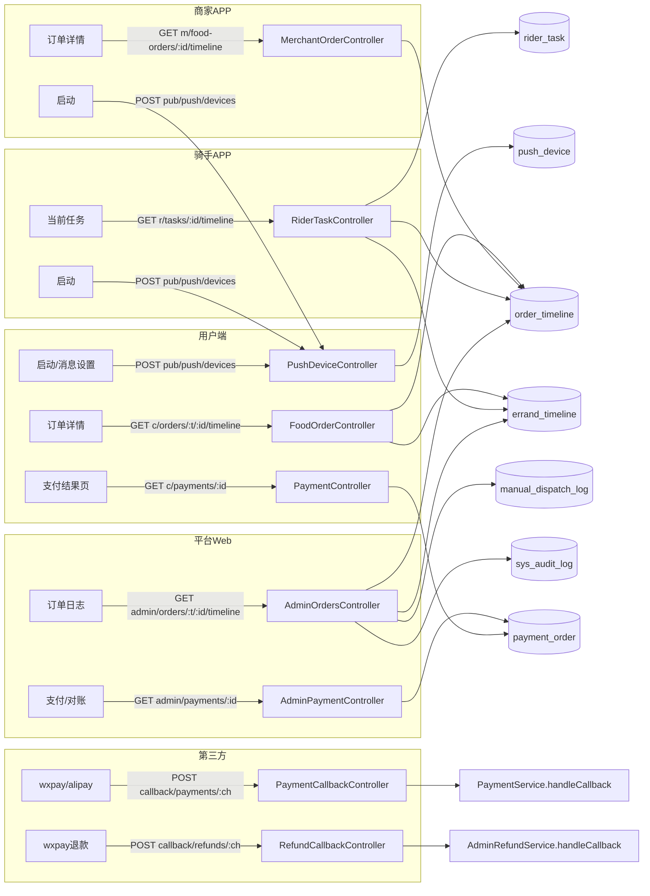

# 阶段 10 — 四端联调 · 接口状态消息资金 · DESIGN(架构设计)

## 1. 整体架构



## 2. 模块分层

### 2.1 push-device 新模块

```
apps/server/src/modules/push-device/
├── push-device.module.ts
├── push-device.service.ts        # bindDevice (UK upsert)
├── push-device.controller.ts     # POST /pub/push/devices, 三 token guard
├── push-device.dto.ts            # BindPushDeviceDto + BindPushDeviceVo
└── push-device.service.spec.ts   # 3 用例(新建 / 重复绑定 / 软关)
```

### 2.2 admin-orders 新模块(timeline 通用)

```
apps/server/src/modules/admin-orders/
├── admin-orders.module.ts
├── admin-orders.service.ts       # getTimeline(bizType, orderId)
├── admin-orders.controller.ts    # GET /admin/orders/:bizType/:orderId/timeline
├── admin-orders.dto.ts
└── admin-orders.service.spec.ts  # 3 用例(food / errand / not found)
```

### 2.3 admin-payment 新模块

```
apps/server/src/modules/admin-payment/
├── admin-payment.module.ts
├── admin-payment.service.ts      # getPayment(payOrderId)
├── admin-payment.controller.ts   # GET /admin/payments/:payOrderId
├── admin-payment.dto.ts
└── admin-payment.service.spec.ts # 2 用例(found / not found)
```

### 2.4 既有模块扩展 method

| 模块                          | 新方法                                                                | 控制器路径                                                                                                                |
| ----------------------------- | --------------------------------------------------------------------- | ------------------------------------------------------------------------------------------------------------------------- |
| `food-order`                  | `getTimelineForCustomer`                                              | `c/orders/:bizType/:orderId/timeline`(分发到 food-order/errand-order)— 实际放在 customer 端 OrderTimeline 通用 controller |
| `errand-order`                | `getTimelineForCustomer`                                              | 同上                                                                                                                      |
| `merchant-order`              | `getTimelineForMerchant`                                              | `m/food-orders/:orderId/timeline`                                                                                         |
| `rider-task`                  | `getTimelineForRider`                                                 | `r/tasks/:taskId/timeline`                                                                                                |
| `payment`                     | `getForCustomer(payOrderId, customerId)`                              | `c/payments/:payOrderId`                                                                                                  |
| `payment-callback.controller` | 新增 `paymentsCallback(channel, ...)` `refundsCallback(channel, ...)` | `callback/payments/:channel` `callback/refunds/:channel`                                                                  |

> **决策**:为简化路由,c 端 timeline 不放在 food-order/errand-order 各自 controller,而新建 `customer-orders` 模块作为分发入口(与 admin-orders 对称)。

调整后的新模块清单:**4 个**(push-device / admin-orders / admin-payment / **customer-orders**)。

### 2.5 customer-orders 新模块(timeline 通用)

```
apps/server/src/modules/customer-orders/
├── customer-orders.module.ts
├── customer-orders.service.ts    # getTimeline(bizType, orderId, customerId)
├── customer-orders.controller.ts # GET /c/orders/:bizType/:orderId/timeline
├── customer-orders.dto.ts
└── customer-orders.service.spec.ts # 3 用例
```

## 3. push_device 表

```sql
CREATE TABLE push_device (
  push_device_id    BIGINT       PRIMARY KEY AUTO_INCREMENT,
  device_token      VARCHAR(255) NOT NULL,
  principal_type    VARCHAR(16)  NOT NULL COMMENT 'customer|merchant|rider',
  principal_id      BIGINT       NOT NULL,
  platform          VARCHAR(16)  NOT NULL COMMENT 'ios|android|wxmp',
  app_type          VARCHAR(16)  NOT NULL COMMENT 'customer|merchant|rider',
  push_enabled      TINYINT(1)   NOT NULL DEFAULT 1,
  created_at        BIGINT       NOT NULL,
  updated_at        BIGINT       NOT NULL,
  UNIQUE KEY uk_push_device_token (device_token, principal_type),
  KEY idx_push_device_principal (principal_type, principal_id)
);
```

## 4. 接口契约 — 详细字段

### 4.1 GET `/api/v1/c/orders/:bizType/:orderId/timeline`

```json
// Response
{
  "timeline": [
    {
      "at": 1714867800000,
      "fromStatus": "WAIT_PAY",
      "toStatus": "PAID_WAIT_MERCHANT",
      "actor": "system",
      "reason": "wxpay callback"
    }
  ],
  "currentStatus": "PAID_WAIT_MERCHANT",
  "availableActions": [] // stage 11 接入 nextStates
}
```

### 4.2 GET `/api/v1/m/food-orders/:orderId/timeline`

```json
{
  "timeline": [...],
  "currentStatus": "PAID_WAIT_MERCHANT",
  "allowedMerchantActions": ["ACCEPT", "REJECT"]
}
```

### 4.3 GET `/api/v1/r/tasks/:taskId/timeline`

```json
{
  "timeline": [...],
  "taskStatus": "PICKED_UP",
  "orderBizType": "FOOD",
  "allowedRiderActions": ["DELIVERED"]
}
```

### 4.4 GET `/api/v1/admin/orders/:bizType/:orderId/timeline`

```json
{
  "timeline": [...],
  "currentStatus": "DELIVERED",
  "operatorLogs": [...],   // sys_audit_log 过滤 targetType=order, targetId=orderId
  "dispatchLogs": [...],   // manual_dispatch_log + dispatch_task by orderId
  "paymentLogs": [...]     // payment_order by bizType+bizId
}
```

### 4.5 GET `/api/v1/c/payments/:payOrderId`

```json
{
  "payOrderId": "1",
  "payStatus": "success", // pending|success|failed|expired|refunded → 上层 stage 11 映射成契约 WAIT_PAY/PAYING/PAID/...
  "paidAt": 1714867800000,
  "amountFen": "9900",
  "channel": "wxpay"
}
```

### 4.6 GET `/api/v1/admin/payments/:payOrderId`

```json
{
  ...4.5 全部字段,
  "thirdPartyTradeNo": "wx_xxx",
  "callbackLogs": [{ "raw": "...", "parsedAt": 1714867800000 }]
}
```

### 4.7 / 4.8 callback (paymentes/refunds)

- 路径整改:旧 `POST /callback/wxpay` 保留 → 同时新增 `POST /callback/payments/wxpay` 转发到同 service
- refunds 新增 controller,接 AdminRefundService.handleProviderCallback 占位(stage 11 真实现)

### 4.9 POST `/api/v1/pub/push/devices`

```json
// Request
{ "deviceToken": "abc", "platform": "ios", "appType": "customer", "pushEnabled": true }
// Response
{ "bindId": "1", "enabled": true }
```

## 5. 异常处理

- timeline 接口越权返回 `FORBIDDEN`,记录 traceId
- payment 查询越权返回 `FORBIDDEN`(c 端校验 customer 持有该 bizId 订单)
- callback 验签失败返回 `THIRD_PARTY_ERROR`
- callback nonce 重放返回 200 + duplicate=true
- push-device 重复绑定 → upsert 更新 platform/appType/pushEnabled,返回同 bindId
