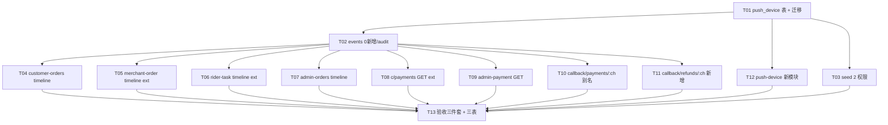

# 阶段 10 — 四端联调 · 接口状态消息资金 · TASK(原子任务)

## 任务依赖图

## 波次划分

### Wave 1 — Schema/Audit/Permission(T01-T03)

#### T01 — push_device 表 + Stage10Init 迁移

- **输入**:DESIGN § 3 表定义
- **输出**:`apps/server/src/database/entities/push-device.entity.ts` + `migrations/1717287900000-Stage10Init.ts` + entities/index.ts 注册
- **验收**:`pnpm --filter @o2o/server typecheck` 绿;迁移 file 内 SQL 与 DESIGN § 3 一致

#### T02 — events 自审 + spec 兼容

- **输入**:CONSENSUS § 5 — 0 新增 events
- **输出**:`apps/server/src/events/events.stage10.spec.ts` 验证 EventName 计数 ≥ 62(stage 9 末)
- **验收**:`pnpm --filter @o2o/server jest events/events.stage10` 绿

#### T03 — 2 权限 seed

- **输入**:CONSENSUS § 4
- **输出**:`apps/server/src/database/seeds/role-permission.seed.ts` 加 2 个权限点 + 角色绑定
- **验收**:typecheck 绿;权限总数从 74 → 76

---

### Wave 2 — 4 timeline 接口(T04-T07)

#### T04 — customer-orders 模块(c-timeline)

- **输出**:
  - `modules/customer-orders/customer-orders.{module,service,controller,dto,service.spec}.ts`
  - `app.module.ts` 注册
- **接口**:`GET /api/v1/c/orders/:bizType/:orderId/timeline` + Customer-Token + 越权返回 FORBIDDEN
- **验收**:3 用例(food OK / errand OK / FORBIDDEN)

#### T05 — merchant-order 扩 m-timeline

- **输出**:`modules/merchant-order/merchant-order.controller.ts` 加 `GET /m/food-orders/:orderId/timeline` + service `getTimelineForMerchant`
- **验收**:2 用例(本店 OK / 越权 FORBIDDEN)

#### T06 — rider-task 扩 r-timeline

- **输出**:`modules/rider-task/rider-task.controller.ts` 加 `GET /r/tasks/:taskId/timeline` + service `getTimelineForRider`(分发到 order_timeline 或 errand_timeline)
- **验收**:2 用例(food task / errand task)

#### T07 — admin-orders 新模块(admin-timeline)

- **输出**:`modules/admin-orders/admin-orders.{module,service,controller,dto,service.spec}.ts` + `app.module.ts` 注册
- **接口**:`GET /api/v1/admin/orders/:bizType/:orderId/timeline` + Admin-Token + @Audit + @RequirePermission(`admin:order:timeline:view`)
- **响应**:timeline + operatorLogs + dispatchLogs + paymentLogs
- **验收**:3 用例(food / errand / merge logs)

---

### Wave 3 — payment 查询 + callback(T08-T11)

#### T08 — payment c GET ext

- **输出**:`modules/payment/payment.controller.ts` 加 `GET /c/payments/:payOrderId` + service `getForCustomer`
- **验收**:2 用例(自己的 / 越权 FORBIDDEN)

#### T09 — admin-payment 新模块

- **输出**:`modules/admin-payment/admin-payment.{module,service,controller,dto,service.spec}.ts` + `app.module.ts` 注册
- **验收**:2 用例(found 含 callbackLogs / not found)

#### T10 — callback/payments/:channel 别名

- **输出**:`modules/payment/payment-callback.controller.ts` 加 `POST /callback/payments/:channel`(转发到 PaymentService.handleCallback)
- **保留旧路径** `/callback/wxpay` `/callback/alipay` 兼容
- **验收**:1 用例(新路径成功 → 旧 service 调用)

#### T11 — callback/refunds/:channel 新增

- **输出**:新建 `modules/admin-refund/refund-callback.controller.ts` + `admin-refund.service.ts` 加 `handleProviderCallback(channel, raw, sign)` 占位实现(查 refund_order → 设 SUCCESS,nonce 防重放)
- **验收**:2 用例(成功 / 重放 duplicate)

---

### Wave 4 — push-device(T12)

#### T12 — push-device 新模块

- **输出**:
  - `modules/push-device/push-device.{module,service,controller,dto,service.spec}.ts`
  - `app.module.ts` 注册
  - 三 token guard 复合(C/M/R OR)
  - upsert 逻辑(deviceToken+principalType UK)
  - @Idempotent + @Audit
- **验收**:3 用例(新建 / 重复绑定更新 / pushEnabled=false 软关)

---

### Wave 5 — 验收(T13)

#### T13 — ACCEPTANCE/FINAL/TODO + 三表

- **输出**:
  - `docs/阶段10/ACCEPTANCE_阶段10.md`
  - `docs/阶段10/FINAL_阶段10.md`
  - `docs/阶段10/TODO_阶段10.md`
  - `项目阶段规划/10-阶段10-.../{手动审查与测试,问题与风险记录,阶段交付清单}.md` 三表填充
- **验收**:全部勾选齐全,git commit 提交

## 任务总数

**13 任务,分 5 波**,新增模块 4 个(customer-orders / admin-orders / admin-payment / push-device),新表 1 个,新接口 9 个,新权限 2 个。

## 严格不做(防越界审查)

- ❌ 不接真第三方
- ❌ 不动客户端代码
- ❌ 不新增 admin-web 页面
- ❌ 不重做 stage 5-9 既有接口
- ❌ 不新增 event/subscriber/job
