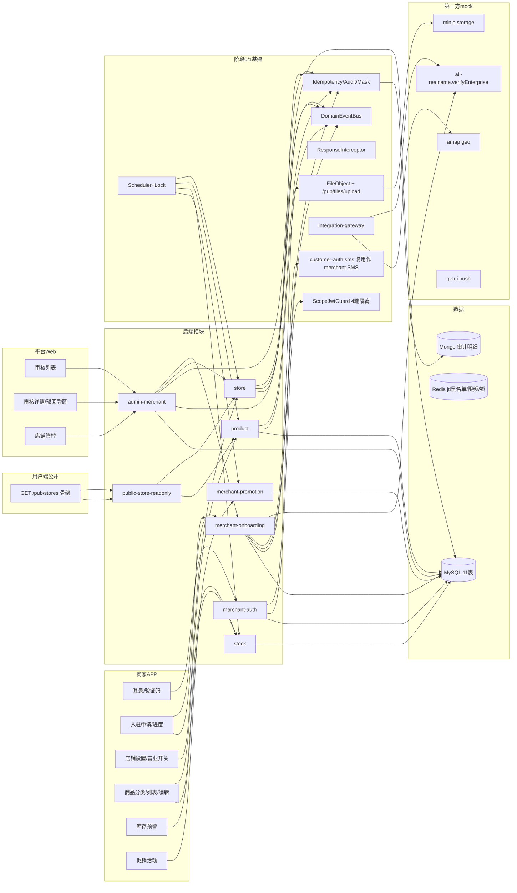
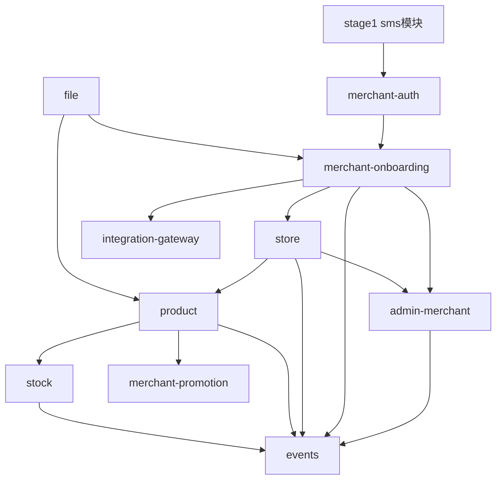
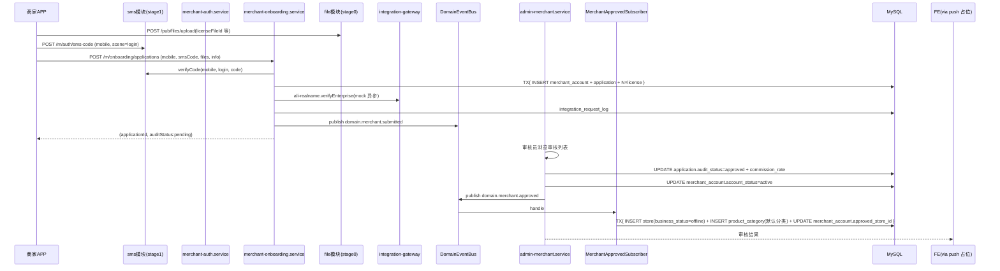
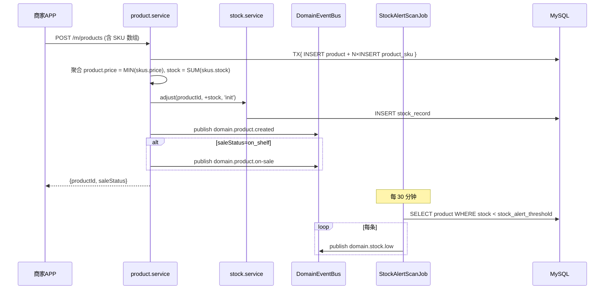
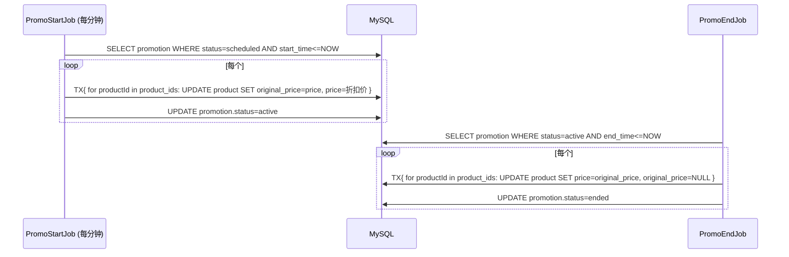

# 阶段 2 — 商家端 APP 入驻店铺与商品管理 · 设计文档(DESIGN)

> 商家端仅 Android APP / iOS APP,禁止规划商家 Web 后台、商家小程序。外卖订单与跑腿订单必须独立订单体系、独立状态机、独立计价、独立退款规则。

## 1. 整体架构



## 2. 模块依赖关系



## 3. 数据表设计(11 张)

### 3.1 merchant_account(商家主账号表)

| 字段                  | 类型                                | 约束                   | 说明                                                   |
| --------------------- | ----------------------------------- | ---------------------- | ------------------------------------------------------ |
| merchant_id           | BIGINT                              | PK auto                | 商家 ID                                                |
| mobile                | VARCHAR(20)                         | UK 非空                | 商家手机号(登录用)                                     |
| account_status        | ENUM('pending','active','disabled') | 非空 default 'pending' | pending(未审核完)/active(可用)/disabled                |
| latest_application_id | BIGINT                              | NULL                   | 最新一次申请 ID                                        |
| approved_store_id     | BIGINT                              | NULL                   | 审核通过后建立的 store_id(per ALIGN 4.8 商家:店铺=1:1) |
| created_at            | BIGINT                              | 非空                   |                                                        |
| updated_at            | BIGINT                              | 非空                   |                                                        |

索引:`uk_mobile (mobile)` `idx_status (account_status)`

### 3.2 merchant_application(入驻申请表)

| 字段            | 类型                                             | 说明                              |
| --------------- | ------------------------------------------------ | --------------------------------- |
| application_id  | BIGINT                                           | PK auto                           |
| merchant_id     | BIGINT                                           | FK,索引                           |
| audit_status    | ENUM('pending','approved','rejected','disabled') | 非空 default 'pending'            |
| store_name      | VARCHAR(128)                                     |                                   |
| business_scope  | VARCHAR(255)                                     | 经营范围(餐饮/便利店/...)         |
| legal_person    | VARCHAR(50)                                      | 法人姓名(@Mask 输出)              |
| id_card_no      | VARCHAR(30)                                      | 法人身份证(@Mask 输出)            |
| license_no      | VARCHAR(40)                                      | 营业执照号                        |
| food_permit_no  | VARCHAR(40)                                      | 食品许可证号(餐饮类必填)          |
| commission_rate | DECIMAL(5,4)                                     | NULL,审核通过时填(per ALIGN 4.12) |
| reject_reason   | VARCHAR(500)                                     | NULL                              |
| submitted_at    | BIGINT                                           |                                   |
| audited_at      | BIGINT                                           | NULL                              |
| audited_by      | BIGINT                                           | NULL,admin operator id            |
| created_at      | BIGINT                                           |                                   |
| updated_at      | BIGINT                                           |                                   |

索引:`idx_merchant_status (merchant_id, audit_status, submitted_at DESC)` `idx_pending (audit_status, submitted_at)`(平台审核列表用)

### 3.3 merchant_license(资质文件关联表)

| 字段           | 类型                                                                                            | 说明                           |
| -------------- | ----------------------------------------------------------------------------------------------- | ------------------------------ |
| license_id     | BIGINT                                                                                          | PK auto                        |
| application_id | BIGINT                                                                                          | FK                             |
| license_type   | ENUM('business_license','food_permit','legal_id_card_front','legal_id_card_back','store_photo') | 资质类型                       |
| file_id        | VARCHAR(64)                                                                                     | FK→file_object.file_id         |
| expiry_date    | DATE                                                                                            | NULL,营业执照/食品许可证有效期 |
| created_at     | BIGINT                                                                                          |                                |

索引:`idx_application_type (application_id, license_type)` `idx_expiry (expiry_date)` (定时任务扫到期)

### 3.4 store(店铺表)

| 字段             | 类型                              | 说明                            |
| ---------------- | --------------------------------- | ------------------------------- |
| store_id         | BIGINT                            | PK auto                         |
| merchant_id      | BIGINT                            | UK,商家:店铺=1:1 强约束         |
| name             | VARCHAR(128)                      | 店铺名                          |
| avatar_file_id   | VARCHAR(64)                       | NULL                            |
| intro            | VARCHAR(500)                      | NULL                            |
| business_scope   | VARCHAR(255)                      |                                 |
| business_status  | ENUM('online','offline','paused') | 非空 default 'offline'          |
| min_order_amount | BIGINT                            | 起送价(分),非空 default 0       |
| delivery_fee     | BIGINT                            | 配送费(分),非空 default 0       |
| commission_rate  | DECIMAL(5,4)                      | 同 application 表(冗余便于查询) |
| notice           | VARCHAR(500)                      | NULL,店铺公告                   |
| city_code        | VARCHAR(20)                       | NULL                            |
| created_at       | BIGINT                            |                                 |
| updated_at       | BIGINT                            |                                 |

索引:`uk_merchant (merchant_id)` `idx_status (business_status, city_code)`(用户端公开列表用)

### 3.5 store_business_hour(营业时间表)

| 字段        | 类型    | 说明          |
| ----------- | ------- | ------------- |
| record_id   | BIGINT  | PK auto       |
| store_id    | BIGINT  | FK            |
| day_of_week | TINYINT | 0~6,周日~周六 |
| start_time  | TIME    | "HH:mm:ss"    |
| end_time    | TIME    | "HH:mm:ss"    |

索引:`idx_store (store_id, day_of_week)`

### 3.6 store_delivery_area(配送范围)

| 字段             | 类型   | 说明                             |
| ---------------- | ------ | -------------------------------- |
| area_id          | BIGINT | PK auto                          |
| store_id         | BIGINT | FK                               |
| geometry         | JSON   | GeoJSON Polygon(per D-3)         |
| min_order_amount | BIGINT | 该区域起送价(分,可覆盖 store 表) |
| delivery_fee     | BIGINT | 该区域配送费(分,可覆盖 store 表) |
| created_at       | BIGINT |                                  |

索引:`idx_store (store_id)`

### 3.7 product_category(商品分类表)

| 字段          | 类型        | 说明         |
| ------------- | ----------- | ------------ |
| category_id   | BIGINT      | PK auto      |
| store_id      | BIGINT      | FK           |
| name          | VARCHAR(64) |              |
| display_order | INT         | 排序(默认 0) |
| created_at    | BIGINT      |              |
| updated_at    | BIGINT      |              |

索引:`idx_store_order (store_id, display_order)`

### 3.8 product(商品表)

| 字段                  | 类型                                            | 说明                                              |
| --------------------- | ----------------------------------------------- | ------------------------------------------------- |
| product_id            | BIGINT                                          | PK auto                                           |
| store_id              | BIGINT                                          | FK,索引                                           |
| category_id           | BIGINT                                          | FK                                                |
| name                  | VARCHAR(128)                                    |                                                   |
| description           | TEXT                                            | NULL                                              |
| cover_image_file_id   | VARCHAR(64)                                     | NULL                                              |
| images                | JSON                                            | 详情图片 file_id 数组                             |
| price                 | BIGINT                                          | 单位:分(per ALIGN 4.9);有 SKU 时为 MIN(SKU.price) |
| original_price        | BIGINT                                          | NULL,限时折扣前缓存(per ALIGN 4.13)               |
| stock                 | INT                                             | 总库存;有 SKU 时为 SUM(SKU.stock)                 |
| stock_alert_threshold | INT                                             | NULL default 5,库存预警阈值(per ALIGN 4.6)        |
| has_sku               | TINYINT                                         | 0/1                                               |
| sale_status           | ENUM('draft','on_shelf','off_shelf','sold_out') | 非空 default 'draft'                              |
| created_at            | BIGINT                                          |                                                   |
| updated_at            | BIGINT                                          |                                                   |

索引:`idx_store_status (store_id, sale_status)` `idx_category (category_id)` `idx_alert (stock, stock_alert_threshold)`(预警 job 扫描)

### 3.9 product_sku(商品 SKU 表)

| 字段       | 类型         | 说明                                              |
| ---------- | ------------ | ------------------------------------------------- |
| sku_id     | BIGINT       | PK auto                                           |
| product_id | BIGINT       | FK                                                |
| spec_value | VARCHAR(255) | 规格值,JSON 字符串如 `{"size":"L","color":"red"}` |
| price      | BIGINT       | 单位:分                                           |
| stock      | INT          |                                                   |
| created_at | BIGINT       |                                                   |
| updated_at | BIGINT       |                                                   |

索引:`idx_product (product_id)` `uk_product_spec (product_id, spec_value)`

### 3.10 stock_record(库存流水表)

| 字段            | 类型        | 说明                                                    |
| --------------- | ----------- | ------------------------------------------------------- |
| record_id       | BIGINT      | PK auto                                                 |
| product_id      | BIGINT      | FK,索引                                                 |
| sku_id          | BIGINT      | NULL(无 SKU 时)                                         |
| quantity_change | INT         | 正数=增,负数=减                                         |
| reason          | VARCHAR(64) | 'manual_adjust' / 'order_deduct' / 'order_refund' / ... |
| operator_id     | VARCHAR(64) | merchant_id / admin_id / 'system'                       |
| operator_type   | VARCHAR(20) | merchant / admin / system                               |
| stock_before    | INT         |                                                         |
| stock_after     | INT         |                                                         |
| created_at      | BIGINT      |                                                         |

索引:`idx_product_time (product_id, created_at DESC)` `idx_sku (sku_id)`

### 3.11 merchant_promotion(促销活动表)

| 字段        | 类型                                                | 说明                 |
| ----------- | --------------------------------------------------- | -------------------- |
| promo_id    | BIGINT                                              | PK auto              |
| store_id    | BIGINT                                              | FK                   |
| promo_type  | ENUM('time_limited','single_full_off')              | per ALIGN 4.5        |
| name        | VARCHAR(128)                                        |                      |
| product_ids | JSON                                                | BIGINT 数组,绑定商品 |
| rules       | JSON                                                | per ALIGN 4.5 schema |
| start_time  | BIGINT                                              |                      |
| end_time    | BIGINT                                              |                      |
| status      | ENUM('draft','scheduled','active','paused','ended') | 非空 default 'draft' |
| created_at  | BIGINT                                              |                      |
| updated_at  | BIGINT                                              |                      |

索引:`idx_store_status (store_id, status)` `idx_active_window (status, start_time, end_time)`(定时任务扫描)

## 4. 接口契约定义

### 4.1 商家端 16 个

#### POST /api/v1/m/auth/sms-code(扩展)

- Token:无 | 权限点:`merchant:public`
- 请求:`{mobile, scene}`(scene=login)
- 复用 stage 1 sms.service(sms 模块通用,scene 扩展)

#### POST /api/v1/m/auth/login(扩展)

- 请求:`{mobile, code, deviceId, platform}`
- 响应:`{merchantToken, refreshToken, accountStatus}` — 商家无自动注册,merchant_account 必须先存在(由 admin 审核通过事件创建)
- 错误:`UNAUTHORIZED`(code 错)/ `DATA_NOT_FOUND`(merchant_account 不存在,提示"先入驻")/ `STATUS_INVALID`(disabled)

#### POST /api/v1/m/auth/refresh + /logout(扩展)

- 同 customer-auth refresh / logout(jti 黑名单)

#### POST /api/v1/m/onboarding/applications

- Token:无(无 merchant_account 时也能调)| 权限点:`merchant:public`
- 请求:`{mobile, smsCode, licenseFileId, foodPermitFileId?, idCardFrontFileId, idCardBackFileId, storePhotoFileIds[], legalPerson, idCardNo, licenseNo, foodPermitNo?, storeName, businessScope}`
- 响应:`{applicationId, auditStatus:'pending', submittedAt}`
- 副作用:首次申请 INSERT merchant_account(account_status='pending')+ INSERT merchant_application + N×INSERT merchant_license + 调 ali-realname.verifyEnterprise mock(本阶段不阻塞,记 integration_request_log)+ 发布 `domain.merchant.submitted`
- 重提:已 rejected 状态可重提(canResubmit=true 时)

#### GET /api/v1/m/onboarding/status

- Token:无(用 mobile + smsCode 验证身份)或 Merchant-Token | 简化:本阶段要求 Merchant-Token(`merchant:public` 不需要 token,但 status 查询需要;改为先登录 → 再查;或 mobile+code 一次性 token)
- **决策**:先 mobile+code 登录拿 Merchant-Token,即使 account_status='pending',token 仍签发;status 接口走 `merchant:store:own` 校验
- 响应:`{auditStatus, rejectReason?, canResubmit, lastSubmittedAt}`

#### PATCH /api/v1/m/store/settings

- Token:Merchant | 权限点:`merchant:store:own`
- 仅 audit 通过后才能调(business_status≠'pending')
- 请求:`{avatarFileId?, name?, intro?, businessHours?:[{dayOfWeek,startTime,endTime}], deliveryArea?:GeoJsonPolygon, minOrderAmount?, deliveryFee?, notice?}`
- 响应:`{storeId, updatedAt}`
- 幂等 + 审计

#### PATCH /api/v1/m/store/business-status

- Token:Merchant | 权限:`merchant:store:own`
- 请求:`{businessStatus:'online'|'offline', reason?}` — 商家自己只能 toggle online↔offline,不能写 paused(paused 由平台强制)
- 响应:`{storeId, businessStatus, effectiveAt}`
- 副作用:发 `domain.store.status-changed`

#### GET /api/v1/m/store

- 查自己店铺信息(merchant_id 推自 token)+ 营业时间 + 配送范围

#### GET/POST/PATCH/DELETE /api/v1/m/product-categories

- 商品分类增删改查(权限 `merchant:store:own`)

#### POST /api/v1/m/products

- 请求:`{categoryId, name, description, coverImageFileId, images:[fileId], hasSku, price?, stock?, stockAlertThreshold?, skus?:[{specValue,price,stock}], saleStatus:'draft'|'on_shelf'}`
- 响应:`{productId, saleStatus, createdAt}`
- 副作用:hasSku=1 时聚合 product.price=MIN(skus.price), product.stock=SUM(skus.stock);写 stock_record('manual_adjust' 初始化);发 `domain.product.created`;若 saleStatus='on_shelf' 同时发 `domain.product.on-sale`

#### GET /api/v1/m/products

- 列表,分页 + 筛选(`?categoryId&saleStatus&keyword&pageNo&pageSize`)

#### PATCH /api/v1/m/products/:productId

- 编辑(同 POST 字段,但 active promo 内禁止改 price)

#### PATCH /api/v1/m/products/:productId/sale-status

- `{saleStatus:'on_shelf'|'off_shelf', reason?}` — 发 `domain.product.on-sale`

#### PATCH /api/v1/m/products/batch-sale-status

- 批量 `{productIds:[], saleStatus, reason?}` — 单次事务,失败任一回滚

#### GET /api/v1/m/products/stock-alerts

- 当前 store 下 stock < threshold 的商品列表

#### PATCH /api/v1/m/products/:productId/stock-threshold

- `{threshold:number}` 改预警阈值

#### POST /api/v1/m/promotions + GET + PATCH /:id/status

- 创建活动 / 列表 / 暂停恢复结束

### 4.2 平台 Web 4 个

#### GET /api/v1/admin/merchants/applications

- Token:Admin | 权限:`admin:merchants:manage`
- `?auditStatus&keyword&pageNo&pageSize`(keyword 搜手机号 / 店名 / 法人姓名)
- 响应字段全部 @Mask 脱敏

#### GET /api/v1/admin/merchants/applications/:applicationId

- 申请详情 + 资质文件 url + 历史驳回原因

#### POST /api/v1/admin/merchants/:applicationId/audit

- 请求:`{auditResult:'approved'|'rejected', rejectReason?, commissionRate?(approved 时必填,0~1)}`
- 响应:`{merchantId, storeId?, auditStatus}`
- 副作用:UPDATE merchant_application + UPDATE merchant_account.account_status='active'(approved 时);发 `domain.merchant.approved`(approved)→ 订阅器自动建 store + 默认 product_category
- 幂等(已审核状态再次调返回当前结果不重发事件)

#### GET /api/v1/admin/merchants/stores + PATCH /api/v1/admin/merchants/stores/:storeId/business-status

- 平台店铺管控,可强制 paused

### 4.3 用户端公开 3 个(只读骨架)

- `GET /api/v1/pub/stores`(分页营业店铺,过滤 business_status='online')
- `GET /api/v1/pub/stores/:storeId`(店铺详情)
- `GET /api/v1/pub/stores/:storeId/products`(商品列表,过滤 sale_status='on_shelf')

> **本阶段只交付接口与服务实现 + 1 个冒烟 spec,不出 UI**(用户端 UI 留 stage 5)。

## 5. 数据流图

### 5.1 商家入驻 → 平台审核 → 自动建店



### 5.2 商品创建 → 上架 → 库存预警



### 5.3 限时折扣开始/结束



## 6. 异常处理策略

| 场景                                  | 处理                                                 | 错误码             |
| ------------------------------------- | ---------------------------------------------------- | ------------------ |
| 入驻申请重复(同手机号 24h 内)         | controller 校验 + DB UNIQUE                          | DUPLICATE_REQUEST  |
| 资质文件不存在 / bizType 错           | service 校验 file_object 表                          | INVALID_PARAM      |
| 审核已通过再调 audit 接口             | 幂等返当前结果不重发事件                             | OK(不算错)         |
| 商品在 active promo 中改 price        | controller 校验 promotion 表                         | STATUS_INVALID     |
| 店铺未审核 / paused 时 PATCH settings | service 校验 store.business_status                   | STATUS_INVALID     |
| 跨商家访问别人 store / product        | guard 检查 store.merchant_id == req.user.principalId | FORBIDDEN          |
| 跨端 Token 误用                       | ScopeJwtGuard                                        | FORBIDDEN          |
| 商家 disabled 后访问任何 m 接口       | merchant-auth 在 token 验证后查 account_status       | STATUS_INVALID     |
| 第三方 verifyEnterprise 失败          | 不阻塞主流程,审核仍走人审                            | OK(异步落 pending) |

## 7. 4 端 Token 与权限点

新增权限点:

| 权限点                   | 描述                                           | 默认绑定角色         |
| ------------------------ | ---------------------------------------------- | -------------------- |
| `merchant:public`        | 商家公开接口(sms / login / refresh / 入驻提交) | 匿名(无 token 也可)  |
| `merchant:store:own`     | 商家访问自己店铺数据                           | MERCHANT             |
| `admin:merchants:manage` | 平台审核 / 强制管控                            | SUPER_ADMIN          |
| `admin:menu:merchants`   | 平台 Web 商家菜单                              | SUPER_ADMIN, AUDITOR |
| `admin:merchants:view`   | 只查不改(列表/详情)                            | SUPER_ADMIN, AUDITOR |

stage 0 已有 SUPER_ADMIN / AUDITOR / MERCHANT 角色。本阶段 migration 中追加 sys_role_permission 关联即可。

## 8. 5 个定时任务设计

| Job                      | Cron                     | 锁 key                             | 主流程                                                                                                                  |
| ------------------------ | ------------------------ | ---------------------------------- | ----------------------------------------------------------------------------------------------------------------------- |
| LicenseExpiryReminderJob | `0 8 * * *`(每日 8:00)   | `lock:job:license-expiry-reminder` | SELECT merchant_license WHERE expiry_date < NOW+7d → 发推送占位 + log                                                   |
| StockAlertScanJob        | `*/30 * * * *`(每 30 分) | `lock:job:stock-alert-scan`        | SELECT product WHERE stock < stock_alert_threshold → 发 domain.stock.low                                                |
| PromoStartJob            | `* * * * *`(每分钟)      | `lock:job:promo-start`             | SELECT promotion WHERE status=scheduled AND start_time<=NOW → TX 改 product.price + 缓存 original_price + status=active |
| PromoEndJob              | `* * * * *`(每分钟)      | `lock:job:promo-end`               | SELECT promotion WHERE status=active AND end_time<=NOW → TX 还原 price + status=ended                                   |
| SoldOutAutoOffShelfJob   | `*/5 * * * *`(每 5 分)   | `lock:job:sold-out-shelf`          | SELECT product WHERE stock=0 AND sale_status='on_shelf' → UPDATE sale_status='sold_out'                                 |

## 9. 6 个领域事件设计

```ts
// events.ts(在阶段 1 EventName 上扩充)
export const EventName = {
  // ... stage 0 五 + stage 1 五,本阶段加六
  MerchantSubmitted: 'domain.merchant.submitted',
  MerchantApproved: 'domain.merchant.approved',
  StoreStatusChanged: 'domain.store.status-changed',
  ProductCreated: 'domain.product.created',
  ProductOnSale: 'domain.product.on-sale',
  StockLow: 'domain.stock.low',
} as const;

interface MerchantSubmittedPayload {
  merchantId: string;
  applicationId: string;
  submittedAt: number;
}
interface MerchantApprovedPayload {
  merchantId: string;
  applicationId: string;
  commissionRate: number;
  approvedAt: number;
  auditedBy: string;
}
interface StoreStatusChangedPayload {
  storeId: string;
  merchantId: string;
  beforeStatus: string;
  afterStatus: string;
  effectiveAt: number;
  operatorType: 'merchant' | 'admin' | 'system';
  reason?: string;
}
interface ProductCreatedPayload {
  productId: string;
  storeId: string;
  categoryId: string;
  createdAt: number;
}
interface ProductOnSalePayload {
  productId: string;
  storeId: string;
  saleStatus: 'on_shelf' | 'off_shelf' | 'sold_out';
  changedAt: number;
}
interface StockLowPayload {
  productId: string;
  storeId: string;
  currentStock: number;
  threshold: number;
}
```

订阅器:

- `MerchantApprovedSubscriber` → 自动建 store(business_status='offline')+ 默认 product_category("未分类")+ UPDATE merchant_account.approved_store_id(本阶段唯一有副作用的订阅器)
- `MerchantSubmittedSubscriber` → 仅日志(stage 11+ 给平台运营推送通知)
- `StoreStatusChangedSubscriber` → 仅日志(stage 5+ 失活时清用户端店铺缓存)
- `ProductOnSaleSubscriber` → 仅日志(stage 5+ 触发用户端搜索索引更新)
- `StockLowSubscriber` → 占位 push 通知(stage 11 真发 getui)
- `ProductCreatedSubscriber` → 留 stage 5+ 不写

## 10. 前端页面设计

### 10.1 商家 APP(11 页)

| 页面     | 路径                               | 接口                                   | 关键交互                                  |
| -------- | ---------------------------------- | -------------------------------------- | ----------------------------------------- |
| 启动     | `/pages/launch/index`              | (复用 stage 0)                         | 检查 token → 跳登录或主页                 |
| 登录页   | `/pages/login/index`               | sms-code                               | 输手机号 → 60s 倒计时                     |
| 验证码页 | `/pages/login/verify`              | login                                  | 6 位码 → 登录;未入驻 → 跳入驻申请         |
| 入驻申请 | `/pages/onboarding/apply`          | files/upload + onboarding/applications | 多步表单(资质 → 法人 → 店铺基本信息)      |
| 审核进度 | `/pages/onboarding/progress`       | onboarding/status                      | 状态展示 + 驳回原因 + 重提按钮            |
| 工作台   | `/pages/workbench/index`           | (聚合)                                 | 营业开关 + 商品快入口 + 库存预警提示      |
| 店铺设置 | `/pages/store/settings`            | store/settings + GET store             | 表单(头像/名/简介/营业时间/起送价/配送费) |
| 营业开关 | `/pages/store/business-status`     | store/business-status                  | toggle + 休业原因                         |
| 配送范围 | `/pages/store/delivery-area`       | store/settings                         | MapView 多边形绘制                        |
| 商品分类 | `/pages/products/categories`       | product-categories CRUD                | 列表 + 拖拽排序 + 增删改                  |
| 商品列表 | `/pages/products/list`             | GET products + sale-status             | 分页 + 筛选 + 单/批量上下架               |
| 商品编辑 | `/pages/products/edit`             | POST/PATCH products                    | 多 SKU + 图片上传                         |
| 库存预警 | `/pages/stock/alerts`              | stock-alerts + threshold               | 列表 + 调阈值                             |
| 促销活动 | `/pages/promotions/list` + `/edit` | promotions CRUD                        | 限时折扣 / 单品满减                       |

新增组件:

- `MobileInput.vue` / `SmsCodeInput.vue`(独立实现,不跨 app 依赖)
- `UploadField.vue`(多文件上传 + 进度)
- `BusinessHoursEditor.vue`(7 天每日时段编辑)
- `DeliveryAreaPicker.vue`(MapView + 多边形绘制)
- `SkuEditor.vue`(动态规格行)
- `PromoRulesEditor.vue`(限时/满减规则编辑)
- `ProductCard.vue` / `CategoryItem.vue` / `StockAlertCard.vue`

### 10.2 平台 Web(3 页 + 1 弹窗)

| 页面         | 路径                                | 接口                               | 权限点                 |
| ------------ | ----------------------------------- | ---------------------------------- | ---------------------- |
| 商家审核列表 | `/admin/merchants/audit`            | GET applications                   | admin:merchants:view   |
| 商家审核详情 | `/admin/merchants/applications/:id` | GET applications/:id + POST audit  | admin:merchants:manage |
| 店铺管控     | `/admin/merchants/stores`           | GET stores + PATCH business-status | admin:merchants:manage |
| 审核弹窗     | (在详情页内)                        | POST audit                         | admin:merchants:manage |

复用 stage 0/1 已有的 `el-table` / `el-form` / `el-pagination` / `el-dialog` / `v-permission` / `dictStore`。

## 11. 与 stage 0/1 集成点

| 集成点                             | 来自                 | 阶段 2 使用                                                                  |
| ---------------------------------- | -------------------- | ---------------------------------------------------------------------------- |
| 4 端守卫                           | stage 0              | T03 merchant-auth `MerchantJwtGuard`;T07 admin-merchant `AdminJwtGuard`      |
| 权限                               | stage 0              | T01 seed 加 5 权限 + T03~T09 controller @RequirePermission                   |
| 幂等 / 审计 / 脱敏                 | stage 0              | 全模块                                                                       |
| sms 模块                           | stage 1              | T03 merchant-auth 调 SmsService.sendCode/verifyCode/consumeCode(scene=login) |
| customer-auth jti 黑名单模式       | stage 1              | T03 merchant-auth.logout 同款                                                |
| AutoRegister 事务模板              | stage 1              | T11 MerchantApprovedSubscriber 用 dataSource.transaction                     |
| @Mask                              | stage 1              | T07 admin-merchant 详情 DTO                                                  |
| 文件                               | stage 0              | T01 加 bizType + T04 入驻文件上传                                            |
| 调度 / 锁                          | stage 0              | T10 5 job                                                                    |
| 事件总线                           | stage 0 + stage 1    | T11 6 EventName + 4 订阅器                                                   |
| 第三方网关                         | stage 0/1            | T02 扩 verifyEnterprise                                                      |
| 共享类型                           | stage 0/1 contracts  | T01 加 FileBizType 3 个                                                      |
| 前端 auth store                    | stage 1 customer-app | T12 merchant-app 复刻                                                        |
| 前端 401 refresh                   | stage 1              | T12 同款 setRefreshHandler                                                   |
| admin-web v-permission / dictStore | stage 0/1            | T17                                                                          |

## 12. 风险与规避

| 风险                                                     | 规避                                                                                |
| -------------------------------------------------------- | ----------------------------------------------------------------------------------- |
| 11 表 migration 顺序错 / 外键失败                        | 单一文件 `1714867400000-Stage2Init.ts` 一次性建表;不加物理 FK(stage 0 全无 FK 约定) |
| 审核通过事件订阅器失败导致店铺没建                       | 订阅器内 dataSource.transaction;失败走 retry job;管理端可手动 dispatch event 重试   |
| 商家在 active promo 内改商品价格                         | controller 层校验 promotion 表 active 列表                                          |
| 配送范围 GeoJSON 输入校验                                | DTO 用 class-validator 自定义验证器 + 拒绝非闭合多边形                              |
| 商家 APP build 误打 H5 / 小程序                          | package.json scripts 里 `build` 默认 = `build:app`;README 标明;CI 只跑 build:app    |
| 多 SKU 商品价格聚合并发                                  | service 改 SKU 时事务 + 行级锁 product 行                                           |
| 商品图片大量上传超时                                     | 沿用 stage 0 minio adapter 已有的 onProgress;前端断点续传留 stage 11                |
| 平台 Web mock token 没 admin:merchants:manage 权限测不通 | T17 完成后,admin-web userStore.mockLogin SUPER_ADMIN 自动绑该权限(刷新 dictStore)   |
