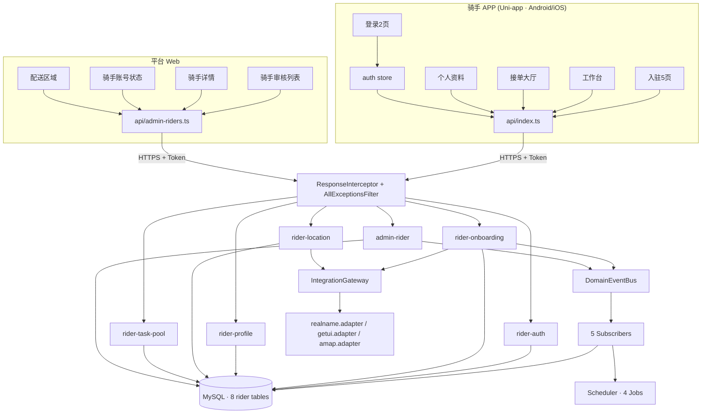
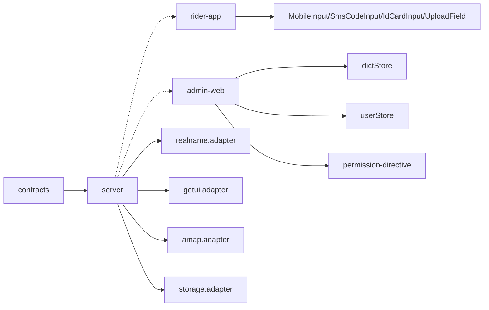
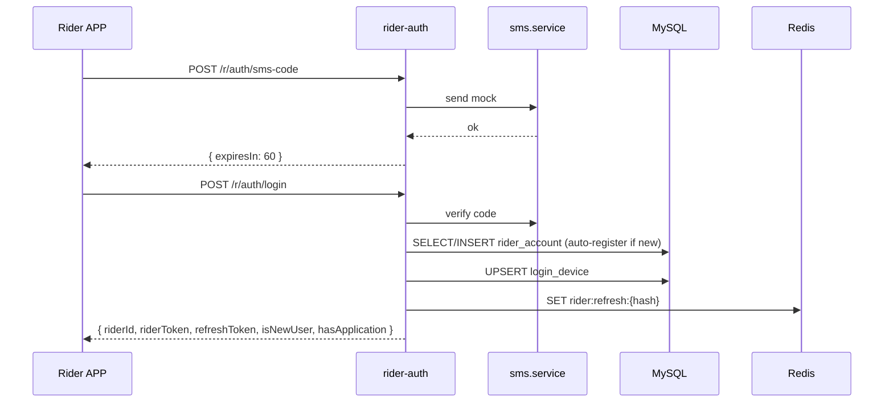
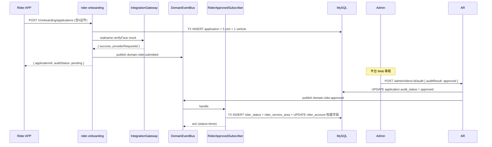
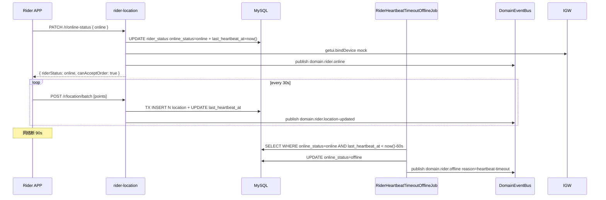
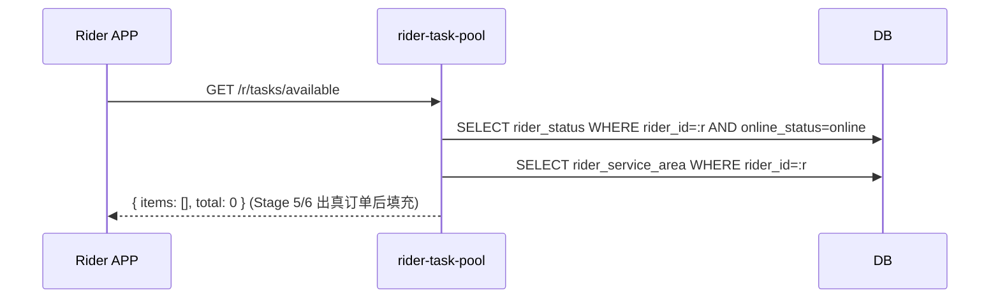
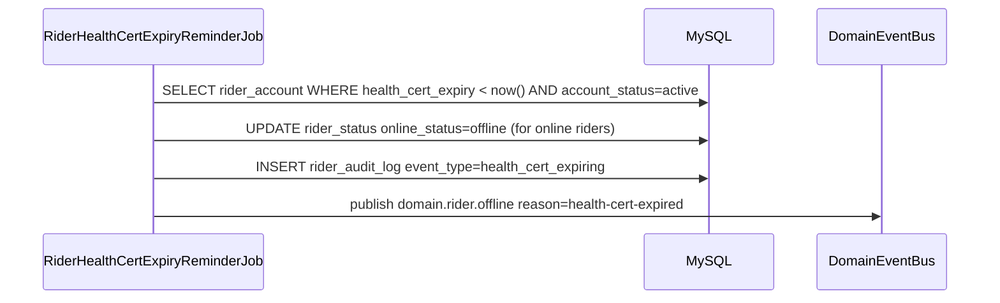
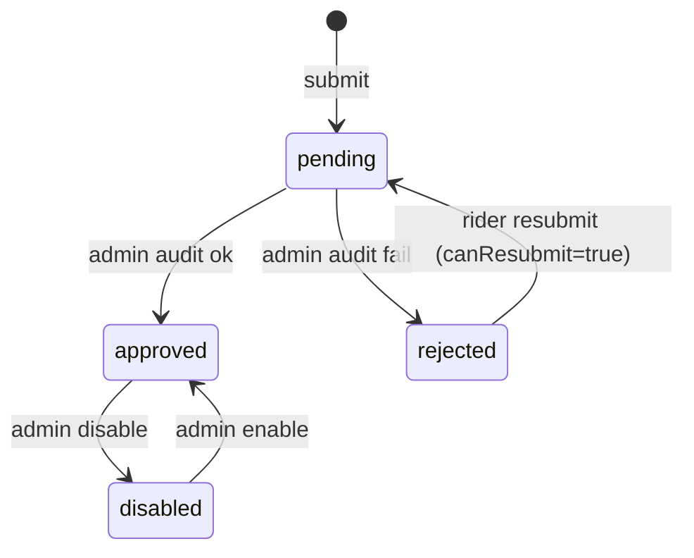

# 阶段 3 — 骑手端 APP 入驻接单与配送基础 · 系统设计(DESIGN)

> 商家端仅 Android APP / iOS APP,禁止规划商家 Web 后台、商家小程序。外卖订单与跑腿订单必须独立订单体系、独立状态机、独立计价、独立退款规则。

## 1. 整体架构



## 2. 模块依赖



## 3. 数据表 schema(8 张)

> 通用约定:`<table>_id` BIGINT PRIMARY KEY AUTO_INCREMENT;`created_at` / `updated_at` BIGINT(毫秒);软删除统一用 `deleted_at` BIGINT NULL。

### 3.1 rider_account

| 字段                                 | 类型             | 说明                                                          |
| ------------------------------------ | ---------------- | ------------------------------------------------------------- |
| rider_id                             | BIGINT PK        | 主键                                                          |
| mobile                               | VARCHAR(20) UQ   | 手机号(唯一,登录用)                                           |
| account_status                       | VARCHAR(20)      | `active` / `disabled`(默认 active 但需审核 approved 才能上线) |
| real_name                            | VARCHAR(50) NULL | 真实姓名(approved 后写入)                                     |
| id_card_no                           | VARCHAR(18) NULL | 身份证号(approved 后写入,@Mask)                               |
| health_cert_no                       | VARCHAR(50) NULL | 健康证号(approved 后写入)                                     |
| health_cert_expiry                   | BIGINT NULL      | 健康证到期(毫秒;到期前 7 天提醒 + 过期强制下线)               |
| approved_at                          | BIGINT NULL      | 审核通过时间                                                  |
| approved_application_id              | BIGINT NULL      | 当前生效申请 ID                                               |
| created_at / updated_at / deleted_at | BIGINT           |                                                               |

索引:`mobile`(UQ)。

### 3.2 rider_application

| 字段                    | 类型              | 说明                                                                          |
| ----------------------- | ----------------- | ----------------------------------------------------------------------------- |
| application_id          | BIGINT PK         |                                                                               |
| rider_id                | BIGINT FK NULL    | 首次提交时 NULL,审核通过后填(对应 rider_account.rider_id)                     |
| mobile                  | VARCHAR(20)       | 申请时手机号(冗余以应对未注册场景)                                            |
| real_name               | VARCHAR(50)       | 申请快照                                                                      |
| id_card_no              | VARCHAR(18)       | 申请快照                                                                      |
| health_cert_no          | VARCHAR(50)       | 申请快照                                                                      |
| health_cert_expiry      | BIGINT            | 申请快照(毫秒)                                                                |
| audit_status            | VARCHAR(20)       | `pending` / `approved` / `rejected` / `disabled`(本字段沿用 stage 2 商家枚举) |
| reject_reason           | VARCHAR(500) NULL |                                                                               |
| audited_at              | BIGINT NULL       |                                                                               |
| audited_by              | BIGINT NULL       | 审核员 admin_user_id                                                          |
| submitted_at            | BIGINT            |                                                                               |
| created_at / updated_at | BIGINT            |                                                                               |

索引:`(mobile, submitted_at)` / `audit_status`。

### 3.3 rider_certificate

| 字段           | 类型           | 说明                                                                                                   |
| -------------- | -------------- | ------------------------------------------------------------------------------------------------------ |
| certificate_id | BIGINT PK      |                                                                                                        |
| application_id | BIGINT FK      |                                                                                                        |
| cert_type      | VARCHAR(30)    | `id_card_front` / `id_card_back` / `face_video` / `health_cert` / `driver_license` / `vehicle_license` |
| file_object_id | VARCHAR(40) FK | file_object 表                                                                                         |
| extra          | JSON NULL      | 比如人脸视频 OCR 返回 / 健康证体检日期等                                                               |
| created_at     | BIGINT         |                                                                                                        |

索引:`(application_id, cert_type)`(UQ);保证每个申请每种资质 1 行。

### 3.4 rider_vehicle

| 字段                    | 类型             | 说明                                   |
| ----------------------- | ---------------- | -------------------------------------- |
| vehicle_id              | BIGINT PK        |                                        |
| rider_id                | BIGINT FK        |                                        |
| vehicle_type            | VARCHAR(20)      | `electric_bike` / `motorcycle` / `car` |
| plate_no                | VARCHAR(20) NULL |                                        |
| brand                   | VARCHAR(50) NULL |                                        |
| status                  | VARCHAR(20)      | `active` / `inactive`(默认 active)     |
| created_at / updated_at | BIGINT           |                                        |

索引:`rider_id`。

### 3.5 rider_service_area

| 字段                    | 类型         | 说明                                                                                                      |
| ----------------------- | ------------ | --------------------------------------------------------------------------------------------------------- |
| service_area_id         | BIGINT PK    |                                                                                                           |
| rider_id                | BIGINT FK UQ | 1:1 to rider                                                                                              |
| geometry                | JSON         | GeoJSON Polygon `{type:'Polygon', coordinates:[[[lng,lat],...]]}`,空时 `{type:'Polygon', coordinates:[]}` |
| max_concurrent_orders   | INT          | 最大同时接单数(默认 3,留 stage 8 用)                                                                      |
| created_at / updated_at | BIGINT       |                                                                                                           |

### 3.6 rider_status

| 字段                    | 类型               | 说明                                           |
| ----------------------- | ------------------ | ---------------------------------------------- |
| status_id               | BIGINT PK          |                                                |
| rider_id                | BIGINT FK UQ       | 1:1 to rider                                   |
| online_status           | VARCHAR(20)        | `online` / `offline` / `busy`(本阶段不用 busy) |
| current_lng             | DECIMAL(10,6) NULL |                                                |
| current_lat             | DECIMAL(10,6) NULL |                                                |
| last_heartbeat_at       | BIGINT NULL        | 心跳时间(>60s 无心跳被 job 强制下线)           |
| device_token            | VARCHAR(255) NULL  | getui 推送 device token                        |
| platform                | VARCHAR(10) NULL   | `android` / `ios`                              |
| credit_score            | INT                | 信用分(默认 100,本阶段字段就位无业务规则)      |
| created_at / updated_at | BIGINT             |                                                |

索引:`(online_status, last_heartbeat_at)`。

### 3.7 rider_location

| 字段        | 类型          | 说明                                     |
| ----------- | ------------- | ---------------------------------------- |
| location_id | BIGINT PK     |                                          |
| rider_id    | BIGINT FK     |                                          |
| lng         | DECIMAL(10,6) |                                          |
| lat         | DECIMAL(10,6) |                                          |
| accuracy    | INT NULL      | 精度(米)                                 |
| batch_id    | VARCHAR(40)   | 批量上报的 batchId(对应 @Idempotent key) |
| reported_at | BIGINT        | 上报时间(毫秒)                           |
| created_at  | BIGINT        |                                          |

索引:`(rider_id, reported_at)`(组合) / `(reported_at)`(给清理 job 走全表扫描)。

### 3.8 rider_audit_log

| 字段           | 类型           | 说明                                                                                                                              |
| -------------- | -------------- | --------------------------------------------------------------------------------------------------------------------------------- |
| audit_log_id   | BIGINT PK      |                                                                                                                                   |
| rider_id       | BIGINT FK NULL | 入驻提交时可能 NULL(未注册账号)                                                                                                   |
| application_id | BIGINT FK NULL |                                                                                                                                   |
| event_type     | VARCHAR(40)    | `submitted` / `approved` / `rejected` / `disabled` / `enabled` / `online` / `offline` / `health_cert_expiring` / `location_batch` |
| operator_type  | VARCHAR(20)    | `rider` / `admin` / `system`                                                                                                      |
| operator_id    | BIGINT NULL    |                                                                                                                                   |
| detail         | JSON NULL      |                                                                                                                                   |
| created_at     | BIGINT         |                                                                                                                                   |

索引:`(rider_id, created_at)` / `event_type`。

### 3.9 sys_permission seed(扩 4 行)

```sql
INSERT INTO sys_permission (code, name) VALUES
  ('rider:public', '骑手端公开'),
  ('rider:self', '骑手端访问自己资源'),
  ('admin:menu:riders', '平台菜单·骑手管理'),
  ('admin:riders:view', '平台查骑手列表与详情'),
  ('admin:riders:manage', '平台审核骑手 / 启停 / 配送区域');

-- 角色绑定(role-permission.seed.ts 扩展)
RIDER → rider:public, rider:self
SUPER_ADMIN → admin:riders:view, admin:riders:manage, admin:menu:riders
AUDITOR → admin:riders:view, admin:menu:riders
```

## 4. 接口契约(14 个)

> 全部走 `ResponseInterceptor`(返 ApiResponse `{code, message, data, traceId, timestamp}`)。错误码沿用 stage 0 ErrorCode。

### 4.1 rider-auth(4 个)

#### POST /api/v1/r/auth/sms-code

- 调用端:骑手 APP / Token:无 / 装饰器:@Public + @Idempotent(60s, key=`rider:sms:${mobile}:${scene}`)
- Req: `{ mobile: string, scene: 'login' }`
- Res: `{ expiresIn: 60 }`(开发模式 console.log mock code)

#### POST /api/v1/r/auth/login

- @Public + @Idempotent(10s, key 含 mobile+code+deviceId) + @Audit
- Req: `{ mobile, code, deviceId, platform: 'app-android'|'app-ios' }`
- Res: `{ riderId, accountStatus, riderToken, refreshToken, expiresIn, isNewUser, hasApplication, latestApplicationId? }`
- 行为:验证 sms_code(消费一次);如未注册,自动建 rider_account(account_status='active')+ 写 login_device 复用 stage 1 表;如已注册,UPDATE login_device

#### POST /api/v1/r/auth/refresh

- @Public + @Idempotent(短期)
- Req: `{ refreshToken }`
- Res: `{ riderToken, refreshToken, expiresIn }`
- 行为:Redis 校验 hash 在 `rider:refresh:{hash}`,旋转新对

#### POST /api/v1/r/auth/logout

- RiderJwtGuard + @Audit + @Idempotent
- Req: 无
- Res: `null`
- 行为:写 jti 黑名单 `jti:revoked:{jti}` (TTL=token 剩余有效期);删 Redis refresh

### 4.2 rider-onboarding(2 个)

#### POST /api/v1/r/onboarding/applications

- RiderJwtGuard + @RequirePermission('rider:self') + @Idempotent(key=`rider:onboarding:${riderId}`) + @Audit
- Req:

```ts
{
  realName: string;
  idCardNo: string;
  healthCertNo: string;
  healthCertExpiry: number;  // 毫秒
  vehicle: { vehicleType: 'electric_bike'|'motorcycle'|'car', plateNo?: string, brand?: string };
  certificates: { certType: '...', fileObjectId: string }[];  // 5 项
}
```

- Res: `{ applicationId, auditStatus: 'pending', submittedAt }`
- 行为:事务 INSERT rider_application + 5 rider_certificate + (首次)1 rider_vehicle;同步调 `realname.verifyFace` mock(失败不阻塞,reason 写 audit_log;成功立即可审);发布 `domain.rider.submitted`;写 rider_audit_log event_type='submitted'

#### GET /api/v1/r/onboarding/status

- RiderJwtGuard + @RequirePermission('rider:self')
- Res:

```ts
{
  hasApplication: boolean;
  applicationId?: string;
  auditStatus?: 'pending'|'approved'|'rejected'|'disabled';
  rejectReason?: string;
  canResubmit: boolean;  // = 最新申请 status='rejected'
  submittedAt?: number;
  realName?: string;  // approved 后从 rider_account 读
}
```

### 4.3 rider-profile(2 个)

#### GET /api/v1/r/profile

- RiderJwtGuard + @RequirePermission('rider:self')
- Res: `{ riderId, mobile(@Mask), realName, vehicle, healthCertExpiry, creditScore, accountStatus }`

#### PATCH /api/v1/r/profile

- RiderJwtGuard + @Idempotent + @Audit
- Req: `{ vehicle?: {...} }`(本阶段只允许改车辆;real_name / id_card 是审核结果,不可改)
- Res: `null`

### 4.4 rider-location(2 个)

#### PATCH /api/v1/r/online-status

- RiderJwtGuard + @Idempotent + @Audit
- Req: `{ targetStatus: 'online'|'offline', deviceToken?: string, platform?: 'android'|'ios', currentLng?: number, currentLat?: number }`
- Res: `{ riderStatus, canAcceptOrder: boolean, reason?: string }`
- 行为:校验 rider 必须 approved + 健康证未过期 + 账号 active;online 时调 `getui.bindDevice` mock(失败不阻塞,warn 日志);发布 `domain.rider.online` / `offline`;写 rider_audit_log

#### POST /api/v1/r/location/batch

- RiderJwtGuard + @Idempotent(key=batchId) + @Audit
- Req: `{ batchId: string, points: { lng, lat, accuracy?, reportedAt }[] }`(数组长度 1~50;> 50 PARAM_INVALID)
- Res: `{ acceptedCount: number, serverTime: number }`
- 行为:事务 INSERT N 条 rider_location;同步刷新 rider_status.last_heartbeat_at = now() + current_lng/lat = 数组最后 1 点;发布 `domain.rider.location-updated` 1 个事件 payload `{ riderId, batchId, batchSize, lastLng, lastLat, lastReportedAt }`

### 4.5 rider-task-pool(1 个)

#### GET /api/v1/r/tasks/available

- RiderJwtGuard + @RequirePermission('rider:self')
- Query: `?bizType=takeaway|errand&radius=3000&page=1&size=20`
- Res: `{ items: TaskItemVo[], total: number }`
- 本阶段:**返回 `{items:[], total:0}`**(per D-4)。校验:rider 必须 approved + online + 有 service area 才走过滤分支(过滤分支为空源数据)

```ts
TaskItemVo: {
  taskId: string;
  bizType: 'takeaway' | 'errand';
  distance: number; // 米
  reward: number; // 分
  deadline: number; // 毫秒
  pickupAddress: {
    (lng, lat, text);
  }
  deliveryAddress: {
    (lng, lat, text);
  }
}
```

### 4.6 admin-rider(3 个)

#### GET /api/v1/admin/riders

- AdminJwtGuard + @RequirePermission('admin:riders:view')
- Query: `?keyword=&auditStatus=&accountStatus=&page=&size=`
- Res: `{ items: RiderListItemVo[], total }`(@Mask mobile / idCardNo)

#### GET /api/v1/admin/riders/:applicationId

- AdminJwtGuard + @RequirePermission('admin:riders:view')
- Res: `{ application: {...含5证件URL}, vehicle, latestStatus?, recentAuditLogs }`(全部 @Mask 敏感字段)

#### POST /api/v1/admin/riders/:applicationId/audit

- AdminJwtGuard + @RequirePermission('admin:riders:manage') + @Idempotent + @Audit
- Req: `{ auditResult: 'approved' | 'rejected', rejectReason?: string }`
- Res: `{ riderId, auditStatus }`
- 行为:幂等(已是目标态返当前结果不重发事件);approved 发 `domain.rider.approved`;rejected 写 reject_reason + audit_log

#### POST /api/v1/admin/riders/:riderId/status (扩展)

- AdminJwtGuard + @RequirePermission('admin:riders:manage') + @Idempotent + @Audit
- Req: `{ targetStatus: 'enabled' | 'disabled', reason?: string }`
- 行为:UPDATE rider_account.account_status;disabled 时同步 UPDATE rider_status.online_status='offline' + 发布 `domain.rider.offline` reason='admin-disabled'

#### PATCH /api/v1/admin/riders/:riderId/service-area (扩展)

- AdminJwtGuard + @RequirePermission('admin:riders:manage') + @Idempotent + @Audit
- Req: `{ geometry: GeoJSONPolygon, maxConcurrentOrders?: number }`
- 行为:UPDATE rider_service_area;@IsGeoJsonPolygon 校验

> ⚠️ 注:契约清单点名 3 接口,扩展 2 接口(status / service-area),共 **5 个 admin 接口**;14 接口总数为 4(auth)+ 2(onboarding)+ 2(profile)+ 2(location)+ 1(task-pool)+ 5(admin) = **16 接口**(超出最初 14 估计 2 个,扩展接口必要,记入 CONSENSUS §4 隐含扩展)。

## 5. Sequence(5 个核心场景)

### 5.1 骑手注册登录



### 5.2 入驻提交 + 异步核验 + 平台审核 + 自动建关联



### 5.3 上线 + 心跳 + 心跳超时下线



### 5.4 接单大厅(本阶段返空)



### 5.5 健康证到期 + 强制下线



## 6. 状态机

### 6.1 audit_status



### 6.2 online_status

```mermaid
stateDiagram-v2
  [*] --> offline: rider register
  offline --> online: rider go online (前提:approved + healthCert valid + active)
  online --> offline: rider go offline OR heartbeat timeout OR healthCert expired OR admin disable
  online --> busy: 接单成功 (留 stage 5/6;本阶段不进入)
  busy --> online: 订单完成 (留 stage 5/6)
```



非法流转返 `STATUS_INVALID`(沿用 stage 0 ErrorCode)。

## 7. 事件设计(5 个)

| EventName            | 名称                          | 触发                                                                                   | Payload                                                             | 订阅器                                                                       |
| -------------------- | ----------------------------- | -------------------------------------------------------------------------------------- | ------------------------------------------------------------------- | ---------------------------------------------------------------------------- |
| RiderSubmitted       | domain.rider.submitted        | rider-onboarding.submit                                                                | `{ applicationId, mobile, riderId? }`                               | RiderSubmittedSubscriber(写 audit_log)                                       |
| RiderApproved        | domain.rider.approved         | admin-rider.audit (approved)                                                           | `{ applicationId, riderId }`                                        | RiderApprovedSubscriber(自动建关联)                                          |
| RiderOnline          | domain.rider.online           | rider-location.online-status / 入驻 approved 后首次                                    | `{ riderId, deviceToken?, platform?, lng?, lat? }`                  | RiderOnlineSubscriber(写 audit_log)                                          |
| RiderOffline         | domain.rider.offline          | rider-location.online-status / heartbeat timeout / health-cert-expired / admin disable | `{ riderId, reason }`                                               | RiderOfflineSubscriber(写 audit_log + getui.unbindDevice mock)               |
| RiderLocationUpdated | domain.rider.location-updated | rider-location.batch                                                                   | `{ riderId, batchId, batchSize, lastLng, lastLat, lastReportedAt }` | RiderLocationUpdatedSubscriber(留 stage 8 调度匹配,本阶段空实现 + warn 日志) |

事件 payload 接口在 `events/events.ts` 加 `EventPayloadMap` 5 行;EventName key 加 5 行。

## 8. 定时任务设计(4 个)

| Job                              | Cron                  | 锁前缀                                   | 行为                                                                                                                                       |
| -------------------------------- | --------------------- | ---------------------------------------- | ------------------------------------------------------------------------------------------------------------------------------------------ |
| RiderHeartbeatTimeoutOfflineJob  | `*/1 * * * *`(每分钟) | `lock:scheduler:rider-heartbeat-timeout` | 扫 rider_status WHERE online_status=online AND last_heartbeat_at < now()-60000;UPDATE offline + 发 offline 事件 reason='heartbeat-timeout' |
| RiderHealthCertExpiryReminderJob | `0 8 * * *`(每日8点)  | `lock:scheduler:rider-health-expiry`     | 扫 rider_account WHERE health_cert_expiry between (now, now+7天) OR < now;7 天内写 audit_log reminder;过期同时强制 offline                 |
| RiderAuditTimeoutReminderJob     | `0 9 * * *`(每日9点)  | `lock:scheduler:rider-audit-timeout`     | 扫 rider_application WHERE audit_status=pending AND submitted_at < now-72h;写 audit_log reminder(本阶段不发短信,占位)                      |
| RiderLocationArchiveJob          | `0 3 * * *`(每日3点)  | `lock:scheduler:rider-location-archive`  | DELETE FROM rider_location WHERE reported_at < now-7天;输出 metrics(本阶段直接删,stage 8 升级归档 MongoDB)                                 |

注册到 `scheduler.module.ts` providers + jobs 数组(累加到 17 jobs)。

## 9. 文件结构

### 后端

```
apps/server/src/
├ database/entities/
│   ├ rider-account.entity.ts
│   ├ rider-application.entity.ts
│   ├ rider-certificate.entity.ts
│   ├ rider-vehicle.entity.ts
│   ├ rider-service-area.entity.ts
│   ├ rider-status.entity.ts
│   ├ rider-location.entity.ts
│   └ rider-audit-log.entity.ts
├ database/migrations/1714867500000-Stage3Init.ts
├ database/seeds/role-permission.seed.ts(扩 4 权限)
├ events/events.ts(+5 EventName + payload)
├ events/subscribers/
│   ├ rider-submitted.subscriber.ts
│   ├ rider-approved.subscriber.ts
│   ├ rider-online.subscriber.ts
│   ├ rider-offline.subscriber.ts
│   └ rider-location-updated.subscriber.ts
├ scheduler/jobs/
│   ├ rider-heartbeat-timeout-offline.job.ts
│   ├ rider-health-cert-expiry-reminder.job.ts
│   ├ rider-audit-timeout-reminder.job.ts
│   └ rider-location-archive.job.ts
├ modules/
│   ├ rider-auth/{module,service,controller,dto,constants}.ts
│   ├ rider-onboarding/{module,service,controller,dto}.ts
│   ├ rider-profile/{module,service,controller,dto}.ts
│   ├ rider-location/{module,service,controller,dto}.ts
│   ├ rider-task-pool/{module,service,controller,dto}.ts
│   └ admin-rider/{module,service,controller,dto}.ts
└ modules/integration-gateway/adapters/
    ├ realname.adapter.ts(+verifyFace)
    └ getui.adapter.ts(+bindDevice +unbindDevice)
```

### 骑手 APP

```
apps/rider-app/src/
├ api/index.ts(stage 3 接口常量)
├ stores/auth.ts(Pinia 复刻 merchant)
├ utils/request.ts(401 自动 refresh)
├ pages/login/{index,verify}.vue
├ pages/onboarding/{apply,face,health,vehicle,progress}.vue
├ pages/workbench/index.vue
├ pages/tasks/available.vue
├ pages/profile/index.vue
└ components/common/{MobileInput,SmsCodeInput,IdCardInput,UploadField}.vue
```

### 平台 Web

```
apps/admin-web/src/
├ api/admin-riders.ts
├ views/riders/{audit,detail,status,delivery-area}.vue
├ views/riders/components/{RiderAuditDialog,RiderHealthCertPreview}.vue
└ router/index.ts(+4 路由)
```

## 10. 异常 / 错误码

| 场景                                                      | ErrorCode                    | HTTP |
| --------------------------------------------------------- | ---------------------------- | ---- |
| sms code 错误 / 过期                                      | AUTH_INVALID_SMS             | 401  |
| token 无效 / 过期                                         | UNAUTHORIZED                 | 401  |
| 跨端 token                                                | FORBIDDEN(cross-scope token) | 403  |
| 入驻已存在 pending                                        | STATUS_INVALID               | 409  |
| audit 非法流转(approved→pending)                          | STATUS_INVALID               | 409  |
| online-status 校验失败(未审 / 健康证过期 / 账号 disabled) | STATUS_INVALID               | 409  |
| location batch > 50 点                                    | PARAM_INVALID                | 400  |
| service-area JSON 非 Polygon                              | PARAM_INVALID                | 400  |
| 第三方 mock 未通过(verifyFace 失败)                       | THIRD_PARTY_FAILED           | 502  |

## 11. 测试覆盖矩阵(给 T16 测试任务)

- 后端 jest:6 模块 × 平均 8 spec ≈ 48,加 4 jobs 各 1 + 5 subscribers 各 1 + adapters 扩展 2 + cross-scope 6 + 状态机 5 = ≈80
- 前端 vitest:rider-app 8 spec(login / verify / apply / face / health / vehicle / progress / workbench)+ admin-web 4 spec(audit / detail / status / RiderAuditDialog) ≈ 30
