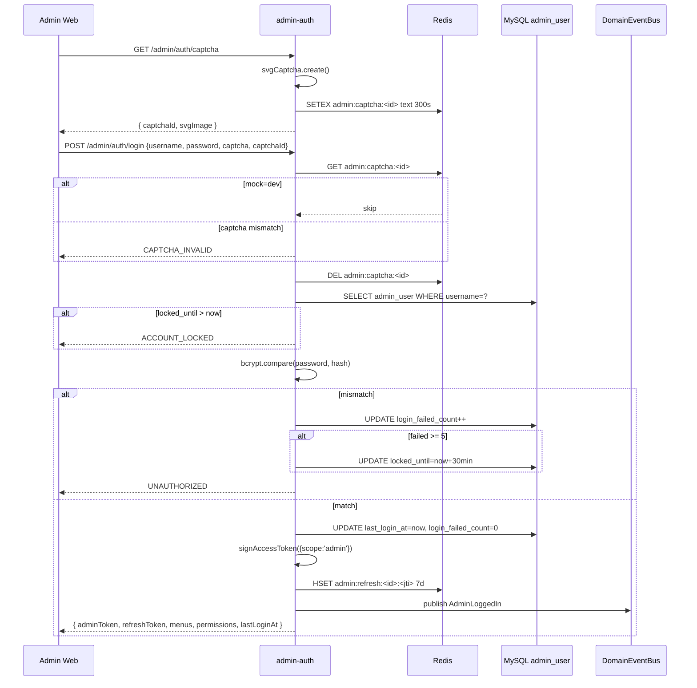
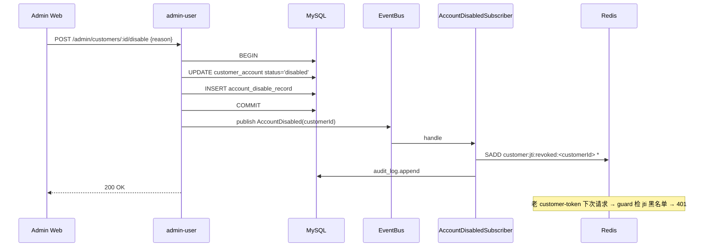
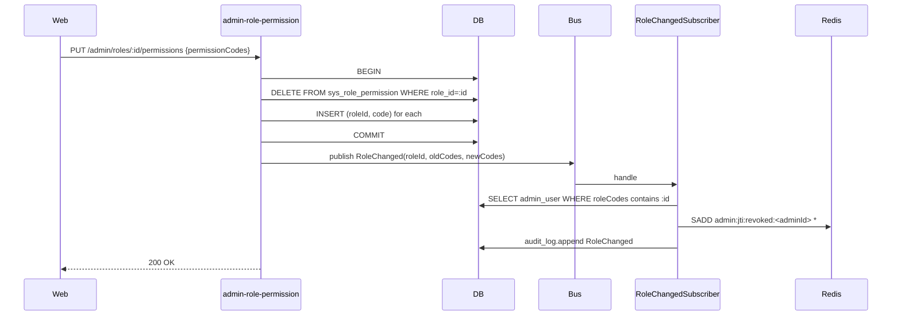
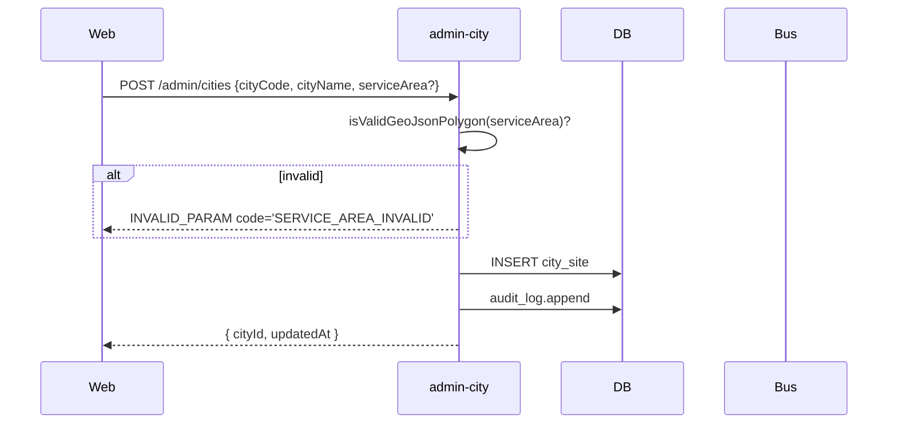
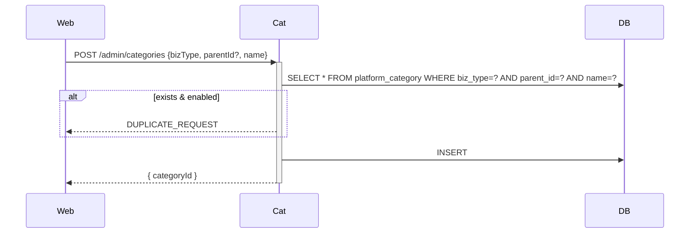
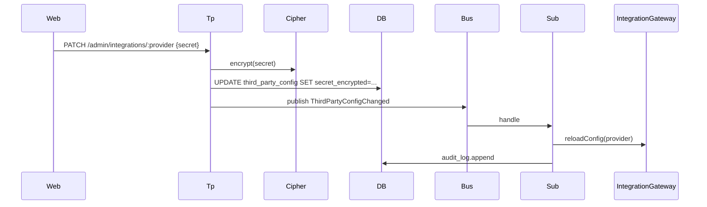

# 阶段 4 — 平台管理端 Web 审核管控与基础配置 · 设计文档(DESIGN)

> 商家端仅 Android APP / iOS APP,禁止规划商家 Web 后台、商家小程序。外卖订单与跑腿订单必须独立订单体系、独立状态机、独立计价、独立退款规则。

## 1. 系统分层与模块依赖

```mermaid
flowchart TB
  subgraph Admin Web
    LoginPage --> CaptchaApi
    CityPage --> CityApi
    CategoryPage --> CategoryApi
    SystemConfigPage --> SysConfigApi
    IntegrationPage --> IntApi
    RolePage --> RoleApi
    CustomersPage --> CustomerDisableApi
  end

  subgraph Server Modules
    AdminAuthCtrl --> AdminAuthSvc --> AuthSvc[(auth.service)]
    AdminAuthSvc --> RedisCache[(Redis admin:captcha:*)]
    AdminCityCtrl --> AdminCitySvc --> CityRepo[(city_site)]
    AdminCategoryCtrl --> AdminCategorySvc --> CatRepo[(platform_category)]
    AdminSystemConfigCtrl --> AdminSystemConfigSvc --> SysConfigRepo[(sys_config)]
    AdminThirdPartyCtrl --> AdminThirdPartySvc --> TpRepo[(third_party_config)]
    AdminThirdPartySvc --> CipherUtil[(cipher util)]
    AdminRolePermCtrl --> AdminRolePermSvc --> RoleRepo[(sys_role / sys_permission)]
    AdminUserCtrl --> AdminUserSvc --> CustomerAuth
    AdminUserSvc --> DisableRepo[(account_disable_record)]
    AdminMerchantSvc & AdminRiderSvc -->|on audit| EventBus
    AllSvc --> EventBus
    EventBus --> Subscribers
    Subscribers --> AuditLogSvc
    Subscribers --> JtiBlackList[(Redis admin:jti:revoked / customer:jti:revoked / ...)]
    Subscribers --> IntegrationGatewaySvc
    Scheduler --> ConfigAggrJob & DisableTokenJob
  end

  CaptchaApi -.-> AdminAuthCtrl
  CityApi -.-> AdminCityCtrl
  CategoryApi -.-> AdminCategoryCtrl
  SysConfigApi -.-> AdminSystemConfigCtrl
  IntApi -.-> AdminThirdPartyCtrl
  RoleApi -.-> AdminRolePermCtrl
  CustomerDisableApi -.-> AdminUserCtrl
```



## 2. 数据库 Schema

### 2.1 city_site(新增)

```sql
CREATE TABLE city_site (
  city_site_id     BIGINT       NOT NULL AUTO_INCREMENT,
  city_code        VARCHAR(16)  NOT NULL,
  city_name        VARCHAR(64)  NOT NULL,
  province         VARCHAR(64)           DEFAULT NULL,
  service_enabled  TINYINT(1)   NOT NULL DEFAULT 1,
  service_area     JSON                  DEFAULT NULL COMMENT 'GeoJSON Polygon, NULL=全城',
  display_order    INT          NOT NULL DEFAULT 0,
  created_at       BIGINT       NOT NULL,
  updated_at       BIGINT       NOT NULL,
  PRIMARY KEY (city_site_id),
  UNIQUE KEY uk_city_site_code (city_code),
  KEY idx_city_site_enabled_order (service_enabled, display_order)
) ENGINE=InnoDB DEFAULT CHARSET=utf8mb4 COMMENT='平台城市站点权威表';
```

### 2.2 platform_category(新增)

```sql
CREATE TABLE platform_category (
  category_id    BIGINT       NOT NULL AUTO_INCREMENT,
  biz_type       VARCHAR(16)  NOT NULL COMMENT 'takeaway | errand',
  parent_id      BIGINT       NOT NULL DEFAULT 0,
  name           VARCHAR(64)  NOT NULL,
  icon_url       VARCHAR(512)          DEFAULT NULL,
  display_order  INT          NOT NULL DEFAULT 0,
  enabled        TINYINT(1)   NOT NULL DEFAULT 1,
  created_at     BIGINT       NOT NULL,
  updated_at     BIGINT       NOT NULL,
  PRIMARY KEY (category_id),
  UNIQUE KEY uk_platform_category (biz_type, parent_id, name),
  KEY idx_platform_category_listing (biz_type, enabled, display_order)
) ENGINE=InnoDB DEFAULT CHARSET=utf8mb4 COMMENT='平台级分类表';
```

### 2.3 account_disable_record(新增)

```sql
CREATE TABLE account_disable_record (
  account_disable_record_id  BIGINT       NOT NULL AUTO_INCREMENT,
  account_type               VARCHAR(16)  NOT NULL COMMENT 'customer | merchant | rider',
  account_id                 BIGINT       NOT NULL,
  action                     VARCHAR(16)  NOT NULL COMMENT 'disable | enable',
  reason                     VARCHAR(512)          DEFAULT NULL,
  operator_admin_id          BIGINT       NOT NULL,
  operator_username          VARCHAR(64)  NOT NULL,
  created_at                 BIGINT       NOT NULL,
  PRIMARY KEY (account_disable_record_id),
  KEY idx_disable_target (account_type, account_id, created_at),
  KEY idx_disable_operator (operator_admin_id, created_at)
) ENGINE=InnoDB DEFAULT CHARSET=utf8mb4 COMMENT='账号禁用启用流水';
```

### 2.4 admin_user 扩展(stage 0 既有,加 4 列)

```sql
ALTER TABLE admin_user
  ADD COLUMN password_hash       VARCHAR(128) NOT NULL DEFAULT '' AFTER username,
  ADD COLUMN login_failed_count  INT          NOT NULL DEFAULT 0,
  ADD COLUMN locked_until        BIGINT       NOT NULL DEFAULT 0,
  ADD COLUMN last_login_at       BIGINT       NOT NULL DEFAULT 0;
```

> stage 0 admin_user 已有 admin_user_id / username / display_name / status / role_codes / created_at / updated_at,本阶段补 4 列以承载 admin-auth login。

## 3. 接口契约(22 接口)

### 3.1 admin-auth(4)

#### `GET /api/v1/admin/auth/captcha`

- Token: 无
- Permission: 无
- Idempotent: 否
- Audit: 否
- Response: `{ captchaId: string, svgImage: string }`(svgImage 直接 SVG XML 文本)
- Logic: svg-captcha.create({ size: 4, ignoreChars: '0o1l', noise: 2 }) → `{text, data}` → 生成 captchaId(uuid v4)→ Redis SETEX `admin:captcha:<captchaId>` text TTL=300 → 返 svgImage=data

#### `POST /api/v1/admin/auth/login`

- Token: 无
- Permission: 无
- Idempotent: `Idempotency-Key`(60s)+ 内置 key=username:ip 兜底
- Audit: 是(success / fail 各一条)
- Request: `{ username, password, captcha, captchaId, deviceId?, platform? }`
- Response: `{ adminToken, refreshToken, expiresIn, displayName, roleCodes, permissions: string[], menus: string[], lastLoginAt }`
- Errors:
  - `CAPTCHA_EXPIRED` / `CAPTCHA_INVALID`(captcha 校验失败)
  - `INVALID_PARAM`(字段缺失)
  - `UNAUTHORIZED`(用户名不存在 / 密码错)→ login_failed_count++
  - `ACCOUNT_LOCKED`(locked_until > now)
  - `ACCOUNT_DISABLED`(admin_user.status='disabled')
- Logic:
  1. mock 模式 captcha === 'dev' 跳过 captcha 校验;否则 GET Redis `admin:captcha:<captchaId>` → 一致 → DEL key
  2. 查 admin_user(username) → 不存在 UNAUTHORIZED
  3. status='disabled' → ACCOUNT_DISABLED
  4. locked_until > now → ACCOUNT_LOCKED
  5. bcrypt.compare(password, password_hash) → false: login_failed_count++(若 ≥5 设 locked_until=now+30min);UNAUTHORIZED
  6. true: reset login_failed_count=0 + last_login_at=now + 写 sys_role.permissions 集合 + auth.service.signAccessToken({ scope:'admin', subject: admin_user_id, jti }) → adminToken
  7. 写 refreshToken hash:`admin:refresh:<adminUserId>:<jti>` Redis TTL 7d
  8. 发 `domain.admin.logged-in` 事件

#### `POST /api/v1/admin/auth/refresh`

- Token: Refresh-Token(adminToken header 失效允许)
- 复刻 stage 1/2/3 模式

#### `POST /api/v1/admin/auth/logout`

- Token: Admin-Token
- jti 加黑名单 + 删 refresh hash

### 3.2 admin-rider applications alias(1)

#### `GET /api/v1/admin/riders/applications`

- Token: Admin-Token
- Permission: `admin:riders:view`
- Query: `auditStatus?, keyword?, pageNo, pageSize`(默认 auditStatus in (pending, rejected))
- Response: 同 stage 3 GET /admin/riders 但精简(只返 audit 相关字段:applicationId / mobile_masked / realName_masked / submittedAt / auditStatus / rejectReason)

### 3.3 admin-user 扩展(2)

#### `POST /api/v1/admin/customers/:id/disable`

- Token: Admin-Token
- Permission: `admin:customers:disable`
- Idempotent: 60s key=customerId
- Audit: 是
- Request: `{ reason: string }`(必填,1-500 char)
- Response: `{ success:true, accountStatus:'disabled', disabledAt }`
- Logic(事务):
  1. SELECT customer_account WHERE id=:id FOR UPDATE
  2. 已 disabled → 返当前结果(幂等)
  3. UPDATE customer_account SET account_status='disabled', updated_at=now
  4. INSERT account_disable_record(action='disable', reason, operator)
  5. publish `domain.account.disabled`(accountType='customer', accountId, reason, operatorId)

#### `POST /api/v1/admin/customers/:id/enable`

- 反向操作:account_status='active' + INSERT(action='enable')+ 不发 disabled 事件(只 audit_log;jti 不需要恢复,旧 token 已失效)

### 3.4 admin-city(4)

#### `GET /api/v1/admin/cities`

- Token: Admin-Token / Permission: `admin:cities:manage`
- Query: `keyword?, serviceEnabled?, pageNo, pageSize`
- Response: 分页 + items[{cityCode, cityName, province, serviceEnabled, serviceArea, displayOrder, updatedAt}]

#### `POST /api/v1/admin/cities`

- Idempotent: 60s key=cityCode
- Request: `{ cityCode, cityName, province?, serviceEnabled?, serviceArea?, displayOrder? }`
- 校验:cityCode 唯一;serviceArea 若非空必须 GeoJSON Polygon;cityCode `/^[A-Z0-9_]{2,16}$/`

#### `PATCH /api/v1/admin/cities/:code`

- 不可改 cityCode

#### `DELETE /api/v1/admin/cities/:code`

- 软禁用 service_enabled=false

### 3.5 admin-category(4)

#### `GET /api/v1/admin/categories?bizType=takeaway|errand`

- bizType 必填 → 返树状(parent_id=0 顶级 → children 二级)

#### `POST /api/v1/admin/categories`

- Idempotent: 60s key=bizType:parentId:name
- Request: `{ bizType, parentId?, name, iconUrl?, displayOrder? }`

#### `PATCH /api/v1/admin/categories/:id`

- 不可改 bizType / parentId

#### `DELETE /api/v1/admin/categories/:id`

- 软禁用 enabled=false;若有二级子类目仍 enabled → 报 STATUS_INVALID code='HAS_ENABLED_CHILDREN'

### 3.6 admin-system-config(2)

#### `GET /api/v1/admin/system-config`

- 返全部 sys_config 行;value 若 isSecret=true 返脱敏

#### `PATCH /api/v1/admin/system-config/:key`

- Request: `{ value }`
- 校验 key 存在 → 否则 SYSTEM_CONFIG_KEY_UNKNOWN
- 发 `domain.config.changed`(stage 0 既有事件)

### 3.7 admin-third-party-config(3)

#### `GET /api/v1/admin/integrations`

- 返全部 third_party_config;secret_encrypted 解密后脱敏返(`xxx***xxx`)

#### `GET /api/v1/admin/integrations/:provider`

- 单个详情,secret 脱敏

#### `PATCH /api/v1/admin/integrations/:provider`

- Request: `{ appId?, secret?, callbackUrl?, enabled?, configJson? }`
- secret 字段进 cipher.encrypt 存 secret_encrypted
- 发 `domain.thirdparty.config-changed`

### 3.8 admin-role-permission(3)

#### `GET /api/v1/admin/roles`

- Permission: `admin:roles:manage`(view 也走同权限,简化)
- 返 sys_role 列表 + 每行 `permissionCodes: string[]`

#### `GET /api/v1/admin/permissions`

- 返 seed 权限点树:
  ```json
  [
    { "group": "customer", "permissions": [{ "code": "customer:self", "name": "用户自资源" }] },
    { "group": "merchant", "permissions": [...] },
    { "group": "rider", "permissions": [...] },
    { "group": "admin", "permissions": [...] }
  ]
  ```

#### `PUT /api/v1/admin/roles/:id/permissions`

- Idempotent: 60s key=roleId
- Request: `{ permissionCodes: string[] }`
- 事务:DELETE FROM sys_role_permission WHERE role_id=:id;INSERT 新条目;发 `domain.role.changed`(roleId, oldCodes, newCodes)

## 4. 序列图

### 4.1 admin login(D-1)



### 4.2 customer disable + 强制下线(R-03)



### 4.3 角色权限编辑 + 强制重登(D-4)



### 4.4 platform city create(D-2 + GeoJSON)



### 4.5 platform category create



### 4.6 third-party-config patch + 缓存重载



## 5. 角色与权限矩阵(stage 4 后)

| 权限点                        | SUPER_ADMIN | AUDITOR | RIDER | MERCHANT | CUSTOMER |
| ----------------------------- | ----------- | ------- | ----- | -------- | -------- |
| admin:cities:manage           | ✓           | ✗       | ✗     | ✗        | ✗        |
| admin:categories:manage       | ✓           | ✗       | ✗     | ✗        | ✗        |
| admin:system-config:manage    | ✓           | ✗       | ✗     | ✗        | ✗        |
| admin:third-party:manage      | ✓           | ✗       | ✗     | ✗        | ✗        |
| admin:roles:manage            | ✓           | ✗       | ✗     | ✗        | ✗        |
| admin:menu:cities             | ✓           | ✓(只读) | ✗     | ✗        | ✗        |
| admin:menu:categories         | ✓           | ✓       | ✗     | ✗        | ✗        |
| admin:menu:system-config      | ✓           | ✓       | ✗     | ✗        | ✗        |
| admin:menu:third-party        | ✓           | ✗       | ✗     | ✗        | ✗        |
| admin:menu:roles              | ✓           | ✗       | ✗     | ✗        | ✗        |
| admin:customers:disable(既有) | ✓           | ✗       | ✗     | ✗        | ✗        |

stage 0/1/2/3 已有的:`admin:menu:audit-logs / integrations / system-config / roles-permissions / customers / merchants / riders` 沿用。

## 6. 6 事件 payload

```ts
// events.ts(stage 4 新增 6)
AdminLoggedIn: 'domain.admin.logged-in',
RoleChanged: 'domain.role.changed',
AccountDisabled: 'domain.account.disabled',
MerchantAudited: 'domain.merchant.audited',
RiderAudited: 'domain.rider.audited',
ThirdPartyConfigChanged: 'domain.thirdparty.config-changed',

// EventPayloadMap 新增 6
[EventName.AdminLoggedIn]: {
  adminUserId: string;
  username: string;
  loggedInAt: number;
  ip?: string;
  deviceId?: string;
};
[EventName.RoleChanged]: {
  roleId: string;
  roleCode: string;
  oldPermissionCodes: string[];
  newPermissionCodes: string[];
  operatorAdminId: string;
  changedAt: number;
};
[EventName.AccountDisabled]: {
  accountType: 'customer' | 'merchant' | 'rider';
  accountId: string;
  action: 'disable' | 'enable';
  reason?: string;
  operatorAdminId: string;
  operatedAt: number;
};
[EventName.MerchantAudited]: {
  applicationId: string;
  merchantId?: string;
  auditResult: 'approved' | 'rejected';
  rejectReason?: string;
  operatorAdminId: string;
  auditedAt: number;
};
[EventName.RiderAudited]: {
  applicationId: string;
  riderId?: string;
  auditResult: 'approved' | 'rejected';
  rejectReason?: string;
  operatorAdminId: string;
  auditedAt: number;
};
[EventName.ThirdPartyConfigChanged]: {
  provider: string;
  changedFields: string[];
  operatorAdminId: string;
  changedAt: number;
};
```

## 7. 2 定时任务

### 7.1 config-change-aggregate.job

- Cron `0 0 * * * *`(每小时整点)
- DistributedLock key `lock:scheduler:config-change-aggregate`
- 逻辑:扫上一小时 sys_audit_log WHERE event_type IN ('config.changed','thirdparty.config-changed','role.changed','city.updated','category.updated')→ 按 event_type 聚合 count + 最早 / 最晚时间 → 写新 sys_audit_log row(event_type='config.aggregate.hourly', detail={...})
- 用途:运营审计大盘可看每小时配置变更分布

### 7.2 disabled-account-token-broadcast.job

- Cron `*/5 * * * *`(每 5min)
- DistributedLock key `lock:scheduler:disabled-token-broadcast`
- 逻辑:扫 account_disable_record WHERE action='disable' AND created_at > (last_run_at - 10min)→ 对每条调 jti 黑名单广播(冗余 subscriber 实时性,兜底重启 / 错过事件场景)
- 状态保留:Redis `scheduler:disabled-broadcast:last-run` BIGINT

## 8. 异常处理策略

| 错误场景                      | 错误码                                      | HTTP | 用户提示                 |
| ----------------------------- | ------------------------------------------- | ---- | ------------------------ |
| captcha 过期                  | CAPTCHA_EXPIRED                             | 400  | 验证码已过期,请刷新      |
| captcha 错误                  | CAPTCHA_INVALID                             | 400  | 验证码错误               |
| 用户名 / 密码错               | UNAUTHORIZED                                | 401  | 用户名或密码错误         |
| admin 锁定                    | ACCOUNT_LOCKED                              | 423  | 账号已锁定,30 分钟后再试 |
| admin disabled                | ACCOUNT_DISABLED                            | 403  | 账号已禁用,请联系管理员  |
| 权限不足                      | FORBIDDEN                                   | 403  | 暂无操作权限             |
| 系统参数 key 不存在           | SYSTEM_CONFIG_KEY_UNKNOWN                   | 400  | 该参数不存在             |
| service_area 不是合法 GeoJSON | INVALID_PARAM(detail: SERVICE_AREA_INVALID) | 400  | 配送区域格式错误         |
| city_code 重复                | DUPLICATE_REQUEST                           | 409  | 城市编码已存在           |
| 类目重名                      | DUPLICATE_REQUEST                           | 409  | 该类目名已存在           |
| 类目有启用子类目 → 不可禁用   | STATUS_INVALID(HAS_ENABLED_CHILDREN)        | 422  | 请先禁用子类目           |

## 9. 前端 UI 设计要点

### 9.1 login 页

- captcha SVG 图(point img.src=`data:image/svg+xml;base64,...`),点击图片刷新
- 用户名 + 密码 + 验证码三个输入;登录按钮 loading;显示 lastLoginAt
- 失败 5 次 + ACCOUNT_LOCKED 弹错误 modal(显示 30min)

### 9.2 cities 页

- el-table:cityCode / cityName / province / serviceEnabled (Switch) / serviceArea (省略号 + 抽屉)
- 新增 / 编辑 Dialog:GeoJSON textarea(8 行)+ 保存校验
- 软禁用按钮(改 serviceEnabled=false)而非物理删

### 9.3 categories 页

- 双 tab(takeaway / errand);共用 `<CategoryTree :bizType="...">` 组件
- 每行行内编辑 displayOrder / 启停 switch;新增 / 编辑 Dialog:name + iconUrl + parent 选择(当前 bizType 内顶级)
- 删除按钮(实际是软禁用)

### 9.4 system-config 页

- el-table:configKey / description / value(行内 el-input + 保存按钮)/ updatedAt
- 仅 value 可编;configKey 不可改;新增 disabled

### 9.5 integrations 页

- el-table:provider / enabled / appId / callbackUrl / 健康检查状态 / updatedAt / 操作(编辑 + 健康检查)
- 编辑抽屉:appId / secret(明文输入,显示已加密提示)/ callbackUrl / enabled / configJson(textarea)

### 9.6 roles-permissions 页

- 左 30%:el-table 角色列表(roleCode / roleName / 权限数 / 创建时间)
- 右 70%:el-tree 权限树(checkbox,按 group 分);保存按钮 PUT;切换角色 → 重载

### 9.7 customers 页 disable

- 列表行加"禁用 / 启用"按钮(v-permission='admin:customers:disable')
- 禁用 Dialog:reason textarea(必填 1-500 char);确认后调接口
- 列表行 status=disabled 飘红

### 9.8 customers/disable-records 页

- el-table:被禁用账号(类型 + ID + mobile_masked)/ action / reason / 操作人 / 时间
- 关联跳转:点账号 ID → 详情页

## 10. 文件清单

```
apps/server/src/

database/entities/
├ city-site.entity.ts                        (新)
├ platform-category.entity.ts                (新)
├ account-disable-record.entity.ts           (新)
├ admin-user.entity.ts                       (加 4 列)
└ index.ts                                   (加 3 export)

database/migrations/
└ 1714867600000-Stage4Init.ts               (新)

database/seeds/
├ admin-user.seed.ts                         (新)
├ platform-category.seed.ts                  (新)
├ city-site.seed.ts                          (新)
└ role-permission.seed.ts                    (加 stage 4 权限)

modules/admin-auth/
├ admin-auth.module.ts
├ admin-auth.controller.ts
├ admin-auth.service.ts
├ dto/{captcha-response,login-request,login-response}.dto.ts
└ admin-auth.spec.ts

modules/admin-city/
├ admin-city.module.ts
├ admin-city.controller.ts
├ admin-city.service.ts
├ dto/* + admin-city.spec.ts

modules/admin-category/                       (同 admin-city 文件结构)
modules/admin-system-config/                  (同)
modules/admin-third-party-config/             (同)
modules/admin-role-permission/                (同)

modules/admin-user/admin-user.controller.ts   (加 disable/enable 端点)
modules/admin-user/admin-user.service.ts      (加 disable / enable)
modules/admin-user/admin-user-disable.spec.ts (新)
modules/admin-merchant/admin-merchant.service.ts (audit 后加 publish MerchantAudited)
modules/admin-rider/admin-rider.service.ts    (audit 后加 publish RiderAudited)
modules/admin-rider/admin-rider.controller.ts (加 GET /applications alias)

events/events.ts                              (加 6 EventName + payload)
events/events.stage4.spec.ts                  (新)
events/subscribers/admin-logged-in.subscriber.ts
events/subscribers/role-changed.subscriber.ts
events/subscribers/account-disabled.subscriber.ts
events/subscribers/merchant-audited.subscriber.ts
events/subscribers/rider-audited.subscriber.ts
events/subscribers/third-party-config-changed.subscriber.ts
events/subscribers/*.spec.ts

scheduler/jobs/
├ config-change-aggregate.job.ts              (新)
├ disabled-account-token-broadcast.job.ts     (新)
└ scheduler.module.ts                         (加注册,17 → 19)

modules/system/system.service.ts              (listCities 切到 city_site)

modules/auth/cross-scope.spec.ts              (加 admin → c/m/r FORBIDDEN)

apps/admin-web/src/
├ stores/dict.ts                              (新)
├ stores/auth.ts                              (加 lastLoginAt)
├ views/login/index.vue                       (改造 captcha)
├ views/customers/index.vue                   (加 disable button)
├ views/customers/disable-records.vue         (新)
├ views/cities/index.vue                      (新)
├ views/categories/{takeaway,errand}.vue      (新)
├ views/categories/components/CategoryTree.vue(新)
├ views/system-config/index.vue               (改造可编辑)
├ views/integrations/index.vue                (改造)
├ views/roles-permissions/index.vue           (改造左右栏)
├ api/admin-auth.ts                           (新)
├ api/admin-cities.ts                         (新)
├ api/admin-categories.ts                     (新)
├ api/admin-system-config.ts                  (新)
├ api/admin-third-party.ts                    (新)
├ api/admin-roles.ts                          (新)
├ api/admin-customer-disable.ts               (新)
└ router/index.ts                             (加 stage 4 路由)
```
