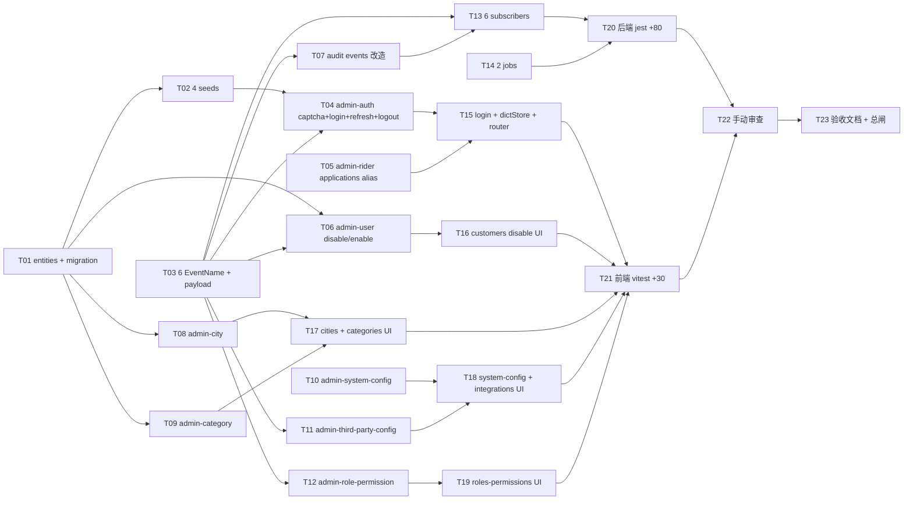

# 阶段 4 — 平台管理端 Web 审核管控与基础配置 · 原子任务清单(TASK)

> 商家端仅 Android APP / iOS APP,禁止规划商家 Web 后台、商家小程序。外卖订单与跑腿订单必须独立订单体系、独立状态机、独立计价、独立退款规则。

## 任务依赖图



## Wave 0 文档先行(已完成)

- ALIGNMENT\_阶段4.md ✓
- CONSENSUS\_阶段4.md ✓
- DESIGN\_阶段4.md ✓
- TASK\_阶段4.md ✓

## Wave 1 数据底座 + 事件(T01~T03)

### T01 · 3 张新表 entity + admin_user 扩展 + migration

- **输入**:DESIGN § 2 schema 设计
- **输出**:
  - `apps/server/src/database/entities/city-site.entity.ts`
  - `apps/server/src/database/entities/platform-category.entity.ts`
  - `apps/server/src/database/entities/account-disable-record.entity.ts`
  - `apps/server/src/database/entities/admin-user.entity.ts`(加 password_hash / login_failed_count / locked_until / last_login_at 4 列)
  - `apps/server/src/database/entities/index.ts`(加 3 export)
  - `apps/server/src/database/migrations/1714867600000-Stage4Init.ts`(CREATE 3 + ALTER 1)
- **实现约束**:全 BIGINT 时间戳;UNIQUE / 组合索引按 schema;migration up 和 down 都写
- **依赖**:无
- **AC**:`pnpm --filter @o2o/server typeorm:migration:run` 成功;`SHOW TABLES LIKE 'city_site'` `'platform_category'` `'account_disable_record'` 各 1;`DESCRIBE admin_user` 含 4 新列
- **预计**:60 min

### T02 · 4 seed 文件(admin-user / city-site / platform-category / role-permission 扩展)

- **输入**:DESIGN § 5 权限矩阵 + ALIGNMENT § 5.8 权限点
- **输出**:
  - `apps/server/src/database/seeds/admin-user.seed.ts`(新建,upsert SUPER_ADMIN 默认账号 username='super_admin' password=`O2o@2026-Admin` bcrypt cost=10)
  - `apps/server/src/database/seeds/platform-category.seed.ts`(新建,takeaway 8 顶级 + errand 4 顶级)
  - `apps/server/src/database/seeds/city-site.seed.ts`(新建,北京/上海/广州/深圳 4 个 service_area=null)
  - `apps/server/src/database/seeds/role-permission.seed.ts`(扩展 +5 业务权限点 + 5 menu;SUPER_ADMIN 全绑;AUDITOR 加 menu 只读)
  - `apps/server/src/database/seeds/index.ts`(注册 3 新 seed)
- **实现约束**:全部 idempotent(重跑不冲突);bcrypt 用 stage 0 既有依赖
- **依赖**:T01
- **AC**:`pnpm --filter @o2o/server seed:run` 成功;`SELECT username FROM admin_user WHERE username='super_admin'` 返 1 行;`SELECT code FROM sys_permission WHERE code LIKE 'admin:%' AND code NOT LIKE 'admin:menu:%'` ≥ stage 4 5 + 历史值
- **预计**:45 min

### T03 · 6 EventName + payload + spec

- **输入**:DESIGN § 6
- **输出**:
  - `apps/server/src/events/events.ts`(EventName +6,EventPayloadMap +6)
  - `apps/server/src/events/events.stage4.spec.ts`(验证 27 events / 全部以 `domain.<biz>.<verb>` / 类型对齐)
  - 同步更新 stage 0/1/2/3 既有 events.spec(Object.values(EventName).length === 27)
- **实现约束**:命名严格按 ALIGNMENT § 5.3
- **依赖**:无
- **AC**:`pnpm --filter @o2o/server test -- events.stage4` 全绿
- **预计**:30 min

## Wave 2 admin-auth + 现有模块扩展(T04~T07)

### T04 · admin-auth 模块(captcha + login + refresh + logout)

- **输入**:DESIGN § 3.1 + § 4.1 序列图 + ALIGNMENT § 5.11/5.12
- **输出**:
  - `apps/server/src/modules/admin-auth/admin-auth.module.ts`
  - `admin-auth.controller.ts`(4 端点)
  - `admin-auth.service.ts`(captcha + login + refresh + logout,内部用 svg-captcha)
  - `dto/{captcha-response,login-request,login-response,refresh-request,logout-request}.dto.ts`
  - `admin-auth.spec.ts`(captcha 生成 / mock=dev 跳过 / lock 5 次 / refresh / logout 黑名单)
- **实现约束**:
  - svg-captcha `^1.4.0` 加到 server package.json
  - mock 模式判断:`process.env.INTEGRATION_MODE === 'mock'`
  - bcrypt cost=10
  - Idempotent key=username:ip
  - login success 发 `domain.admin.logged-in`
  - refresh / logout 复刻 stage 1/2/3 模式(Redis hash + jti 黑名单)
- **依赖**:T01(admin_user 列)+ T02(seed 默认账号)+ T03(AdminLoggedIn 事件)
- **AC**:AC-T04-1 ~ AC-T04-4 全过
- **预计**:120 min

### T05 · admin-rider applications alias 端点

- **输入**:DESIGN § 3.2
- **输出**:
  - `admin-rider.controller.ts` 加 `GET /applications` 方法 + 调 service.list 默认参数 `auditStatus in (pending, rejected)`
  - 字段精简 VO `RiderApplicationListItemVo`(applicationId / mobile_masked / realName_masked / submittedAt / auditStatus / rejectReason)
  - spec 加 1 用例
- **实现约束**:复用 admin-rider.service.list,不重写;@Mask 沿用;@RequirePermission('admin:riders:view')
- **依赖**:无
- **AC**:AC-T05;curl `GET /admin/riders/applications` 返带分页 + 默认 status=pending
- **预计**:25 min

### T06 · admin-user disable / enable 端点

- **输入**:DESIGN § 3.3 + § 4.2 序列图
- **输出**:
  - `admin-user.controller.ts` 加 2 端点
  - `admin-user.service.ts` 加 disable / enable 方法(事务)
  - `admin-user-disable.spec.ts` 新建
- **实现约束**:
  - 事务 `dataSource.transaction(em => ...)`
  - 幂等:已 disabled 状态下再 disable → 返当前结果不重复发事件
  - 发 `domain.account.disabled` 事件(action 字段区分 disable / enable)
  - @Idempotent key=customerId / @Audit / @RequirePermission('admin:customers:disable')
- **依赖**:T01(account_disable_record)+ T03(AccountDisabled)
- **AC**:AC-T06-1 / AC-T06-2
- **预计**:55 min

### T07 · admin-merchant + admin-rider audit 改造发新事件

- **输入**:DESIGN § 6 MerchantAudited / RiderAudited
- **输出**:
  - `admin-merchant.service.ts` audit 方法事务 commit 后,发 `domain.merchant.audited`(approved + rejected 两路径)。stage 2 既有 `domain.merchant.approved` 兼容保留,只在 approved 时发(供 stage 2 既有订阅器);新事件 `audited` 两种结果都发
  - `admin-rider.service.ts` 同上
  - 测试:在既有 audit spec 新增 publish 验证(approved / rejected 两条)
- **实现约束**:不动 audit 接口契约;两个事件并存(approved 是子集,audited 是全集)
- **依赖**:T03
- **AC**:AC-T07-1 / AC-T07-2
- **预计**:35 min

## Wave 3 基础配置模块(T08~T11)

### T08 · admin-city 模块

- **输入**:DESIGN § 3.4 + § 4.4
- **输出**:
  - `apps/server/src/modules/admin-city/`(module + controller + service + dto + spec)
  - `apps/server/src/modules/system/system.service.ts` `listCities()` 改读 city_site
- **实现约束**:
  - GeoJSON 校验复用 `apps/server/src/modules/admin-rider/utils/geojson.ts`(若 stage 3 没拆出,本任务拆出来共享)
  - cityCode `/^[A-Z0-9_]{2,16}$/`
  - DELETE 软禁用
  - @Idempotent key=cityCode / @Audit / @RequirePermission('admin:cities:manage')
- **依赖**:T01 + T02(city-site seed)
- **AC**:AC-T08-1~5
- **预计**:60 min

### T09 · admin-category 模块

- **输入**:DESIGN § 3.5 + § 4.5
- **输出**:同上文件结构 / 树状 GET / 软禁用 / 子类目检查
- **实现约束**:
  - bizType 必填(DTO 校验)
  - parentId=0 顶级 / >0 二级;不允许 3 层(parent.parent_id 必须 0)
  - DELETE 子类目检查:有 enabled=true 子项 → STATUS_INVALID HAS_ENABLED_CHILDREN
- **依赖**:T01 + T02
- **AC**:AC-T09-1~4
- **预计**:55 min

### T10 · admin-system-config 模块

- **输入**:DESIGN § 3.6
- **输出**:同上 + 复用 stage 0 sys_config entity / ConfigChanged 事件
- **实现约束**:
  - PATCH 校验 key 存在(SELECT WHERE config_key=:key)
  - 不允许 POST 新增(controller 不暴露 POST)
  - GET 时 isSecret=true 字段脱敏
- **依赖**:无
- **AC**:AC-T10-1 / AC-T10-2
- **预计**:35 min

### T11 · admin-third-party-config 模块

- **输入**:DESIGN § 3.7 + § 4.6
- **输出**:同上 + cipher 加密 + IntegrationGatewayService.reloadConfig 钩子
- **实现约束**:
  - cipher util 已有(stage 0)
  - secret_encrypted 解密后脱敏前 3 + `***` + 后 3
  - PATCH 入参 secret 明文 → encrypt → 存
  - 发 ThirdPartyConfigChanged
- **依赖**:T03
- **AC**:AC-T11-1~3
- **预计**:50 min

## Wave 4 角色权限 + 调度任务(T12~T14)

### T12 · admin-role-permission 模块

- **输入**:DESIGN § 3.8 + § 4.3
- **输出**:同模块文件结构;3 端点;事务覆盖式重建
- **实现约束**:
  - GET /admin/permissions 静态分组(customer/merchant/rider/admin)从 sys_permission 表读
  - PUT 不允许删 SUPER_ADMIN / AUDITOR 角色绑定全部权限(若 permissionCodes 空且 roleCode 是内置角色 → STATUS_INVALID)
  - 事务:DELETE FROM sys_role_permission WHERE role_id=:id;INSERT each
  - 发 RoleChanged
- **依赖**:T03
- **AC**:AC-T12-1~3
- **预计**:55 min

### T13 · 6 事件订阅器 + 强制下线广播

- **输入**:DESIGN § 6 + ALIGNMENT § 4.4 / 5.6 / R-02 / R-03
- **输出**:
  - `events/subscribers/admin-logged-in.subscriber.ts`(audit_log + log)
  - `role-changed.subscriber.ts`(扫 admin_user roleCodes 含 :id → jti 黑名单广播 + audit_log)
  - `account-disabled.subscriber.ts`(扫对应端 customer/merchant/rider auth jti 广播 + audit_log)
  - `merchant-audited.subscriber.ts`(audit_log)
  - `rider-audited.subscriber.ts`(audit_log)
  - `third-party-config-changed.subscriber.ts`(IntegrationGatewayService.reloadConfig + audit_log)
  - 各 .spec.ts(共 6 个)
  - `events/events.module.ts` 注册 6
- **实现约束**:
  - jti 黑名单 key:`admin:jti:revoked:<adminId>` / `customer:jti:revoked:<customerId>` / `merchant:jti:revoked:<merchantId>` / `rider:jti:revoked:<riderId>`(SADD + 7 天过期 = max refresh TTL)
  - 失败必抛 → DomainEventRetryJob 兜底
- **依赖**:T03 + T07 + T11
- **AC**:AC-EV-2~7
- **预计**:80 min

### T14 · 2 定时任务 + scheduler.module 注册

- **输入**:DESIGN § 7
- **输出**:
  - `scheduler/jobs/config-change-aggregate.job.ts`
  - `scheduler/jobs/disabled-account-token-broadcast.job.ts`
  - `scheduler/scheduler.module.ts`(注册 +2,17 → 19)
  - 各 .spec.ts(2)
- **实现约束**:继承 BaseJob;锁 lock:scheduler:\*;dev mode trigger 接口已就位
- **依赖**:T01(account_disable_record)
- **AC**:AC-J-1 / AC-J-2
- **预计**:50 min

## Wave 5 admin-web 页面(T15~T19)

### T15 · login captcha + dictStore + 路由扩展 + auth store 加 lastLoginAt

- **输入**:DESIGN § 9.1 + § 4.3 dictStore
- **输出**:
  - `apps/admin-web/src/views/login/index.vue`(改造 captcha 图 + 刷新 + 错误处理 + lastLoginAt 显示)
  - `stores/dict.ts`(4 字典 60s 缓存)
  - `stores/auth.ts`(加 lastLoginAt 持久化)
  - `api/admin-auth.ts`(captcha + login + refresh + logout)
  - `router/index.ts`(注册 stage 4 4 新路由)
  - `utils/request.ts`(若没有 401 自动 refresh,加之)
  - `views/login/index.spec.ts` + `stores/dict.spec.ts`
- **实现约束**:
  - captcha 图 ``
  - dictStore 4 字典 + getter `getCityName(code)` `getCategoryName(id)` `getAuditStatusLabel(status)`
  - 路由加:`/cities` / `/categories/takeaway` / `/categories/errand` / `/customers/disable-records`
- **依赖**:T04(admin-auth API)
- **AC**:AC-P-1 / AC-P-9
- **预计**:90 min

### T16 · customers disable button + disable-records page

- **输入**:DESIGN § 9.7 / 9.8
- **输出**:
  - `views/customers/index.vue`(列表行加按钮 + Disable Dialog)
  - `views/customers/disable-records.vue`(新)
  - `api/admin-customer-disable.ts`
  - 各 spec(2)
- **实现约束**:
  - v-permission='admin:customers:disable'
  - Dialog reason 必填 1-500 char
  - 关联跳详情:点 customerId
- **依赖**:T06 + T15
- **AC**:AC-P-2 / AC-P-3
- **预计**:50 min

### T17 · cities + categories 页面 + CategoryTree 组件

- **输入**:DESIGN § 9.2 / 9.3
- **输出**:
  - `views/cities/index.vue`(列表 + 编辑 Dialog GeoJSON textarea)
  - `views/categories/takeaway.vue` + `errand.vue`(各 2 行薄壳调 CategoryTree)
  - `views/categories/components/CategoryTree.vue`(props bizType,内部 GET /admin/categories?bizType + 树展示 + CRUD)
  - `api/admin-cities.ts` + `api/admin-categories.ts`
  - 各 spec(3:cities / categories tree / API mock)
- **实现约束**:GeoJSON 复用 stage 3 delivery-area textarea 模式;categories 双层树 el-tree default-expand-all
- **依赖**:T08 + T09 + T15
- **AC**:AC-P-4 / AC-P-5
- **预计**:90 min

### T18 · system-config + integrations 页改造

- **输入**:DESIGN § 9.4 / 9.5
- **输出**:
  - `views/system-config/index.vue`(改造表格 inline edit value + 保存按钮)
  - `views/integrations/index.vue`(改造列表 + 编辑抽屉 + 健康检查按钮)
  - `api/admin-system-config.ts` + `api/admin-third-party.ts`
  - spec(2)
- **实现约束**:
  - 系统参数:value 编辑;configKey 不可改;PATCH 后刷新行
  - 第三方:secret 输入框 placeholder='留空表示不修改';保存调 PATCH;健康检查调 stage 0 既有 GET /admin/integrations/health
- **依赖**:T10 + T11 + T15
- **AC**:AC-P-6 / AC-P-7
- **预计**:75 min

### T19 · roles-permissions 左右栏改造

- **输入**:DESIGN § 9.6
- **输出**:
  - `views/roles-permissions/index.vue`(左 30% 角色列表 + 右 70% el-tree checkbox)
  - `api/admin-roles.ts`
  - dictStore 缓存 permissions 树
  - spec(2:render + tree-check 同步)
- **实现约束**:
  - el-tree node-key="code" + show-checkbox + check-strictly=true(避免父子联动误勾)
  - 切换角色 → 重置树勾选 → setCheckedKeys(roleData.permissionCodes)
  - 保存按钮调 PUT;成功后 el-message 提示 + 重新拉角色
- **依赖**:T12 + T15
- **AC**:AC-P-8
- **预计**:65 min

## Wave 6 测试 + 验收文档(T20~T23)

### T20 · 后端 jest +80 用例

- **输入**:T04~T14 各模块 spec
- **输出**:确保以下 spec 总量达标:
  - admin-auth.spec(captcha 6 / login 8 / refresh 4 / logout 4 = 22)
  - admin-city.spec(8)
  - admin-category.spec(8)
  - admin-system-config.spec(5)
  - admin-third-party-config.spec(7)
  - admin-role-permission.spec(8)
  - admin-user-disable.spec(6)
  - 6 subscribers spec(各 2,共 12)
  - 2 jobs spec(各 2,共 4)
  - cross-scope.spec 加 admin → c/m/r 4 → 共 +4
  - 合计 +84(达标)
- **AC**:`pnpm --filter @o2o/server test` 累计 ≥354
- **预计**:整合在前置任务中,本任务专门补漏

### T21 · 前端 vitest +30 用例 admin-web

- **输入**:T15~T19 spec
- **输出**:
  - login.spec(captcha render + login flow)4
  - dict.spec 6
  - customers/index.spec disable 4
  - customers/disable-records.spec 3
  - cities/index.spec 5
  - categories/CategoryTree.spec 4
  - system-config.spec 3
  - integrations.spec 3
  - roles-permissions.spec 3
  - 合计 +35
- **AC**:`pnpm --filter @o2o/admin-web test` 累计 ≥52

### T22 · 手动审查与测试文档

- **输入**:CONSENSUS § 5 验收门禁
- **输出**:
  - `项目阶段规划/04-阶段4-平台管理端Web-审核管控与基础配置/手动审查与测试.md` 8 节(curl/SQL/截图证据)
  - `项目阶段规划/04-阶段4-.../问题与风险记录.md` 追加(P0/P1=0)
- **AC**:8 节齐全,P0/P1 列为空

### T23 · 阶段验收文档 + 总闸 + commit

- **输入**:全部 T01~T22
- **输出**:
  - `docs/阶段4-.../ACCEPTANCE_阶段4.md`(25+ AC + 23 任务自审 + 漏项审查表 7 规划文档逐条)
  - `docs/阶段4-.../FINAL_阶段4.md`(总览 + 14 能力矩阵 + 4 用户决策 + 12 自动决策 + 提交记录)
  - `docs/阶段4-.../TODO_阶段4.md`(必做 + 可选)
- **AC**:`pnpm -r build` / `pnpm -r test` / `pnpm lint` / `pnpm format:check` 全绿;git status 干净

## 任务总览

| Wave | 任务    | 数量        | 预计时间               |
| ---- | ------- | ----------- | ---------------------- |
| 0    | 4 文档  | 4           | 已完成                 |
| 1    | T01~T03 | 3           | 135 min                |
| 2    | T04~T07 | 4           | 235 min                |
| 3    | T08~T11 | 4           | 200 min                |
| 4    | T12~T14 | 3           | 185 min                |
| 5    | T15~T19 | 5           | 370 min                |
| 6    | T20~T23 | 4           | 90 min(测试已包含在前) |
| 总计 | -       | 23 + 4 docs | -                      |

## 中断条款

- 任一 T 卡住 > 30 min → 写入 `项目阶段规划/04-阶段4-.../问题与风险记录.md` 问用户
- migration 失败 → typeorm:migration:revert 修 entity 重出
- 第三方 mock 行为遇规划文档未覆盖 → 追加 ALIGNMENT\_阶段4.md 末尾澄清条目

## 漏项审查机制(每波 commit message)

```
✅ 漏项审查
- [x] TASK 文档列出的子任务全部完成
- [x] 接口契约 22 个全部实现(列接口名)
- [x] 状态机 nextStates / 非法流转 STATUS_INVALID 已覆盖
- [x] admin Token 隔离测试已写
- [x] @Idempotent / @Audit / @Mask / @RequirePermission 装饰器组合按规划文档配齐
- [x] 规划文档 7 份均无未覆盖条款
```
