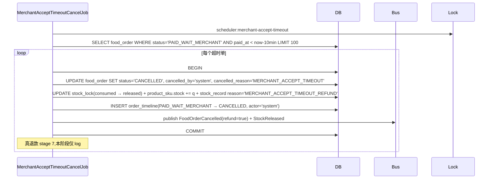
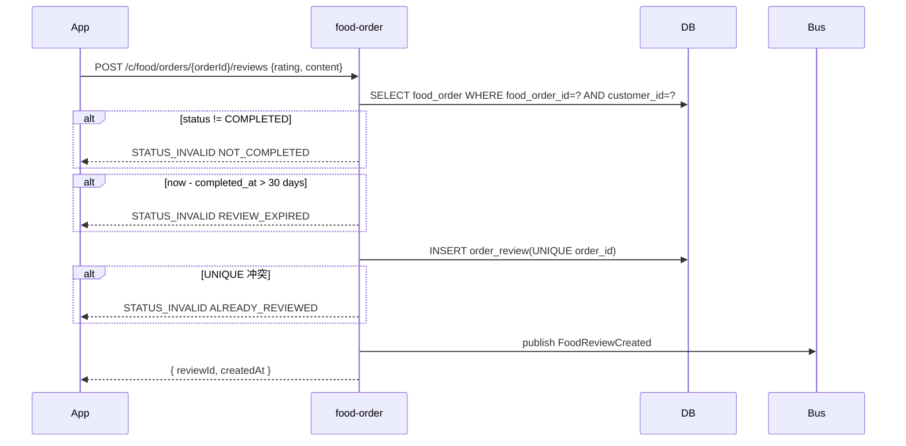

# 阶段 5 — 用户端外卖交易闭环 · 设计文档(DESIGN)

> 商家端仅 Android APP / iOS APP,禁止规划商家 Web 后台、商家小程序。外卖订单与跑腿订单必须独立订单体系、独立状态机、独立计价、独立退款规则。

## 1. 系统分层与模块依赖

```mermaid
flowchart TB
  subgraph Customer App
    HomePage --> HomeApi
    StoresPage --> StoresApi
    StoreDetailPage --> ProductsApi
    CartPage --> CartApi
    ConfirmPage --> PreviewApi
    ConfirmPage --> SubmitApi
    PayPage --> PrepayApi
    OrderListPage --> OrderListApi
    OrderDetailPage --> OrderDetailApi
    TrackPage --> TrackApi
    CancelDialog --> CancelApi
    ReviewPage --> ReviewApi
  end

  subgraph Server Modules
    FoodHomeCtrl --> FoodHomeSvc
    StoreQueryCtrl --> StoreQuerySvc --> StoreRepo
    ProductQueryCtrl --> ProductQuerySvc --> ProductRepo
    CartCtrl --> CartSvc --> CartRepo
    FoodOrderCtrl --> FoodOrderSvc --> FoodOrderRepo
    FoodOrderSvc --> StockLockRepo
    FoodOrderSvc --> CouponLockRepo
    FoodOrderSvc --> SnapshotRepo
    FoodOrderSvc --> TimelineRepo
    FoodOrderSvc --> EventBus
    PaymentCtrl --> PaymentSvc --> PaymentOrderRepo
    PaymentSvc --> WxpayAdapter
    PaymentSvc --> AlipayAdapter
    PayCallbackCtrl --> PaymentSvc
    TrackQueryCtrl --> TrackQuerySvc
    AdminFoodOrderCtrl --> FoodOrderSvc

    EventBus --> FoodOrderCreatedSub
    EventBus --> PaymentSucceededSub
    EventBus --> FoodOrderPaidSub --> GetuiAdapter
    EventBus --> FoodOrderPaidSub --> SmsAdapter
    EventBus --> FoodOrderCancelledSub
    EventBus --> StockReleasedSub
    EventBus --> FoodReviewCreatedSub

    Scheduler --> WaitPayTimeoutJob --> FoodOrderSvc
    Scheduler --> MerchantAcceptTimeoutJob --> FoodOrderSvc
    Scheduler --> PaymentCallbackRetryJob --> PaymentSvc
    Scheduler --> ReservedDispatchJob --> FoodOrderSvc

    RiderTaskPoolSvc -.读取.-> FoodOrderRepo
  end

  HomeApi -.-> FoodHomeCtrl
  StoresApi -.-> StoreQueryCtrl
  ProductsApi -.-> ProductQueryCtrl
  CartApi -.-> CartCtrl
  PreviewApi -.-> FoodOrderCtrl
  SubmitApi -.-> FoodOrderCtrl
  OrderListApi -.-> FoodOrderCtrl
  OrderDetailApi -.-> FoodOrderCtrl
  CancelApi -.-> FoodOrderCtrl
  ReviewApi -.-> FoodOrderCtrl
  PrepayApi -.-> PaymentCtrl
  TrackApi -.-> TrackQueryCtrl
```



模块边界:

- `food-home`:首页配置(banner / 类目 / 推荐),纯只读聚合
- `store-query`:店铺列表 + 搜索 + 排序,只读 stage 2 store / store_business_hour / store_delivery_area
- `product-query`:商品树 + 规格,只读 stage 2 product / product_sku / product_category
- `cart`:购物车 CRUD,新表 cart_item
- `food-order`:订单全生命周期(preview / submit / list / detail / cancel / review),最大模块
- `payment`:支付单 + 回调,新表 payment_order
- `coupon`:仅 coupon_lock 表 + service 锁/释放方法(本阶段不暴露 c 端接口)
- `points`:**本阶段不建模块**(用户拍板 A6 最小化;preview 收到 pointsUsed 由 food-order 直接 INVALID_PARAM)
- `track-query`:轨迹查询(本阶段返简化骨架)
- `admin-food-order`:平台监控页接口

## 2. 数据库 Schema(9 表新建)

### 2.1 food_order

```sql
CREATE TABLE food_order (
  food_order_id      BIGINT       NOT NULL AUTO_INCREMENT,
  order_no           VARCHAR(32)  NOT NULL,
  customer_id        BIGINT       NOT NULL,
  store_id           BIGINT       NOT NULL,
  city_code          VARCHAR(16)  NOT NULL,
  status             VARCHAR(32)  NOT NULL DEFAULT 'WAIT_PAY',
  pay_status         VARCHAR(16)  NOT NULL DEFAULT 'unpaid',
  delivery_type      VARCHAR(16)  NOT NULL DEFAULT 'instant',
  reserved_time      BIGINT                DEFAULT NULL,
  goods_amount       BIGINT       NOT NULL,
  delivery_fee       BIGINT       NOT NULL DEFAULT 0,
  discount_amount    BIGINT       NOT NULL DEFAULT 0,
  payable_amount     BIGINT       NOT NULL,
  paid_amount        BIGINT                DEFAULT NULL,
  address_snapshot   JSON         NOT NULL,
  remark             VARCHAR(512)          DEFAULT NULL,
  expire_at          BIGINT       NOT NULL COMMENT '15min 待支付截止',
  paid_at            BIGINT                DEFAULT NULL,
  cancelled_at       BIGINT                DEFAULT NULL,
  cancelled_by       VARCHAR(16)           DEFAULT NULL,
  cancelled_reason   VARCHAR(255)          DEFAULT NULL,
  created_at         BIGINT       NOT NULL,
  updated_at         BIGINT       NOT NULL,
  PRIMARY KEY (food_order_id),
  UNIQUE KEY uk_order_no (order_no),
  KEY idx_customer_status (customer_id, status, created_at),
  KEY idx_store_status (store_id, status, created_at),
  KEY idx_status_created (status, created_at),
  KEY idx_city_status (city_code, status, created_at)
) ENGINE=InnoDB DEFAULT CHARSET=utf8mb4 COMMENT='外卖订单';
```

### 2.2 food_order_item

```sql
CREATE TABLE food_order_item (
  food_order_item_id BIGINT       NOT NULL AUTO_INCREMENT,
  food_order_id      BIGINT       NOT NULL,
  sku_id             BIGINT       NOT NULL,
  product_id         BIGINT       NOT NULL,
  sku_snapshot       JSON         NOT NULL COMMENT '{name,price,spec,iconUrl}',
  quantity           INT          NOT NULL,
  unit_price         BIGINT       NOT NULL,
  sub_total          BIGINT       NOT NULL,
  created_at         BIGINT       NOT NULL,
  PRIMARY KEY (food_order_item_id),
  KEY idx_food_order_id (food_order_id),
  KEY idx_sku_id (sku_id)
) ENGINE=InnoDB DEFAULT CHARSET=utf8mb4 COMMENT='外卖订单项';
```

### 2.3 cart_item

```sql
CREATE TABLE cart_item (
  cart_item_id    BIGINT       NOT NULL AUTO_INCREMENT,
  customer_id     BIGINT       NOT NULL,
  store_id        BIGINT       NOT NULL,
  sku_id          BIGINT       NOT NULL,
  quantity        INT          NOT NULL DEFAULT 1,
  created_at      BIGINT       NOT NULL,
  updated_at      BIGINT       NOT NULL,
  PRIMARY KEY (cart_item_id),
  UNIQUE KEY uk_cart_unique (customer_id, store_id, sku_id),
  KEY idx_customer_store (customer_id, store_id)
) ENGINE=InnoDB DEFAULT CHARSET=utf8mb4 COMMENT='购物车';
```

### 2.4 order_price_snapshot

```sql
CREATE TABLE order_price_snapshot (
  order_price_snapshot_id BIGINT       NOT NULL AUTO_INCREMENT,
  preview_id              VARCHAR(64)  NOT NULL COMMENT 'uuid v4',
  customer_id             BIGINT       NOT NULL,
  store_id                BIGINT       NOT NULL,
  payload                 JSON         NOT NULL COMMENT '完整试算字段',
  created_at              BIGINT       NOT NULL,
  expires_at              BIGINT       NOT NULL COMMENT 'now + 5min',
  PRIMARY KEY (order_price_snapshot_id),
  UNIQUE KEY uk_preview_id (preview_id),
  KEY idx_expires (expires_at)
) ENGINE=InnoDB DEFAULT CHARSET=utf8mb4 COMMENT='订单价格快照';
```

### 2.5 payment_order

```sql
CREATE TABLE payment_order (
  payment_order_id   BIGINT       NOT NULL AUTO_INCREMENT,
  pay_order_no       VARCHAR(32)  NOT NULL,
  biz_type           VARCHAR(16)  NOT NULL COMMENT 'FOOD | ERRAND',
  biz_id             BIGINT       NOT NULL,
  pay_channel        VARCHAR(16)  NOT NULL COMMENT 'wxpay | alipay',
  payable_amount     BIGINT       NOT NULL,
  paid_amount        BIGINT                DEFAULT NULL,
  status             VARCHAR(16)  NOT NULL DEFAULT 'pending',
  channel_trade_no   VARCHAR(64)           DEFAULT NULL,
  callback_raw       JSON                  DEFAULT NULL,
  retry_count        INT          NOT NULL DEFAULT 0,
  expire_at          BIGINT       NOT NULL,
  paid_at            BIGINT                DEFAULT NULL,
  created_at         BIGINT       NOT NULL,
  updated_at         BIGINT       NOT NULL,
  PRIMARY KEY (payment_order_id),
  UNIQUE KEY uk_pay_order_no (pay_order_no),
  KEY idx_biz (biz_type, biz_id),
  KEY idx_status_expire (status, expire_at)
) ENGINE=InnoDB DEFAULT CHARSET=utf8mb4 COMMENT='支付单';
```

### 2.6 coupon_lock

```sql
CREATE TABLE coupon_lock (
  coupon_lock_id  BIGINT       NOT NULL AUTO_INCREMENT,
  order_id        BIGINT       NOT NULL,
  coupon_id       BIGINT       NOT NULL,
  customer_id     BIGINT       NOT NULL,
  status          VARCHAR(16)  NOT NULL DEFAULT 'active' COMMENT 'active|released|consumed',
  created_at      BIGINT       NOT NULL,
  released_at     BIGINT                DEFAULT NULL,
  PRIMARY KEY (coupon_lock_id),
  KEY idx_coupon_id (coupon_id),
  KEY idx_customer_status (customer_id, status),
  KEY idx_order_id (order_id)
) ENGINE=InnoDB DEFAULT CHARSET=utf8mb4 COMMENT='优惠券锁定(stage 5 仅建表占位)';
```

### 2.7 stock_lock

```sql
CREATE TABLE stock_lock (
  stock_lock_id   BIGINT       NOT NULL AUTO_INCREMENT,
  order_id        BIGINT       NOT NULL,
  sku_id          BIGINT       NOT NULL,
  quantity        INT          NOT NULL,
  status          VARCHAR(16)  NOT NULL DEFAULT 'active' COMMENT 'active|released|consumed',
  created_at      BIGINT       NOT NULL,
  released_at     BIGINT                DEFAULT NULL,
  PRIMARY KEY (stock_lock_id),
  KEY idx_sku (sku_id),
  KEY idx_order (order_id),
  KEY idx_status_created (status, created_at)
) ENGINE=InnoDB DEFAULT CHARSET=utf8mb4 COMMENT='库存锁定';
```

### 2.8 order_timeline

```sql
CREATE TABLE order_timeline (
  order_timeline_id BIGINT       NOT NULL AUTO_INCREMENT,
  order_id          BIGINT       NOT NULL,
  biz_type          VARCHAR(16)  NOT NULL DEFAULT 'FOOD',
  from_status       VARCHAR(32)           DEFAULT NULL,
  to_status         VARCHAR(32)  NOT NULL,
  actor_type        VARCHAR(16)  NOT NULL COMMENT 'customer|merchant|rider|admin|system',
  actor_id          VARCHAR(64)           DEFAULT NULL,
  reason            VARCHAR(255)          DEFAULT NULL,
  created_at        BIGINT       NOT NULL,
  PRIMARY KEY (order_timeline_id),
  KEY idx_order_created (order_id, created_at)
) ENGINE=InnoDB DEFAULT CHARSET=utf8mb4 COMMENT='订单状态时间线';
```

### 2.9 order_review

```sql
CREATE TABLE order_review (
  order_review_id BIGINT       NOT NULL AUTO_INCREMENT,
  order_id        BIGINT       NOT NULL,
  customer_id     BIGINT       NOT NULL,
  store_id        BIGINT       NOT NULL,
  rating          TINYINT      NOT NULL COMMENT '1-5',
  content         VARCHAR(500)          DEFAULT NULL,
  image_file_ids  JSON                  DEFAULT NULL,
  anonymous       TINYINT(1)   NOT NULL DEFAULT 0,
  created_at      BIGINT       NOT NULL,
  PRIMARY KEY (order_review_id),
  UNIQUE KEY uk_order_id_main (order_id),
  KEY idx_store_rating (store_id, rating, created_at),
  KEY idx_customer (customer_id, created_at)
) ENGINE=InnoDB DEFAULT CHARSET=utf8mb4 COMMENT='订单评价(主评)';
```

## 3. 接口契约

### 3.1 food-home(1)

#### `GET /api/v1/c/food/home`

- Token: 可选(@Public,有 token 时返收藏推荐;游客返通用)
- Query: `cityCode, lng?, lat?`
- Response:
  ```json
  {
    "cityCode": "BJ",
    "banners": [{ "imageUrl", "linkUrl", "displayOrder" }],
    "categories": [{ "categoryId", "name", "iconUrl" }],
    "activityEntries": [],
    "recommendedStores": [{ "storeId", "name", "iconUrl", "distance", "sales", "rating", "deliveryFee", "minOrderAmount", "businessStatus" }]
  }
  ```
- Logic: 读 city_site 校验 cityCode → 读 platform_category WHERE bizType=takeaway → 读 store WHERE city=? AND status=open ORDER BY (距离 / 销量 / 评分 综合) LIMIT 10

### 3.2 store-query(1)

#### `GET /api/v1/c/food/stores`

- Token: 可选
- Query: `cityCode, keyword?, categoryId?, sort?(distance|sales|rating), lng?, lat?, pageNo, pageSize`
- Response: 分页 + items[StoreVo]
- Logic: 复用 stage 2 store-query 模块的查询底座 + 加 distance 排序(用 amap-distance.adapter 计算)

### 3.3 product-query(1)

#### `GET /api/v1/c/food/stores/{storeId}/products`

- Token: 可选
- Path: storeId
- Response: `{ categories: [{categoryId, name, displayOrder}], products: [{productId, name, iconUrl, basePrice, saleStatus, categoryId, skus: [{skuId, specs, price, stock, stockLocked, saleStatus}]}], promotions: [...] }`
- Logic: 读 stage 2 product / product_sku / product_category / merchant_promotion;saleStatus 计算考虑 stock - stock_locked

### 3.4 cart(1)

#### `POST /api/v1/c/food/cart/items`

- Token: Customer-Token
- Idempotent: 60s key=customerId:storeId:skuId
- Audit: 是
- Request: `{ storeId, skuId, quantity }` (quantity=0 视为删除;>0 视为 upsert)
- Response: `{ cartId, items: [{cartItemId, skuId, quantity, sku:{...}}], goodsAmount, deliveryFee, discountAmount, totalAmount }`
- Logic: UPSERT cart_item;quantity=0 时 DELETE;返回该 customerId+storeId 完整购物车

### 3.5 food-order(7)

#### `POST /api/v1/c/food/orders/preview`

- Token: Customer-Token
- Idempotent: 60s key=customerId:storeId
- Request: `{ storeId, items: [{skuId, quantity}], addressId, couponId?, pointsUsed?, deliveryType:'instant'|'reserved', reservedTime? }`
- Response: `{ previewId, expiresAt, goodsAmount, deliveryFee, discountAmount, payableAmount, estimatedDeliveryTime, unavailableReason? }`
- Errors:
  - INVALID_PARAM `COUPON_NOT_AVAILABLE`(本阶段 couponId 任何值都返此)
  - INVALID_PARAM `POINTS_NOT_AVAILABLE`(本阶段 pointsUsed > 0 都返此)
  - DATA_NOT_FOUND `STORE_NOT_FOUND` / `ADDRESS_NOT_FOUND`
  - STATUS_INVALID `STORE_CLOSED` / `OUT_OF_DELIVERY_RANGE` / `BELOW_MIN_ORDER` / `STOCK_INSUFFICIENT` / `RESERVED_TIME_PAST`
- Logic:
  1. 校验 store / address / cityCode 一致
  2. 校验 address 在 store_delivery_area 内(amap.distance + GeoJSON contains 简化为 stage 5 仅校验 cityCode 一致)
  3. 校验 sku 库存(stock - stock_locked >= quantity)
  4. 计算 goodsAmount(sum sub_total)+ deliveryFee(stage 2 store.deliveryFee 或固定 ¥3)+ discountAmount(merchant_promotion 满减)
  5. 校验 goodsAmount >= store.minOrderAmount
  6. 写 order_price_snapshot(payload 含全部字段)+ Redis SETEX 5min(双写,Redis 主、DB 兜底)
  7. 返回完整试算

#### `POST /api/v1/c/food/orders`

- Token: Customer-Token
- Idempotent: 60s key=previewId
- Audit: 是
- Request: `{ previewId, addressId, payChannel:'wxpay'|'alipay', remark? }`
- Response: `{ orderId, orderNo, payOrderId(空,prepay 接口创建), payableAmount, expireAt }`
- Errors: STATUS_INVALID PREVIEW_EXPIRED / PREVIEW_NOT_FOUND / STOCK_INSUFFICIENT_AT_SUBMIT
- Logic(事务):
  1. SELECT snapshot WHERE preview_id=? AND customer_id=?;判过期
  2. 锁 stock(逐 sku SELECT FOR UPDATE → 校验 → UPDATE stock_locked += q)
  3. 写 stock_lock active 行(逐 item)
  4. 若 snapshot.couponId 不空 → 本阶段直接抛 INVALID_PARAM(防御,正常 preview 已拦截)
  5. 生成 orderNo = `${yyyyMMdd}${redis incr daily reset 6 位}`
  6. INSERT food_order(status=WAIT_PAY, expire_at=now+15min)
  7. INSERT food_order_item(逐 sku,sku_snapshot 拷贝)
  8. INSERT order_timeline(NULL → WAIT_PAY)
  9. publish FoodOrderCreated
- 不创建 payment_order:由 prepay 接口创建

#### `GET /api/v1/c/food/orders`

- Token: Customer-Token
- Query: `status?, pageNo, pageSize`
- Response: 分页 + items 简化 VO(orderId / orderNo / status / storeId / storeName / payableAmount / itemsBrief / expireAt / createdAt)
- Logic: WHERE customer_id=? + 可选 status,按 created_at DESC

#### `GET /api/v1/c/food/orders/{orderId}`

- Token: Customer-Token
- Path: orderId
- Response: 完整 VO,含 store(简化)/ items / address / timeline / payOrder / actions(可点击下一步:cancel / pay / review)
- Logic: WHERE food_order_id=? AND customer_id=?

#### `POST /api/v1/c/food/orders/{orderId}/cancel`

- Token: Customer-Token
- Idempotent: 60s key=orderId
- Audit: 是
- Request: `{ reason? }`
- Errors: STATUS_INVALID INVALID_TRANSITION(非 WAIT_PAY)
- Logic(事务):
  1. SELECT FOR UPDATE
  2. 校验 status='WAIT_PAY' AND customer_id=current
  3. UPDATE food_order SET status='CANCELLED', cancelled_at, cancelled_by='customer', cancelled_reason
  4. UPDATE stock_lock.status='released' + product_sku.stock_locked -= quantity(逐 item)
  5. INSERT order_timeline (WAIT_PAY → CANCELLED)
  6. publish FoodOrderCancelled + StockReleased

#### `POST /api/v1/c/food/orders/{orderId}/reviews`

- Token: Customer-Token
- Idempotent: 60s key=orderId
- Audit: 是
- Request: `{ rating: 1-5, content?: <=500, anonymous?: bool, images?: fileId[] (<=9) }`
- Errors: STATUS_INVALID NOT_COMPLETED / REVIEW_EXPIRED(>30 天) / ALREADY_REVIEWED
- Logic:
  1. SELECT order WHERE food_order_id=? AND customer_id=?
  2. 校验 status='COMPLETED' + (now - completed_at) <= 30 天
  3. INSERT order_review(UNIQUE order_id 防重)
  4. publish FoodReviewCreated

### 3.6 payment(1 c + 2 callback)

#### `POST /api/v1/c/payments/prepay`

- Token: Customer-Token
- Idempotent: 60s key=orderId(同一订单同一渠道短期幂等)
- Audit: 是
- Request: `{ bizType: 'FOOD', orderId, payChannel:'wxpay'|'alipay' }`
- Response: `{ payOrderId, payOrderNo, payParams(JSON 字符串,前端唤起 SDK 用), expireAt }`
- Errors: DATA_NOT_FOUND ORDER_NOT_FOUND / STATUS_INVALID ORDER_NOT_PAYABLE(非 WAIT_PAY)
- Logic:
  1. SELECT food_order WHERE food_order_id=? AND customer_id=? AND status='WAIT_PAY'
  2. SELECT payment_order WHERE biz_id=? AND status='pending' (有则复用,过期 invalidate)
  3. 生成 payOrderNo = `P${yyyyMMddHHmmss}${seq6}`
  4. INSERT payment_order(status=pending, expire_at=order.expire_at)
  5. 调 wxpay/alipay.adapter.prepay() → 返 payParams
  6. 返回 payParams

#### `POST /api/v1/callback/wxpay` / `POST /api/v1/callback/alipay`

- Token: 无(@Public)
- Request: 第三方 raw body
- Response: 第三方约定格式("SUCCESS" / "success")
- Logic:
  1. adapter.verifyCallback(rawBody) → 验签 + 解析 → { payOrderNo, channelTradeNo, paidAmount, paidAt, sign }
  2. Redis SETNX `pay:cb:nonce:<sign|nonce>` ttl=60s → 防重放
  3. SELECT payment_order WHERE pay_order_no=? FOR UPDATE
  4. 已 success → 返 duplicate ack
  5. 事务:
     - UPDATE payment_order SET status='success', paid_at, channel_trade_no, callback_raw
     - SELECT food_order WHERE food_order_id=biz_id FOR UPDATE
     - UPDATE food_order SET status='PAID_WAIT_MERCHANT', pay_status='paid', paid_at, paid_amount
     - UPDATE stock_lock.status='consumed' + product_sku.stock -= quantity + stock_locked -= quantity
     - INSERT stock_record(quantityChange=-q reason='ORDER_PAID' operatorType='system')
     - INSERT order_timeline(WAIT_PAY → PAID_WAIT_MERCHANT)
     - publish PaymentSucceeded + FoodOrderPaid
  6. 第三方 ack 返回

### 3.7 track-query(1)

#### `GET /api/v1/c/food/orders/{orderId}/track`

- Token: Customer-Token
- Path: orderId
- Response: `{ orderId, status, eta?, route?: { points: [{lng, lat, ts}] }, riderLocation?: {lng, lat, updatedAt}, source: 'mock' | 'real' }`
- Logic(stage 5 简化):
  - status 在 RIDER_ASSIGNED / PICKED_UP / DELIVERING 时返 stage 3 rider_location 最新 1 行(若骑手已上线);否则 source='mock' 返 store + address 起终点
  - eta 简单计算:基于 amap-distance.adapter mock 距离 / 30 km/h

### 3.8 admin-food-order(3)

#### `GET /api/v1/admin/food-orders`

- Token: Admin-Token
- Permission: `admin:food-orders:view`
- Query: `status?, cityCode?, payChannel?, customerId?, storeId?, dateFrom?, dateTo?, pageNo, pageSize`
- Response: 分页 + items 简化 VO

#### `GET /api/v1/admin/food-orders/{orderId}`

- Token: Admin-Token
- Permission: `admin:food-orders:view`
- Response: 完整详情 VO + timeline + payment_order 信息(脱敏 callback_raw)

#### `GET /api/v1/admin/food-orders/timeline-statistics`

- Token: Admin-Token
- Permission: `admin:food-orders:view`
- Response: `{ waitPayOverdueCount, merchantAcceptOverdueCount, deliveringCount, completedTodayCount, cancelledTodayCount }`
- Logic: 简单 COUNT 查询(本阶段不缓存,stage 9 优化)

## 4. 序列图

### 4.1 提交订单 + 支付主流程(D-1)

```mermaid
sequenceDiagram
  participant App as Customer App
  participant Order as food-order
  participant DB as MySQL
  participant Redis
  participant Pay as payment
  participant Wxpay as wxpay.adapter
  participant Bus as EventBus
  participant Cb as /callback/wxpay
  participant Sub as FoodOrderPaidSubscriber
  participant Getui as getui.adapter

  App->>Order: POST /c/food/orders/preview {storeId,items,addressId,deliveryType}
  Order->>DB: 校验 store/address/sku/库存
  Order->>DB: INSERT order_price_snapshot
  Order->>Redis: SETEX food:preview:<id> 5min
  Order-->>App: { previewId, payableAmount, ... }

  App->>Order: POST /c/food/orders {previewId, payChannel}
  Order->>DB: BEGIN; SELECT snapshot; SELECT FOR UPDATE sku; UPDATE stock_locked
  Order->>DB: INSERT food_order(WAIT_PAY) + items + stock_lock + timeline
  Order->>Bus: publish FoodOrderCreated
  Order->>DB: COMMIT
  Order-->>App: { orderId, orderNo, payableAmount, expireAt }

  App->>Pay: POST /c/payments/prepay {bizType:FOOD, orderId, payChannel:wxpay}
  Pay->>DB: SELECT food_order; INSERT payment_order(pending)
  Pay->>Wxpay: prepay(payOrderNo, payable, notifyUrl)
  Wxpay-->>Pay: mock { prepayId, payParams }
  Pay-->>App: { payOrderId, payParams, expireAt }

  App->>Wxpay: 唤起 SDK(模拟用户支付)
  Wxpay->>Cb: POST /callback/wxpay raw
  Cb->>Wxpay: verifyCallback(raw, sign)
  Wxpay-->>Cb: { payOrderNo, channelTradeNo, paidAmount, paidAt }
  Cb->>Redis: SETNX nonce 60s
  Cb->>DB: BEGIN; UPDATE payment_order(success)
  Cb->>DB: UPDATE food_order(WAIT_PAY → PAID_WAIT_MERCHANT)
  Cb->>DB: stock_lock(consumed) + sku.stock -= q + stock_record + timeline
  Cb->>Bus: publish PaymentSucceeded + FoodOrderPaid
  Cb->>DB: COMMIT
  Cb-->>Wxpay: 'SUCCESS'

  Bus->>Sub: handle(FoodOrderPaid)
  Sub->>Getui: pushNotification(merchant, storeId, payload)
  Sub->>SmsAdapter: send(customer, ORDER_PAID)
  Sub->>AuditLog: append
```

### 4.2 15 min 未支付自动关单(D-2)

```mermaid
sequenceDiagram
  participant Job as WaitPayTimeoutCloseJob
  participant DB
  participant Bus

  Note over Job: cron */30 秒
  Job->>Lock: scheduler:wait-pay-timeout 30s
  Job->>DB: SELECT food_order WHERE status='WAIT_PAY' AND expire_at < now LIMIT 100
  loop 每个超时单
    Job->>DB: BEGIN; SELECT FOR UPDATE
    Job->>DB: UPDATE food_order SET status='CANCELLED', cancelled_by='system', cancelled_reason='WAIT_PAY_TIMEOUT'
    Job->>DB: UPDATE stock_lock(active → released) + product_sku.stock_locked -= q
    Job->>DB: INSERT order_timeline (WAIT_PAY → CANCELLED, actor='system')
    Job->>Bus: publish FoodOrderCancelled + StockReleased
    Job->>DB: COMMIT
  end
```

### 4.3 商家 10 min 未接单自动取消(D-3)



### 4.4 评价提交(D-4)



## 5. 状态机

### 5.1 完整 nextStates 映射

```ts
const FOOD_ORDER_TRANSITIONS: Record<OrderStatus, { next: OrderStatus[]; stage: number }> = {
  WAIT_PAY: { next: ['PAID_WAIT_MERCHANT', 'CANCELLED'], stage: 5 },
  PAID_WAIT_MERCHANT: { next: ['MERCHANT_ACCEPTED', 'CANCELLED'], stage: 5 }, // CANCELLED 由 10min job
  MERCHANT_ACCEPTED: { next: ['PREPARING', 'CANCELLED'], stage: 7 },
  PREPARING: { next: ['READY_FOR_PICKUP'], stage: 7 },
  READY_FOR_PICKUP: { next: ['RIDER_ASSIGNED'], stage: 8 },
  RIDER_ASSIGNED: { next: ['PICKED_UP'], stage: 8 },
  PICKED_UP: { next: ['DELIVERING'], stage: 8 },
  DELIVERING: { next: ['DELIVERED'], stage: 8 },
  DELIVERED: { next: ['COMPLETED'], stage: 8 },
  COMPLETED: { next: [], stage: 5 },
  CANCELLED: { next: [], stage: 5 },
  REFUNDING: { next: ['REFUNDED'], stage: 7 },
  REFUNDED: { next: [], stage: 7 },
  AFTER_SALE: { next: [], stage: 7 },
};
```

stage 5 实现的转移:

- `WAIT_PAY → PAID_WAIT_MERCHANT`(callback)
- `WAIT_PAY → CANCELLED`(用户主动 / 15min job)
- `PAID_WAIT_MERCHANT → CANCELLED`(10min job,平台)

stage 7+ 触发的转移本阶段订单详情查询能展示但不能写入。

### 5.2 非法流转

任何不在 `FOOD_ORDER_TRANSITIONS[from].next` 内的目标 → `STATUS_INVALID code='INVALID_TRANSITION' detail='${from} → ${to}'`

## 6. 6 事件 payload(stage 5 新增 6,EventName 累计 27 → 33)

```ts
// events.ts(stage 5 新增 6)
FoodOrderCreated:   'domain.food-order.created',
PaymentSucceeded:   'domain.payment.succeeded',
FoodOrderPaid:      'domain.food-order.paid',
FoodOrderCancelled: 'domain.food-order.cancelled',
StockReleased:      'domain.stock.released',
FoodReviewCreated:  'domain.food-review.created',

// EventPayloadMap 新增 6
[EventName.FoodOrderCreated]:   { orderId, orderNo, customerId, storeId, payableAmount, expireAt, createdAt };
[EventName.PaymentSucceeded]:   { payOrderId, payOrderNo, bizType, bizId, payChannel, paidAmount, paidAt };
[EventName.FoodOrderPaid]:      { orderId, customerId, storeId, paidAmount, paidAt };
[EventName.FoodOrderCancelled]: { orderId, customerId, reason, cancelledBy: 'customer'|'system'|'merchant', cancelledAt };
[EventName.StockReleased]:      { orderId, items: [{ skuId, quantity }], reason, releasedAt };
[EventName.FoodReviewCreated]:  { reviewId, orderId, customerId, storeId, rating, createdAt };
```

## 7. 4 定时任务(scheduler.module 累计 19 → 23)

详见 CONSENSUS § 3.6。

## 8. 异常处理策略

| 错误场景                        | 错误码                                                                    | HTTP | 用户提示                      |
| ------------------------------- | ------------------------------------------------------------------------- | ---- | ----------------------------- |
| 试算优惠券本阶段不可用          | INVALID_PARAM(detail: COUPON_NOT_AVAILABLE)                               | 400  | 当前活动暂未开放,请下次再来   |
| 试算积分本阶段不可用            | INVALID_PARAM(detail: POINTS_NOT_AVAILABLE)                               | 400  | 积分功能即将上线              |
| 店铺已休息                      | STATUS_INVALID(detail: STORE_CLOSED)                                      | 422  | 店铺已休息                    |
| 地址超出配送范围                | STATUS_INVALID(detail: OUT_OF_DELIVERY_RANGE)                             | 422  | 该地址超出配送范围            |
| 未达起送                        | STATUS_INVALID(detail: BELOW_MIN_ORDER)                                   | 422  | 未达起送金额                  |
| 库存不足(试算时)                | STATUS_INVALID(detail: STOCK_INSUFFICIENT)                                | 422  | 部分商品库存不足              |
| 库存不足(提交时;试算后被人抢光) | STATUS_INVALID(detail: STOCK_INSUFFICIENT_AT_SUBMIT)                      | 422  | 商品已售罄,请重新选择         |
| 预约时间已过                    | STATUS_INVALID(detail: RESERVED_TIME_PAST)                                | 422  | 预约时间已过                  |
| previewId 过期                  | STATUS_INVALID(detail: PREVIEW_EXPIRED)                                   | 422  | 价格已变动,请重新确认         |
| 非 WAIT_PAY 取消                | STATUS_INVALID(detail: INVALID_TRANSITION)                                | 422  | 当前状态无法取消              |
| 评价限制                        | STATUS_INVALID(detail: NOT_COMPLETED / REVIEW_EXPIRED / ALREADY_REVIEWED) | 422  | 当前订单无法评价              |
| 支付回调验签失败                | THIRD_PARTY_ERROR                                                         | 502  | (返第三方约定格式,不上抛业务) |

## 9. 前端 UI 设计要点(customer-app)

### 9.1 路由(pages.json 新增 14 页)

```
pages/food/home/index               外卖首页
pages/food/city-picker/index        城市选择
pages/food/search/index             搜索结果
pages/food/store/detail             店铺详情
pages/food/store/components/SkuPickerModal.vue  规格弹窗
pages/food/cart/index               购物车(单店,query store_id)
pages/food/order/confirm            确认订单
pages/payment/cashier               收银台
pages/payment/result                支付结果
pages/food/order/list               订单列表
pages/food/order/detail             订单详情
pages/food/order/track              轨迹
pages/food/order/components/CancelDialog.vue  取消弹窗
pages/food/review/submit            评价提交
pages/me/aftersales-stub            售后申请占位(stage 7 真实现)
```

### 9.2 stores 新增 5 个

| Store                | 字段                                                     |
| -------------------- | -------------------------------------------------------- |
| stores/dict.ts       | 城市 / 类目 / 店铺基础数据 60s 缓存(沿用 admin-web 模式) |
| stores/cart.ts       | 单店购物车,持久化到 storage,与后端 cart_item 同步        |
| stores/food-order.ts | 当前 preview / 当前 order / 列表分页状态                 |
| stores/payment.ts    | 当前 payOrderId / payParams / 状态                       |

### 9.3 关键交互

- 跨店切换:加车时检查 cart 中 store_id != 当前 store_id → 提示"切换店铺会清空当前购物车"
- 防重复点击:支付按钮 + 提交订单按钮均 loading + idempotencyKey 由前端 uuid 生成
- 倒计时:订单详情 WAIT_PAY 时显示 `expireAt - now` 倒计时
- 状态文案权威:status enum 映射表 dict store + getter,前端不硬编码
- 售罄置灰:saleStatus='off-shelf' 或 stock-stockLocked<=0 → +pointer-events:none

## 10. 文件清单

```
apps/server/src/

database/entities/
├ food-order.entity.ts                  (新)
├ food-order-item.entity.ts             (新)
├ cart-item.entity.ts                   (新)
├ order-price-snapshot.entity.ts        (新)
├ payment-order.entity.ts               (新)
├ coupon-lock.entity.ts                 (新)
├ stock-lock.entity.ts                  (新)
├ order-timeline.entity.ts              (新)
├ order-review.entity.ts                (新)
└ index.ts                              (加 9 export)

database/migrations/
└ 1714867700000-Stage5Init.ts          (新,9 CREATE TABLE)

modules/food-home/
├ food-home.module.ts
├ food-home.controller.ts
├ food-home.service.ts
└ food-home.spec.ts

modules/store-query/
├ store-query.module.ts
├ store-query.controller.ts
├ store-query.service.ts
├ dto/* + spec

modules/product-query/             (类似)
modules/cart/                       (类似)
modules/food-order/                 (最大,含 preview/submit/list/detail/cancel/review,7 端点)
modules/payment/                    (含 prepay 1 + callback 2)
modules/coupon/                     (仅 service 锁释放,无 controller)
modules/track-query/                (1 端点)
modules/admin-food-order/           (3 端点)

modules/rider-task-pool/rider-task-pool.service.ts   (扩展:扫 READY_FOR_PICKUP 食单)

events/events.ts                    (加 6 EventName + payload)
events/events.stage5.spec.ts        (新)
events/subscribers/
├ food-order-created.subscriber.ts
├ payment-succeeded.subscriber.ts
├ food-order-paid.subscriber.ts        (push merchant + sms customer)
├ food-order-cancelled.subscriber.ts
├ stock-released.subscriber.ts
├ food-review-created.subscriber.ts
└ *.spec.ts(共 6 个 + 1 总入口 stage5-subscribers.spec.ts)

scheduler/jobs/
├ wait-pay-timeout-close.job.ts          (新)
├ merchant-accept-timeout-cancel.job.ts  (新)
├ payment-callback-retry.job.ts          (新)
├ reserved-order-dispatch.job.ts         (新)
└ stage5-jobs.spec.ts

modules/integration-gateway/adapters/
├ wxpay.adapter.ts                       (扩展 prepay + verifyCallback)
├ alipay.adapter.ts                      (扩展)
└ adapter.spec.ts(加用例)

apps/customer-app/src/
├ pages.json                             (加 14 页路由)
├ pages/food/home/index.vue
├ pages/food/city-picker/index.vue
├ pages/food/search/index.vue
├ pages/food/store/detail.vue
├ pages/food/store/components/SkuPickerModal.vue
├ pages/food/cart/index.vue
├ pages/food/order/confirm.vue
├ pages/food/order/list.vue
├ pages/food/order/detail.vue
├ pages/food/order/track.vue
├ pages/food/order/components/CancelDialog.vue
├ pages/food/review/submit.vue
├ pages/payment/cashier.vue
├ pages/payment/result.vue
├ pages/me/aftersales-stub.vue
├ stores/dict.ts                         (新)
├ stores/cart.ts                         (新)
├ stores/food-order.ts                   (新)
├ stores/payment.ts                      (新)
├ api/food-home.ts
├ api/food-stores.ts
├ api/food-products.ts
├ api/food-cart.ts
├ api/food-orders.ts
├ api/food-payments.ts
├ api/food-track.ts
└ utils/format-price.ts(新)

apps/admin-web/src/
├ views/food-orders/
│  ├ index.vue                           (新)
│  └ components/FoodOrderDetailDrawer.vue
├ api/admin-food-orders.ts
└ router/index.ts                        (加 1 路由 + 2 权限点)

modules/auth/cross-scope.spec.ts          (加 c → admin/m/r FORBIDDEN — 已就位无需扩;但新接口跑过)
```

## 11. 模块依赖矩阵

| 模块                  | 依赖 stage 0/1/2/3/4                                                                                                         | 依赖 stage 5 内部                                                                           |
| --------------------- | ---------------------------------------------------------------------------------------------------------------------------- | ------------------------------------------------------------------------------------------- |
| food-home             | city_site / platform_category / store / merchant_promotion                                                                   | -                                                                                           |
| store-query           | store / store_business_hour / store_delivery_area / amap-distance.adapter                                                    | -                                                                                           |
| product-query         | product / product_sku / product_category / merchant_promotion                                                                | -                                                                                           |
| cart                  | customer_user / store / product_sku                                                                                          | cart_item                                                                                   |
| food-order            | customer_user / customer_address / store / product_sku / stock_record / merchant_promotion / city_site / store_delivery_area | cart_item, snapshot, food_order, food_order_item, stock_lock, coupon_lock, timeline, review |
| payment               | -                                                                                                                            | food_order, payment_order                                                                   |
| coupon                | -                                                                                                                            | coupon_lock                                                                                 |
| track-query           | rider_location / amap-distance.adapter                                                                                       | food_order                                                                                  |
| admin-food-order      | sys_role / sys_permission                                                                                                    | food_order, payment_order, timeline                                                         |
| rider-task-pool(扩展) | -                                                                                                                            | food_order                                                                                  |

无环。

## 12. 测试矩阵规划

| 模块                    | spec 用例数(预估)       |
| ----------------------- | ----------------------- |
| food-home               | 5                       |
| store-query             | 8                       |
| product-query           | 8                       |
| cart                    | 8                       |
| food-order(preview)     | 12                      |
| food-order(submit)      | 12                      |
| food-order(list/detail) | 6                       |
| food-order(cancel)      | 6                       |
| food-order(review)      | 6                       |
| payment(prepay)         | 6                       |
| payment(callback)       | 8                       |
| coupon.service          | 4                       |
| track-query             | 4                       |
| admin-food-order        | 8                       |
| rider-task-pool 扩展    | 3                       |
| 6 subscribers           | 12(各 2)                |
| 4 jobs                  | 8(各 2)                 |
| stage5-events.spec      | 1                       |
| **后端净增**            | **125**                 |
| customer-app pages      | 30(14 页 + store smoke) |
| customer-app api        | 7                       |
| admin-web food-orders   | 4                       |
| **前端净增**            | **41**                  |

后端 stage 4 base 371 → 目标 **≥ 460**;前端净增 41 → admin-web 57 + customer-app 25 → **≥ 110**。
