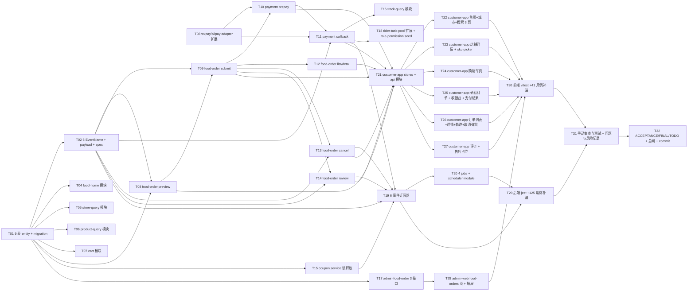

# 阶段 5 — 用户端外卖交易闭环 · 原子任务清单(TASK)

> 商家端仅 Android APP / iOS APP,禁止规划商家 Web 后台、商家小程序。外卖订单与跑腿订单必须独立订单体系、独立状态机、独立计价、独立退款规则。

## 任务依赖图



## Wave 0 文档先行(已完成)

- ALIGNMENT\_阶段5.md ✓
- CONSENSUS\_阶段5.md ✓
- DESIGN\_阶段5.md ✓
- TASK\_阶段5.md ✓

## Wave 1 数据底座 + 事件 + 适配器(T01-T03)

### T01 · 9 表 entity + migration

- **输入**:DESIGN § 2 schema 设计
- **输出**:
  - `apps/server/src/database/entities/` 9 个新 entity 文件:`food-order` / `food-order-item` / `cart-item` / `order-price-snapshot` / `payment-order` / `coupon-lock` / `stock-lock` / `order-timeline` / `order-review`
  - `entities/index.ts` 加 9 export
  - `apps/server/src/database/migrations/1714867700000-Stage5Init.ts`(9 CREATE TABLE,up + down)
- **实现约束**:全 BIGINT 时间戳;主键 `<table>_id`;UNIQUE / 索引按 schema;down 倒序 DROP
- **依赖**:无
- **AC**:`pnpm --filter @o2o/server typeorm:migration:run` 成功;`SHOW TABLES LIKE 'food_%'` / `'cart_item'` / `'order_%'` / `'payment_order'` / `'coupon_lock'` / `'stock_lock'` 共 9 张
- **预计**:80 min

### T02 · 6 EventName + payload + spec

- **输入**:DESIGN § 6
- **输出**:
  - `events/events.ts` 加 6 EventName:`FoodOrderCreated` / `PaymentSucceeded` / `FoodOrderPaid` / `FoodOrderCancelled` / `StockReleased` / `FoodReviewCreated`
  - 6 payload interfaces + EventPayloadMap 加 6 entry
  - `events/events.stage5.spec.ts`(验证 33 events / 全部 `domain.<biz>.<verb>` / 类型对齐)
  - 同步更新 stage 0/1/2/3/4 既有 events.spec(`Object.values(EventName).length === 33`)
- **实现约束**:命名严格按 DESIGN
- **依赖**:无
- **AC**:`pnpm --filter @o2o/server test -- events.stage5` 全绿
- **预计**:35 min

### T03 · wxpay / alipay adapter 扩展

- **输入**:DESIGN § 3.8
- **输出**:
  - `modules/integration-gateway/adapters/wxpay.adapter.ts`:加 `prepay(payOrderNo, payable, notifyUrl)` + `verifyCallback(rawBody, sign)` 方法(MockWxpayAdapter / RealWxpayAdapter,真适配抛 'not configured')
  - `alipay.adapter.ts` 同步
  - 各 spec 加用例(prepay 返结构 + verifyCallback 验签 mock 行为)
- **实现约束**:沿用 stage 0 `IntegrationMode === 'mock'` 判断;mock prepay 返 `{prepayId:'wx_mock_<rand>', payParams:JSON.stringify(...)}`;mock verifyCallback 接受 `sign==='mock-sign'`
- **依赖**:无
- **AC**:adapter spec 加 4 用例(prepay × 2 + verifyCallback × 2)全过
- **预计**:50 min

## Wave 2 c 端只读模块(T04-T06)

### T04 · food-home 模块

- **输入**:DESIGN § 3.1
- **输出**:
  - `modules/food-home/` 5 文件(module / controller / service / dto / spec)
  - `GET /api/v1/c/food/home`(@Public Customer-Token 可选)
  - service 调 stage 4 city_site / platform_category + stage 2 store / merchant_promotion(简化:取顶 10 店铺)
- **依赖**:T01
- **AC**:spec 5 用例;游客与已登录返一致 banners + categories,登录态可加 recommendedStores
- **预计**:50 min

### T05 · store-query 模块

- **输入**:DESIGN § 3.2
- **输出**:
  - `modules/store-query/` 完整结构
  - `GET /api/v1/c/food/stores` 分页 + keyword + categoryId + sort + lng/lat
  - service 复用 stage 2 store 表 + amap-distance mock 距离 + 排序
- **依赖**:T01
- **AC**:spec 8 用例(基本分页 / keyword / categoryId / sort 各 distance/sales/rating / 空结果 / 边界)
- **预计**:60 min

### T06 · product-query 模块

- **输入**:DESIGN § 3.3
- **输出**:
  - `modules/product-query/` 完整结构
  - `GET /api/v1/c/food/stores/{storeId}/products`
  - service 读 product / product_sku / product_category / merchant_promotion;saleStatus 计算考虑 stock - stock_locked
- **依赖**:T01
- **AC**:spec 8 用例(树结构 / 售罄置灰逻辑 / 满减规则附带 / sku 多规格 / 不存在店铺 STATUS_INVALID)
- **预计**:60 min

## Wave 3 cart + food-order 主流程(T07-T11)

### T07 · cart 模块

- **输入**:DESIGN § 3.4
- **输出**:
  - `modules/cart/` 完整结构
  - `POST /api/v1/c/food/cart/items`(quantity=0 删除;>0 upsert)
  - `@Idempotent` key=customerId:storeId:skuId 60s
- **实现约束**:UNIQUE (customer_id, store_id, sku_id);加车前校验 sku 存在 + product 在售
- **依赖**:T01
- **AC**:spec 8 用例(新增 / 修改 / 删除 / 跨店并存 / sku 不存在 / quantity 边界 / 幂等 / @Audit)
- **预计**:60 min

### T08 · food-order preview

- **输入**:DESIGN § 3.5(preview)
- **输出**:
  - `modules/food-order/{module,controller,service,dto}.ts`(controller 留空骨架 + preview 端点)
  - `POST /api/v1/c/food/orders/preview`
  - service:校验 store / address / sku 库存 / 配送范围 / 预约时间 / 起送金额;计算金额;写 order_price_snapshot + Redis SETEX 5min
  - DTO `PreviewRequest` / `PreviewResponse` / `PreviewSnapshot`
  - **A6 防御**:couponId / pointsUsed 任何值 → INVALID_PARAM 'COUPON_NOT_AVAILABLE' / 'POINTS_NOT_AVAILABLE'
- **实现约束**:preview 不锁库存;snapshot 5min Redis + DB 双写
- **依赖**:T01 + T02
- **AC**:spec 12 用例(成功 / 商品不存在 / 库存不足 / 起送不足 / 预约时间过 / 配送超范围 / 优惠券拒 / 积分拒 / 金额计算正确 / snapshot 写入 / Redis 写入 / 不同 customerId)
- **预计**:120 min

### T09 · food-order submit

- **输入**:DESIGN § 3.5(orders)
- **输出**:
  - food-order.controller 加 `POST /api/v1/c/food/orders`
  - service `submit(req, customerId)` 事务方法
  - DTO `SubmitRequest` / `SubmitResponse`
- **实现约束**:
  - `@Idempotent` key=previewId 60s
  - 事务:SELECT snapshot → 锁 sku FOR UPDATE → UPDATE stock_locked + INSERT stock_lock active → INSERT food_order(WAIT_PAY) + items + timeline → publish FoodOrderCreated
  - orderNo = `${yyyyMMdd}${redis incr DAILY 6位}`(redis key `seq:order:food:${yyyymmdd}` ttl 至当日 24:00)
  - snapshot 过期 → STATUS_INVALID PREVIEW_EXPIRED
- **依赖**:T01 + T02 + T08
- **AC**:spec 12 用例(成功 / snapshot 过期 / snapshot 不属本人 / 库存被抢 INSUFFICIENT_AT_SUBMIT / 幂等同 previewId 二次提交返同结果 / orderNo 唯一 / FoodOrderCreated 发出 / timeline NULL→WAIT_PAY / stock_lock 写入 / 跨店校验 / 优惠券防御)
- **预计**:130 min

### T10 · payment prepay

- **输入**:DESIGN § 3.6 prepay
- **输出**:
  - `modules/payment/{module,controller,service,dto}.ts`
  - `POST /api/v1/c/payments/prepay`
  - service.prepay(orderId, payChannel, customerId):校验订单 → 复用未过期 payment_order 或 INSERT 新 → 调 wxpay/alipay.adapter.prepay → 返 payParams
  - `@Idempotent` key=orderId 60s
- **依赖**:T01 + T03 + T09
- **AC**:spec 6 用例(wxpay 成功 / alipay 成功 / 订单不存在 / 订单非 WAIT_PAY / 复用 pending payment_order / 幂等)
- **预计**:60 min

### T11 · payment callback

- **输入**:DESIGN § 3.6 callback + § 4.1 序列图
- **输出**:
  - `modules/payment/payment-callback.controller.ts`(@Controller('callback'),@Public 路由)
  - `POST /api/v1/callback/wxpay` + `POST /api/v1/callback/alipay`
  - service.handleCallback(channel, rawBody, sign):验签 → nonce 防重放 → 事务更新 payment_order + food_order(WAIT_PAY → PAID_WAIT_MERCHANT) + stock_lock(consumed) + sku.stock 减 + stock_record + timeline + publish PaymentSucceeded + FoodOrderPaid
- **实现约束**:
  - Redis SETNX `pay:cb:nonce:<sign>` ttl 60s 防重放
  - 重复回调:第二次起返 `{code:'0', data:{ok:true,duplicate:true}}`,不重复发事件
  - 验签失败 → 返 THIRD_PARTY_ERROR(Filter 转 502),日志记录 raw body
- **依赖**:T02 + T03 + T10
- **AC**:spec 8 用例(wxpay 成功 / alipay 成功 / 验签失败 / 重复回调幂等 / 第二次回调不重发事件 / nonce 防重放 / 状态非 pending 不更新 / Bus publish 2 事件)
- **预计**:120 min

## Wave 4 list/detail/cancel/review/coupon/track(T12-T16)

### T12 · food-order list / detail

- **输入**:DESIGN § 3.5(list / detail)
- **输出**:
  - food-order.controller 加 `GET /c/food/orders`(分页+ status 筛选)+ `GET /c/food/orders/{orderId}`
  - DTO `OrderListItem` / `OrderDetail`
- **依赖**:T09
- **AC**:spec 6 用例(列表分页 / status 筛选 / 不返其他用户订单 / 详情含 timeline / 详情含 payment / actions 字段计算)
- **预计**:60 min

### T13 · food-order cancel

- **输入**:DESIGN § 3.5(cancel)
- **输出**:
  - food-order.controller 加 `POST /c/food/orders/{orderId}/cancel`
  - service.cancel(orderId, customerId, reason)
  - `@Idempotent` key=orderId
- **实现约束**:
  - 仅 status='WAIT_PAY' 用户可主动取消;非 WAIT_PAY → STATUS_INVALID INVALID_TRANSITION
  - 事务:UPDATE food_order + UPDATE stock_lock(active→released) + UPDATE sku.stock_locked 减 + INSERT timeline + publish FoodOrderCancelled + StockReleased
- **依赖**:T02 + T09
- **AC**:spec 6 用例(WAIT_PAY 成功 / PAID_WAIT_MERCHANT 拒 / 不属本人 / 幂等 / stock_lock released / 2 事件发出)
- **预计**:60 min

### T14 · food-order review

- **输入**:DESIGN § 3.5(reviews)+ § 4.4 序列图
- **输出**:
  - food-order.controller 加 `POST /c/food/orders/{orderId}/reviews`
  - service.review(orderId, customerId, dto)
  - DTO `ReviewRequest` (rating 1-5, content<=500, anonymous, images[]<=9)
- **实现约束**:
  - status='COMPLETED' + (now - completed_at) <= 30 天
  - INSERT order_review UNIQUE(order_id) 防重
  - publish FoodReviewCreated
- **依赖**:T02 + T09(订单详情已就位即可 spec 用 mock COMPLETED)
- **AC**:spec 6 用例(成功 / 非 COMPLETED / 30 天过期 / 重复评 ALREADY_REVIEWED / rating 越界校验 / images 超 9 个校验)
- **预计**:60 min

### T15 · coupon.service 锁释放(无 controller)

- **输入**:DESIGN § 1 模块边界 + A6 决策
- **输出**:
  - `modules/coupon/coupon.module.ts` + `coupon.service.ts`(只暴露 `lockCoupons(orderId, couponId, customerId)` / `releaseCoupons(orderId)` / `consumeCoupons(orderId)` 三方法)
  - `coupon.service.spec.ts`
- **实现约束**:
  - lockCoupons 本阶段先抛 INVALID_PARAM 'COUPON_NOT_AVAILABLE'(防御,正常 preview 已拦截)
  - releaseCoupons / consumeCoupons:UPDATE coupon_lock SET status=...
- **依赖**:T01
- **AC**:spec 4 用例(lock 抛 INVALID_PARAM / release 切换状态 / consume 切换状态 / 不存在 lock 静默)
- **预计**:30 min

### T16 · track-query 模块

- **输入**:DESIGN § 3.7
- **输出**:
  - `modules/track-query/` 完整结构
  - `GET /api/v1/c/food/orders/{orderId}/track`
  - service:基于 status 决定 source='mock' 或 'real';mock 模式返起点(store)+ 终点(address)+ eta(distance/30km/h);real 模式读 stage 3 rider_location 最新 1 行
- **依赖**:T11(订单已切到 PAID 状态后才有 track)
- **AC**:spec 4 用例(mock 模式 / real 模式 mock rider_location / 订单不存在 / 不属本人)
- **预计**:50 min

## Wave 5 admin / rider / events / jobs(T17-T20)

### T17 · admin-food-order 3 接口

- **输入**:DESIGN § 3.8
- **输出**:
  - `modules/admin-food-order/` 完整结构
  - `GET /admin/food-orders` 列表
  - `GET /admin/food-orders/{orderId}` 详情
  - `GET /admin/food-orders/timeline-statistics` 超时统计
  - 全部 `@RequirePermission('admin:food-orders:view')`
- **依赖**:T01
- **AC**:spec 8 用例(列表分页 / 多筛选 / 详情含 timeline + payment / 不存在 NOT_FOUND / 超时统计 5 字段 / 端隔离 c-token 拒)
- **预计**:75 min

### T18 · rider-task-pool 扩展 + role-permission seed

- **输入**:CONSENSUS 1.3 + DESIGN § 1
- **输出**:
  - `modules/rider-task-pool/rider-task-pool.service.ts` 改造 listAvailable:扫 `food_order WHERE status='READY_FOR_PICKUP' AND store.cityCode IN rider.serviceArea`,返简化任务卡(本阶段 service_area 简化为 cityCode IN)
  - `database/seeds/role-permission.seed.ts` 加 `admin:food-orders:view` + `admin:menu:food-orders` 权限点(SUPER_ADMIN 全 + AUDITOR 只读)
  - rider-task-pool spec 加 3 用例(扫 READY_FOR_PICKUP / 已 RIDER_ASSIGNED 不返 / cityCode 过滤)
- **依赖**:T01
- **AC**:rider-task-pool spec +3;seed 重跑 SELECT count 增 2 行
- **预计**:50 min

### T19 · 6 事件订阅器

- **输入**:DESIGN § 4.1 + CONSENSUS § 3.7
- **输出**:
  - `events/subscribers/`:
    - `food-order-created.subscriber.ts`(log + audit_log)
    - `payment-succeeded.subscriber.ts`(log,业务在 callback 事务内)
    - `food-order-paid.subscriber.ts`(getui.push(merchant) + sms.send(customer ORDER_PAID 模板)+ audit_log)
    - `food-order-cancelled.subscriber.ts`(若 reason 含 refund mock 流程 log + sms.send(customer ORDER_CANCELLED)+ audit_log)
    - `stock-released.subscriber.ts`(log + audit_log)
    - `food-review-created.subscriber.ts`(audit_log)
  - `events/subscribers/stage5-subscribers.spec.ts`(共 12 用例,各 2)
  - `events/events.module.ts` 注册 6
- **依赖**:T02 + T11 + T13 + T14
- **AC**:stage5-subscribers.spec 12 全绿 + 推送 mock 验证 integration_request_log 行
- **预计**:90 min

### T20 · 4 jobs + scheduler.module 注册

- **输入**:DESIGN § 7 + § 4.2/4.3 序列图
- **输出**:
  - `scheduler/jobs/wait-pay-timeout-close.job.ts`
  - `scheduler/jobs/merchant-accept-timeout-cancel.job.ts`
  - `scheduler/jobs/payment-callback-retry.job.ts`
  - `scheduler/jobs/reserved-order-dispatch.job.ts`
  - `scheduler/scheduler.module.ts` providers 数组 19 → 23
  - `scheduler/jobs/stage5-jobs.spec.ts`(各 2 = 8 用例:基本扫 / 锁防并发 / 多单批处理 / 边界时间)
- **实现约束**:继承 BaseJob;用 DistributedLockService;dev mode trigger 接口已就位
- **依赖**:T09(WaitPayTimeout 需要 food_order 真已就位)+ T11(MerchantAcceptTimeout 需 PAID 状态)
- **AC**:stage5-jobs.spec 8 用例全绿;scheduler.module 注册 23 jobs
- **预计**:90 min

## Wave 6 customer-app 14 页(T21-T27)

### T21 · customer-app stores + api 基建

- **输入**:DESIGN § 9
- **输出**:
  - `apps/customer-app/src/stores/{dict,cart,food-order,payment}.ts`(新)
  - `apps/customer-app/src/api/{food-home,food-stores,food-products,food-cart,food-orders,food-payments,food-track}.ts`(新)
  - `utils/format-price.ts`(分 → 元格式化)
- **依赖**:T07 + T08 + T09 + T10 + T11 + T12 + T13 + T14 + T16
- **AC**:typecheck 全过;stores spec 4 用例(dict cache 60s / cart store 跨店切换提示 / order store 当前 preview 持久化 / payment store)
- **预计**:75 min

### T22 · 首页 + 城市切换 + 搜索 3 页

- **输入**:DESIGN § 9.1 home / city-picker / search
- **输出**:
  - `pages/food/home/index.vue`(banner + 类目 + 推荐店铺 + 城市切换入口)
  - `pages/food/city-picker/index.vue`(城市选择 grid)
  - `pages/food/search/index.vue`(关键字 + 排序 + 列表)
  - 各 spec(3:home smoke / city-picker / search)
- **依赖**:T21
- **AC**:挂载即调 api;状态文案走 dict store getter;loading / 空状态 / 错误 5 用例
- **预计**:90 min

### T23 · 店铺详情 + sku-picker

- **输入**:DESIGN § 9.1 store/detail
- **输出**:
  - `pages/food/store/detail.vue`(分类树 + 商品列表 + 售罄置灰 + 满减展示 + 加车按钮)
  - `pages/food/store/components/SkuPickerModal.vue`(规格选择 + quantity stepper + 加车)
  - 各 spec(2:store-detail / sku-picker)
- **依赖**:T21
- **AC**:加车调 cart api;跨店切换提示;售罄置灰禁点击
- **预计**:90 min

### T24 · 购物车页

- **输入**:DESIGN § 9.1 cart
- **输出**:
  - `pages/food/cart/index.vue`(单店 query store_id + 增减 + 满减提示 + 去结算)
  - spec
- **依赖**:T21
- **AC**:挂载拉 cart 当前 storeId;增减调 cart api;去结算跳确认订单页
- **预计**:50 min

### T25 · 确认订单 + 收银台 + 支付结果

- **输入**:DESIGN § 9.1 confirm / cashier / result
- **输出**:
  - `pages/food/order/confirm.vue`(地址选择 + items 展示 + 优惠券置灰 + 积分置灰 + 配送方式选 + 试算 + 提交)
  - `pages/payment/cashier.vue`(订单倒计时 + 支付方式选 + 唤起 wxpay/alipay)
  - `pages/payment/result.vue`(success 跳订单详情 / fail 重试)
  - 各 spec(3)
- **依赖**:T21
- **AC**:挂载调 preview;选择支付方式后 prepay → 唤起 mock SDK;支付结果状态机驱动跳转
- **预计**:120 min

### T26 · 订单列表 + 详情 + 轨迹 + 取消弹窗

- **输入**:DESIGN § 9.1 order
- **输出**:
  - `pages/food/order/list.vue`(全部 / 待支付 / 进行中 / 已完成 tab + 分页)
  - `pages/food/order/detail.vue`(状态条 + items + timeline + actions)
  - `pages/food/order/track.vue`(简化骨架地图,起点 + 终点 + eta)
  - `pages/food/order/components/CancelDialog.vue`(reason 输入 + 调 cancel api)
  - 各 spec(4)
- **依赖**:T21
- **AC**:列表 status 筛选;详情 timeline 时序展示;倒计时显示;取消按钮仅 WAIT_PAY 显示
- **预计**:130 min

### T27 · 评价 + 售后占位

- **输入**:DESIGN § 9.1 review / aftersales-stub
- **输出**:
  - `pages/food/review/submit.vue`(rating 5 星 + content + images upload + anonymous + 提交)
  - `pages/me/aftersales-stub.vue`(占位文案"售后系统将在 v2 上线" + 返回按钮)
  - 评价 spec
- **依赖**:T21
- **AC**:rating 1-5 校验;content 500 字限制;提交后跳订单详情;售后占位仅渲染文案
- **预计**:50 min

## Wave 7 admin-web 监控页(T28)

### T28 · admin-web food-orders 页 + 抽屉

- **输入**:DESIGN § 10 + CONSENSUS § 1.4
- **输出**:
  - `apps/admin-web/src/views/food-orders/index.vue`(列表 + 筛选 + 超时统计卡片)
  - `views/food-orders/components/FoodOrderDetailDrawer.vue`(详情抽屉:状态机 + timeline + payment 信息)
  - `api/admin-food-orders.ts`(3 函数)
  - `router/index.ts` 加 1 路由 `/admin/food-orders` + 权限 `admin:menu:food-orders`
  - 各 spec(2:list + drawer)
- **依赖**:T17 + T18(seed 权限点)
- **AC**:挂载拉列表 + 统计;详情抽屉显示 timeline;v-permission='admin:food-orders:view' 控按钮
- **预计**:70 min

## Wave 8 测试 + 验收(T29-T32)

### T29 · 后端 jest +125 用例补漏

- **输入**:T01-T20 各模块 spec
- **输出**:确保 spec 总量达标:
  - food-home(5)+ store-query(8)+ product-query(8)+ cart(8)
  - food-order preview(12)+ submit(12)+ list/detail(6)+ cancel(6)+ review(6)
  - payment prepay(6)+ callback(8)+ coupon(4)+ track(4)
  - admin-food-order(8)+ rider-task-pool 扩展(3)
  - 6 subscribers spec(12)+ 4 jobs spec(8)+ events.stage5(1)
  - 合计 +125 → server 累计 ≥ 460
- **AC**:`pnpm --filter @o2o/server test` 全绿且 ≥ 460
- **预计**:整合在前置任务,本任务专门补漏

### T30 · 前端 vitest +41 用例 customer-app + admin-web

- **输入**:T21-T28 各 spec
- **输出**:
  - customer-app pages 30(14 页 smoke + 关键交互)
  - customer-app api smoke 7
  - customer-app stores 4(已在 T21)
  - admin-web food-orders 4
  - 合计 +41 → admin-web 67 + customer-app 65 + 其它累计
- **AC**:`pnpm --filter @o2o/customer-app test` + `pnpm --filter @o2o/admin-web test` 全绿,customer-app ≥ 60,admin-web ≥ 67

### T31 · 手动审查与测试 + 问题与风险记录

- **输入**:CONSENSUS § 4 验收 AC 全套
- **输出**:
  - `项目阶段规划/05-阶段5-用户端-外卖交易闭环/手动审查与测试.md` 8 节(curl 17 接口 / SQL / 截图证据)
  - `问题与风险记录.md` 追加(P0/P1=0 + 已识别 P3 延后)
- **AC**:8 节齐全,P0/P1 列空

### T32 · 阶段验收文档 + 总闸 + commit

- **输入**:全部 T01-T31
- **输出**:
  - `docs/阶段5-用户端外卖交易闭环/ACCEPTANCE_阶段5.md`(27 AC + 32 任务自审 + 漏项审查 7 规划文档)
  - `FINAL_阶段5.md`(总览 + 能力矩阵 + 用户决策 + 自动决策 + 提交记录)
  - `TODO_阶段5.md`(必做 + 可选 + 缺失配置)
- **AC**:`pnpm -r build` / `pnpm -r test` / `pnpm lint` / `pnpm format:check` 全绿;`git status` 干净

## 任务总览

| Wave | 任务    | 数量        | 预计时间     |
| ---- | ------- | ----------- | ------------ |
| 0    | 4 文档  | 4           | 已完成       |
| 1    | T01~T03 | 3           | 165 min      |
| 2    | T04~T06 | 3           | 170 min      |
| 3    | T07~T11 | 5           | 490 min      |
| 4    | T12~T16 | 5           | 260 min      |
| 5    | T17~T20 | 4           | 305 min      |
| 6    | T21~T27 | 7           | 605 min      |
| 7    | T28     | 1           | 70 min       |
| 8    | T29~T32 | 4           | 测试已含在前 |
| 总计 | -       | 32 + 4 docs | -            |

## 中断条款

- 任一 T 卡住 > 30 min → 写入 `项目阶段规划/05-阶段5-.../问题与风险记录.md` 并中断询问用户
- migration 失败 → typeorm:migration:revert 修 entity 重出
- 第三方 mock 行为遇规划文档未覆盖 → 追加 ALIGNMENT\_阶段5.md 末尾澄清条目

## 漏项审查机制(每波 commit message)

```
✅ 漏项审查
- [x] TASK 文档列出的子任务全部完成
- [x] 接口契约 17 个全部实现(列接口名)
- [x] 状态机 nextStates / 非法流转 STATUS_INVALID 已覆盖
- [x] 端 Token 隔离测试已写
- [x] @Idempotent / @Audit / @Mask / @RequirePermission 装饰器组合按规划文档配齐
- [x] 规划文档 7 份均无未覆盖条款(逐条对照)
- [x] 边界:跑腿不混入、商家无 Web、coupon/points 仅最小化、售后仅占位
```
