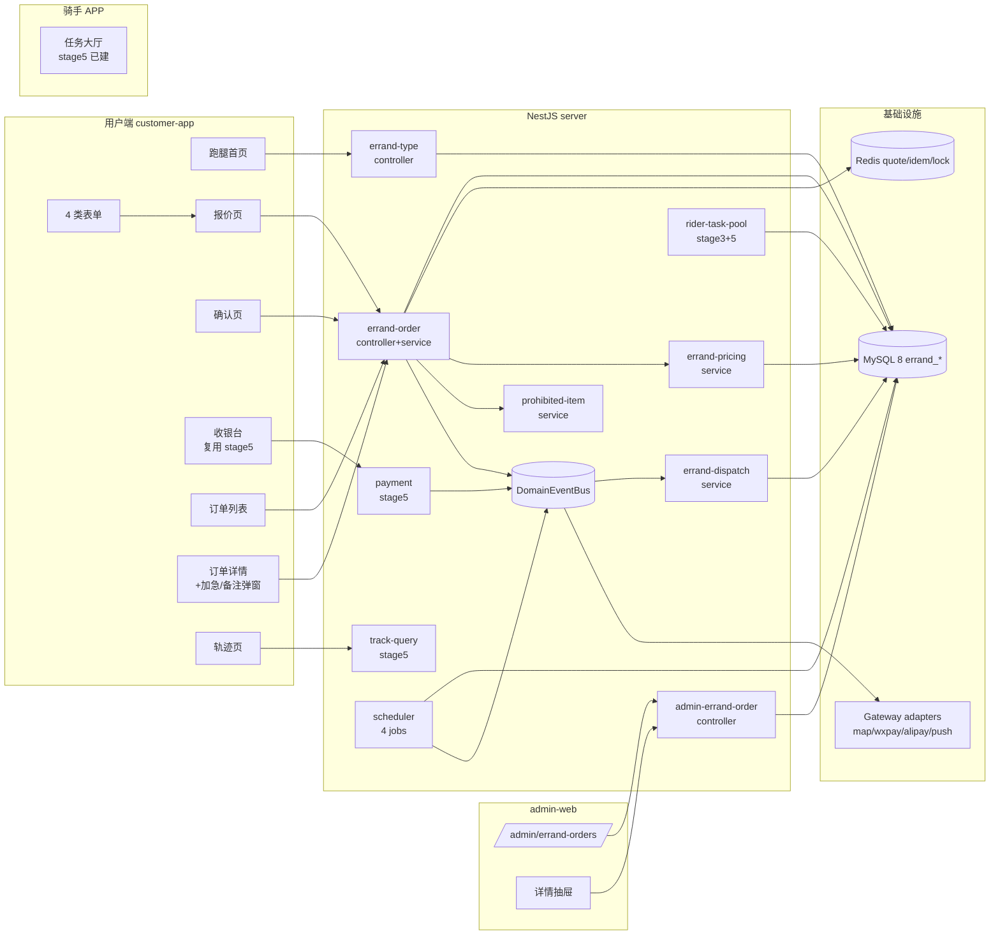

# 阶段 6 — 用户端跑腿交易闭环 · 架构设计(DESIGN)

> 基于 `CONSENSUS_阶段6.md` 锁定的需求与决策,本文档给出系统分层、模块依赖、接口契约、数据流与异常策略。

## 1. 整体架构



## 2. 分层设计

| 层         | 职责                                                                                             |
| ---------- | ------------------------------------------------------------------------------------------------ |
| Controller | DTO 校验 + JwtGuard + RequirePermission + Idempotent + Audit;只编排,不写业务逻辑                 |
| Service    | 单事务 + 状态机校验 + 调用 adapter + 事件发布;含 quote/submit/cancel/urgent/remark/list/detail   |
| Repository | TypeORM Repository,实体即表;读写分离,read 用 createQueryBuilder,write 用 save                    |
| Adapter    | map.distance / push.pushOne / sms.send / wxpay.prepay / alipay.parseCallback,统一返 PrepayResult |
| Subscriber | 6 个事件订阅器,运行在事件总线上,异步,失败不影响主流程                                            |
| Job        | 4 个定时任务,30s/1min 扫库,DistributedLockService 防多实例并发                                   |

## 3. 数据表设计(8 张新)

### 3.1 errand_order — 跑腿主订单

| 字段                  | 类型            | 说明                                                                       |
| --------------------- | --------------- | -------------------------------------------------------------------------- |
| errand_order_id       | varchar(32) PK  | `EO` + ULID                                                                |
| order_no              | varchar(32) UK  | `E` + yyyyMMdd + 6 位 incr                                                 |
| customer_id           | varchar(32) IDX |                                                                            |
| type_code             | varchar(16)     | BUY/DELIVER/HELP/CUSTOM                                                    |
| status                | varchar(20) IDX | WAIT_PAY/PAID/DISPATCHING/ASSIGNED/PICKED_UP/DELIVERED/COMPLETED/CANCELLED |
| pay_order_id          | varchar(32)     | 关联 payment_order(stage 5)                                                |
| base_fee              | decimal(10,2)   | 基础费                                                                     |
| distance_fee          | decimal(10,2)   | 距离费                                                                     |
| urgent_fee            | decimal(10,2)   | 加急费                                                                     |
| budget                | decimal(10,2)   | 用户预算(垫付上限)                                                         |
| payable_amount        | decimal(10,2)   | 应付 = base+distance+urgent                                                |
| urgent_level          | varchar(16)     | standard/fast/express                                                      |
| reserved_time         | bigint          | 预约时间戳(可空)                                                           |
| expire_at             | bigint          | WAIT_PAY 过期时间(15 min)                                                  |
| paid_at               | bigint          |                                                                            |
| cancelled_at          | bigint          |                                                                            |
| cancel_reason         | varchar(255)    |                                                                            |
| created_at/updated_at | bigint          |                                                                            |

### 3.2 errand_order_detail — 详情(取送地址 / 物品 / 任务描述)

| errand_order_detail_id PK / order_id IDX UK / pickup_address(JSON {address,name,mobile,lng,lat}) / delivery_address(JSON 同) / item_desc TEXT / task_desc TEXT / weight DECIMAL(8,2) / distance_meters INT / created_at/updated_at |

### 3.3 errand_quote — 报价快照

| errand_quote_id PK / customer_id IDX / type_code / pickup_addr(JSON) / delivery_addr(JSON) / weight / urgent_level / budget / base_fee / distance_fee / urgent_fee / payable_amount / prohibited_warnings(JSON arr) / expire_at(5 min) / used_order_id(可空) / created_at |

### 3.4 errand_attachment — 图片附件

| errand_attachment_id PK / order_id IDX / file_id FK file_object / sort INT / created_at |

### 3.5 errand_price_snapshot — 价格快照(submit 时冻结)

| errand_price_snapshot_id PK / order_id IDX UK / payload(JSON 全量计价 input/output) / created_at |

### 3.6 errand_task — 调度任务

| errand_task_id PK / order_id IDX UK / status varchar(20) IDX(READY_FOR_DISPATCH/ASSIGNED/PICKED_UP/DELIVERED) / rider_id IDX(可空) / dispatch_count INT / price_increase DECIMAL(10,2) / pickup_addr(JSON) / delivery_addr(JSON) / created_at/updated_at |

### 3.7 prohibited_item — 违禁品库

| prohibited_item_id PK / keyword varchar(64) UK IDX / category varchar(32) / level varchar(16)(WARN/REJECT) / description varchar(255) / enabled tinyint / created_at/updated_at |

### 3.8 errand_timeline — 订单事件流

| errand_timeline_id PK / order_id IDX / event_type varchar(32)(CREATED/PAID/DISPATCH/ASSIGN/PICKUP/DELIVER/COMPLETE/CANCEL/REMARK/URGENT/PRICE_INC) / payload(JSON) / created_at |

### 3.9 errand_pricing — 计价规则(seed 1 条)

| errand_pricing_id PK / city_code varchar(8) IDX(默认全国 'GLOBAL') / base_fee_yuan / distance_fee_per_km / urgent_standard / urgent_fast / urgent_express / weight_extra_per_kg / enabled / created_at |

> 共 9 张实体;但 errand_pricing 仅 seed 配置数据,不是规划列出的 8 张"核心数据表",这里独立建以满足"计价以后端为准、不写死代码"。

## 4. 接口契约(13 接口 — 9 c 端 + 3 admin + 1 复用 callback)

### 4.1 用户端 9 接口

| Method | Path                                                   | DTO/Body 关键字段                                                                                             | VO/响应                                                                         |
| ------ | ------------------------------------------------------ | ------------------------------------------------------------------------------------------------------------- | ------------------------------------------------------------------------------- |
| GET    | /api/v1/c/errand/service-types                         | cityCode?                                                                                                     | [{typeCode,name,requiredFields,enabled}]                                        |
| POST   | /api/v1/c/errand/quotes                                | typeCode,pickupAddress,deliveryAddress,weight?,urgency,budget?,reservedTime?,attachments?,itemDesc?,taskDesc? | quoteId,baseFee,distanceFee,urgentFee,payableAmount,expireAt,prohibitedWarnings |
| POST   | /api/v1/c/errand/orders                                | quoteId,payChannel,remark?,idempotencyKey                                                                     | orderId,orderNo,payOrderId,status,expireAt                                      |
| GET    | /api/v1/c/errand/orders **(A1 新增)**                  | status?,page,pageSize                                                                                         | {list[],total,page,pageSize}                                                    |
| GET    | /api/v1/c/errand/orders/{orderId}                      | -                                                                                                             | orderStatus,priceDetail,pickup,delivery,rider,timeline,actions                  |
| POST   | /api/v1/c/errand/orders/{orderId}/cancel **(A2 新增)** | reason                                                                                                        | orderId,status                                                                  |
| POST   | /api/v1/c/errand/orders/{orderId}/urgent               | urgentLevel,confirmFee                                                                                        | orderId,urgentFee,status                                                        |
| PATCH  | /api/v1/c/errand/orders/{orderId}/remark               | remark,attachments?                                                                                           | orderId,latestRemark,updatedAt                                                  |
| GET    | /api/v1/c/errand/orders/{orderId}/track                | -                                                                                                             | riderLocation,route,trackPoints,eta                                             |

### 4.2 admin 3 接口(A4 甲方案)

| Method | Path                              | 权限点                   | 响应                                                                              |
| ------ | --------------------------------- | ------------------------ | --------------------------------------------------------------------------------- |
| GET    | /api/v1/admin/errand-orders       | admin:errand-orders:view | {list,total,page,pageSize}                                                        |
| GET    | /api/v1/admin/errand-orders/:id   | admin:errand-orders:view | 详情(同 c 端 + 用户/骑手脱敏字段)                                                 |
| GET    | /api/v1/admin/errand-orders/stats | admin:errand-orders:view | {totalCount,paidCount,dispatchingCount,deliveredCount,cancelledCount,totalAmount} |

### 4.3 callback(复用 stage 5,不动)

- POST /api/v1/callback/wxpay
- POST /api/v1/callback/alipay
- bizType 路由:'FOOD' → FoodOrderPaidSubscriber;'ERRAND' → ErrandPaidSubscriber

## 5. 数据流(关键 5 条)

### 5.1 报价

```
quote DTO → ErrandOrderService.preview()
  ├─ ErrandTypeService.find(typeCode)
  ├─ MapAdapter.distance(pickup, delivery) → meters
  ├─ ErrandPricingService.calc(typeCode, distance, urgentLevel, weight) → {baseFee,distanceFee,urgentFee}
  ├─ ProhibitedItemService.check(itemDesc/taskDesc) → warnings[]
  ├─ INSERT errand_quote(... expire_at = now+5min)
  └─ Redis SETEX errand:quote:<id> 300s
return QuoteVO
```

### 5.2 提交

```
submit DTO → ErrandOrderService.submit() (Transaction)
  ├─ Redis GET errand:quote:<id> → 不存在 throw STATUS_INVALID
  ├─ DB 校验 quoteId.used_order_id IS NULL 且 expire_at > now
  ├─ INSERT errand_order(orderNo='E'+yyyyMMdd+6 位 incr, status='WAIT_PAY')
  ├─ INSERT errand_order_detail
  ├─ INSERT errand_attachment[]
  ├─ INSERT errand_price_snapshot
  ├─ INSERT errand_timeline(CREATED)
  ├─ UPDATE errand_quote.used_order_id = orderId
  ├─ PaymentService.prepay(bizType='ERRAND', bizId=orderId, channel) → payOrderId
  ├─ UPDATE errand_order.pay_order_id
  └─ DomainEventBus.publish(ErrandOrderCreated)
return {orderId, orderNo, payOrderId, status, expireAt}
```

### 5.3 支付回调(复用 stage 5)

```
POST /callback/wxpay → PaymentService.handleCallback(channel, raw)
  ├─ 验签 + nonce 防重放(60s)
  ├─ 查 payment_order by out_trade_no → biz_type='ERRAND', biz_id=orderId
  ├─ UPDATE payment_order.status='SUCCESS', paid_at=now
  ├─ DomainEventBus.publish(PaymentSucceeded{bizType:'ERRAND', bizId:orderId})
  └─ ErrandPaidSubscriber:
       ├─ UPDATE errand_order.status WAIT_PAY → PAID, paid_at=now
       ├─ INSERT errand_timeline(PAID)
       ├─ DomainEventBus.publish(ErrandPaid)
       └─ ErrandDispatchSubscriber:
            ├─ INSERT errand_task(status='READY_FOR_DISPATCH')
            ├─ UPDATE errand_order.status='DISPATCHING'
            └─ push.pushOne({cid:'rider:nearby', body:'新跑腿任务'})
```

### 5.4 加急

```
urgent DTO → ErrandOrderService.urgent() (Transaction)
  ├─ 状态校验 status ∈ {PAID, DISPATCHING, ASSIGNED}
  ├─ ErrandPricingService.calcUrgent(urgentLevel) → newUrgentFee
  ├─ confirmFee 校验(防止前端漂移)
  ├─ UPDATE errand_order.urgent_fee, urgent_level, payable_amount
  ├─ INSERT errand_timeline(URGENT, payload={old, new})
  ├─ TODO(stage 8): payment 补差价 — 本阶段暂记账不补扣
  └─ DomainEventBus.publish(ErrandPriceIncreased)
```

### 5.5 自动取消(10 min 无骑手)

```
no-rider-cancel.job (每 1 min)
  ├─ 扫 errand_order WHERE status='DISPATCHING' AND DISPATCHING_at < now - 10min
  ├─ for each:
  │    ├─ UPDATE status='CANCELLED', cancel_reason='NO_RIDER'
  │    ├─ INSERT errand_timeline(CANCEL)
  │    ├─ DomainEventBus.publish(ErrandNoRiderCancelled)
  │    └─ ErrandRefundSubscriber:
  │         └─ wxpay/alipay.refund mock + payment_order.refund_status='REFUNDED'
```

## 6. 异常处理策略

| 异常             | 处理                                                                         |
| ---------------- | ---------------------------------------------------------------------------- |
| 报价过期         | submit 接口返 STATUS_INVALID,前端弹窗提示重新报价                            |
| 违禁命中(WARN)   | 不阻断,前端展示警告但允许提交;命中(REJECT) 阻断 quote → 直接抛 INVALID_PARAM |
| quote 重复使用   | errand_quote.used_order_id IS NOT NULL → submit 抛 DUPLICATE_REQUEST         |
| 状态机非法流转   | 抛 STATUS_INVALID;controller 返 400 + 错误提示                               |
| 距离计算失败     | map.adapter mock 永远返成功;真实接入后 fallback 直线距离 + log warn          |
| 支付回调验签失败 | 复用 stage 5 行为:返 FAIL,callback 重试 by 三方                              |
| job 多实例并发   | DistributedLockService 加锁 errand\_<jobName>;锁失败 silent skip             |
| 事件订阅器异常   | 单事件失败不影响主流程,失败入 dead-letter(stage 0 已建)                      |

## 7. 测试策略

### 7.1 后端 jest(目标 ≥130 用例)

- entity:9 张表 entity 字段完整性 12 用例
- migration:Stage6Init.up/down 2 用例
- service:errand-type / errand-pricing / errand-order(quote/submit/list/detail/cancel/urgent/remark) / errand-dispatch / prohibited-item / admin-errand-order ≈ 60 用例
- subscriber:6 订阅器 12 用例
- job:4 jobs 12 用例
- controller:9 c 端 + 3 admin = 12 用例,e2e 主流程
- adapter 扩展:map.adapter Haversine 4 用例,wxpay/alipay parseCallback bizType='ERRAND' 4 用例
- events.ts:6 新事件名 + payload 4 用例
- 容错:状态机非法流转 / quote 过期 / 违禁命中 / nonce 重放 ≈ 12 用例

### 7.2 前端 vitest

- customer-app:7 api spec(每接口 1) + 3 store spec + format-price 等 util 已建 — 估 ≥40 用例
- admin-web:errand-orders/index spec + drawer spec + api spec — 估 ≥10 用例

## 8. 性能与限流(本阶段最低线)

- quote 接口:无限流(报价为只读 + Redis 5 min);Idempotency-Key 兜底防重复提交
- submit:Idempotency-Key + DB UNIQUE(customer_id, quoteId)
- callback:nonce 防重放 60s(stage 5 已建)
- list:分页强制 pageSize ≤ 50
- map.distance mock:同步,< 1ms
