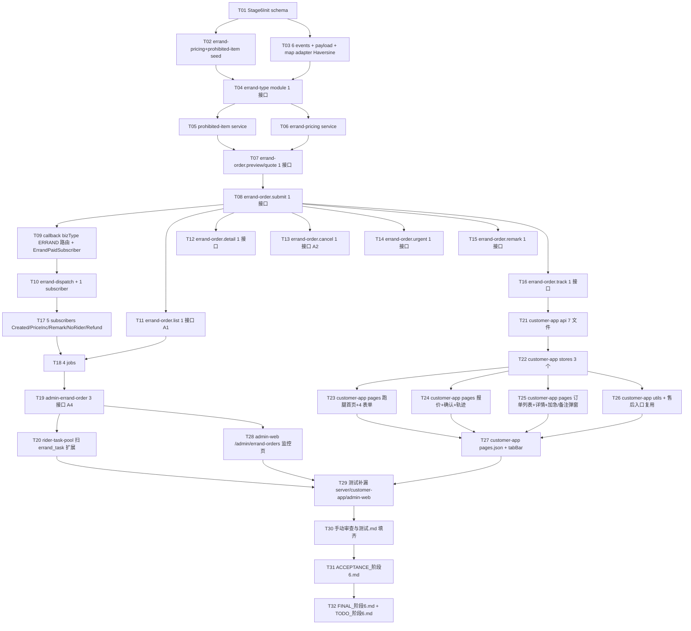

# 阶段 6 — 用户端跑腿交易闭环 · 原子任务拆分(TASK)

> 基于 `DESIGN_阶段6.md`,本阶段拆 **32 个原子任务**(28 开发 + 4 测试与文档),按 8 个 Wave 串行 + Wave 内并行。

## 任务依赖图

## 通用约束(全部任务遵守)

- 严格遵循 `项目阶段规划/06-阶段6-用户端-跑腿交易闭环/` 9 份文档,不多不少。
- 装饰器:c 端写接口必须 `@Idempotent` + `@Audit`;admin 接口必须 `@AdminJwt` + `@RequirePermission`。
- 测试:每个 service 至少 5 用例(正常/边界/异常/状态机/事件触发)。
- 代码规范:沿用 stage 5 文件结构(controller/service/dto/vo/entity/repository/index.ts)。
- migration:1 个文件 `1715000000000-Stage6Init.ts`,9 张新表 + 1 ALTER(payment_order biz_type 已支持 ERRAND,无需 ALTER)。
- 提交:按 Wave 串 commit,commit message 格式 `feat(stage-6): TXX-TYY <短描述>`。

---

## Wave 1 — schema + 全局事件 + adapter(T01-T03,3 任务)

### T01 — Stage6Init migration + 9 entity

- **输入**: DESIGN § 3 数据表清单
- **输出**:
  - `apps/server/src/database/entities/`:errand-order.entity.ts / errand-order-detail.entity.ts / errand-quote.entity.ts / errand-attachment.entity.ts / errand-price-snapshot.entity.ts / errand-task.entity.ts / prohibited-item.entity.ts / errand-timeline.entity.ts / errand-pricing.entity.ts(共 9 个文件)
  - `entities/index.ts` 增加导出
  - `apps/server/src/database/migrations/1715000000000-Stage6Init.ts`(9 CREATE TABLE)
  - 字段全部 BIGINT 时间戳 + 主键 `<table>_id`
- **验收**: pnpm --filter @o2o/server build 通过;migration 在测试 jest 环境 up/down 通过

### T02 — errand-pricing + prohibited-item seed

- **输入**: T01 完成
- **输出**:
  - `apps/server/src/database/seeds/errand-pricing.seed.ts` — 1 条 GLOBAL(基础 5 元 + 距离 0.5 元/km + 0/5/10 加急)
  - `apps/server/src/database/seeds/prohibited-item.seed.ts` — 5 条(刀具/危险品/烟酒/药品/管制品)
  - `apps/server/src/database/seeds/errand-type.seed.ts` — 4 条(BUY/DELIVER/HELP/CUSTOM + requiredFields JSON)
  - 注册到 `seeds/index.ts`
- **验收**: pnpm --filter @o2o/server seed 后 3 张表数据齐全;jest seed.spec 4 用例

### T03 — 6 events + map.adapter Haversine

- **输入**: T01 完成
- **输出**:
  - `apps/server/src/events/events.ts` 增加 6 EventName + 6 Payload + EventPayloadMap
  - `apps/server/src/modules/integration-gateway/adapters/map.adapter.ts` 扩展 `distance(p1,p2):number` Haversine 实现 + `route()` 简化骨架
  - jest:`events.ts.spec` +6 用例,`map.adapter.spec` +4 用例(0/北京-上海/同点/超长距离)
- **验收**: build 通过;jest map.adapter 全绿

---

## Wave 2 — 配置类 3 模块(T04-T06)

### T04 — errand-type module(1 c 端接口)

- **输入**: T01-T03 完成
- **输出**:
  - `apps/server/src/modules/errand-type/`:errand-type.controller.ts / service.ts / vo.ts / dto.ts / module.ts / index.ts / \*.spec.ts
  - 接口:`GET /api/v1/c/errand/service-types?cityCode`
  - VO:`{typeCode, name, requiredFields, enabled}`
  - 注册到 AppModule
- **验收**: jest 5 用例(全量/cityCode 为空/4 类正确返回/disabled 过滤)

### T05 — prohibited-item module(纯 service)

- **输出**:
  - `apps/server/src/modules/prohibited-item/`:service.ts(check(text):Promise<{level,keyword,description}[]>) / module.ts / index.ts / spec.ts
  - 不暴露 controller(stage 9 才有 admin 配置 UI)
- **验收**: jest 6 用例(命中 WARN/命中 REJECT/无命中/空文本/keyword 关闭/正则 case-insensitive)

### T06 — errand-pricing module(纯 service)

- **输出**:
  - `apps/server/src/modules/errand-pricing/`:service.ts(calc({typeCode,distance,urgentLevel,weight}):{baseFee,distanceFee,urgentFee,payableAmount}) / module.ts / index.ts / spec.ts
- **验收**: jest 8 用例(BUY/DELIVER/HELP/CUSTOM × distance 边界 + urgentLevel 3 档 + weight extra)

---

## Wave 3 — 订单核心(T07-T10,4 任务)

### T07 — errand-order.preview/quote(1 c 端接口)

- **输入**: T04-T06 完成
- **输出**:
  - `apps/server/src/modules/errand-order/`:controller / service / dto(QuoteDTO) / vo / module / index / \*.spec.ts
  - 接口:`POST /api/v1/c/errand/quotes` @Idempotent @Audit
  - 流程:type-find → map.distance → pricing.calc → prohibited.check → INSERT errand_quote + Redis SETEX 300s
- **验收**: jest 10 用例(4 类成功 + 违禁命中 WARN + 违禁命中 REJECT + Idempotency-Key 重放 + 缓存命中 + 字段缺失 + 距离 0)

### T08 — errand-order.submit(1 c 端接口)

- **输入**: T07 完成 + payment 模块(stage 5)
- **输出**:
  - 同模块新增 SubmitDTO + service.submit() + controller.submit()
  - 接口:`POST /api/v1/c/errand/orders` @Idempotent @Audit
  - 流程:Redis GET quote → DB 校验 used_order_id IS NULL → INSERT 5 张子表 + payment.prepay(bizType='ERRAND') → 发 ErrandOrderCreated
- **验收**: jest 12 用例(成功 + quote 过期 + quote 已使用 + payChannel 错误 + 事件断言 + Idempotency 重放 + 状态机断言)

### T09 — payment callback bizType=ERRAND 路由 + ErrandPaidSubscriber

- **输入**: T08 完成
- **输出**:
  - `apps/server/src/events/subscribers/errand-paid.subscriber.ts`:
    监听 PaymentSucceeded(bizType='ERRAND') → UPDATE errand_order WAIT_PAY→PAID + INSERT errand_timeline + 发 ErrandPaid
  - 注册到 events.module
  - jest:订阅器 5 用例(状态推进 / 时间线 / 事件链 / bizType 过滤 / 已 PAID 幂等)
- **验收**: jest 5 用例

### T10 — errand-dispatch module + ErrandDispatchSubscriber

- **输入**: T09 完成
- **输出**:
  - `apps/server/src/modules/errand-dispatch/`:service.ts(createTask(orderId)) / module / spec
  - `apps/server/src/events/subscribers/errand-dispatch.subscriber.ts`:监听 ErrandPaid → INSERT errand_task + UPDATE order.status='DISPATCHING' + push 骑手
  - jest 8 用例(任务创建 / 状态推进 / push 调用断言 / 重复触发幂等)
- **验收**: jest 8 用例

---

## Wave 4 — 订单读 & 操作 6 接口(T11-T16)

### T11 — errand-order.list(A1 新增,1 接口)

- **输出**: `GET /api/v1/c/errand/orders?status&page&pageSize`,4 tab 筛选(WAIT_PAY/IN_PROGRESS/COMPLETED/CANCELLED 聚合)
- **验收**: jest 6 用例(每 tab + 分页 + 空)

### T12 — errand-order.detail

- **输出**: `GET /api/v1/c/errand/orders/{orderId}`,返 priceDetail+pickup+delivery+rider+timeline+actions
- **验收**: jest 6 用例(各状态 actions 不同)

### T13 — errand-order.cancel(A2 新增,1 接口)

- **输出**: `POST /api/v1/c/errand/orders/{orderId}/cancel`,仅 WAIT_PAY 用户主动 → CANCELLED + 发 ErrandOrderCancelled
- **验收**: jest 6 用例(成功 / 非 WAIT_PAY / 非本人 / 重复 / 事件断言 / 时间线)

### T14 — errand-order.urgent

- **输出**: `POST /api/v1/c/errand/orders/{orderId}/urgent`,状态 ∈ {PAID, DISPATCHING, ASSIGNED} 可加急,UPDATE urgent_fee + 发 ErrandPriceIncreased
- **验收**: jest 7 用例(3 档加急 + 状态非法 + confirmFee 漂移 + 事件 + 时间线)

### T15 — errand-order.remark

- **输出**: `PATCH /api/v1/c/errand/orders/{orderId}/remark`,任意状态可补充 + 发 ErrandRemarkAdded + 写时间线
- **验收**: jest 5 用例

### T16 — errand-order.track(复用 track-query)

- **输出**: `GET /api/v1/c/errand/orders/{orderId}/track`,从 errand_task 取 rider_id → rider_location.recent + map.route 简化
- **验收**: jest 5 用例

---

## Wave 5 — 5 subscribers + 4 jobs + admin + rider 扩展(T17-T20)

### T17 — 5 subscribers

- **输出**: `events/subscribers/`:
  - errand-order-created.subscriber(写时间线 CREATED — 已被 service 同步写,这里仅冗余兜底)
  - errand-price-increased.subscriber(push 提示用户)
  - errand-remark-added.subscriber(push 提示骑手)
  - errand-no-rider-cancelled.subscriber(refund mock + sms 通知)
  - errand-refund.subscriber(实际退款 — 由 ErrandNoRiderCancelled / 用户 cancel 触发)
- **验收**: jest 10 用例(每订阅器 2)

### T18 — 4 jobs

- **输出**: `apps/server/src/scheduler/jobs/`:
  - wait-pay-timeout-close-errand.job — 30s 扫 WAIT_PAY 过期
  - no-rider-price-increase.job — 1 min 扫 DISPATCHING 超 3 min 未变化
  - no-rider-cancel.job — 1 min 扫 DISPATCHING 超 10 min
  - reserved-errand-dispatch.job — 30s 扫 reservedTime ≤ now+10min 的 PAID 订单
  - 每 job 继承 BaseJob + DistributedLockService
- **验收**: jest 12 用例(锁正常/扫描正确/边界/触发事件)

### T19 — admin-errand-order 3 接口(A4)

- **输出**: `apps/server/src/modules/admin-errand-order/` controller/service/vo/spec
  - 3 接口 + 权限 admin:errand-orders:view + sys_permission seed +2
- **验收**: jest 6 用例(list/detail/stats × 权限通过/拒绝)

### T20 — rider-task-pool 扩展扫 errand_task

- **输出**: `apps/server/src/modules/rider-task-pool/service.ts` listAvailable() 中 union errand_task.status='READY_FOR_DISPATCH' 返简化卡(taskType='ERRAND')
  - 不新增接口,沿用 `GET /api/v1/r/tasks/available`
- **验收**: jest 5 用例(只 food / 只 errand / mixed / order by createdAt / 分页)

---

## Wave 6 — customer-app 14 页 + api + stores(T21-T27)

### T21 — customer-app api 7 文件

- **输出**: `apps/customer-app/src/api/`:errand-types.ts / errand-quotes.ts / errand-orders.ts(含 list/detail/cancel/urgent/remark) / errand-track.ts(共 4 个文件就够覆盖 9 接口);每文件配 \*.spec.ts
- **验收**: vitest 9 用例(每接口 1 url 断言)

### T22 — customer-app 3 stores

- **输出**: `apps/customer-app/src/stores/`:errand-quote.ts(quote 缓存 + reset) / errand-order.ts(list/detail/refresh) / errand-form.ts(4 类表单暂存)
- **验收**: vitest 12 用例

### T23 — pages 跑腿首页 + 4 表单

- **输出**: `apps/customer-app/src/pages/errand/`:home/index.vue + form/buy.vue + form/deliver.vue + form/help.vue + form/custom.vue
- **验收**: 4 表单字段差异生效;manual + 1 vitest 用例(home 渲染)

### T24 — pages 报价 + 确认 + 轨迹

- **输出**: `errand/quote/index.vue` + `errand/confirm/index.vue` + `errand/track/index.vue`
- **验收**: 报价页展示 prohibitedWarnings;确认页展示价格细分

### T25 — pages 订单列表 + 详情 + 加急/备注弹窗

- **输出**: `errand/order/list.vue` + `errand/order/detail.vue`(内嵌加急/备注弹窗)
- **验收**: 详情 timeline 渲染;状态字典 STATUS_LABEL_ERRAND

### T26 — utils + 售后入口复用

- **输出**:
  - `apps/customer-app/src/utils/errand-status.ts` — STATUS_LABEL_ERRAND 字典
  - 售后入口直接路由到 stage 5 已建的 `/pages/me/aftersales-stub`(不新增页)
- **验收**: vitest 6 用例(字典完整性)

### T27 — pages.json + 入口 tabBar

- **输出**: 注册 14 页路由(已建则确认),首页 tabBar 增加跑腿入口或外卖首页底部增"跑腿"卡片
- **验收**: pnpm --filter @o2o/customer-app build 通过

---

## Wave 7 — admin-web 监控页(T28)

### T28 — admin-web /admin/errand-orders 监控页 + 抽屉

- **输出**:
  - `apps/admin-web/src/api/admin-errand-orders.ts` + spec
  - `apps/admin-web/src/views/errand-orders/index.vue`(列表 + 4 状态 tab + 筛选)
  - `apps/admin-web/src/views/errand-orders/components/ErrandOrderDetailDrawer.vue`(详情抽屉)
  - 路由 `/admin/errand-orders` + 菜单注册(menu:errand-orders 权限点)
- **验收**: vitest 10 用例;pnpm --filter @o2o/admin-web build 通过

---

## Wave 8 — 测试补漏 + 文档(T29-T32)

### T29 — 测试补漏

- **输出**:
  - server jest 累计 ≥640 用例(stage 5 末 510 + ≥130);特别补:容错路径 / 状态机 / 事件链
  - customer-app vitest 累计 ≥89 用例(stage 5 末 49 + ≥40)
  - admin-web vitest 累计 ≥72 用例(stage 5 末 62 + ≥10)
- **验收**: pnpm -r test 全绿

### T30 — 手动审查与测试.md 填齐

- **输出**: `项目阶段规划/06-.../手动审查与测试.md`:接口审查 7+1+1+3 表填齐(本工具自动落证据,人工触发部分明确标"待人工触发")
  - 同时 `问题与风险记录.md` P0/P1/P2 全部"暂无";P3 ≥3 条(真支付/真路线/真售后)
- **验收**: 文档可读,反查规划无遗漏

### T31 — ACCEPTANCE\_阶段6.md

- **输出**: `docs/阶段6-用户端跑腿交易闭环/ACCEPTANCE_阶段6.md`:对照 § 2.1-2.5 验收标准逐项打勾 + 证据(jest 用例数 / commit hash / 文件路径)
- **验收**: 全部勾选

### T32 — FINAL*阶段6.md + TODO*阶段6.md

- **输出**:
  - `FINAL_阶段6.md`:总览 / 能力矩阵 / 关键决策 / 自动决策 / 提交记录
  - `TODO_阶段6.md`:用户侧待办(MySQL migrate / curl / 真机)
- **验收**: 三件套交付完整

---

## 提交节奏(预计 8-9 commit)

| Wave | Commit message                                                            |
| ---- | ------------------------------------------------------------------------- |
| 0    | docs(stage-6): ALIGNMENT/CONSENSUS/DESIGN/TASK 4 文档(待人审)             |
| 1    | feat(stage-6): T01-T03 schema + 6 events + map.adapter + seeds            |
| 2    | feat(stage-6): T04-T06 errand-type/pricing/prohibited-item                |
| 3    | feat(stage-6): T07-T10 quote/submit + paid/dispatch subscribers           |
| 4    | feat(stage-6): T11-T16 list/detail/cancel/urgent/remark/track             |
| 5    | feat(stage-6): T17-T20 5 subscribers + 4 jobs + admin 3 接口 + rider 扩展 |
| 6    | feat(stage-6): T21-T27 customer-app 14 页 + api + stores                  |
| 7    | feat(stage-6): T28 admin-web errand-orders 监控页                         |
| 8    | feat(stage-6): T29-T32 测试补漏 + 验收文档(完整交付 32/32)                |

## 复杂度评估

- 复杂度与 stage 5 同档(stage 5 = 32 任务/9 commit/+139 jest);本阶段预计也是 32 任务/9 commit/+130-150 jest。
- 风险点:错单状态机比食单简单(无商家接单/无评价),但有"加价/退款 mock"分支需测;违禁品 keyword 命中需简单正则。
- 依赖 stage 5 的 payment 模块改动只是 bizType 路由分发(已预留),不需要修改 payment.service.ts 主逻辑。
