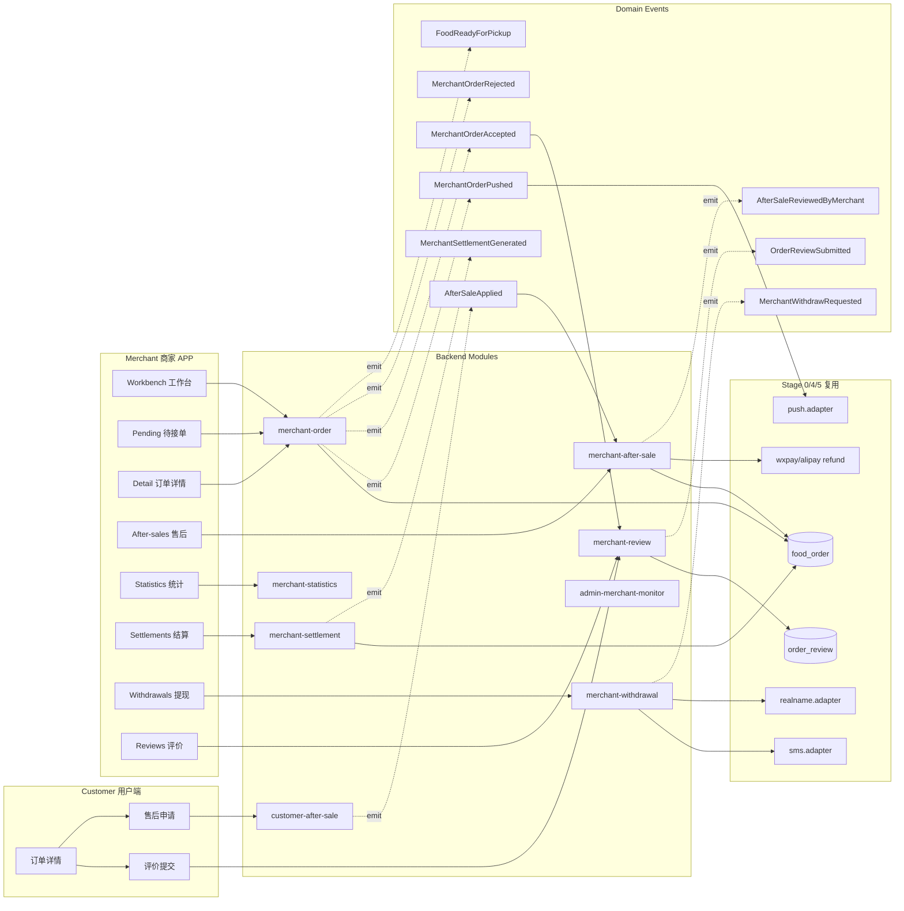
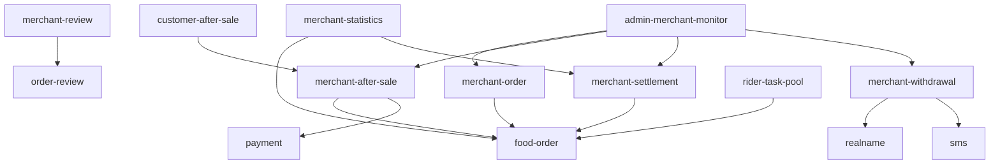

# 阶段 7 — 商家端 APP 订单售后结算数据 · 设计文档(DESIGN)

> 基于 CONSENSUS\_阶段7.md 锁定项,产出整体架构 / 模块依赖 / 数据表 / 接口契约 / 状态机 / 事件流。

## 1. 整体架构



## 2. 模块依赖



> 仅画"新增/扩展依赖"。stage 5 既有 food-order/payment 等不重复。
> rider-task-pool 仅作只读消费 food_order.status='READY_FOR_PICKUP',不做改动。

## 3. 数据模型

### 3.1 新增表(7)

| 表                             | 主键                                   | 关键字段                                                                                                                                                                                                                                                                                      | 说明           |
| ------------------------------ | -------------------------------------- | --------------------------------------------------------------------------------------------------------------------------------------------------------------------------------------------------------------------------------------------------------------------------------------------- | -------------- |
| `after_sale`                   | after_sale_id BIGINT                   | order_id, customer_id, merchant_id, store_id, type(REFUND/EXCHANGE), reason, amount_cents, status(PENDING_MERCHANT/APPROVED_BY_MERCHANT/REJECTED_BY_MERCHANT/PENDING_PLATFORM/COMPLETED/REFUNDED/CANCELLED), merchant_review_at, merchant_reject_reason, applied_at, completed_at, created_at | 售后单主表     |
| `after_sale_evidence`          | after_sale_evidence_id BIGINT          | after_sale_id, file_id, source(USER/MERCHANT), created_at                                                                                                                                                                                                                                     | 凭证           |
| `merchant_order_action_log`    | merchant_order_action_log_id BIGINT    | order_id, merchant_id, action(ACCEPT/REJECT/READY/REMARK), before_status, after_status, payload_json, operator_id, created_at                                                                                                                                                                 | 商家操作流水   |
| `review_reply`                 | review_reply_id BIGINT                 | order_review_id, merchant_id, store_id, content, created_at                                                                                                                                                                                                                                   | 评价回复       |
| `merchant_statistics_snapshot` | merchant_statistics_snapshot_id BIGINT | store_id, snapshot_date YYYYMMDD, order_count, gross_cents, refund_cents, net_cents, top_items_json, store_rating, created_at                                                                                                                                                                 | 经营快照(日级) |
| `merchant_settlement`          | merchant_settlement_id BIGINT          | settlement_no, store_id, period_start, period_end, gross_cents, commission_cents, fee_cents, net_cents, status(PENDING/READY/PAID/FAILED), created_at, completed_at                                                                                                                           | T+1 结算       |
| `merchant_withdrawal`          | merchant_withdrawal_id BIGINT          | withdrawal_no, store_id, amount_cents, account_id, status(PENDING/APPROVED/COMPLETED/REJECTED/FAILED), submitted_at, completed_at, sms_code_hash, fail_reason                                                                                                                                 | 提现           |

### 3.2 扩展表(2)

- `food_order`(stage 5 已存在)
  - **扩 status 枚举**:补 PAID_WAIT_MERCHANT / MERCHANT_ACCEPTED / PREPARING / READY_FOR_PICKUP(向前兼容,老 PAID 老路径仍支持)。
  - **新字段**:accepted_at BIGINT NULL / expected_ready_at BIGINT NULL / ready_at BIGINT NULL / reject_reason VARCHAR(255) NULL。
  - **新索引**:idx_food_order_merchant_status(merchant_id, status, created_at)。
- `order_review`(stage 5 已存在)
  - 不改 schema(reply 走单独表)。

### 3.3 sys_config 新增

```json
[
  {
    "configKey": "MERCHANT_WITHDRAWAL_LIMIT",
    "configValue": "{\"single\":1000000,\"daily\":5000000}",
    "description": "商家提现单笔/单日限额(分)"
  },
  {
    "configKey": "AFTER_SALE_WINDOW_DAYS",
    "configValue": "7",
    "description": "用户申请售后窗口(天,以订单 DELIVERED 起算)"
  },
  {
    "configKey": "MERCHANT_COMMISSION_RATE",
    "configValue": "{\"food\":500}",
    "description": "商家佣金率(万分位,500=5%)"
  },
  { "configKey": "MERCHANT_PAYMENT_FEE_RATE", "configValue": "60", "description": "支付通道费率(万分位,60=0.6%)" }
]
```

### 3.4 sys_permission 新增(6)

```
admin:menu:after-sales / admin:after-sales:view
admin:menu:settlements / admin:settlements:view
admin:menu:withdrawals / admin:withdrawals:view
```

## 4. 接口契约

### 4.1 商家 m/\* 接口(11)

| 接口                                     | 装饰器                             | 状态机迁移                                         | 关键 DTO                                                               |
| ---------------------------------------- | ---------------------------------- | -------------------------------------------------- | ---------------------------------------------------------------------- |
| GET /m/food-orders/pending               | MerchantJwt                        | -                                                  | PageDto(status?, pageNo, pageSize) → PageVO\<MerchantOrderListVO\>     |
| POST /m/food-orders/{orderId}/accept     | MerchantJwt + @Idempotent + @Audit | PAID_WAIT_MERCHANT → MERCHANT_ACCEPTED → PREPARING | { expectedReadyMin?: number }                                          |
| POST /m/food-orders/{orderId}/reject     | MerchantJwt + @Idempotent + @Audit | PAID_WAIT_MERCHANT → CANCELLED + REFUNDING         | { rejectReason: string }                                               |
| POST /m/food-orders/{orderId}/ready      | MerchantJwt + @Idempotent + @Audit | PREPARING → READY_FOR_PICKUP                       | { readyRemark?: string }                                               |
| GET /m/after-sales                       | MerchantJwt                        | -                                                  | { status?, pageNo, pageSize }                                          |
| POST /m/after-sales/{afterSaleId}/review | MerchantJwt + @Idempotent + @Audit | PENDING_MERCHANT → APPROVED/REJECTED_BY_MERCHANT   | { reviewResult: 'APPROVE'\|'REJECT', rejectReason?, evidenceFileIds? } |
| POST /m/reviews/{reviewId}/reply         | MerchantJwt + @Idempotent + @Audit | -                                                  | { content: string }                                                    |
| GET /m/statistics                        | MerchantJwt                        | -                                                  | { range: 'TODAY'\|'YESTERDAY'\|'WEEK'\|'MONTH' }                       |
| GET /m/settlements                       | MerchantJwt                        | -                                                  | { month?, status?, pageNo, pageSize }                                  |
| GET /m/withdrawals                       | MerchantJwt                        | -                                                  | { status?, pageNo, pageSize }                                          |
| POST /m/withdrawals                      | MerchantJwt + @Idempotent + @Audit | - → PENDING                                        | { amount, accountId, smsCode }                                         |

### 4.2 用户 c/\* 接口(2 补充)

| 接口                | 装饰器                             | 关键 DTO                                            |
| ------------------- | ---------------------------------- | --------------------------------------------------- |
| POST /c/reviews     | CustomerJwt + @Idempotent + @Audit | { orderId, rating, content?, imageFileIds? }        |
| POST /c/after-sales | CustomerJwt + @Idempotent + @Audit | { orderId, type, reason, amount, evidenceFileIds? } |

### 4.3 平台 admin/\* 接口(7 监控)

| 接口                           | 装饰器                                  |
| ------------------------------ | --------------------------------------- |
| GET /admin/after-sales         | AdminJwt + admin:after-sales:view       |
| GET /admin/after-sales/{id}    | AdminJwt + admin:after-sales:view       |
| GET /admin/settlements         | AdminJwt + admin:settlements:view       |
| GET /admin/settlements/{id}    | AdminJwt + admin:settlements:view       |
| GET /admin/withdrawals         | AdminJwt + admin:withdrawals:view       |
| GET /admin/withdrawals/{id}    | AdminJwt + admin:withdrawals:view       |
| GET /admin/merchant-statistics | AdminJwt + admin:settlements:view(复用) |

总计 **20 接口**(11 m + 2 c + 7 admin)。

## 5. 状态机

### 5.1 food_order 完整状态机(扩展)

```
WAIT_PAY(创建)
   ↓ 支付成功
PAID(老兼容入口) ─────→ DISPATCHING(老路径直派)
   ↓ 新路径
PAID_WAIT_MERCHANT
   ├─ accept ──→ MERCHANT_ACCEPTED ──→ PREPARING ──→ READY_FOR_PICKUP ──→ DISPATCHING
   ├─ reject ──→ CANCELLED + REFUNDING
   └─ 10min  ──→ CANCELLED + REFUNDING(job)
DISPATCHING ──→ ASSIGNED ──→ PICKED_UP ──→ DELIVERED ──→ COMPLETED
```

### 5.2 after_sale 状态机

```
PENDING_MERCHANT
   ├─ approve ──→ APPROVED_BY_MERCHANT ──→ REFUNDING ──→ REFUNDED ──→ COMPLETED
   └─ reject  ──→ REJECTED_BY_MERCHANT ──→ PENDING_PLATFORM(stage 9 仲裁)
```

### 5.3 merchant_settlement / merchant_withdrawal 状态机

```
settlement: PENDING ──→ READY ──→ PAID
withdrawal: PENDING ──→ APPROVED ──→ COMPLETED  (REJECTED / FAILED 任意分支)
```

## 6. 事件流(9)

| EventName                   | 触发点                                                    | Payload                                                       | 订阅者                                                                                                 |
| --------------------------- | --------------------------------------------------------- | ------------------------------------------------------------- | ------------------------------------------------------------------------------------------------------ |
| MerchantOrderPushed         | food_order PAID 后立即(stage 5 既有 food-order-paid 扩展) | { orderId, storeId, merchantId, payableAmountCents }          | merchant-order-pushed.subscriber → push.adapter + audit                                                |
| MerchantOrderAccepted       | accept 接口                                               | { orderId, storeId, expectedReadyAt, acceptedAt }             | merchant-order-accepted.subscriber → audit + sms.send 给用户                                           |
| MerchantOrderRejected       | reject 接口                                               | { orderId, storeId, rejectReason }                            | merchant-order-rejected.subscriber → 触发 refund mock + audit + sms 给用户                             |
| FoodReadyForPickup          | ready 接口                                                | { orderId, storeId, readyAt }                                 | food-ready-for-pickup.subscriber → push 给已分配骑手 + audit                                           |
| AfterSaleApplied            | c/after-sales 接口                                        | { afterSaleId, orderId, storeId, customerId, amount, reason } | after-sale-applied.subscriber → push 给商家 + audit                                                    |
| AfterSaleReviewedByMerchant | m/after-sales/review 接口                                 | { afterSaleId, decision, rejectReason? }                      | after-sale-reviewed.subscriber → 触发 refund(approve)/transfer to platform(reject)+ sms 给用户 + audit |
| OrderReviewSubmitted        | c/reviews 接口                                            | { reviewId, orderId, storeId, rating }                        | order-review-submitted.subscriber → push 给商家 + audit + 触发统计                                     |
| MerchantSettlementGenerated | t1-merchant-settlement.job                                | { settlementId, storeId, periodStart, periodEnd, netCents }   | merchant-settlement-generated.subscriber → push 给商家 + audit                                         |
| MerchantWithdrawRequested   | m/withdrawals POST                                        | { withdrawalId, storeId, amountCents }                        | merchant-withdraw-requested.subscriber → audit + sms 通知商家                                          |

## 7. 定时任务(5)

| Job                         | Cron       | 锁                                            | 业务                                                                                                                |
| --------------------------- | ---------- | --------------------------------------------- | ------------------------------------------------------------------------------------------------------------------- |
| wait-merchant-accept-remind | 每 30s     | DistributedLock 'wait-merchant-accept-remind' | 扫 food_order status=PAID_WAIT_MERCHANT 且 createdAt + 5min < now,push.adapter 给 merchant 并写 timeline            |
| wait-merchant-accept-cancel | 每 30s     | DistributedLock                               | 扫 food_order status=PAID_WAIT_MERCHANT 且 createdAt + 10min < now,迁 status=CANCELLED + REFUNDING,触发 refund mock |
| t1-merchant-settlement      | 每日 02:00 | DistributedLock                               | 按 store 维度扫前一日 COMPLETED 订单聚合 → 生成 merchant_settlement 行 + emit MerchantSettlementGenerated           |
| withdrawal-status-poll      | 每 1min    | DistributedLock                               | 扫 merchant_withdrawal status=APPROVED 且超 30s 未 COMPLETED 的提现单(mock 自动完成)                                |
| daily-statistics-snapshot   | 每日 02:30 | DistributedLock                               | 按 store 维度扫前一日数据 → 生成 merchant_statistics_snapshot 行                                                    |

## 8. 异常处理策略

| 异常                                         | 处理                                                |
| -------------------------------------------- | --------------------------------------------------- |
| accept 时 food_order 不在 PAID_WAIT_MERCHANT | 抛 STATUS_INVALID 422                               |
| reject 时 reason 为空                        | INVALID_PARAM 400                                   |
| reject 退款失败                              | 状态停在 CANCELLED + REFUNDING,后台 refund job 重试 |
| 5min/10min job 抢同一订单                    | DistributedLock + status 双重校验                   |
| t1-settlement 重跑                           | settlement_no 唯一索引 + ON DUPLICATE 跳过          |
| withdrawal 额度超限                          | INVALID_PARAM 400 + audit                           |
| sms code 校验失败                            | UNAUTHORIZED 401 + 限频                             |
| after_sale review 时已 APPROVED              | STATUS_INVALID 422                                  |
| review 提交时订单非 COMPLETED                | STATUS_INVALID 422                                  |
| 同一订单重复评价                             | uk_order_review_main(已存)抛 DUPLICATE_REQUEST      |

## 9. 前端架构

### 9.1 merchant-app

```
apps/merchant-app/src/
  pages.json                            (16 新页注册)
  api/
    merchant-orders.ts (+spec)
    after-sales.ts (+spec)
    reviews.ts (+spec)
    statistics.ts (+spec)
    settlements.ts (+spec)
    withdrawals.ts (+spec)
  stores/
    order.ts (Pinia,选中订单 / 待接单列表)
    after-sale.ts
    settlement.ts
    statistics.ts
  utils/
    food-order-status.ts (STATUS_LABEL / next-actions)
    after-sale-status.ts
  pages/
    workbench/index.vue        (工作台:数据卡片 + 待办列表)
    orders/pending.vue
    orders/detail.vue
    after-sales/list.vue
    after-sales/detail.vue
    statistics/index.vue
    settlements/list.vue
    settlements/detail.vue
    withdrawals/form.vue
    withdrawals/records.vue
    exports/index.vue
    reviews/list.vue
    me/index.vue              (个人中心增强)
  components/
    OrderRejectModal.vue
    OrderReadyModal.vue
    ReviewReplyModal.vue
```

### 9.2 customer-app(增量)

```
apps/customer-app/src/
  pages/
    order/review.vue            (评价提交)
    order/after-sale-apply.vue  (售后申请)
  api/
    review.ts (+spec)
    after-sale.ts (+spec)
```

### 9.3 admin-web(增量)

```
apps/admin-web/src/
  views/
    after-sales/index.vue
    after-sales/components/AfterSaleDetailDrawer.vue
    settlements/index.vue
    settlements/components/SettlementDetailDrawer.vue
    withdrawals/index.vue
    withdrawals/components/WithdrawalDetailDrawer.vue
    food-orders/index.vue       (扩展:加 acceptedAt/readyAt 字段列 + 商家维度筛选)
  api/
    admin-after-sales.ts (+spec)
    admin-settlements.ts (+spec)
    admin-withdrawals.ts (+spec)
  router/index.ts                (3 新路由)
```

## 10. 配置驱动 / Mock

- **push**:`push.adapter.send({deviceToken, title, body, payload})` Mock 写入 `domain_event_log` 为 `mockPushQueue` 表(stage 0 已有)。
- **退款**:`payment.service.refund(paymentOrderId, amount)` Mock,只写 payment_refund_log 行 + 状态机迁。
- **实名**:`realname.adapter.verify(legalPersonName, idCard)` Mock 全部返回 true(stage 11 接生产)。
- **sms**:`sms.adapter.send(mobile, template, vars)` Mock 写表。
- **结算定时**:T+1 凌晨 02:00,scheduler 触发,跑前一日的所有 COMPLETED 订单聚合。

## 11. 边界审查矩阵

- [x] 商家端仅 Android/iOS APP(merchant-app:uni-app vue3,目标平台 H5/Android/iOS,本阶段 H5 build 通过)。
- [x] 跑腿订单不进入商家流程(本阶段所有 service 都按 errand_order 显式排除/不接触)。
- [x] 4 端 Token 隔离(MerchantJwt / CustomerJwt / AdminJwt)。
- [x] 外卖/跑腿独立(本阶段所有改动都在 food_order 域)。
- [x] 金额分 / 距离米 / 时间毫秒 / camelCase。
