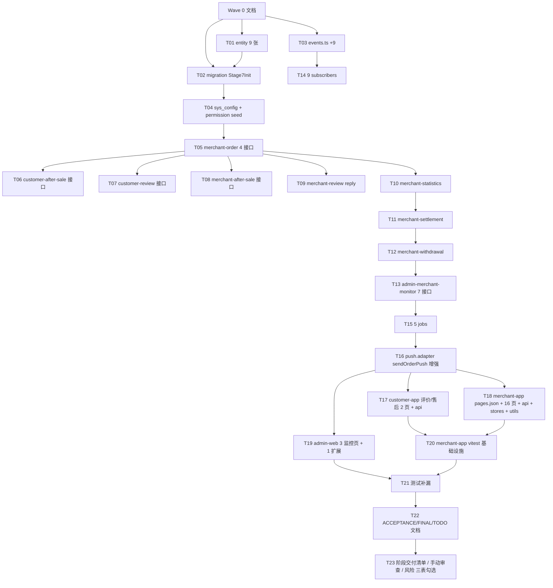

# 阶段 7 — 商家端 APP 订单售后结算数据 · 任务拆解(TASK)

> 基于 DESIGN\_阶段7.md 拆解 32 原子任务,9 波交付。每任务包含输入契约 / 输出契约 / 实现约束 / 依赖。

## 1. 任务依赖图



## 2. 原子任务清单(32)

### Wave 1:数据基础(T01–T04,4 任务)

#### T01 9 张 entity 文件(+ 2 现有扩展)

- 输入:DESIGN § 3 表清单
- 输出:`apps/server/src/database/entities/{after-sale,after-sale-evidence,merchant-order-action-log,review-reply,merchant-statistics-snapshot,merchant-settlement,merchant-withdrawal}.entity.ts` + food_order.entity.ts 扩字段
- 约束:BIGINT auto-increment / camelCase / @Index 主索引

#### T02 Stage7Init.ts migration

- 输入:T01 entity
- 输出:`apps/server/src/database/migrations/1715472600000-Stage7Init.ts` 9 张 CREATE TABLE + ALTER TABLE food_order
- 约束:idempotent migration

#### T03 events.ts +9 EventName

- 输入:DESIGN § 6
- 输出:events.ts 添加 9 EventName + 对应 Payload type;events.stage1-6.spec.ts 期望值 39 → 48
- 约束:命名规范 domain.<bounded-context>.<verb>

#### T04 sys_config seed + sys_permission seed

- 输入:DESIGN § 3.3-3.4
- 输出:
  - `database/seeds/sys-config-stage7.seed.ts`(4 条:withdrawal-limit / aftersale-window / commission-rate / payment-fee-rate)
  - `database/seeds/role-permission.seed.ts` 增 6 权限 + AUDITOR 绑定

### Wave 2:核心后端(T05–T13,9 任务)

#### T05 merchant-order 模块

- 输入:DESIGN § 4.1
- 输出:`modules/merchant-order/{controller,service,dto,vo,module}.ts` + merchant-order.service.spec.ts(≥10 用例)
- 约束:GET pending / POST accept / POST reject / POST ready / 状态机校验 / 数据归属;event emit MerchantOrderAccepted/Rejected/FoodReadyForPickup

#### T06 customer-after-sale 模块

- 输入:CONSENSUS § 1.1
- 输出:`modules/customer-after-sale/{controller,service,dto,module}.ts` + spec
- 约束:POST /c/after-sales,校验 DELIVERED + 7 天窗口 + 唯一性,emit AfterSaleApplied

#### T07 customer-review 模块

- 输入:CONSENSUS § 1.1 / DESIGN § 4.2
- 输出:`modules/customer-review/{controller,service,dto,module}.ts` + spec
- 约束:POST /c/reviews,校验 COMPLETED + 唯一(uk_order_review_main),emit OrderReviewSubmitted

#### T08 merchant-after-sale 模块

- 输入:DESIGN § 5.2
- 输出:`modules/merchant-after-sale/{controller,service,dto,vo,module}.ts` + spec
- 约束:GET /m/after-sales / POST /m/after-sales/{id}/review,状态机迁移,emit AfterSaleReviewedByMerchant

#### T09 merchant-review 模块

- 输入:DESIGN § 4.1
- 输出:`modules/merchant-review/{controller,service,dto,module}.ts` + spec
- 约束:POST /m/reviews/{id}/reply,关联 review_reply 表

#### T10 merchant-statistics 模块

- 输入:DESIGN § 7
- 输出:`modules/merchant-statistics/{controller,service,dto,vo,module}.ts` + spec
- 约束:GET /m/statistics,从 merchant_statistics_snapshot 聚合(today/yesterday/week/month)

#### T11 merchant-settlement 模块

- 输入:DESIGN § 7
- 输出:`modules/merchant-settlement/{controller,service,dto,vo,module}.ts` + spec
- 约束:GET /m/settlements,merchant 维度过滤

#### T12 merchant-withdrawal 模块

- 输入:DESIGN § 8
- 输出:`modules/merchant-withdrawal/{controller,service,dto,vo,module}.ts` + spec
- 约束:GET/POST /m/withdrawals,实名校验 + 额度校验 + sms 校验 + 状态机

#### T13 admin-merchant-monitor 扩展(4 模块新增 + 1 复用扩展)

- 输入:DESIGN § 4.3
- 输出:
  - `modules/admin-after-sale/{controller,service,module}.ts` + spec
  - `modules/admin-settlement/{controller,service,module}.ts` + spec
  - `modules/admin-withdrawal/{controller,service,module}.ts` + spec
  - `modules/admin-food-order/` 扩展 acceptedAt/readyAt 字段(无新增接口,扩展现有 list/detail VO)
  - `modules/admin-merchant-statistics/{controller,service,module}.ts` + spec(GET /admin/merchant-statistics)
- 约束:AdminJwt + 权限点

### Wave 3:事件 + 任务(T14–T16,3 任务)

#### T14 9 subscribers

- 输入:DESIGN § 6
- 输出:9 个 `events/subscribers/<event>.subscriber.ts` + stage7-subscribers.spec.ts(≥18 用例)
- 约束:每个 sub writeAudit + 调相应 adapter

#### T15 5 jobs

- 输入:DESIGN § 7
- 输出:`scheduler/jobs/{wait-merchant-accept-remind,wait-merchant-accept-cancel,t1-merchant-settlement,withdrawal-status-poll,daily-statistics-snapshot}.job.ts` + spec
- 约束:BaseJob + DistributedLockService

#### T16 push.adapter sendOrderPush 增强

- 输入:stage 0 push.adapter
- 输出:`integration-gateway/adapters/push.adapter.ts` 增 sendMerchantOrderPush(storeId, payload) Mock 实现 + spec
- 约束:不破 stage 5/6 既有用例

### Wave 4:用户端 + 商家端前端(T17–T20,4 任务)

#### T17 customer-app 评价/售后 2 页 + 2 api

- 输入:CONSENSUS § 1.2 + DESIGN § 9.2
- 输出:
  - `apps/customer-app/src/pages/order/review.vue`
  - `apps/customer-app/src/pages/order/after-sale-apply.vue`
  - `apps/customer-app/src/api/{review,after-sale}.ts` + spec
  - `pages.json` 注册 2 路由
  - food_order/detail.vue 增"评价"+"申请售后"按钮入口(已有"售后入口"占位仅 errand,这是 food)
- 约束:沿用 stage 5 已有 customer-app 套路

#### T18 merchant-app 16 页 + api + stores + utils

- 输入:DESIGN § 9.1
- 输出:
  - 6 api 文件 + spec(merchant-orders / after-sales / reviews / statistics / settlements / withdrawals)
  - 4 store 文件(order / after-sale / settlement / statistics)
  - 2 utils(food-order-status / after-sale-status)
  - 16 页(参见 CONSENSUS § 1.2)
  - pages.json 注册全部路由
  - 工作台 workbench/index.vue 重写为含 待接单/今日统计/快捷入口 工作台
- 约束:Vue3 setup + uni.request + Pinia + 字典化状态

#### T19 admin-web 3 新增页 + 1 扩展页 + 3 api + 路由

- 输入:DESIGN § 9.3
- 输出:
  - 3 view 文件 + 3 detail-drawer 组件(after-sales / settlements / withdrawals)
  - 3 api 文件 + spec
  - food-orders/index.vue 扩展时间字段 + 商家筛选
  - router/index.ts 增 3 路由
- 约束:沿用 stage 5/6 admin-food-order 套路

#### T20 merchant-app vitest 基础设施

- 输入:customer-app vitest 配置(stage 5)
- 输出:`apps/merchant-app/vitest.config.ts`、`test-setup.ts`、6 个 api spec、4 个 store spec(共 ≥40 用例)
- 约束:沿用 customer-app 既有 vitest 配置 / mock 套路

### Wave 5:测试与验收(T21–T23,3 任务)

#### T21 测试补漏

- 输入:T05–T20 用例
- 输出:server jest +95 / customer-app +10 / merchant-app +40 / admin-web +9 用例;关键路径(订单履约/售后审核/T+1结算/提现/评价回复)100% 覆盖
- 约束:4 闸门绿(build / test / lint / format:check)

#### T22 ACCEPTANCE/FINAL/TODO 3 文档

- 输入:CONSENSUS § 2 验收标准 + 实际交付
- 输出:`docs/阶段7-商家端APP订单售后结算/{ACCEPTANCE,FINAL,TODO}_阶段7.md`
- 约束:沿用 stage 5/6 文档结构

#### T23 三表勾选 + 边界复核

- 输入:T22 验收结果
- 输出:
  - `项目阶段规划/07-.../手动审查与测试.md` 自动可填项填齐
  - `项目阶段规划/07-.../问题与风险记录.md` 列 ≥4 P3 项(契约清单 v2 / 真推送 / 真退款 / 真实名 / merchant-app 真机适配)
  - `项目阶段规划/07-.../阶段交付清单.md` 全部勾选
- 约束:边界审查通过(无商家 Web/小程序、不串跑腿)

## 3. 验收门禁

- [ ] 32 原子任务 ✅
- [ ] 4 闸门绿
- [ ] server jest ≥698、merchant-app vitest ≥40、admin-web vitest ≥75
- [ ] 9 张表建库通过
- [ ] 9 events + 9 subscribers + 5 jobs 接入并审计
- [ ] 11 m/_ + 2 c/_ + 7 admin/\* = 20 接口
- [ ] merchant-app 16 + customer-app 2 + admin-web 4 = 22 页面
- [ ] 7 文档齐全(ALIGNMENT/CONSENSUS/DESIGN/TASK/ACCEPTANCE/FINAL/TODO)
- [ ] 边界复核通过

## 4. 提交节奏(8 commit + Wave 0)

```
1) docs(stage-7): ALIGNMENT/CONSENSUS/DESIGN/TASK 4 文档(待人审)
2) feat(stage-7): T01-T04 schema + 9 events + sys_config/permission seed
3) feat(stage-7): T05-T07 merchant-order + customer-after-sale + customer-review
4) feat(stage-7): T08-T09 merchant-after-sale + merchant-review
5) feat(stage-7): T10-T13 statistics/settlement/withdrawal + admin 监控
6) feat(stage-7): T14-T16 9 subscribers + 5 jobs + push.adapter
7) feat(stage-7): T17 customer-app 评价/售后 2 页
8) feat(stage-7): T18 merchant-app 16 页 + api + stores + utils + vitest
9) feat(stage-7): T19 admin-web 监控扩展 + T20 merchant-app vitest
10) feat(stage-7): T21-T23 测试补漏 + 手动审查 + 阶段验收文档(完整交付 32/32)
```
