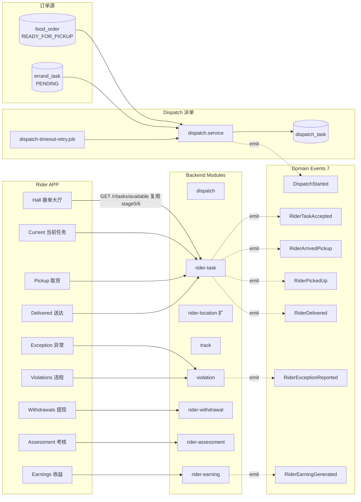
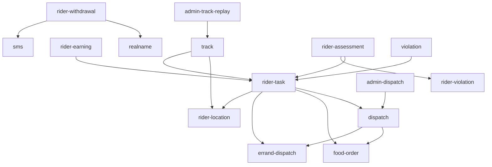

# 阶段 8 — 骑手端 APP 调度轨迹收益考核 · 设计文档(DESIGN)

> 基于 CONSENSUS\_阶段8.md 锁定项,产出整体架构 / 模块依赖 / 数据表 / 接口契约 / 状态机 / 事件流。

## 1. 整体架构



## 2. 模块依赖



## 3. 数据模型

### 3.1 新增表(7)

| 表                 | 主键                       | 关键字段                                                                                                                                                                                                                                        | 说明                      |
| ------------------ | -------------------------- | ----------------------------------------------------------------------------------------------------------------------------------------------------------------------------------------------------------------------------------------------- | ------------------------- |
| `dispatch_task`    | dispatch_task_id BIGINT    | biz_type(FOOD/ERRAND), biz_order_id, biz_task_id NULL, candidate_rider_ids JSON, status(PENDING/DISPATCHED/TIMEOUT/CANCELLED), retry_count, dispatched_at, timeout_at, created_at                                                               | 派单流水                  |
| `rider_task`       | rider_task_id BIGINT       | dispatch_task_id, rider_id, biz_type, biz_order_id, biz_task_id, status(ASSIGNED/ARRIVED_PICKUP/PICKED_UP/DELIVERING/DELIVERED/EXCEPTION/CANCELLED), accepted_at, arrived_pickup_at, picked_up_at, delivered_at, eta_at, created_at, updated_at | 骑手任务主表              |
| `track_point`      | track_point_id BIGINT      | rider_task_id, rider_id, lng, lat, accuracy, speed, recorded_at                                                                                                                                                                                 | 轨迹点(批量入库,任务粒度) |
| `rider_earning`    | rider_earning_id BIGINT    | rider_id, settle_date(YYYYMMDD), order_count, base_amount, distance_amount, timely_bonus, reward_amount, deduct_amount, total_amount, status(PENDING/READY/PAID), settled_at, created_at                                                        | 骑手日级收益              |
| `rider_withdrawal` | rider_withdrawal_id BIGINT | withdrawal_no, rider_id, amount_cents, account_id, status(PENDING/APPROVED/COMPLETED/REJECTED/FAILED), sms_code_hash, submitted_at, completed_at, fail_reason, created_at                                                                       | 骑手提现单                |
| `rider_assessment` | rider_assessment_id BIGINT | rider_id, period(MONTH YYYYMM), on_time_rate, accept_rate, complaint_rate, avg_rating, rank_in_city, badges_json, created_at                                                                                                                    | 骑手月度考核              |
| `rider_violation`  | rider_violation_id BIGINT  | rider_id, rider_task_id NULL, type(EXCEPTION/LATE/COMPLAINT/FRAUD), description, photos_json, deduct_cents NULL, status(REPORTED/PENDING_PLATFORM/CONFIRMED/DROPPED), reported_at, decided_at, decision, created_at                             | 骑手违规记录              |

### 3.2 扩展表(1)

- `rider_location`(stage 3 已存在)
  - 扩 `device_token VARCHAR(128) NULL`(配合推送)/ `online_at BIGINT NULL`(上次心跳时间)。
  - **不破 stage 3 现有字段**。

### 3.3 sys_config 新增

```json
[
  {
    "configKey": "rider.withdrawal.limit",
    "configValue": "{\"single\":100000,\"daily\":1000000}",
    "description": "骑手提现单笔/单日限额(分)"
  },
  {
    "configKey": "rider.earning.formula",
    "configValue": "{\"baseFood\":500,\"baseErrand\":300,\"perKmCents\":50,\"timelyBonus\":200}",
    "description": "骑手收益公式(分)"
  },
  {
    "configKey": "rider.assessment.thresholds",
    "configValue": "{\"onTimeRate\":0.9,\"acceptRate\":0.8,\"complaintRate\":0.05}",
    "description": "骑手考核阈值"
  },
  { "configKey": "dispatch.timeout_seconds", "configValue": "30", "description": "派单超时秒数(超时进入重试)" }
]
```

### 3.4 sys_permission 新增(5)

```
admin:menu:dispatch / admin:dispatch:view
admin:menu:track-replay / admin:track-replay:view
admin:menu:violations / admin:violations:view
```

(共 6 个 menu+view 配对项 = 5 个新增,因 admin:violations:view 与 admin:menu:violations 配对算 2 项,共 5 个 sys_permission 新行)

## 4. 接口契约

### 4.1 骑手端 r/\* 接口(11)

| 接口                                 | 装饰器                          | 状态机                                                       | 关键 DTO                                          |
| ------------------------------------ | ------------------------------- | ------------------------------------------------------------ | ------------------------------------------------- |
| GET /r/tasks/available               | RiderJwt                        | -                                                            | (复用 stage 5/6)                                  |
| GET /r/tasks/{taskId}                | RiderJwt                        | -                                                            | 当前任务详情                                      |
| POST /r/tasks/{taskId}/accept        | RiderJwt + @Idempotent + @Audit | dispatch_task PENDING → DISPATCHED + 创 rider_task ASSIGNED  | { lng?, lat? }                                    |
| POST /r/tasks/{taskId}/arrive-pickup | RiderJwt + @Idempotent + @Audit | rider_task ASSIGNED → ARRIVED_PICKUP                         | { lng, lat }                                      |
| POST /r/tasks/{taskId}/pickup        | RiderJwt + @Idempotent + @Audit | ARRIVED_PICKUP → PICKED_UP + food_order/errand_task 状态推进 | { pickupCode?, itemCheckResult, photos? }         |
| POST /r/tasks/{taskId}/delivered     | RiderJwt + @Idempotent + @Audit | PICKED_UP/DELIVERING → DELIVERED + 推进订单状态              | { deliveryProof, lng, lat }                       |
| POST /r/tasks/{taskId}/exception     | RiderJwt + @Idempotent + @Audit | rider_task → EXCEPTION + 创 rider_violation                  | { exceptionType, description, photos?, lng, lat } |
| GET /r/earnings                      | RiderJwt                        | -                                                            | { dateRange?, pageNo?, pageSize? } → 总览 + items |
| GET /r/withdrawals                   | RiderJwt                        | -                                                            | { status?, pageNo?, pageSize? }                   |
| POST /r/withdrawals                  | RiderJwt + @Idempotent + @Audit | - → PENDING                                                  | { amount, accountId?, smsCode }                   |
| GET /r/assessment                    | RiderJwt                        | -                                                            | { period? = 'MONTH' }                             |
| GET /r/violations                    | RiderJwt                        | -                                                            | { status?, pageNo?, pageSize? }                   |

(实际 12,扣除 GET /r/tasks/available 复用项,本阶段新建 11)

### 4.2 平台 admin/\* 接口(4)

| 接口                           | 装饰器                                                                     |
| ------------------------------ | -------------------------------------------------------------------------- |
| GET /admin/dispatch-tasks      | AdminJwt + admin:dispatch:view                                             |
| GET /admin/dispatch-tasks/{id} | AdminJwt + admin:dispatch:view                                             |
| GET /admin/track-replay        | AdminJwt + admin:track-replay:view(参数 riderTaskId / rider_id + 时间窗口) |
| GET /admin/violations          | AdminJwt + admin:violations:view                                           |

总计 **15 接口**(11 r 端 + 4 admin)。

## 5. 状态机

### 5.1 dispatch_task 状态机

```
PENDING ─┬─ rider 接受 ──→ DISPATCHED
         ├─ 超时(30s) ──→ TIMEOUT(可重试,retry_count++)
         └─ 订单取消 ──→ CANCELLED
```

### 5.2 rider_task 状态机

```
ASSIGNED ──→ ARRIVED_PICKUP ──→ PICKED_UP ──→ DELIVERING ──→ DELIVERED
   │             │                  │              │
   └─────────────┴──────────────────┴──────────────┴──→ EXCEPTION / CANCELLED
```

### 5.3 food_order 状态机扩展(stage 5 已建,本阶段消费)

- READY_FOR_PICKUP → 派单后 RIDER_ASSIGNED → PICKED_UP → DELIVERING → DELIVERED
- rider-task accept → food_order.status = RIDER_ASSIGNED(stage 5 已预留)
- rider-task pickup → food_order.status = PICKED_UP(stage 5 已预留)
- rider-task delivered → food_order.status = DELIVERED(stage 5 已预留)

### 5.4 errand_task / errand_order 状态机(stage 6 已建,本阶段消费)

- errand_task PENDING → 派单后 ASSIGNED
- accept → errand_order.status = ASSIGNED → PICKED_UP → DELIVERED → COMPLETED

### 5.5 rider_withdrawal 状态机

```
PENDING ──→ APPROVED ──→ COMPLETED  (REJECTED / FAILED 任意分支)
```

### 5.6 rider_violation 状态机

```
REPORTED ──→ PENDING_PLATFORM ──→ CONFIRMED(扣款)/ DROPPED(免责)
```

## 6. 事件流(7)

| EventName              | 触发点                         | Payload                                                                           | 订阅者                                                                                 |
| ---------------------- | ------------------------------ | --------------------------------------------------------------------------------- | -------------------------------------------------------------------------------------- |
| DispatchStarted        | dispatch.service.dispatch()    | { dispatchTaskId, bizType, bizOrderId, candidateCount }                           | dispatch-started.subscriber → push 候选骑手 + audit                                    |
| RiderTaskAccepted      | rider-task.accept              | { riderTaskId, riderId, dispatchTaskId, bizType, acceptedAt }                     | rider-task-accepted.subscriber → audit + 同步 food_order/errand_order 状态 + push 用户 |
| RiderArrivedPickup     | rider-task.arrivePickup        | { riderTaskId, riderId, lng, lat, arrivedAt }                                     | rider-arrived-pickup.subscriber → audit + push merchant 备货                           |
| RiderPickedUp          | rider-task.pickup              | { riderTaskId, riderId, pickedUpAt }                                              | rider-picked-up.subscriber → audit + 推 food_order PICKED_UP + push 用户               |
| RiderDelivered         | rider-task.delivered           | { riderTaskId, riderId, deliveredAt, deliveryProof }                              | rider-delivered.subscriber → audit + 推 food_order DELIVERED + push 用户 + sms 用户    |
| RiderExceptionReported | rider-task.exception           | { riderViolationId, riderTaskId, riderId, exceptionType, platformHandleRequired } | rider-exception-reported.subscriber → audit + push 平台值班                            |
| RiderEarningGenerated  | rider-earning-daily-settle.job | { riderEarningId, riderId, settleDate, totalAmount }                              | rider-earning-generated.subscriber → push 骑手 + audit                                 |

## 7. 定时任务(5 新 + 1 复用)

| Job                                               | Cron       | 锁              | 业务                                                                                                |
| ------------------------------------------------- | ---------- | --------------- | --------------------------------------------------------------------------------------------------- |
| dispatch-timeout-retry                            | 每 10s     | DistributedLock | 扫 dispatch_task PENDING 且 timeout_at < now → 标 TIMEOUT + 重新派单(retry_count++,最多 3 次)       |
| track-compress                                    | 每 5min    | DistributedLock | 扫 track_point 大于 1 小时未压缩的 → Douglas-Peucker 抽稀,保留关键拐点(简化为按时间间隔抽样)        |
| delivery-timeout-mark                             | 每 1min    | DistributedLock | 扫 rider_task DELIVERING 且 eta_at < now - 5min → 标超时违规(rider_violation type=LATE,自动 deduct) |
| rider-earning-daily-settle                        | 每日 02:30 | DistributedLock | 按 rider 维度聚合前一日 DELIVERED rider_task → 创 rider_earning 行 + emit RiderEarningGenerated     |
| rider-violation-deduct                            | 每日 03:00 | DistributedLock | 扫 rider_violation status=CONFIRMED 且 deduct_cents>0 且未扣 → 写入对应 rider_earning.deductAmount  |
| **复用** rider-heartbeat-timeout-offline(stage 3) | 每 1min    | -               | 5min 心跳超时离线(stage 3 既有)                                                                     |

## 8. 异常处理策略

| 异常                                      | 处理                                                          |
| ----------------------------------------- | ------------------------------------------------------------- |
| accept 时 dispatch_task 已被其他骑手领走  | 抛 STATUS_INVALID 422                                         |
| arrive-pickup 时 rider_task 不在 ASSIGNED | 抛 STATUS_INVALID 422                                         |
| pickup 时 itemCheckResult 不通过(跑腿)    | 走 exception 流程,不直接 pickup                               |
| 轨迹上传失败                              | rider-app 本地缓存 + retry(stage 3 既有 batch 上传)           |
| 提现额度超限                              | INVALID_PARAM 400                                             |
| 提现 sms 失败                             | UNAUTHORIZED 401                                              |
| 派单超时无人接                            | dispatch-timeout-retry job 处理                               |
| food_order/errand_task 已被其他状态推进   | rider-task service 在 transaction 内 SELECT...FOR UPDATE 校验 |

## 9. 前端架构

### 9.1 rider-app

```
apps/rider-app/src/
  pages.json                          (15 新页注册)
  api/
    rider-tasks.ts (+spec)
    rider-earnings.ts (+spec)
    rider-withdrawals.ts (+spec)
    rider-assessment.ts (+spec)
    rider-violations.ts (+spec)
    rider-track.ts (+spec)
  stores/
    task.ts(当前/待接任务)
    earning.ts
    withdrawal.ts
    assessment.ts
  utils/
    rider-task-status.ts
    earning-formula.ts
  pages/
    workbench/index.vue                  (增强)
    tasks/hall.vue                       (接单大厅)
    tasks/current.vue                    (当前任务)
    tasks/pickup-food.vue
    tasks/pickup-errand.vue
    tasks/navigate.vue
    tasks/delivering.vue
    tasks/delivered.vue
    tasks/exception.vue
    earnings/index.vue
    withdrawals/form.vue
    withdrawals/records.vue
    assessment/index.vue
    violations/index.vue
  components/
    DispatchModal.vue                    (派单弹窗)
```

### 9.2 customer-app(扩展)

```
apps/customer-app/src/
  pages/
    food/order/track.vue                 (扩骑手实时位置 + 轨迹折线)
    errand/order/track/index.vue         (扩同上)
  api/
    rider-track.ts (+spec)               (查询骑手实时位置 — 通过 stage 5/6 既有 track-query 接口)
```

### 9.3 admin-web(增量)

```
apps/admin-web/src/
  views/
    dispatch/index.vue
    dispatch/components/DispatchTaskDrawer.vue
    track-replay/index.vue
    violations/index.vue
  api/
    admin-dispatch.ts (+spec)
    admin-track-replay.ts (+spec)
    admin-violations.ts (+spec)
  router/index.ts                       (3 新路由)
```

## 10. 配置驱动 / Mock

- **派单算法**:本阶段简化为"按 service-area 内在线骑手按距离排序取第一",P3 登记 stage 11 接智能调度。
- **轨迹**:rider-app 模拟 GPS 上报(uni.getLocation),后端保存。
- **真退款**:wxpay/alipay refund mock(stage 11 接)。
- **真推送**:push.adapter 沿用 stage 0/7 mock。
- **真 sms**:sms.adapter 沿用 stage 0 mock。
- **真实名**:realname.adapter 沿用 stage 0/7 mock。
- **轨迹压缩**:抽样保留(每 30s 1 点),P3 登记 stage 11 接 Douglas-Peucker。

## 11. 边界审查矩阵

- [x] 商家端仅 Android/iOS APP(本阶段不动 merchant-app)。
- [x] 跑腿订单不进入商家流程(本阶段所有 service 都不修改 errand_order)。
- [x] 4 端 Token 隔离(RiderJwt / CustomerJwt / AdminJwt)。
- [x] 外卖/跑腿独立(rider-task service 内部按 bizType 分发,但**不混合**两边状态机)。
- [x] 金额分 / 距离米 / 时间毫秒 / camelCase。
