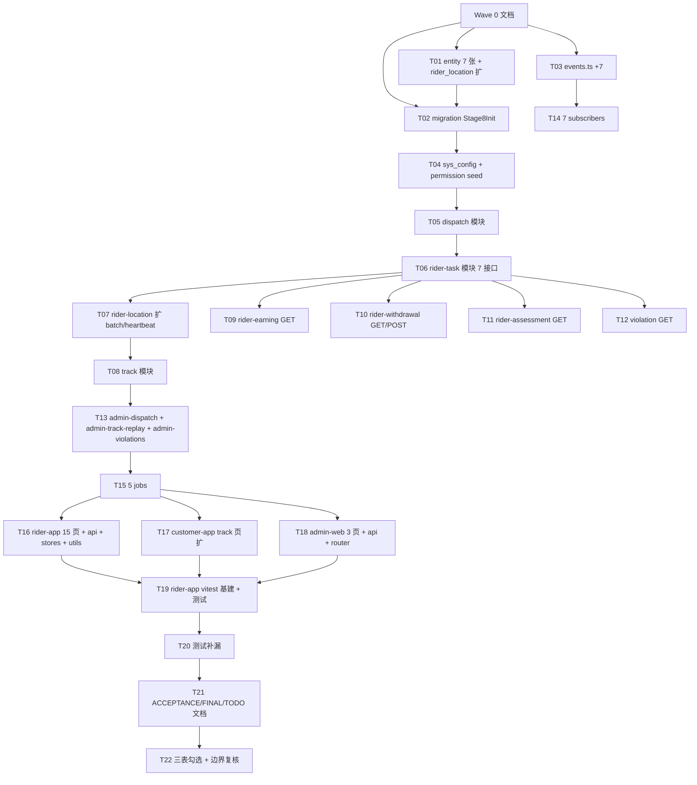

# 阶段 8 — 骑手端 APP 调度轨迹收益考核 · 任务拆解(TASK)

> 基于 DESIGN\_阶段8.md 拆解 32 原子任务,9 波交付。每任务包含输入契约 / 输出契约 / 实现约束 / 依赖。

## 1. 任务依赖图



## 2. 原子任务清单(32)

### Wave 1:数据基础(T01–T04,4 任务)

#### T01 7 张新 entity + rider_location 扩字段

- 输入:DESIGN § 3.1 / § 3.2
- 输出:`apps/server/src/database/entities/{dispatch-task,rider-task,track-point,rider-earning,rider-withdrawal,rider-assessment,rider-violation}.entity.ts` + rider-location.entity 扩 device_token / online_at
- 约束:BIGINT auto-increment / camelCase / @Index 关键索引

#### T02 Stage8Init.ts migration

- 输入:T01 entity
- 输出:`apps/server/src/database/migrations/1716077400000-Stage8Init.ts` 7 CREATE TABLE + 1 ALTER rider_location
- 约束:idempotent migration,down() 反向迁移

#### T03 events.ts +7 EventName + payload + spec

- 输入:DESIGN § 6
- 输出:events.ts +7 EventName + 7 Payload + EventPayloadMap;events.stage1-7.spec 期望值 48 → 55;新建 events.stage8.spec(3 用例)
- 约束:命名规范 domain.<bounded-context>.<verb>

#### T04 sys_config + sys_permission seed

- 输入:DESIGN § 3.3-3.4
- 输出:
  - `database/seeds/sys-config-stage8.seed.ts`(4 配置:withdrawal.limit / earning.formula / assessment.thresholds / dispatch.timeout_seconds)
  - `database/seeds/role-permission.seed.ts` 增 5-6 sys_permission + AUDITOR 绑定
- 约束:沿用 stage 5/6/7 套路

### Wave 2:核心后端(T05–T13,9 任务)

#### T05 dispatch 模块

- 输入:DESIGN § 4 / § 5.1
- 输出:`modules/dispatch/{service,module}.ts` + dispatch.service.spec(≥6 用例)
- 约束:dispatch(bizType, bizOrderId) 创建 dispatch_task,扫描 service-area 在线骑手,emit DispatchStarted

#### T06 rider-task 模块(7 接口主体)

- 输入:DESIGN § 4.1
- 输出:`modules/rider-task/{controller,service,dto,vo,module}.ts` + rider-task.service.spec(≥15 用例)
- 约束:7 接口(GET /r/tasks/{id}, accept, arrive-pickup, pickup, delivered, exception)+ 状态机校验 + bizType 分发

#### T07 rider-location 扩展

- 输入:DESIGN § 3.2
- 输出:`modules/rider-location/rider-location.service.ts` 扩 batch 上传(POST /r/locations/batch 已存)+ 心跳(online_at 字段更新);spec 补 ≥3 用例
- 约束:不破 stage 3 既有用例

#### T08 track 模块

- 输入:DESIGN § 9.2
- 输出:`modules/track/{service,module}.ts` + track.service.spec(≥4 用例)
- 约束:track.service 提供 GET 用户/admin 轨迹查询(track_point + rider_location 联查)

#### T09 rider-earning GET 接口

- 输入:DESIGN § 4.1
- 输出:`modules/rider-earning/{controller,service,dto,vo,module}.ts` + spec(≥4 用例)
- 约束:GET /r/earnings,聚合 rider_earning 表 + items list

#### T10 rider-withdrawal 模块

- 输入:DESIGN § 4.1 / § 5.5
- 输出:`modules/rider-withdrawal/{controller,service,dto,module}.ts` + spec(≥6 用例)
- 约束:GET/POST /r/withdrawals(实名+限额+sms+状态机,套用 stage 7 商家提现)

#### T11 rider-assessment GET 接口

- 输入:DESIGN § 4.1
- 输出:`modules/rider-assessment/{controller,service,dto,module}.ts` + spec(≥3 用例)
- 约束:GET /r/assessment,从 rider_assessment 表查月度 + 实时 KPI 计算(stage 11 优化)

#### T12 violation 模块

- 输入:DESIGN § 4.1 / § 5.6
- 输出:`modules/violation/{service,module}.ts` + spec(≥3 用例)
- 约束:GET /r/violations 骑手只读,内部 reportException 方法供 rider-task service 调用

#### T13 admin 监控模块(3)

- 输入:DESIGN § 4.2
- 输出:
  - `modules/admin-dispatch/{controller,service,module}.ts` + spec(GET dispatch-tasks list/detail)
  - `modules/admin-track-replay/{controller,service,module}.ts` + spec(GET 轨迹回放)
  - `modules/admin-violations/{controller,service,module}.ts` + spec(GET violations list)
- 约束:AdminJwt + 权限点

### Wave 3:事件 + 任务(T14–T15,2 任务)

#### T14 7 subscribers

- 输入:DESIGN § 6
- 输出:7 个 `events/subscribers/<event>.subscriber.ts` + stage8-subscribers.spec.ts(≥14 用例)
- 约束:每个 sub writeAudit + 调相应 adapter,失败不阻塞

#### T15 5 新 jobs

- 输入:DESIGN § 7
- 输出:`scheduler/jobs/{dispatch-timeout-retry,track-compress,delivery-timeout-mark,rider-earning-daily-settle,rider-violation-deduct}.job.ts` + spec(≥10 用例)
- 约束:BaseJob + DistributedLockService

### Wave 4:前端(T16–T18,3 任务)

#### T16 rider-app 15 页 + 6 api + 4 stores + 2 utils + vitest

- 输入:DESIGN § 9.1
- 输出:
  - 6 api 文件 + spec(rider-tasks/rider-earnings/rider-withdrawals/rider-assessment/rider-violations/rider-track)
  - 4 store(task / earning / withdrawal / assessment)
  - 2 utils(rider-task-status / earning-formula)
  - 15 页(参见 CONSENSUS § 1.2)
  - DispatchModal.vue 组件
  - pages.json 注册全部
- 约束:Vue3 setup + uni.request + Pinia + 字典化状态

#### T17 customer-app track 页扩展(2 页)

- 输入:DESIGN § 9.2
- 输出:
  - `pages/food/order/track.vue` 扩骑手位置/轨迹折线/异常提示
  - `pages/errand/order/track/index.vue` 扩同上
  - `api/rider-track.ts`(查询骑手实时位置)+ spec
- 约束:复用 stage 5/6 既有 track-query 接口,不新建后端接口

#### T18 admin-web 3 页 + 3 api + 路由

- 输入:DESIGN § 9.3
- 输出:
  - 3 view + 3 detail-drawer/component(dispatch / track-replay / violations)
  - 3 api 文件 + spec
  - router/index.ts 增 3 路由(admin:menu:dispatch / track-replay / violations)
- 约束:沿用 stage 5/6/7 admin 套路

### Wave 5:测试与验收(T19–T22,4 任务)

#### T19 rider-app vitest 基建 + 测试

- 输入:T16 输出
- 输出:`apps/rider-app/vitest.config.ts`(stage 3 已有,扩展)、6 api spec + 4 store spec + 2 utils spec(共 ≥45 用例)
- 约束:沿用 customer-app/merchant-app 既有 vitest 套路

#### T20 测试补漏

- 输入:T05–T19 用例
- 输出:server jest +91 / customer-app +5 / rider-app +45 / admin-web +10 用例;关键路径 100% 覆盖
- 约束:4 闸门绿(build / test / lint / format:check)

#### T21 ACCEPTANCE/FINAL/TODO 3 文档

- 输入:CONSENSUS § 2 验收标准 + 实际交付
- 输出:`docs/阶段8-骑手端APP调度轨迹收益考核/{ACCEPTANCE,FINAL,TODO}_阶段8.md`
- 约束:沿用 stage 5/6/7 文档结构

#### T22 三表勾选 + 边界复核

- 输入:T21 验收结果
- 输出:
  - `项目阶段规划/08-.../手动审查与测试.md` 自动可填项填齐
  - `项目阶段规划/08-.../问题与风险记录.md` 列 ≥4 P3 项(amap / wxpay / 推送语音 / 智能派单 / 真 GPS)
  - `项目阶段规划/08-.../阶段交付清单.md` 全部勾选
- 约束:边界审查通过(无商家 Web/小程序、不串跑腿)

## 3. 验收门禁

- [ ] 32 原子任务 ✅
- [ ] 4 闸门绿
- [ ] server jest ≥780、rider-app vitest ≥45、admin-web vitest ≥90
- [ ] 7 张新表建库通过
- [ ] 7 events + 7 subscribers + 5 jobs 接入并审计
- [ ] 11 r/_ + 4 admin/_ = 15 接口
- [ ] rider-app 15 + customer-app 2 扩 + admin-web 3 = 20 页面变更
- [ ] 7 文档齐全
- [ ] 边界复核通过

## 4. 提交节奏(8 commit + Wave 0)

```
1) docs(stage-8): ALIGNMENT/CONSENSUS/DESIGN/TASK 4 文档(待人审)
2) feat(stage-8): T01-T04 schema + 7 events + sys_config/permission seed
3) feat(stage-8): T05-T08 dispatch + rider-task + rider-location + track
4) feat(stage-8): T09-T13 earning/withdrawal/assessment/violation + admin 监控
5) feat(stage-8): T14-T15 7 subscribers + 5 jobs
6) feat(stage-8): T16 rider-app 15 页 + api + stores + utils + vitest
7) feat(stage-8): T17 customer-app track 页扩
8) feat(stage-8): T18 admin-web 3 页(dispatch / track-replay / violations)
9) feat(stage-8): T19-T22 测试补漏 + 手动审查 + 阶段验收文档(完整交付 32/32)
```
