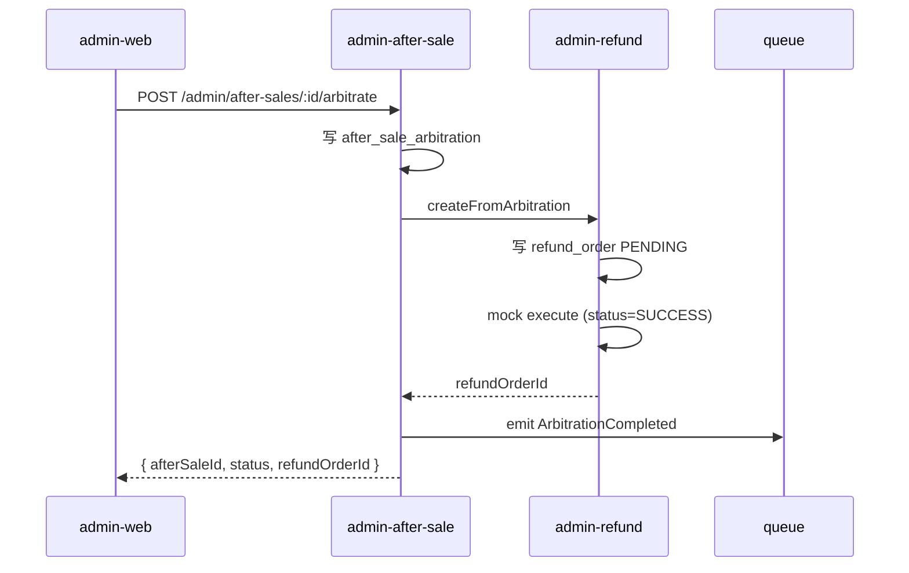

# 阶段 9 — 平台管理端 Web · 调度售后运营财务 · 系统设计(DESIGN)

## 1. 整体架构

```mermaid
graph TB
  subgraph Web[admin-web 平台 Web]
    AW1[marketing/coupons]
    AW2[rate-rules]
    AW3[refunds]
    AW4[exceptions]
    AW5[dashboard]
    AW6[exports]
    AW7[dispatch-rules]
    AW8[food-orders+export 按钮]
    AW9[errand-orders+export]
    AW10[after-sales+arbitrate]
    AW11[dispatch+manual-assign]
  end
  subgraph BE[NestJS 后端]
    M1[admin-refund]
    M2[marketing]
    M3[finance]
    M4[dashboard]
    M5[export]
    M6[risk]
    M7[admin-dispatch 扩]
    M8[admin-after-sale 扩]
    M9[admin-food-order 扩]
    M10[admin-errand-order 扩]
  end
  subgraph DB[MySQL]
    T1[(dispatch_rule)]
    T2[(manual_dispatch_log)]
    T3[(after_sale_arbitration)]
    T4[(refund_order)]
    T5[(coupon_rule)]
    T6[(points_rule)]
    T7[(rate_rule)]
    T8[(dashboard_snapshot)]
    T9[(export_task)]
    T10[(risk_exception_log)]
  end
  subgraph Sched[Scheduler]
    J1[risk-exception-scan/5min]
    J2[dashboard-snapshot-generate/00:30]
    J3[export-task-process/30s]
    J4[coupon-expire/00:00]
    J5[marketing-activity-toggle/1min]
    J6[reconciliation/03:30]
  end
  subgraph Bus[DomainEventBus]
    E1[ManualDispatchCreated]
    E2[OrderReassigned]
    E3[ArbitrationCompleted]
    E4[RefundExecuted]
    E5[CouponPublished]
    E6[RateRuleChanged]
    E7[ReportGenerated]
  end
  AW1 --> M2 --> T5
  AW2 --> M3 --> T7
  AW3 --> M1 --> T4
  AW4 --> M6 --> T10
  AW5 --> M4 --> T8
  AW6 --> M5 --> T9
  AW7 --> M7 --> T1
  AW8 --> M9
  AW9 --> M10
  AW10 --> M8 --> T3
  AW11 --> M7 --> T2
  M7 --> E1
  M7 --> E2
  M8 --> E3
  M1 --> E4
  M2 --> E5
  M3 --> E6
  J2 --> E7
  J1 --> T10
  J2 --> T8
  J3 --> T9
  J4 --> T5
  J5 --> T5
  J6 --> T4
```



## 2. 数据表 schema(关键字段)

### 2.1 dispatch_rule

```
dispatchRuleId BIGINT PK auto
ruleName VARCHAR(100)
cityCode VARCHAR(20) INDEX
bizType ENUM('FOOD','ERRAND')
algorithm VARCHAR(40) -- nearest|round-robin|score
config JSON           -- 半径/权重/最大候选数
enabled TINYINT
createdBy BIGINT
createdAt/updatedAt BIGINT
```

### 2.2 manual_dispatch_log

```
logId BIGINT PK auto
dispatchTaskId BIGINT INDEX
riderId BIGINT
operatorAdminId BIGINT
reason VARCHAR(255)
beforeStatus VARCHAR(20)
afterStatus VARCHAR(20)
createdAt BIGINT
```

### 2.3 after_sale_arbitration

```
arbitrationId BIGINT PK auto
afterSaleId BIGINT INDEX
responsibleParty ENUM('MERCHANT','RIDER','CUSTOMER','PLATFORM')
decision ENUM('APPROVE','REJECT','PARTIAL')
refundAmount BIGINT  -- 分
penalty BIGINT       -- 处罚分
remark VARCHAR(500)
operatorAdminId BIGINT
refundOrderId BIGINT NULL
createdAt BIGINT
```

### 2.4 refund_order

```
refundOrderId BIGINT PK auto
refundNo VARCHAR(40) UNIQUE -- RF+yyyyMMdd+ms
bizType ENUM('FOOD','ERRAND')
bizOrderId BIGINT INDEX
paymentOrderId BIGINT
amount BIGINT
status ENUM('PENDING','SUCCESS','FAILED','CLOSED')
provider VARCHAR(20)  -- wxpay|alipay
providerRefundId VARCHAR(80) NULL
errorMessage VARCHAR(500) NULL
createdAt/updatedAt BIGINT
```

### 2.5 coupon_rule

```
couponRuleId BIGINT PK auto
couponName VARCHAR(100)
couponType ENUM('AMOUNT','DISCOUNT')
bizType ENUM('FOOD','ERRAND','ALL')
threshold BIGINT       -- 满减门槛分;0=无门槛
discount BIGINT        -- 减额(分)/折扣(percent*100)
totalStock INT
remainStock INT
validFrom/validTo BIGINT
status ENUM('DRAFT','ACTIVE','EXPIRED','DISABLED')
createdBy BIGINT
createdAt/updatedAt BIGINT
```

### 2.6 points_rule

```
pointsRuleId BIGINT PK auto
ruleName VARCHAR(100)
bizType ENUM('FOOD','ERRAND')
trigger ENUM('ORDER_PAID','ORDER_COMPLETED')
points INT  -- 每单积分
enabled TINYINT
createdAt/updatedAt BIGINT
```

(占位 — 本阶段仅建表,无业务接口)

### 2.7 rate_rule

```
rateRuleId BIGINT PK auto
cityCode VARCHAR(20) INDEX
categoryId BIGINT NULL  -- 平台类目;null=全局
merchantCommissionRate INT  -- 万分位
riderServiceFee BIGINT       -- 分
withdrawFeeRate INT          -- 万分位
settlementCycle ENUM('T1','WEEKLY','MONTHLY')
effectiveAt BIGINT INDEX
status ENUM('PENDING','EFFECTIVE','EXPIRED')
operatorAdminId BIGINT
createdAt/updatedAt BIGINT
```

### 2.8 dashboard_snapshot

```
snapshotId BIGINT PK auto
snapshotDate VARCHAR(10) INDEX  -- YYYY-MM-DD
cityCode VARCHAR(20) INDEX
gmv BIGINT
orderCount INT
activeUsers INT
onlineRiders INT
exceptionOrders INT
createdAt BIGINT
```

### 2.9 export_task

```
exportTaskId BIGINT PK auto
exportNo VARCHAR(40) UNIQUE   -- EX+yyyyMMdd+ms
exportType VARCHAR(40)        -- food-orders|errand-orders|settlements|...
queryParams JSON
operatorAdminId BIGINT
status ENUM('PENDING','PROCESSING','SUCCESS','FAILED')
fileUrl VARCHAR(500) NULL
errorMessage VARCHAR(500) NULL
rowCount INT NULL
createdAt/updatedAt BIGINT
```

### 2.10 risk_exception_log

```
logId BIGINT PK auto
exceptionType VARCHAR(40)  -- DELIVERY_TIMEOUT|DUPLICATE_REFUND|MULTI_REFUND_SAME_STORE
bizType ENUM('FOOD','ERRAND')
bizOrderId BIGINT
severity ENUM('LOW','MEDIUM','HIGH')
description VARCHAR(500)
status ENUM('OPEN','HANDLED','IGNORED')
handlerAdminId BIGINT NULL
handledAt BIGINT NULL
createdAt BIGINT
```

## 3. 接口契约(10 个)

| #   | Method | Path                                        | 权限                     | Body/Params                                                                                                      | Returns                                                         |
| --- | ------ | ------------------------------------------- | ------------------------ | ---------------------------------------------------------------------------------------------------------------- | --------------------------------------------------------------- |
| 1   | GET    | `/admin/food-orders/export`                 | admin:export:manage      | filter params                                                                                                    | `{ exportTaskId, status: 'PENDING' }`                           |
| 2   | GET    | `/admin/errand-orders/export`               | admin:export:manage      | 同上                                                                                                             | 同上                                                            |
| 3   | POST   | `/admin/dispatch/tasks/:taskId/assign`      | admin:dispatch:manage    | `{riderId, reason}`                                                                                              | `{taskId, dispatchStatus, assignedAt}`                          |
| 4   | POST   | `/admin/after-sales/:afterSaleId/arbitrate` | admin:after:sales:manage | `{responsibleParty, decision, refundAmount, penalty, remark}`                                                    | `{afterSaleId, status, refundOrderId}`                          |
| 5   | POST   | `/admin/marketing/coupons`                  | admin:marketing:manage   | `{couponName, couponType, bizType, threshold, discount, totalStock, validFrom, validTo}`                         | `{couponRuleId, status}`                                        |
| 6   | PATCH  | `/admin/rate-rules`                         | admin:rate:rules:manage  | `{cityCode, categoryId, merchantCommissionRate, riderServiceFee, withdrawFeeRate, settlementCycle, effectiveAt}` | `{ruleId, effectiveAt}`                                         |
| 7   | GET    | `/admin/dashboard/overview`                 | admin:dashboard:view     | `?cityCode&from&to`                                                                                              | `{gmv, orderCount, activeUsers, onlineRiders, exceptionOrders}` |
| 8   | POST   | `/admin/exports`                            | admin:export:manage      | `{exportType, queryParams}`                                                                                      | `{exportTaskId, status}`                                        |
| 9   | GET    | `/admin/exports/:id`                        | admin:export:manage      | -                                                                                                                | `{exportTask + fileUrl}`                                        |
| 10  | GET    | `/admin/risk/exceptions`                    | admin:risk:view          | `?status&exceptionType&pageNo&pageSize`                                                                          | `{ items, total, pageNo, pageSize }`                            |

> 全部 6 个写接口 + @Idempotent + @Audit
> Token:Admin-Token

## 4. 模块拆分

### admin-refund(新)

- service:createFromArbitration / executeMockRefund / queryByOrderId
- 不暴露独立 controller(由 admin-after-sale arbitrate 内部调用 + admin-refund 模块自身 GET)

### marketing(新)

- controller:`/admin/marketing/coupons` POST / GET 列表
- service:CRUD coupon_rule + 库存管理 + emit CouponPublished

### finance(新)

- controller:`/admin/rate-rules` PATCH / GET 列表
- service:写新 rate_rule + 旧规则 EXPIRED + emit RateRuleChanged

### dashboard(新)

- controller:`/admin/dashboard/overview` GET
- service:实时聚合 stage 5/6 food_order + errand_order + 用户/骑手在线数

### export(新)

- controller:`/admin/exports` POST/GET
- service:enqueue → export_task PENDING → job 轮询 → minio 上传 → SUCCESS

### risk(新)

- controller:`/admin/risk/exceptions` GET
- service:列表 + 处理标记
- job 写入 → controller 读出

### admin-dispatch(扩)

- 新增 method:assign(taskId, riderId, reason)
  - 校验 dispatch_task 状态 PENDING/TIMEOUT
  - 写 manual_dispatch_log
  - 更新 dispatch_task.acceptedRiderId
  - emit ManualDispatchCreated

### admin-after-sale(扩)

- 新增 method:arbitrate(afterSaleId, body)
  - 写 after_sale_arbitration
  - decision=APPROVE/PARTIAL → 调 admin-refund.createFromArbitration
  - emit ArbitrationCompleted

### admin-food-order / admin-errand-order(扩)

- 新增 GET `/export` 子路由 → 调 export.enqueue → 返 exportTaskId

## 5. 状态机扩展

### dispatch_task(stage 8 既有)

- 新增允许迁移:`PENDING|TIMEOUT → DISPATCHED`(by admin manual)
- after:操作员 ID 写 manual_dispatch_log

### after_sale(stage 7 既有)

- 新增允许迁移:`PENDING_PLATFORM → ARBITRATED`(由 arbitrate 触发)
- after:写 after_sale_arbitration

### refund_order(新)

- `PENDING → SUCCESS / FAILED`
- mock 直接 SUCCESS;真实 wxpay stage 11

## 6. 异常处理

- arbitrate 时 refund 创建失败 → 整体回滚(transaction)
- export job 处理失败 → 重试 3 次,FAILED 写 error
- coupon 库存 0 → 库存校验 + 行级锁 + UPDATE WHERE remainStock>0
- rate_rule 旧规则未 EXPIRED 完成前不允许新规则 effective(避免叠加)

## 7. 数据流向图



## 8. 与既有阶段集成

- 复用 stage 4 admin-auth + RequirePermission decorator
- 复用 stage 5/6 food_order/errand_order/payment_order 表
- 复用 stage 7 settlement/withdrawal/order_review/after_sale 表
- 复用 stage 8 dispatch_task/rider_task/rider_violation 表 + DistributedLockService
