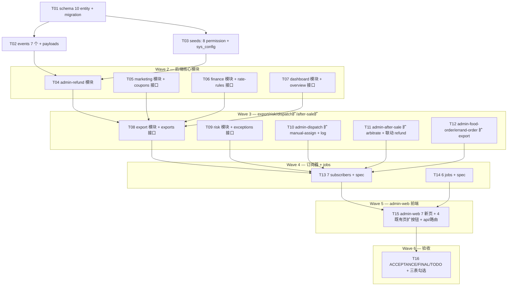

# 阶段 9 — 平台管理端 Web · 调度售后运营财务 · 原子任务(TASK)

> 严格按 ALIGNMENT/CONSENSUS/DESIGN 拆分,不多不少。每波完成后审查无遗漏。

## 任务依赖图

## 原子任务列表(共 16 个)

### Wave 1 — Schema/Events/Seeds(T01-T03)

#### T01 — schema 10 entity + Stage9Init migration

- **输入**:DESIGN § 2 字段清单
- **输出**:
  - `apps/server/src/database/entities/dispatch-rule.entity.ts`
  - `apps/server/src/database/entities/manual-dispatch-log.entity.ts`
  - `apps/server/src/database/entities/after-sale-arbitration.entity.ts`
  - `apps/server/src/database/entities/refund-order.entity.ts`
  - `apps/server/src/database/entities/coupon-rule.entity.ts`
  - `apps/server/src/database/entities/points-rule.entity.ts`
  - `apps/server/src/database/entities/rate-rule.entity.ts`
  - `apps/server/src/database/entities/dashboard-snapshot.entity.ts`
  - `apps/server/src/database/entities/export-task.entity.ts`
  - `apps/server/src/database/entities/risk-exception-log.entity.ts`
  - `apps/server/src/database/entities/index.ts` 导出
  - `apps/server/src/database/migrations/1716683100000-Stage9Init.ts` (10 张 CREATE TABLE)
- **验收**:`pnpm --filter @o2o/server typecheck` 通过

#### T02 — events 7 个 + payloads + EventPayloadMap

- **输入**:CONSENSUS § 1.4
- **输出**:
  - `apps/server/src/events/events.ts` 增 7 EventName + 7 Payload type + map 项
  - `apps/server/src/events/events.stage9.spec.ts` ≥ 3 用例
- **验收**:jest 增 ≥3 用例

#### T03 — seeds(8 permission + role-permission + sys_config)

- **输出**:
  - `apps/server/src/database/seeds/role-permission.seed.ts` 增 8 权限 + 绑定 SUPER_ADMIN/AUDITOR
  - `apps/server/src/database/seeds/sys-config-stage9.seed.ts`(若 dispatch.algorithm.default / coupon.expire.batch_size 等需要)
  - `apps/server/src/database/run-seed.ts` 注册
- **验收**:`pnpm seed:run` 增量正常

### Wave 2 — 后端核心 4 模块(T04-T07)

#### T04 — admin-refund 模块

- **输出**:
  - module/service/(无独立 controller)
  - service.createFromArbitration(afterSaleId, refundAmount) → refund_order PENDING → mock execute SUCCESS → emit RefundExecuted
  - service.spec ≥ 3 用例
- **验收**:jest +3

#### T05 — marketing 模块 + coupons

- **输出**:
  - controller `/admin/marketing/coupons` POST(@Idempotent + @Audit + @RequirePermission)+ GET 列表
  - service.publishCoupon → 写 coupon_rule + emit CouponPublished
  - service.list(分页/筛选)
  - dto/vo/spec ≥ 4 用例
- **验收**:jest +4

#### T06 — finance 模块 + rate-rules

- **输出**:
  - controller `/admin/rate-rules` PATCH + GET 列表
  - service:旧规则按 city+category 标 EXPIRED → 写新 EFFECTIVE → emit RateRuleChanged
  - dto/vo/spec ≥ 4 用例
- **验收**:jest +4

#### T07 — dashboard 模块 + overview

- **输出**:
  - controller `/admin/dashboard/overview` GET
  - service:从 food_order/errand_order/rider_status/risk_exception_log 实时聚合
  - 优先读 dashboard_snapshot(若当日已生成);否则实时聚合
  - spec ≥ 3 用例
- **验收**:jest +3

### Wave 3 — export/risk/dispatch 扩/after-sale 扩(T08-T12)

#### T08 — export 模块 + 2 接口

- **输出**:
  - controller `/admin/exports` POST + `/admin/exports/:id` GET
  - service.enqueue(exportType, queryParams) → 写 export_task PENDING
  - service.detail(exportTaskId)
  - 文件实际处理在 T14 export-task-process job
  - spec ≥ 3 用例
- **验收**:jest +3

#### T09 — risk 模块 + exceptions 接口

- **输出**:
  - controller `/admin/risk/exceptions` GET 列表(可选 PATCH /:id 标记 HANDLED — 简化只做 GET)
  - service.list(分页/筛选)
  - spec ≥ 2 用例
- **验收**:jest +2

#### T10 — admin-dispatch 扩 manual-assign

- **输出**:
  - 在 stage 8 既有 admin-dispatch.controller.ts 增 POST `/admin/dispatch/tasks/:taskId/assign`
  - service.manualAssign(taskId, riderId, reason, operatorId)
    - 校验 dispatch_task PENDING/TIMEOUT
    - 写 manual_dispatch_log + 更新 dispatch_task.acceptedRiderId
    - emit ManualDispatchCreated + OrderReassigned
  - spec ≥ 3 用例
- **验收**:jest +3

#### T11 — admin-after-sale 扩 arbitrate

- **输出**:
  - 在 stage 7 既有 admin-after-sale.controller.ts 增 POST `/admin/after-sales/:afterSaleId/arbitrate`
  - service.arbitrate(afterSaleId, body, operatorId)
    - 写 after_sale_arbitration
    - decision=APPROVE/PARTIAL → 注入 RefundService.createFromArbitration
    - emit ArbitrationCompleted
  - 失败 transaction 回滚
  - spec ≥ 3 用例
- **验收**:jest +3

#### T12 — admin-food-order/errand-order 扩 export

- **输出**:
  - GET `/admin/food-orders/export` controller method → 调 ExportService.enqueue('food-orders', queryParams)
  - 同 errand-orders
  - spec ≥ 2 用例(每边 1)
- **验收**:jest +2

### Wave 4 — Subscribers + Jobs(T13-T14)

#### T13 — 7 subscribers

- **输出**:
  - `events/subscribers/manual-dispatch-created.subscriber.ts`
  - `events/subscribers/order-reassigned.subscriber.ts`
  - `events/subscribers/arbitration-completed.subscriber.ts`
  - `events/subscribers/refund-executed.subscriber.ts`
  - `events/subscribers/coupon-published.subscriber.ts`
  - `events/subscribers/rate-rule-changed.subscriber.ts`
  - `events/subscribers/report-generated.subscriber.ts`
  - 注册到 EventsModule.providers
  - 1 spec 文件覆盖所有 ≥ 7 用例
- **验收**:jest +7

#### T14 — 6 jobs + spec

- **输出**:
  - `scheduler/jobs/risk-exception-scan.job.ts`(@Cron 每 5min,扫 stage 5/6 异常订单)
  - `scheduler/jobs/dashboard-snapshot-generate.job.ts`(每日 00:30,写 dashboard_snapshot)
  - `scheduler/jobs/export-task-process.job.ts`(每 30s,处理 PENDING export_task → mock minio 上传)
  - `scheduler/jobs/coupon-expire.job.ts`(每日 00:00,validTo 过期 → status=EXPIRED)
  - `scheduler/jobs/marketing-activity-toggle.job.ts`(每 1min,validFrom 到 → ACTIVE / validTo 到 → EXPIRED)
  - `scheduler/jobs/reconciliation.job.ts`(每日 03:30,对账 mock)
  - 全部 BaseJob + DistributedLock
  - 注册到 SchedulerModule.providers + TypeOrmFeature
  - spec ≥ 6 用例
- **验收**:jest +6

### Wave 5 — admin-web(T15)

#### T15 — admin-web 7 新页 + 4 扩按钮 + api/router

- **输出**:
  - api 文件 7:`api/admin-marketing.ts` `api/admin-rate-rules.ts` `api/admin-refunds.ts` `api/admin-risk.ts` `api/admin-dashboard.ts` `api/admin-exports.ts` `api/admin-dispatch-rules.ts`
  - 视图 7:`views/marketing/coupons/index.vue` `views/rate-rules/index.vue` `views/refunds/index.vue` `views/exceptions/index.vue` `views/dashboard/index.vue` `views/exports/index.vue` `views/dispatch-rules/index.vue`
  - 既有页扩按钮:
    - `views/food-orders/index.vue` 加「导出」按钮
    - `views/errand-orders/index.vue` 加「导出」按钮
    - `views/after-sales/index.vue` 加「仲裁」按钮 + ArbitrateDialog 组件
    - `views/dispatch/index.vue` 加「人工派单」按钮 + ManualAssignDialog 组件
  - router/index.ts +7 路由
  - vitest ≥ 10 用例(每新页 ≥ 1)
- **验收**:vitest +10

### Wave 6 — 验收(T16)

#### T16 — ACCEPTANCE/FINAL/TODO + 三表

- **输出**:
  - `docs/阶段9-平台管理端Web调度售后运营财务/ACCEPTANCE_阶段9.md`
  - `docs/阶段9-平台管理端Web调度售后运营财务/FINAL_阶段9.md`
  - `docs/阶段9-平台管理端Web调度售后运营财务/TODO_阶段9.md`
  - `项目阶段规划/09-阶段9-.../手动审查与测试.md` 自动可填项填(接口 Checklist 自动通过 + 边界 + 5.1 适用范围)
  - `项目阶段规划/09-阶段9-.../问题与风险记录.md` P2/P3 登记
  - `项目阶段规划/09-阶段9-.../阶段交付清单.md` 全勾选
  - 跑完整 4 闸门 + 8 阶段冒烟一次
- **验收**:jest 累计 ≥ 787 / admin-web vitest ≥ 97 / 4 闸全绿

## 质量门控(每波)

- 每波结束前:typecheck / lint / test / build 全过 + git commit + 自审 wave 内任务无遗漏
- 全阶段结束:对照 9 份规划文档 100% 落地;无越界(商家 Web/小程序;外卖跑腿混用)
- 跨阶段:既有 stage 5/6/7/8 admin 接口/页面只扩,不重做

## 任务总数:16(分 6 波,与 stage 8 的 32 个相比规模约一半,因前端只做 1 端 admin-web)

## 自审检查清单(每波尾)

- [ ] 接口数 = 7 契约 + 3 推断 = 10 条无遗漏
- [ ] 模块数 = 6 新 + 4 扩 = 10 个
- [ ] 表数 = 10 个
- [ ] events = 7 个 / subscribers = 7 个
- [ ] jobs = 6 个新增
- [ ] 平台 Web 新页 = 7 + 既有页扩 = 4
- [ ] 商家端零修改;用户端零修改;骑手端零修改
- [ ] 外卖跑腿订单互不混用(refund_order 内 bizType 分发,dashboard 也分别聚合)
