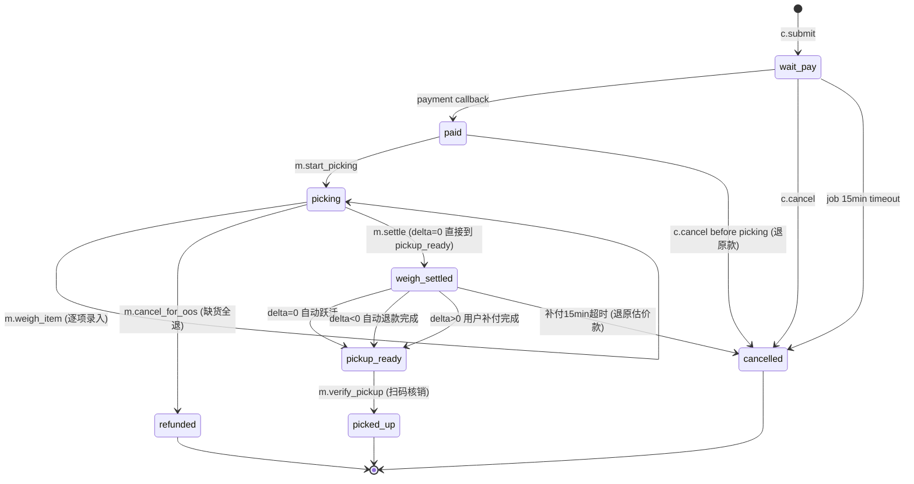
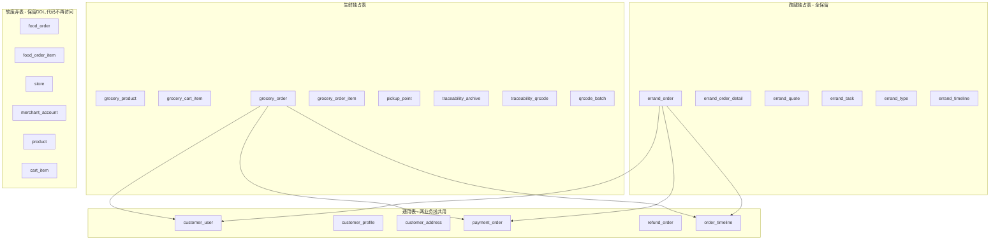

# 阶段 GR-0 · DESIGN（架构设计）

## 1. 整体架构

```mermaid
graph LR
  subgraph customerApp[用户端 customer-app]
    cHome[商城首页]
    cDetail[商品详情]
    cCart[购物车]
    cPicker[选自提点]
    cConfirm[确认订单]
    cOrders[订单列表]
    cDeltaPay[差额补付]
    cScan[扫码识别]
    cTrace[档案详情]
  end

  subgraph merchantApp[商家端 merchant-app 运营员后台]
    mLogin[用户名密码登录]
    mProd[商品管理]
    mPick[拣货池]
    mWeigh[称重录入]
    mSettle[结算差额]
    mVerify[核销自提]
    mArchive[档案管理]
    mScanBind[扫码绑档案]
  end

  subgraph adminWeb[平台 Web admin-web]
    aPP[自提点管理]
    aProd[全局商品]
    aOrders[订单监控]
    aTraceArc[档案管理]
    aTraceQR[二维码批量]
    aTraceScan[扫码枪录入]
    aOperator[运营员管理]
  end

  subgraph server[NestJS 后端]
    direction TB
    pickupPoint[pickup-point]
    groceryProduct[grocery-product]
    groceryCart[grocery-cart]
    groceryOrder[grocery-order]
    traceArchive[traceability-archive]
    traceQrcode[traceability-qrcode]
    payment[payment 复用]
    adminRefund[admin-refund 复用]
  end

  subgraph db[(MySQL)]
    tPP[(pickup_point)]
    tGP[(grocery_product)]
    tGC[(grocery_category)]
    tGCI[(grocery_cart_item)]
    tGO[(grocery_order)]
    tGOI[(grocery_order_item)]
    tTA[(traceability_archive)]
    tTQ[(traceability_qrcode)]
    tQB[(qrcode_batch)]
    tPO[(payment_order)]
    tRO[(refund_order)]
    tOT[(order_timeline)]
  end

  cHome -->|GET pub/grocery/products| groceryProduct
  cDetail -->|GET pub/grocery/products/:id| groceryProduct
  cCart --> groceryCart
  cPicker -->|GET pub/pickup-points| pickupPoint
  cConfirm -->|POST c/grocery/orders| groceryOrder
  cOrders -->|GET c/grocery/orders| groceryOrder
  cDeltaPay -->|payment.prepay 差额| payment
  cScan -->|GET pub/trace/:code| traceQrcode
  cTrace -->|GET pub/trace/:code/archive| traceArchive

  mLogin -->|POST m/auth/login| server
  mProd --> groceryProduct
  mPick -->|GET m/grocery/orders| groceryOrder
  mWeigh -->|POST .../weigh| groceryOrder
  mSettle -->|POST .../settle| groceryOrder
  mVerify -->|POST .../verify-pickup| groceryOrder
  mArchive --> traceArchive
  mScanBind --> traceQrcode

  aPP --> pickupPoint
  aProd --> groceryProduct
  aOrders --> groceryOrder
  aTraceArc --> traceArchive
  aTraceQR --> traceQrcode
  aTraceScan --> traceQrcode
  aOperator -->|admin_user CRUD| server

  pickupPoint --> tPP
  groceryProduct --> tGP
  groceryProduct --> tGC
  groceryCart --> tGCI
  groceryOrder --> tGO
  groceryOrder --> tGOI
  groceryOrder --> tOT
  groceryOrder --> payment
  payment --> tPO
  adminRefund --> tRO
  traceArchive --> tTA
  traceQrcode --> tTQ
  traceQrcode --> tQB
```

## 2. 生鲜订单状态机（最关键）



### 2.1 关键不变式

- `paid` 状态下 `estimate_payment_order_id` 必非空
- `weigh_settled` 状态下 `final_amount_cents` 必非空，且所有 `grocery_order_item.final_weight_grams` 非空
- `pickup_ready` 状态下 `pickup_code` 必非空（6 位数字）
- `picked_up` 状态下 `picked_up_at` 必非空
- 差额 = `final_amount_cents - estimated_amount_cents`，写入 `weight_delta_cents`
- `|weight_delta_cents| ≤ estimated_amount_cents × sys_config.grocery.delta_max_ratio`（默认 0.30）

## 3. 模块分层

### 3.1 pickup-point

```
apps/server/src/modules/pickup-point/
├── pickup-point.module.ts
├── pickup-point.service.ts         # CRUD + Haversine 距离排序
├── pickup-point.controller.ts      # GET pub/pickup-points + pub/pickup-points/:id
├── admin-pickup-point.service.ts   # admin 写
├── admin-pickup-point.controller.ts # admin/pickup-points 完整 CRUD
├── pickup-point.dto.ts
└── pickup-point.service.spec.ts    # 5 用例
```

### 3.2 grocery-product

```
apps/server/src/modules/grocery-product/
├── grocery-product.module.ts
├── grocery-product.service.ts          # CRUD + 上下架 + 调整库存
├── grocery-product.controller.ts       # GET pub/grocery/products(:id) + GET pub/grocery/categories
├── m-grocery-product.controller.ts     # m/grocery/products 完整 CRUD
├── admin-grocery-product.controller.ts # admin/grocery/products 全局视角
├── grocery-product.dto.ts
└── grocery-product.service.spec.ts     # 10 用例
```

### 3.3 grocery-cart

```
apps/server/src/modules/grocery-cart/
├── grocery-cart.module.ts
├── grocery-cart.service.ts             # add/update/remove/clear
├── grocery-cart.controller.ts          # c/grocery/cart/* (4 接口)
├── grocery-cart.dto.ts
└── grocery-cart.service.spec.ts        # 6 用例
```

### 3.4 grocery-order

```
apps/server/src/modules/grocery-order/
├── grocery-order.module.ts
├── grocery-order.service.ts            # submit / cancel / list / detail（customer 侧）
├── grocery-order.controller.ts         # c/grocery/orders/*
├── picking.service.ts                  # start_picking / weigh_item / settle / verify_pickup（运营员侧）
├── m-grocery-order.controller.ts       # m/grocery/orders/* (拣货池 + 拣货流程)
├── admin-grocery-order.service.ts      # 订单监控 + 详情
├── admin-grocery-order.controller.ts   # admin/grocery/orders/*
├── grocery-order.dto.ts
├── grocery-order.service.spec.ts       # 15 用例
└── picking.service.spec.ts             # 20 用例（最复杂）
```

### 3.5 traceability-archive

```
apps/server/src/modules/traceability-archive/
├── traceability-archive.module.ts
├── traceability-archive.service.ts     # CRUD
├── traceability-archive.controller.ts  # 公开 GET（被 qrcode 模块调用）
├── m-traceability-archive.controller.ts # m/traceability/archives/*
├── admin-traceability-archive.controller.ts # admin/traceability/archives/*
├── traceability-archive.dto.ts
└── traceability-archive.service.spec.ts # 6 用例
```

### 3.6 traceability-qrcode

```
apps/server/src/modules/traceability-qrcode/
├── traceability-qrcode.module.ts
├── traceability-qrcode.service.ts      # batchGenerate / batchExport / bindToArchive / publicLookup / markSold
├── traceability-qrcode.controller.ts   # pub/trace/:code
├── m-traceability-qrcode.controller.ts # m/traceability/qrcodes/:code/bind
├── admin-traceability-qrcode.controller.ts # admin/traceability/qrcodes/*
├── qrcode-encoder.util.ts              # code 编码 + checksum
├── qrcode-png.util.ts                  # 用 qrcode npm 包生成 PNG
├── qrcode-zip.util.ts                  # 用 archiver npm 包打 ZIP
├── traceability-qrcode.dto.ts
├── traceability-qrcode.service.spec.ts # 12 用例
└── qrcode-encoder.util.spec.ts         # 5 用例（编码 + checksum 防伪）
```

## 4. 关键算法

### 4.1 自提点按距离排序（Haversine）

复用现有 `apps/server/src/common/utils/distance.util.ts`（stage-6 errand 已有）。
公式：

```
R = 6371000m
φ1 = lat1·π/180, φ2 = lat2·π/180
Δφ = (lat2-lat1)·π/180, Δλ = (lng2-lng1)·π/180
a = sin²(Δφ/2) + cos(φ1)·cos(φ2)·sin²(Δλ/2)
c = 2·atan2(√a, √(1-a))
distance = R·c (米)
```

### 4.2 差额结算（GR-4 核心）

```typescript
function settle(orderId: bigint): SettleResult {
  const order = repo.findOne(orderId);
  assert(order.status === 'picking');
  const items = itemRepo.find({ orderId });

  // 1. 所有 item 必须已称重
  for (const item of items) {
    assert(item.final_weight_grams != null, 'WEIGH_INCOMPLETE');
  }

  // 2. 计算 final_line_cents（每 item）
  let finalTotal = 0n;
  for (const item of items) {
    item.final_line_cents = (BigInt(item.unit_price_cents_per_jin) * BigInt(item.final_weight_grams)) / 500n; // 500g = 1 斤
    finalTotal += item.final_line_cents;
  }

  // 3. 差额
  const delta = finalTotal - BigInt(order.estimated_amount_cents);
  const maxAbs = (BigInt(order.estimated_amount_cents) * BigInt(deltaMaxRatio * 1000)) / 1000n;
  if (delta > maxAbs || delta < -maxAbs) {
    throw new BusinessException('WEIGHT_DELTA_EXCEEDED');
    // 该订单后续由 picking_service.cancel_for_excess_delta() 处理
  }

  // 4. 更新订单 + 发事件
  order.final_amount_cents = finalTotal.toString();
  order.weight_delta_cents = delta.toString();
  order.status = 'weigh_settled';
  await repo.save(order);

  // 5. 根据 delta 分发
  if (delta === 0n) {
    // 直接进 pickup_ready
    await markReady(orderId);
  } else if (delta < 0n) {
    // 自动退款
    await refundService.refund({
      relatedOrderId: orderId,
      refundCents: -delta,
      purpose: 'grocery_delta',
    });
    await markReady(orderId);
  } else {
    // 生成补付 payment_order，推送给用户
    const payOrder = await paymentService.createPrepay({
      relatedOrderId: orderId,
      amountCents: delta,
      purpose: 'grocery_delta',
    });
    order.delta_payment_order_id = payOrder.payOrderId;
    await repo.save(order);
    eventBus.emit('grocery_order.weigh_settled', { orderId, delta });
  }

  return { finalAmountCents: finalTotal, deltaCents: delta };
}
```

### 4.3 二维码 code 编码 + checksum

```typescript
const BASE36 = '0123456789ABCDEFGHIJKLMNOPQRSTUVWXYZ';

function encodeCode(batchSeq: number, itemSeq: number): string {
  assert(batchSeq >= 0 && batchSeq < 46656, 'batchSeq overflow');
  assert(itemSeq >= 0 && itemSeq < 46656, 'itemSeq overflow');
  const batchStr = batchSeq.toString(36).toUpperCase().padStart(4, '0');
  const itemStr = itemSeq.toString(36).toUpperCase().padStart(6, '0');
  const prefix = `O2OG-${batchStr}-${itemStr}`;
  const checksum = sha256(prefix).toUpperCase().slice(0, 2);
  return `${prefix}-${checksum}`;
}

function verifyCode(code: string): boolean {
  if (!/^O2OG-[0-9A-Z]{4}-[0-9A-Z]{6}-[0-9A-Z]{2}$/.test(code)) return false;
  const [, batch, item, sum] = code.match(/^O2OG-([0-9A-Z]{4})-([0-9A-Z]{6})-([0-9A-Z]{2})$/)!;
  const expected = sha256(`O2OG-${batch}-${item}`).toUpperCase().slice(0, 2);
  return sum === expected;
}
```

### 4.4 自提码生成（6 位数字）

```typescript
function generatePickupCode(): string {
  return String(Math.floor(100000 + Math.random() * 900000));
}
// 落 grocery_order.pickup_code，verify_pickup 时全等校验
```

## 5. 跨业务线数据隔离



## 6. 鉴权与 Token 矩阵

| 端                 | Token Header   | 鉴权方式                                         | 阶段 |
| ------------------ | -------------- | ------------------------------------------------ | ---- |
| customer           | Customer-Token | 手机号 + 短信验证码（mock 恒 123456，不变）      | 不变 |
| merchant（运营员） | Merchant-Token | **改为：admin_user.username + password**（GR-1） | GR-1 |
| rider              | Rider-Token    | 手机号 + 短信验证码（不变）                      | 不变 |
| admin              | Admin-Token    | admin_user.username + password（不变）           | 不变 |

Merchant-Token 与 Admin-Token 共用同一份 `admin_user` 表，但 Token 体内 `scope` 字段不同：

- Admin-Token：`scope=admin`，要求 role 包含 SUPER_ADMIN/FINANCE/AUDITOR 任一
- Merchant-Token：`scope=merchant`，要求 role 包含 OPERATOR

跨端调用统一返回 `FORBIDDEN`（沿用现有 ScopeJwtGuard 机制）。

## 7. 缓存策略

- 自提点列表（`GET pub/pickup-points`）：Redis 缓存 5min，按 lng/lat round 到 2 位小数做 key
- 商品列表（`GET pub/grocery/products`）：Redis 缓存 30s
- 商品详情（`GET pub/grocery/products/:id`）：Redis 缓存 5min，写操作 evict
- 公开档案查询（`GET pub/trace/:code`）：Redis 缓存 1h（档案绑定后基本不变）

## 8. 与 customer-app 现有 tabBar 的兼容方案（GR-2 实施）

修改 `apps/customer-app/src/pages.json`：

```jsonc
"tabBar": {
  "list": [
    { "pagePath": "pages/grocery/home/index", "text": "商城" },   // 原 food/home/index
    { "pagePath": "pages/grocery/order/list", "text": "订单" },   // 含 segmented tab [生鲜][跑腿]
    { "pagePath": "pages/me/index", "text": "我的" }
  ]
}
```

订单列表页 segmented tab 路由切换：默认显示生鲜订单（GR-3 实装），点跑腿 tab 跳转 `pages/errand/order/list`（已有，不动）。
