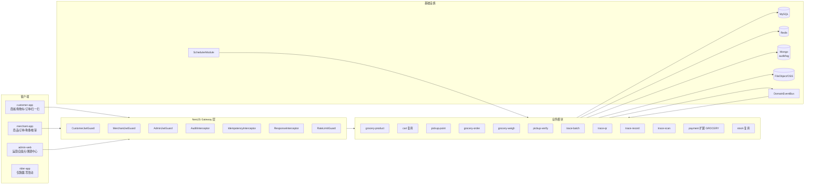
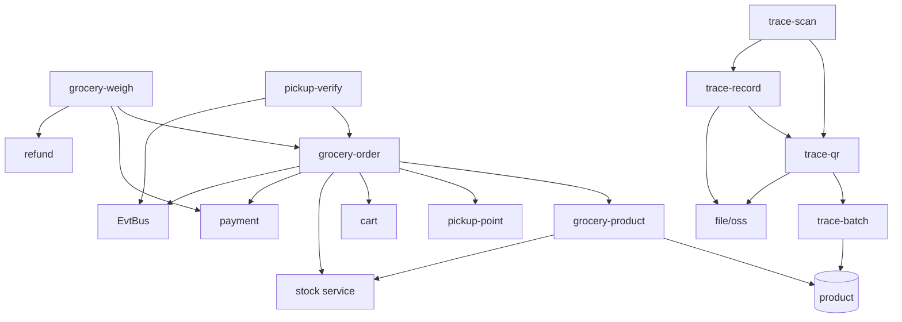
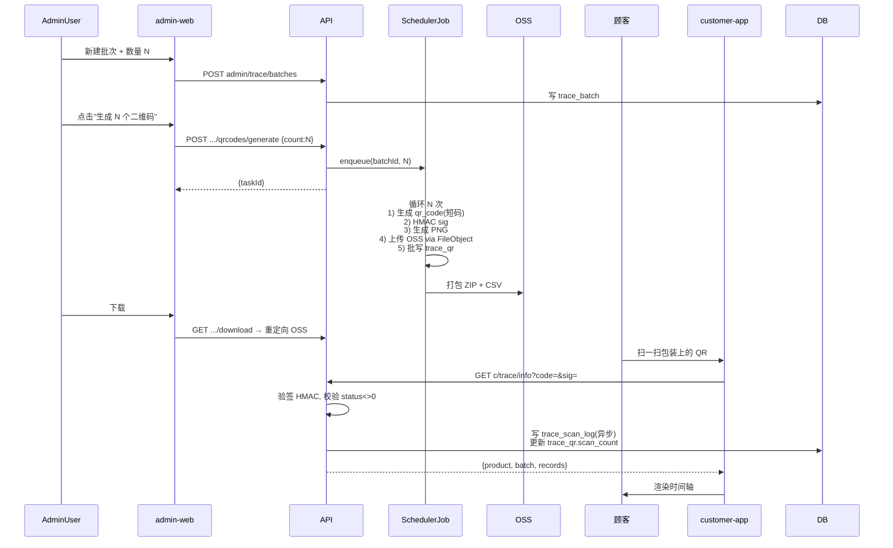

# DESIGN — 生鲜商城与溯源改造

> 阶段：6A · Architect
> 创建：2026-05-13
> 上游：ALIGNMENT、CONSENSUS

---

## 一、整体架构



---

## 二、模块依赖



---

## 三、分层设计

| 层               | 内容                                                          |
| ---------------- | ------------------------------------------------------------- |
| Controller       | 4 套（c/m/admin），仅做 DTO 校验 & 透传，绑定 Guard/Decorator |
| Service          | 业务逻辑；事务边界；调用其他 service 不跨模块 ORM             |
| Repository       | 用 TypeORM Repository / DataSource Tx                         |
| Event Subscriber | 在 events 模块按 stage 注册                                   |
| Job              | 在 SchedulerModule 注册（不依赖 EventsModule）                |

---

## 四、数据库 DDL（最终版）

> 全部金额 `bigint` 分；时间 `bigint` 毫秒；主键 `bigint`。命名与现有保持一致。

### 4.1 product 表新增字段（向后兼容）

```sql
ALTER TABLE `product`
  ADD COLUMN `product_type` ENUM('food','grocery') NOT NULL DEFAULT 'food' AFTER `category_id`,
  ADD COLUMN `pricing_mode` ENUM('fixed','weighed') NOT NULL DEFAULT 'fixed' AFTER `product_type`,
  ADD COLUMN `weight_unit` VARCHAR(8) NULL COMMENT 'jin/kg/g (仅 weighed)' AFTER `pricing_mode`,
  ADD COLUMN `min_weight_g` INT NULL COMMENT '最小起售克数' AFTER `weight_unit`,
  ADD COLUMN `max_weight_g` INT NULL COMMENT '单次上限克数' AFTER `min_weight_g`,
  ADD COLUMN `unit_price_per_jin` BIGINT NULL COMMENT '单价(分/斤),称重商品用,优先于 price' AFTER `max_weight_g`,
  ADD INDEX `idx_product_type_status` (`product_type`,`sale_status`);
```

> `price` 字段保留：定价模式商品的"一份价"；称重商品 `price` 可空，用 `unit_price_per_jin` 算单价。

### 4.2 cart_item 表新增字段

```sql
ALTER TABLE `cart_item`
  ADD COLUMN `pricing_mode_snapshot` ENUM('fixed','weighed') NOT NULL DEFAULT 'fixed' AFTER `quantity`,
  ADD COLUMN `estimated_weight_g` INT NULL COMMENT '预估克数,仅 weighed' AFTER `pricing_mode_snapshot`;
```

### 4.3 自提点

```sql
CREATE TABLE `pickup_point` (
  `pickup_point_id` BIGINT UNSIGNED NOT NULL AUTO_INCREMENT,
  `merchant_id` BIGINT UNSIGNED NOT NULL,
  `store_id` BIGINT UNSIGNED NULL,
  `name` VARCHAR(64) NOT NULL,
  `phone` VARCHAR(20) NOT NULL,
  `province` VARCHAR(32) NOT NULL,
  `city` VARCHAR(32) NOT NULL,
  `district` VARCHAR(32) NOT NULL,
  `address` VARCHAR(255) NOT NULL,
  `lng` DECIMAL(10,6) NOT NULL,
  `lat` DECIMAL(10,6) NOT NULL,
  `geohash` VARCHAR(12) NOT NULL,
  `status` TINYINT NOT NULL DEFAULT 1 COMMENT '0停用 1启用',
  `created_at` BIGINT NOT NULL,
  `updated_at` BIGINT NOT NULL,
  PRIMARY KEY (`pickup_point_id`),
  KEY `idx_merchant` (`merchant_id`),
  KEY `idx_geohash` (`geohash`)
) ENGINE=InnoDB DEFAULT CHARSET=utf8mb4 COMMENT='自提点';
```

### 4.4 提货时段

```sql
CREATE TABLE `pickup_time_slot` (
  `slot_id` BIGINT UNSIGNED NOT NULL AUTO_INCREMENT,
  `pickup_point_id` BIGINT UNSIGNED NOT NULL,
  `slot_date` DATE NOT NULL,
  `start_minute` SMALLINT NOT NULL COMMENT '当日起始分钟(0-1439)',
  `end_minute` SMALLINT NOT NULL COMMENT '当日结束分钟',
  `capacity` INT NOT NULL,
  `reserved` INT NOT NULL DEFAULT 0,
  `status` TINYINT NOT NULL DEFAULT 1,
  `created_at` BIGINT NOT NULL,
  `updated_at` BIGINT NOT NULL,
  PRIMARY KEY (`slot_id`),
  UNIQUE KEY `uk_point_date_start` (`pickup_point_id`,`slot_date`,`start_minute`),
  KEY `idx_slot_date` (`slot_date`)
) ENGINE=InnoDB DEFAULT CHARSET=utf8mb4 COMMENT='自提时段';
```

### 4.5 生鲜订单

```sql
CREATE TABLE `grocery_order` (
  `grocery_order_id` BIGINT UNSIGNED NOT NULL AUTO_INCREMENT,
  `order_no` VARCHAR(32) NOT NULL,
  `customer_id` BIGINT UNSIGNED NOT NULL,
  `merchant_id` BIGINT UNSIGNED NOT NULL,
  `pickup_point_id` BIGINT UNSIGNED NOT NULL,
  `pickup_slot_id` BIGINT UNSIGNED NOT NULL,
  `pickup_date` DATE NOT NULL,
  `pickup_start_minute` SMALLINT NOT NULL,
  `pickup_end_minute` SMALLINT NOT NULL,
  `pickup_code` VARCHAR(8) NULL COMMENT '6位明文(短期持有,避免列上索引)',
  `pickup_code_hash` CHAR(64) NULL COMMENT 'sha256(code+salt)',
  `status` VARCHAR(24) NOT NULL DEFAULT 'WAIT_PAY',
  `pay_status` VARCHAR(16) NOT NULL DEFAULT 'unpaid',
  `estimated_goods_amount` BIGINT NOT NULL COMMENT '下单预估商品总额(分)',
  `discount_amount` BIGINT NOT NULL DEFAULT 0,
  `estimated_payable_amount` BIGINT NOT NULL COMMENT '预估应付(分) = estimated_goods - discount',
  `paid_amount` BIGINT NULL,
  `final_goods_amount` BIGINT NULL COMMENT '称重后最终商品总额',
  `final_payable_amount` BIGINT NULL COMMENT '称重后最终应付',
  `diff_amount` BIGINT NULL COMMENT '正=需补付 负=待退款 0=无需差额',
  `diff_pay_status` VARCHAR(16) NULL COMMENT 'unpaid/paying/paid/refunded',
  `coupon_id` BIGINT UNSIGNED NULL,
  `expire_at` BIGINT NOT NULL,
  `paid_at` BIGINT NULL,
  `settling_at` BIGINT NULL COMMENT '开始称重时间',
  `settled_at` BIGINT NULL,
  `picked_up_at` BIGINT NULL,
  `completed_at` BIGINT NULL,
  `cancelled_at` BIGINT NULL,
  `cancelled_by` VARCHAR(16) NULL,
  `cancel_reason` VARCHAR(255) NULL,
  `remark` VARCHAR(512) NULL,
  `verify_operator_id` BIGINT UNSIGNED NULL,
  `created_at` BIGINT NOT NULL,
  `updated_at` BIGINT NOT NULL,
  PRIMARY KEY (`grocery_order_id`),
  UNIQUE KEY `uk_grocery_order_no` (`order_no`),
  KEY `idx_customer_status` (`customer_id`,`status`,`created_at`),
  KEY `idx_merchant_status` (`merchant_id`,`status`,`created_at`),
  KEY `idx_pickup` (`pickup_point_id`,`pickup_date`,`status`),
  KEY `idx_pickup_code_hash` (`pickup_code_hash`),
  KEY `idx_expire` (`expire_at`,`pay_status`)
) ENGINE=InnoDB DEFAULT CHARSET=utf8mb4 COMMENT='生鲜订单';

CREATE TABLE `grocery_order_item` (
  `grocery_order_item_id` BIGINT UNSIGNED NOT NULL AUTO_INCREMENT,
  `grocery_order_id` BIGINT UNSIGNED NOT NULL,
  `product_id` BIGINT UNSIGNED NOT NULL,
  `sku_id` BIGINT UNSIGNED NULL,
  `product_name` VARCHAR(128) NOT NULL,
  `cover_image_file_id` VARCHAR(64) NULL,
  `pricing_mode` ENUM('fixed','weighed') NOT NULL,
  `weight_unit` VARCHAR(8) NULL,
  `unit_price` BIGINT NOT NULL COMMENT 'fixed: 单份价 / weighed: 每斤价',
  `estimated_quantity` INT NOT NULL COMMENT 'fixed: 份数 / weighed: 预估克数',
  `actual_quantity` INT NULL COMMENT 'weighed 称重后克数; fixed=estimated',
  `estimated_subtotal` BIGINT NOT NULL,
  `actual_subtotal` BIGINT NULL,
  `weighed_at` BIGINT NULL,
  `weighed_by` BIGINT UNSIGNED NULL,
  PRIMARY KEY (`grocery_order_item_id`),
  KEY `idx_order` (`grocery_order_id`),
  KEY `idx_product` (`product_id`)
) ENGINE=InnoDB DEFAULT CHARSET=utf8mb4 COMMENT='生鲜订单行项';
```

### 4.6 核销流水

```sql
CREATE TABLE `pickup_verify_log` (
  `verify_log_id` BIGINT UNSIGNED NOT NULL AUTO_INCREMENT,
  `grocery_order_id` BIGINT UNSIGNED NULL,
  `order_no` VARCHAR(32) NOT NULL,
  `pickup_point_id` BIGINT UNSIGNED NOT NULL,
  `operator_id` BIGINT UNSIGNED NOT NULL,
  `operator_name` VARCHAR(32) NULL,
  `verify_method` TINYINT NOT NULL COMMENT '1扫码 2手输码',
  `result` TINYINT NOT NULL COMMENT '1成功 0失败',
  `fail_reason` VARCHAR(255) NULL,
  `client_ip` VARCHAR(45) NULL,
  `created_at` BIGINT NOT NULL,
  PRIMARY KEY (`verify_log_id`),
  KEY `idx_order` (`grocery_order_id`),
  KEY `idx_operator_time` (`operator_id`,`created_at`)
) ENGINE=InnoDB DEFAULT CHARSET=utf8mb4 COMMENT='核销流水';
```

### 4.7 溯源

```sql
CREATE TABLE `trace_batch` (
  `trace_batch_id` BIGINT UNSIGNED NOT NULL AUTO_INCREMENT,
  `batch_no` VARCHAR(32) NOT NULL,
  `product_id` BIGINT UNSIGNED NOT NULL,
  `total_count` INT NOT NULL,
  `produced_at` BIGINT NOT NULL,
  `shelf_life_days` INT NULL,
  `supplier_name` VARCHAR(128) NULL,
  `status` TINYINT NOT NULL DEFAULT 1,
  `created_by` BIGINT UNSIGNED NOT NULL,
  `created_at` BIGINT NOT NULL,
  `updated_at` BIGINT NOT NULL,
  PRIMARY KEY (`trace_batch_id`),
  UNIQUE KEY `uk_batch_no` (`batch_no`),
  KEY `idx_product` (`product_id`)
) ENGINE=InnoDB DEFAULT CHARSET=utf8mb4 COMMENT='溯源批次';

CREATE TABLE `trace_qr` (
  `trace_qr_id` BIGINT UNSIGNED NOT NULL AUTO_INCREMENT,
  `qr_code` VARCHAR(64) NOT NULL,
  `signature` CHAR(64) NOT NULL,
  `trace_batch_id` BIGINT UNSIGNED NOT NULL,
  `product_id` BIGINT UNSIGNED NOT NULL,
  `serial_no` INT NOT NULL,
  `qr_image_file_id` VARCHAR(64) NULL COMMENT 'FileObject 主键',
  `status` TINYINT NOT NULL DEFAULT 1 COMMENT '0作废 1未扫 2已扫',
  `first_scan_at` BIGINT NULL,
  `scan_count` INT NOT NULL DEFAULT 0,
  `created_at` BIGINT NOT NULL,
  PRIMARY KEY (`trace_qr_id`),
  UNIQUE KEY `uk_qr_code` (`qr_code`),
  KEY `idx_batch_serial` (`trace_batch_id`,`serial_no`)
) ENGINE=InnoDB DEFAULT CHARSET=utf8mb4 COMMENT='溯源二维码';

CREATE TABLE `trace_record` (
  `trace_record_id` BIGINT UNSIGNED NOT NULL AUTO_INCREMENT,
  `trace_qr_id` BIGINT UNSIGNED NULL COMMENT 'NULL 表示批次维度节点',
  `trace_batch_id` BIGINT UNSIGNED NOT NULL,
  `node_type` TINYINT NOT NULL COMMENT '1产地 2加工 3检测 4仓储 5物流 6上架 7其他',
  `node_title` VARCHAR(64) NOT NULL,
  `content` TEXT NULL,
  `attachments` JSON NULL COMMENT '[{type,fileId,url,name}]',
  `happened_at` BIGINT NOT NULL,
  `operator_id` BIGINT UNSIGNED NULL,
  `operator_name` VARCHAR(32) NULL,
  `created_at` BIGINT NOT NULL,
  PRIMARY KEY (`trace_record_id`),
  KEY `idx_qr_time` (`trace_qr_id`,`happened_at`),
  KEY `idx_batch_time` (`trace_batch_id`,`happened_at`)
) ENGINE=InnoDB DEFAULT CHARSET=utf8mb4 COMMENT='溯源节点';

CREATE TABLE `trace_scan_log` (
  `trace_scan_log_id` BIGINT UNSIGNED NOT NULL AUTO_INCREMENT,
  `trace_qr_id` BIGINT UNSIGNED NOT NULL,
  `qr_code` VARCHAR(64) NOT NULL,
  `customer_id` BIGINT UNSIGNED NULL,
  `client_ip` VARCHAR(45) NULL,
  `ua` VARCHAR(255) NULL,
  `scanned_at` BIGINT NOT NULL,
  PRIMARY KEY (`trace_scan_log_id`),
  KEY `idx_qr_time` (`trace_qr_id`,`scanned_at`)
) ENGINE=InnoDB DEFAULT CHARSET=utf8mb4 COMMENT='扫码日志';
```

### 4.8 优惠券 scope 扩展

```sql
ALTER TABLE `coupon_rule`
  MODIFY COLUMN `scope` VARCHAR(16) NOT NULL DEFAULT 'FOOD' COMMENT 'FOOD/ERRAND/GROCERY/ALL';
```

### 4.9 旧外卖表重命名（在 deploy 步骤执行，非 migration）

```sql
RENAME TABLE
  food_order TO food_order_deprecated_20260513,
  food_order_item TO food_order_item_deprecated_20260513;
```

---

## 五、API 契约（OpenAPI 摘要）

### 5.1 客户端 c/grocery/\*

| Method | Path                            | 摘要                              | 关键字段                                                                                              |
| ------ | ------------------------------- | --------------------------------- | ----------------------------------------------------------------------------------------------------- |
| GET    | `c/grocery/categories`          | 分类树（仅 product_type=grocery） | -                                                                                                     |
| GET    | `c/grocery/products`            | 商品列表                          | `categoryId`,`keyword`,`pickupPointId`(过滤可售),`sort`,`page`                                        |
| GET    | `c/grocery/products/:productId` | 商品详情                          | 返回 `pricingMode`,`unitPricePerJin`,`weightUnit` 等                                                  |
| GET    | `c/pickup-points`               | 自提点列表                        | `lng`,`lat`,`keyword`                                                                                 |
| GET    | `c/pickup-points/:id/slots`     | 时段（按日）                      | `date`                                                                                                |
| POST   | `c/grocery/orders/preview`      | 试算                              | `items:[{productId,quantity或estimatedWeightG}]`,`couponId?` → `estimatedPayable`,`expireSeconds=300` |
| POST   | `c/grocery/orders`              | 提交                              | + `pickupPointId`,`slotId`,`remark?`;`Idempotency-Key`                                                |
| GET    | `c/grocery/orders`              | 我的订单                          | `status?`,`page`                                                                                      |
| GET    | `c/grocery/orders/:id`          | 详情                              | 含 `pickupCode`(明文,仅支付后)，`pickupQrPayload`(`PICKUP:<orderNo>:<code>`)，称重结果                |
| POST   | `c/grocery/orders/:id/cancel`   | 取消                              | 仅 WAIT_PAY                                                                                           |
| POST   | `c/grocery/orders/:id/repay`    | 重新支付                          | -                                                                                                     |
| POST   | `c/grocery/orders/:id/diff/pay` | 差价补付                          | 返回 PaymentOrder 二次单 payParams                                                                    |
| GET    | `c/trace/info`                  | 扫码查溯源                        | `code`,`sig` → 商品 + 批次 + 节点                                                                     |

### 5.2 商家端 m/grocery/_, m/pickup/_

| Method | Path                              | 摘要                                                               |
| ------ | --------------------------------- | ------------------------------------------------------------------ |
| GET    | `m/grocery/products`              | 商家自营生鲜列表                                                   |
| POST   | `m/grocery/products`              | 新建商品（含 pricing_mode）                                        |
| PUT    | `m/grocery/products/:id`          | 编辑                                                               |
| PATCH  | `m/grocery/products/:id/stock`    | 调库存                                                             |
| PATCH  | `m/grocery/products/:id/shelf`    | 上下架                                                             |
| GET    | `m/pickup/points`                 | 自营自提点列表                                                     |
| POST   | `m/pickup/points`                 | 新建                                                               |
| PUT    | `m/pickup/points/:id`             | 编辑                                                               |
| POST   | `m/pickup/points/:id/slots/batch` | 批量配置时段（含按周复制）                                         |
| GET    | `m/pickup/orders`                 | 待提货订单（按时段分组）                                           |
| POST   | `m/pickup/verify`                 | 核销 `{pickupCode}` 或 `{qrPayload}`                               |
| POST   | `m/pickup/weigh`                  | 录入称重 `{orderId,items:[{itemId,actualG}]}`，返回新 final & diff |
| POST   | `m/pickup/weigh/confirm`          | 确认结算 → 触发补付/退款                                           |
| POST   | `m/pickup/finalize`               | 全部行项处理完毕 → 状态 PICKED_UP                                  |
| GET    | `m/pickup/verify-logs`            | 核销流水                                                           |

### 5.3 平台后台 admin/\*

| Method          | Path                                               | 摘要                                      |
| --------------- | -------------------------------------------------- | ----------------------------------------- |
| GET/POST/PUT    | `admin/grocery/products[/:id]`                     | 平台对全部生鲜商品的管理（同 m 接口结构） |
| GET             | `admin/grocery/orders[/:id]`                       | 平台订单视角，可强制退款                  |
| POST            | `admin/grocery/orders/:id/refund`                  | 平台强制退款                              |
| GET/POST        | `admin/pickup/points`                              | 自提点                                    |
| GET/POST        | `admin/trace/batches`                              | 批次 CRUD                                 |
| POST            | `admin/trace/batches/:id/qrcodes/generate`         | 异步生成 `{count}` → `{taskId}`           |
| GET             | `admin/trace/batches/:id/qrcodes/generate/:taskId` | 进度查询                                  |
| GET             | `admin/trace/batches/:id/qrcodes/download`         | 下载 ZIP+CSV                              |
| GET             | `admin/trace/qrcodes/lookup?code=`                 | 扫码枪定位                                |
| GET             | `admin/trace/qrcodes/:id`                          | 详情 + 节点                               |
| POST/PUT/DELETE | `admin/trace/records[/:id]`                        | 节点                                      |
| GET             | `admin/trace/stats?batchId=`                       | 扫码统计                                  |

### 5.4 通用约定

- 所有写接口必须带 `Idempotency-Key`（已有 `@Idempotent` 装饰器）
- 所有金额字段返回 `分` 整数
- 所有时间字段返回 `毫秒` 整数
- 列表返回 `{ list:[], total, page, pageSize }`

---

## 六、关键序列图

### 6.1 称重结算

```mermaid
sequenceDiagram
  autonumber
  participant U as 顾客
  participant C as customer-app
  participant M as merchant-app(店员)
  participant API as Server
  participant DB as MySQL
  participant PAY as Payment

  U->>C: 展示提货码 6 位
  M->>API: POST m/pickup/verify {pickupCode}
  API->>DB: 校验 hash, 校验店员权限
  API-->>M: order + items (称重待录入)
  loop 逐项
    M->>API: POST m/pickup/weigh {orderId, items:[{itemId, actualG}]}
    API->>DB: 写 actual_quantity, actual_subtotal
  end
  M->>API: POST m/pickup/weigh/confirm
  API->>API: 计算 diff = final - estimated
  alt |diff|/estimated <= 10%
    API->>DB: 状态 SETTLING→PICKED_UP, 自动多退少补
    API->>PAY: 若 diff>0 创建小额 PaymentOrder(GROCERY) 待支付; 若<0 RefundOrder
  else 超出 10%
    API-->>M: 返回需用户确认
    M->>U: 出示 二维码(payParams)
    U->>PAY: 扫码补付
    PAY-->>API: callback success
    API->>DB: diff_pay_status=paid, 状态 PICKED_UP
  end
  M->>API: POST m/pickup/finalize
  API->>DB: status=PICKED_UP, picked_up_at
  API->>EvtBus: grocery.order.picked_up
```

### 6.2 溯源生成与扫码



---

## 七、异常与容错策略

| 场景                              | 处理                                                                       |
| --------------------------------- | -------------------------------------------------------------------------- |
| 库存不足                          | 事务回滚 + ErrorCode.STOCK_NOT_ENOUGH + 客户端提示                         |
| 时段已满                          | 释放本订单 reserved + 提示选其他时段                                       |
| 支付回调重复                      | 幂等(payment_order.status=success 直接 ack)                                |
| 称重超 10% 偏差                   | 不自动转账，必须用户二次确认；超 6h 未补付自动取消"称重确认"，订单挂起人工 |
| 提货码错误                        | pickup_verify_log 写 result=0；同一店员连续 5 次失败封禁 10 分钟           |
| 二维码签名错误                    | 直接 404，写 risk_exception_log                                            |
| 异步生成中断                      | Job 写入 progress；失败 retry ≤ 3；前端轮询进度                            |
| 自提超时未取（如下单 D+3 未到店） | D+3 24:00 自动取消 + 全额退款（参数化）                                    |
| 旧外卖路由访问                    | 返回 410 Gone + 文案"已升级为生鲜商城，请重新进入"                         |

---

## 八、性能与扩展

- **下单**：preview 走 5min snapshot 缓存（沿用现有 order_price_snapshot）
- **订单列表**：`(customer_id, status, created_at)` 复合索引；按时段分页
- **二维码生成**：异步队列 batch=500；OSS 流式上传；ZIP 流式追加避免内存峰值
- **扫码查询**：trace_qr 与 trace_record 走二级缓存（Redis 5min TTL）；签名验证不入缓存
- **后台扫码枪**：input 防抖 200ms，回车提交 lookup；显示最近 10 条历史

---

## 九、安全设计

| 项           | 措施                                                             |
| ------------ | ---------------------------------------------------------------- |
| 金额防篡改   | 服务端按 `unit_price * quantity` 重算，不信任前端                |
| 提货码泄露   | sha256(code+salt) 入库；列表接口仅在订单详情返回明文且仅本人     |
| 核销越权     | 店员账号绑定 pickup_point_id，跨点 403                           |
| 称重作弊     | 记 operator + audit log；min_weight/max_weight 校验；负值/0 拒绝 |
| 差价补付     | 走标准 PaymentOrder + 验签                                       |
| 溯源伪造     | HMAC-SHA256，SECRET 仅 .env，签名前 16 位入 URL                  |
| 扫码爬虫     | 同 IP 30/min 限频；异常告警 risk_exception_log                   |
| 后台敏感操作 | RBAC + AuditInterceptor 全量记录                                 |

---

## 十、向后兼容与回滚

- 仅 ALTER ADD COLUMN 与 CREATE TABLE，无 DROP/MODIFY 破坏性变更（除 coupon_rule.scope 扩展，向后兼容）
- 旧外卖路由保留 1 个 release 周期，返回 410 + 文案，便于快速回滚
- 旧外卖表保留 90 天可一键 RENAME 回原名
- 新模块全部独立，关闭某 module 即可降级
