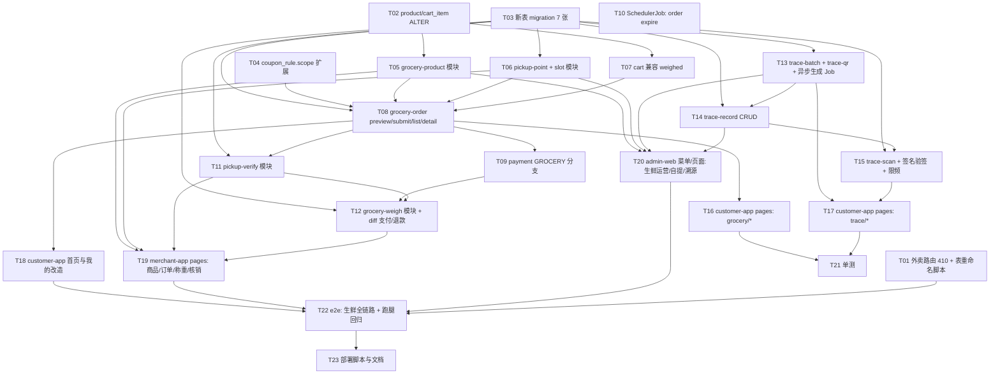

# TASK — 生鲜商城与溯源改造（原子任务拆解）

> 阶段：6A · Atomize
> 创建：2026-05-13
> 上游：DESIGN

---

## 依赖图

---

## 原子任务定义

### Wave 1 · 基建（可全并行）

#### T01 外卖路由灰度下线 + 表重命名脚本

- 输入：现有 `food-order` `food-home` `merchant-order` 等模块
- 输出：
  - 在 `food-order.controller.ts` 等外卖 controller 上加全局 `410 Gone` 拦截或在 main.ts 注入 deny 中间件（路径前缀匹配）
  - 在 deploy 目录新增 `rename-food-tables.sql`，含 `RENAME TABLE` 与回滚版本
- 验收：访问 `c/food/orders` 返回 410；执行重命名脚本后 food_order 不可见，回滚脚本可恢复

#### T02 ALTER product / cart_item

- 输入：DESIGN 4.1 / 4.2
- 输出：migration `1718500000000-GroceryProductAndCartFields.ts`
- 验收：migration up/down 通过；现有 food product 数据不受影响

#### T03 7 张新表 migration

- 输入：DESIGN 4.3-4.7
- 输出：migration `1718500100000-GroceryTables.ts`（含 pickup_point/pickup_time_slot/grocery_order/grocery_order_item/pickup_verify_log/trace_batch/trace_qr/trace_record/trace_scan_log）
- 验收：up/down 通过；索引齐全

#### T04 coupon_rule.scope 扩展

- 输出：migration `1718500200000-CouponScopeGrocery.ts`
- 验收：可写入 `scope='GROCERY'`，旧记录读取不变

---

### Wave 2 · 商城主链（多个可并行，块内有依赖）

#### T05 grocery-product 模块

- 路径：`apps/server/src/modules/grocery-product/`
- 文件：`module.ts` `controller.ts`(c+m+admin 三套或拆三 controller) `service.ts` `dto.ts` `service.spec.ts`
- 输入契约：DTO 含 `pricingMode` `unitPricePerJin` `weightUnit` `minWeightG` `maxWeightG`
- 输出契约：与 DESIGN 5.1 / 5.2 对齐
- 验收：单测通过；可创建 fixed/weighed 两种商品；上下架/调库存正确

#### T06 pickup-point + pickup-time-slot

- 路径：`apps/server/src/modules/pickup-point/`
- 输入：DESIGN 4.3/4.4
- 输出：CRUD + `batch-config-slots` 支持按周复制
- 验收：用户端按 lng/lat 列表正确按距离排序；时段冲突写入失败

#### T07 cart 兼容 weighed

- 路径：`apps/server/src/modules/cart/`
- 改动：DTO 增加 `estimatedWeightG`；service 写入 snapshot 字段
- 验收：fixed 与 weighed 商品都可加购；唯一索引仍生效

#### T08 grocery-order

- 路径：`apps/server/src/modules/grocery-order/`
- 实现：
  - `preview` — 服务端价格重算（fixed: price\*qty / weighed: unit_price_per_jin \* (g/500)），5min snapshot
  - `submit` — 事务：锁 stock_lock + 占 slot.reserved + 写 grocery_order WAIT_PAY + 调用 payment.create(bizType='GROCERY') + 发 grocery.order.created
  - `list/detail/cancel/repay`
- 验收：preview 与 submit 价格一致；并发占用时段不超分；超时自动取消

#### T09 payment GROCERY 分支

- 路径：`apps/server/src/modules/payment/payment.service.ts`
- 改动：扩展 `bizType` 处理；新增回调分支调用 `grocery-order.onPaid`
- 验收：FOOD/ERRAND 既有用例不回归；GROCERY 单可成功支付

#### T10 SchedulerJob: order expire

- 路径：`apps/server/src/scheduler/jobs/grocery-order-expire.job.ts`
- 周期：每分钟
- 动作：扫 `expire_at < now AND status=WAIT_PAY` → 释放库存 + 释放时段 + 置 CANCELLED
- 验收：UT 模拟时间过期场景

---

### Wave 3 · 核销 + 称重

#### T11 pickup-verify 模块

- 路径：`apps/server/src/modules/pickup-verify/`
- 实现：
  - `verify({pickupCode|qrPayload})` — 校验 hash + 店员归属 + 防刷 5/min
  - `verify-logs` 查询
- 验收：明文/扫码两种路径都能核销；越权 403

#### T12 grocery-weigh 模块 + 差额支付/退款

- 路径：`apps/server/src/modules/grocery-weigh/`
- 实现：
  - `weigh-item` 写入 actual_quantity & actual_subtotal
  - `weigh-confirm` 算 diff 判断走自动 / 触发补付（创建子 PaymentOrder bizType=GROCERY，metadata.subType=DIFF）/ 触发 refund
  - `finalize` 全部行项确认 → 状态 PICKED_UP
  - 差价支付回调钩到本服务推进状态
- 验收：±10% 内自动通过；超出需补付路径正确；退款路径正确；状态机不可越级

---

### Wave 4 · 溯源

#### T13 trace-batch + trace-qr + 异步生成 Job

- 路径：`apps/server/src/modules/trace-batch/`、`trace-qr/`
- Job 路径：`apps/server/src/scheduler/jobs/trace-qr-generate.job.ts`
- 实现：批次 CRUD；提交生成任务后入队；Job 循环生成 PNG（用 `qrcode` npm 包）→ FileObject 上传 → 批写入 trace_qr → 流式打 zip + csv（用 `archiver`）→ FileObject 存档供下载
- 验收：生成 1000 条 < 60s；下载 ZIP 解压可见 1000 个 PNG + manifest.csv

#### T14 trace-record CRUD

- 路径：`apps/server/src/modules/trace-record/`
- 实现：节点 CRUD；支持批次维度 & QR 维度；附件走 FileObject
- 验收：扫码查询返回的 records 顺序按 happened_at desc

#### T15 trace-scan 用户端

- 路径：`apps/server/src/modules/trace-scan/`
- 实现：
  - 客户端 `c/trace/info?code=&sig=` 验签 → 拉商品 + 批次 + 节点
  - 同 IP 30/min 限频（接 RateLimitGuard 或自实现 Redis）
  - 写 trace_scan_log（异步）
  - `@Public` 装饰允许匿名
- 验收：错签 404；同 IP 高频限流

---

### Wave 5 · 客户端

#### T16 customer-app `pages/grocery/*`

- 新增页面：
  - `home.vue`（瀑布流 + 分类 + banner）
  - `category.vue`
  - `product/list.vue`
  - `product/detail.vue`（fixed/weighed 两种 UI；weighed 显示"约 X 斤"输入器）
  - `cart.vue`
  - `checkout.vue`（自提点选 + 时段选 + 优惠券选 + 备注）
  - `pickup-point/list.vue`（地图+列表）
  - `order/list.vue`
  - `order/detail.vue`（提货码大字 + QR + 称重详情时间线）
  - `order/diff-pay.vue`（差价补付页）
- 公共组件：`WeightPicker.vue`（克/斤切换）
- 验收：金额/时间/单位 UI 显示正确（前端只用 server 返回值，不本地算价）

#### T17 customer-app `pages/trace/*`

- 新增：
  - `scan.vue`（uni.scanCode 入口）
  - `detail.vue`（产品卡片 + 批次信息 + 节点时间线 + 附件预览）
- 验收：扫码 → 跳转 → 渲染正常

#### T18 customer-app 首页/我的/路由表

- 改动：
  - `pages/index/index.vue` 顶部「生鲜商城」「跑腿服务」两入口
  - `pages/me/index.vue` 订单 Tab 增加"商城"
  - `pages.json` 删除 `pages/food/*`，新增 `pages/grocery/*` `pages/trace/*`
- 验收：tabBar 切换无 404；旧 food 深链跳转新提示页

---

### Wave 6 · 商家与后台

#### T19 merchant-app

- 新增 Tab "商城"
- 新增页面：
  - `pages/grocery/products.vue` `pages/grocery/product-edit.vue`
  - `pages/grocery/orders.vue` `pages/grocery/order-detail.vue`
  - `pages/grocery/pickup-points.vue` `pages/grocery/pickup-slots.vue`
  - `pages/grocery/verify.vue`（扫码 / 手输）
  - `pages/grocery/weigh.vue`（行项称重表单）
  - `pages/grocery/stock-list.vue`（今日备货清单按时段聚合）
- 验收：完整经手"接单→称重→差价→核销→完成"流程

#### T20 admin-web

- 菜单组：生鲜运营 / 自提点 / 生鲜订单 / 溯源中心
- 关键页面：
  - 商品/分类管理
  - 自提点 + 时段批量配置
  - 订单总览 + 强制退款
  - 批次管理（新建/列表/作废）
  - 二维码生成进度 + 下载
  - 扫码枪定位（autoFocus input + 最近 10 条历史）
  - 节点录入（批次/QR 双维度 Tab）
  - 扫码统计图表
- 验收：扫码枪在 PC 浏览器下可一键定位 + 录入

---

### Wave 7 · 质量与交付

#### T21 单测

- 范围：grocery-order.service / grocery-weigh.service / pickup-verify.service / trace-qr.service / trace-scan.service
- 覆盖率：核心服务 ≥ 80%
- 验收：CI 通过

#### T22 集成测试与跑腿回归

- 生鲜 e2e：浏览→加购→下单→支付→核销→称重→差价→完成→评价
- 跑腿回归：现有 errand-status-contract.spec / errand-dispatch / errand-pricing 全套用例
- 验收：全部绿

#### T23 部署与文档

- deploy 增加：env 新变量（TRACE_SECRET、PICKUP_CODE_SALT）、新外部依赖（qrcode、archiver）
- 阶段交付清单同步「项目阶段规划/」
- 输出 FINAL/TODO 文档
- 验收：本地一键 docker-compose up 启动并通过 smoke test

---

## 复杂度评估

| Wave              | 任务数 | 估时                                            | 并行度       |
| ----------------- | ------ | ----------------------------------------------- | ------------ |
| Wave1 基建        | 4      | 1 天                                            | 高           |
| Wave2 商城主链    | 6      | 5 天                                            | 中           |
| Wave3 核销+称重   | 2      | 2.5 天                                          | 低（强依赖） |
| Wave4 溯源        | 3      | 3 天                                            | 中           |
| Wave5 客户端      | 3      | 3 天                                            | 中           |
| Wave6 商家+后台   | 2      | 3 天                                            | 高           |
| Wave7 测试 + 部署 | 3      | 2 天                                            | 低           |
| **合计**          | 23     | **~19.5 天**（单人） / **~10 天**（2-3 人并行） |              |

---

## 阻塞点与注意

- T08 依赖 T02/T03/T05/T06/T07 全部完成（订单核心）
- T12 依赖 T09 + T11（差价补付需 payment 支持 + 核销已通过）
- T17 强依赖 T15（扫码 API）
- 任何修改 `errand-*` 的改动必须 PR review reject
- Payment 接口扩展必须保持 FOOD/ERRAND 旧路径行为不变（加单测兜底）

---

## 输出物对应文件

| 任务    | 主要交付物                                                                                                        |
| ------- | ----------------------------------------------------------------------------------------------------------------- |
| T01     | `apps/server/src/modules/food-order/gone.middleware.ts`（或在 main.ts 注册）、`deploy/sql/rename-food-tables.sql` |
| T02-T04 | `apps/server/src/database/migrations/171850*.ts`                                                                  |
| T05     | `apps/server/src/modules/grocery-product/`                                                                        |
| T06     | `apps/server/src/modules/pickup-point/`                                                                           |
| T07     | 修改 `apps/server/src/modules/cart/`                                                                              |
| T08     | `apps/server/src/modules/grocery-order/`                                                                          |
| T09     | 修改 `apps/server/src/modules/payment/payment.service.ts`                                                         |
| T10     | `apps/server/src/scheduler/jobs/grocery-order-expire.job.ts`                                                      |
| T11     | `apps/server/src/modules/pickup-verify/`                                                                          |
| T12     | `apps/server/src/modules/grocery-weigh/`                                                                          |
| T13     | `apps/server/src/modules/trace-batch/` + `trace-qr/` + `scheduler/jobs/trace-qr-generate.job.ts`                  |
| T14     | `apps/server/src/modules/trace-record/`                                                                           |
| T15     | `apps/server/src/modules/trace-scan/`                                                                             |
| T16-T18 | `apps/customer-app/src/pages/grocery/*` 等 + 改 `pages.json`                                                      |
| T19     | `apps/merchant-app/src/pages/grocery/*` + `pages.json`                                                            |
| T20     | `apps/admin-web/src/views/grocery/*` `views/trace/*` + 路由/菜单                                                  |
| T21-T22 | `*.spec.ts` `*.e2e-spec.ts`                                                                                       |
| T23     | `deploy/` `docs/生鲜商城与溯源/FINAL_*.md` `TODO_*.md`、阶段清单                                                  |
